# 利用 Databricks Delta 实时表进行实时流分析

> 原文：<https://blog.devgenius.io/real-time-streaming-analytics-with-databricks-delta-live-table-574d7747acbd?source=collection_archive---------2----------------------->

在这个故事中，让我们通过一个真实的例子来了解流式分析是多么有用。让我们看看如何使用 Apache Kafka、Databricks Delta Live 表和流数据分析等工具/技术来检测特定区域的 COVID 病例。

这是来自 [Current.io(卡夫卡峰会 2022)](https://2022.currentevent.io/website/39543/welcome) 的一个现场演示的故事。在这里，我们可以看到基于模拟数据捐赠项目 [DDP](https://corona-datenspende.de/science/en) 的数据接收、清理和转换，该项目建立在带有 Apache Kafka、Spark 结构化流和 Delta Live Tables(完全托管的服务)的 lakehouse 之上。

整个代码库由 databricks 开源发布，可以在[这里](https://github.com/databricks/delta-live-tables-notebooks/tree/main/kafka-dlt-streaminganalytics)找到。如果您熟悉 Kafka 和 Databricks delta live 表，请随意跳过。

# 体系结构

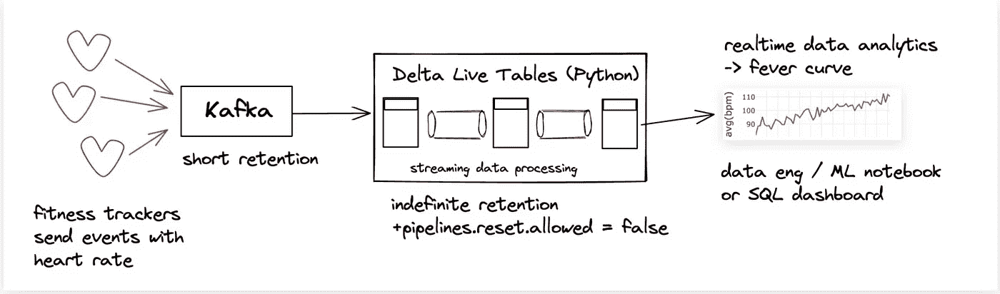

# 实施解决方案的步骤

## 第一步

我们首先需要一个流媒体源。用户可以拥有用户管理的 apache kafka 或云托管的 apache kafka。出于学习目的，我建议使用云托管的 kafka，即融合云 Kafka，因为一旦你首次通过 google 或 github 登录，他们将提供 400 美元的免费信用 30 天。

一旦您有了一个融合的 kafka 云登录，如果您没有看到一个**默认**集群正在运行，请导航到环境部分并创建一个 Kafka 环境。

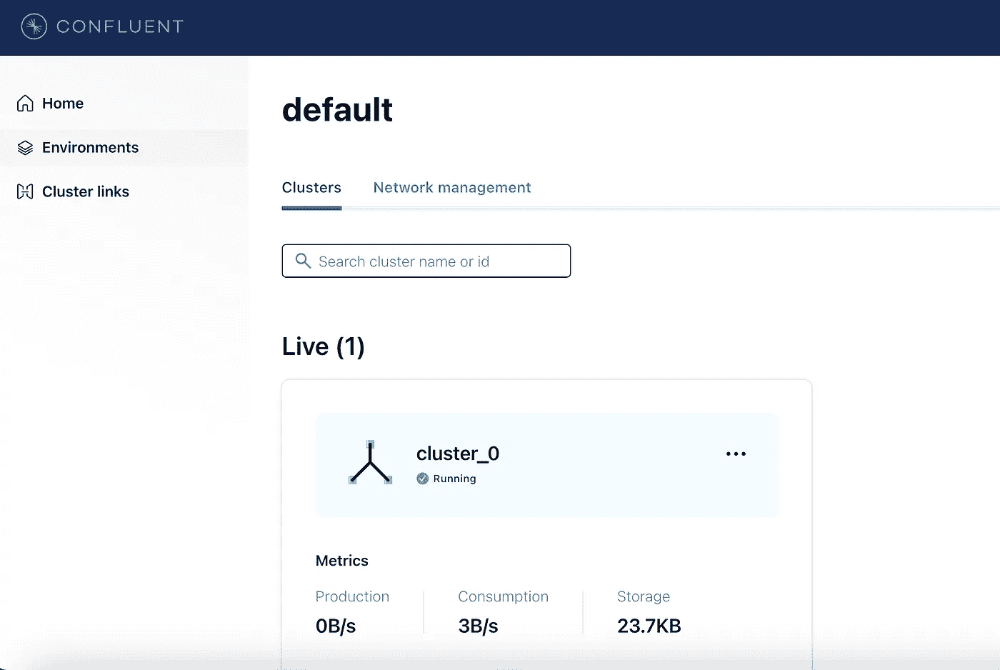

一旦环境启动并运行，通过点击**默认**环境导航到主题部分，并创建一个名为 **fitness-tracker** 的主题，并填充所有默认设置。

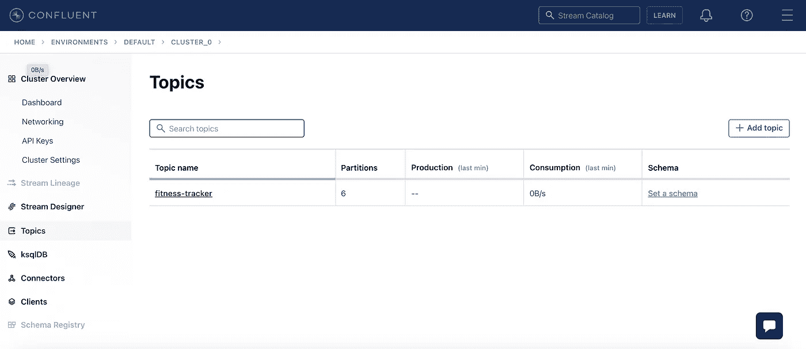

现在，我们需要从汇合门户获取一些细节，以便将消息传送到主题中，并从主题中读取消息。

导航到“Cluster Overview”部分，单击默认环境后即可看到该部分。

从“Cluster Overview”下的列表中，单击“Cluster Settings”以捕获引导服务器详细信息。

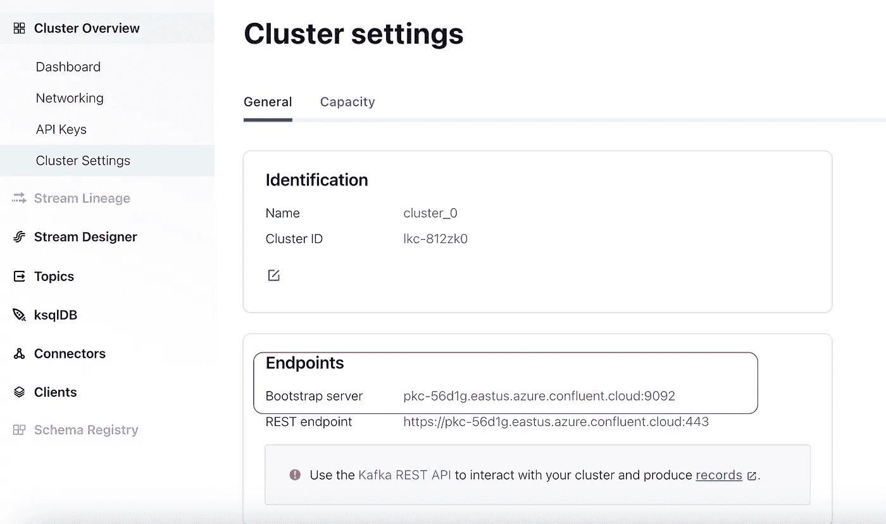

在同一列表中，单击 API 密钥，生成新的 API 密钥，并捕获密钥(CLUSTER_API_KEY)和秘密(CLUSTER_API_SECRET)

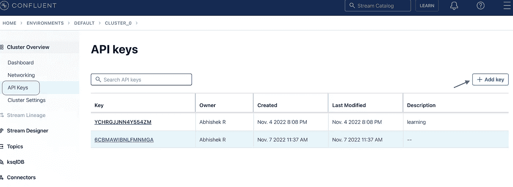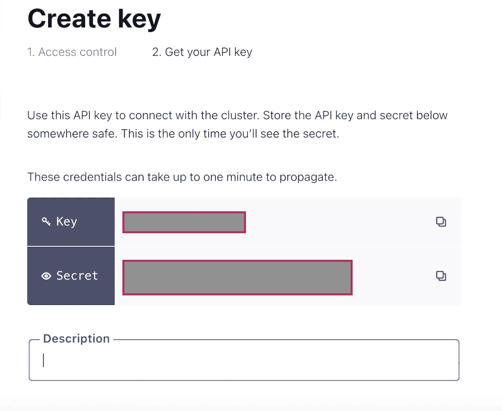

完成上述步骤后，我们将获得 bootstrap.servers、CLUSTER_API_KEY 和 CLUSTER_API_SECRET 的详细信息，这些信息对于通过 Python 客户端连接到融合云非常有用。

## 第二步

从 Databricks 工作区克隆 [github repo](https://github.com/databricks/delta-live-tables-notebooks/tree/main/kafka-dlt-streaminganalytics) 。这将在您的工作区克隆 3 个笔记本。

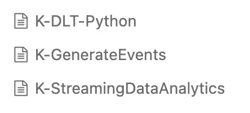

**K-GenerateEvents** 是一款笔记本电脑，可以帮助生成类似于健身追踪器小工具的数据，并将其发布到融合云。通过输入相应的汇合细节来修改笔记本中的以下行，然后通过附加交互式 spark 集群来运行笔记本。

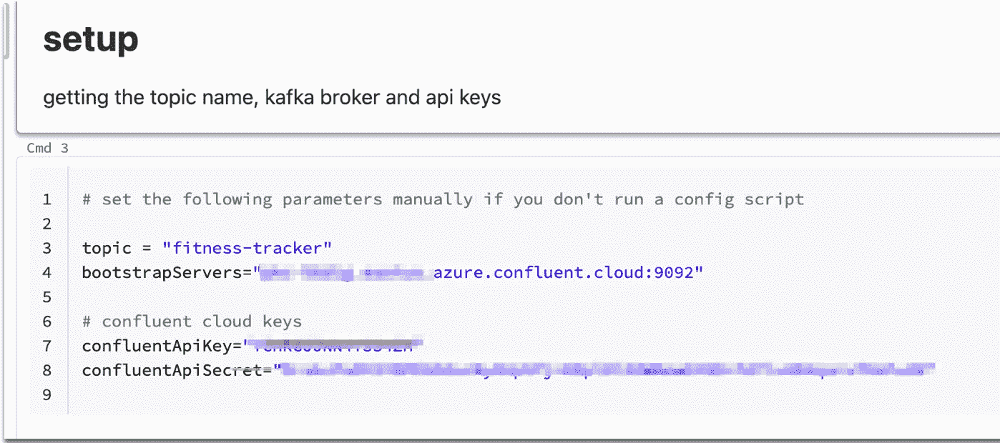

**K-DLT-Python** 是使用 Delta Live 表从融合云接收消息、清理、聚合并将结果写入 Delta 表的笔记本。在笔记本的 **Cmd 4** 中输入相应的汇合细节，修改汇合细节

为了执行此操作，请导航至工作流->增量实时表->创建管道，然后选择 K-DLT-Python 笔记本的路径。

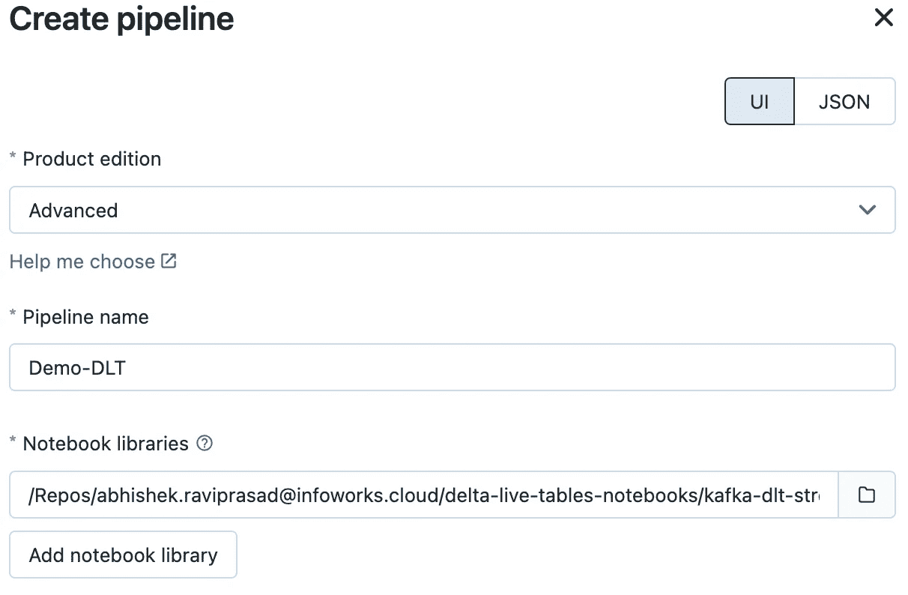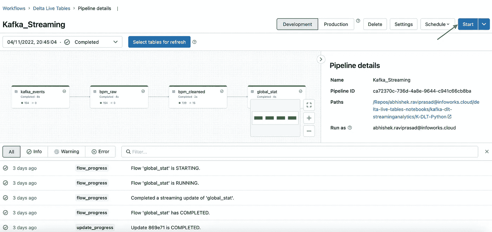

点击 **Start** 按钮，开始从汇合处读取信息，并将数据写入 Delta 表。

**K-StreamingDataAnalytics** 是一个 SQL 记事本，用于查询聚合或清理的数据，并可视化事件。

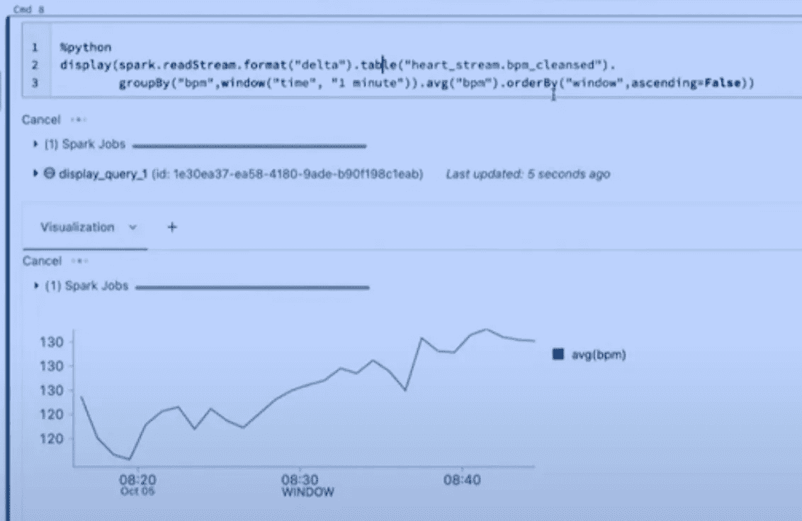

我推荐这篇文章和观看演示视频(参考资料部分提到了它的链接)给所有数据领域的新手和想要了解更多关于流用例的数据工程师。这种端到端的使用案例有助于理解流分析如何帮助用最少的工具集解决现实世界的问题。

感谢 Databricks 和 Confluent 的精彩介绍:-)

## 参考