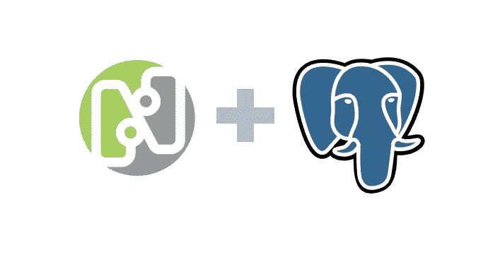
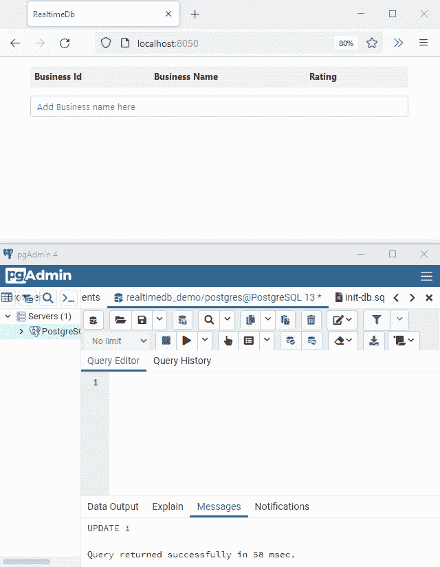
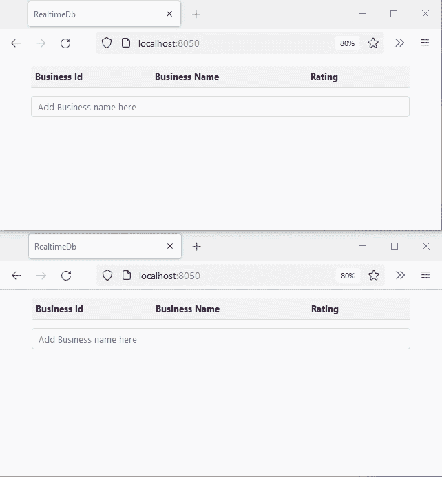

# 来自 PostgreSQL 数据库的实时 Web 更新

> 原文：<https://blog.devgenius.io/real-time-web-updates-from-your-postgresql-database-2289528b0f28?source=collection_archive---------4----------------------->



我在阅读 PostgreSQL 时，注意到一个有趣的特性，叫做逻辑复制。文档解释说逻辑复制是:

> 一种复制数据对象及其更改的方法，基于它们的复制标识(通常是主键)。

换句话说，这是一种通过让数据库向订阅者节点实时发布逻辑数据更改来确保数据库副本始终同步的方法。

复制订阅服务器通常是充当主服务器副本的另一个数据库，但不限于此，它可以是任何东西。如果我们把它变成一个网络服务呢？然后，该服务可以将这些更改推送到 web 应用程序的多个客户端，这样它们就可以实时同步数据。

实际上还有另一个 PostgreSQL 特性，NOTIFY 命令，用于生成通知，但是我们需要为我们感兴趣的每个表编写数据库触发器，并且字符串有效负载大小有 8000 字节的限制。逻辑复制没有这样的限制，可以监听数据库中的所有表，这使得它更具可伸缩性。

所以我写了一个小型开源库，结合了 [**dotNetify**](https://dotnetify.net/) 和 PostgreSQL 逻辑复制。您可以使用它构建一个带有 ASP.NET 5 的 web 应用程序，该应用程序可以对应用程序的任何用户提交给 PostgreSQL 数据库的所有插入、更新和删除操作做出反应。

我把这个库命名为 **DotNetify。Postgres** ( [源代码](https://github.com/dsuryd/dotNetify/tree/master/DotNetifyLib.Postgres))，你的项目不会涉及轮询数据库，建立一个复杂的发布/订阅系统，或者根本不需要多少代码。博客的其余部分将带你构建一个演示应用程序。

# PostgreSQL 设置

要在 PostgreSQL 数据库中启用逻辑复制，请找到 *postgresql.conf* 配置文件，将参数`wal_level`更改为*逻辑*，并将`max_wal_senders`和`max_replication_slots`都至少更改为 1。更改将在服务重新启动后生效。

您也可以使用 SQL 命令来更改它们:

```
ALTER SYSTEM SET wal_level='logical';
ALTER SYSTEM SET max_wal_senders='10';
ALTER SYSTEM SET max_replication_slots='10';
```

下一步是创建出版物:

```
CREATE PUBLICATION my_pub FOR ALL TABLES;
```

我们将它设置为发布所有表的数据更改，但是如果您愿意，您可以将它限制为只发布特定的表。

当 PostgreSQL 发布复制记录(也称为*预写日志*或 WAL)时，它使用一种叫做复制槽的东西来确保记录在订户收到之前不会被删除。

复制槽很棒，因为它们允许订户暂时离线，并且在重新连接时，只需从停止的地方继续。但是有一个警告:在长时间的断开事件中，WAL 记录可能会堆积起来，达到耗尽空间并使数据库崩溃的程度，因此，需要监控这些槽。

下面是我们创建复制槽的方式:

```
SELECT * FROM pg_create_logical_replication_slot('my_slot', 'pgoutput');
```

*pgoutput* 是 PostgreSQL 的标准逻辑解码插件，用于将 WAL 的更改转换为逻辑复制协议。

对于演示，让我们创建一个简单的表。我们还将创建一个新用户，我们的 web 服务将使用该用户连接到数据库:

```
CREATE TABLE IF NOT EXISTS businesses (
  business_id serial PRIMARY KEY,
  business_name VARCHAR ( 50 ) UNIQUE NOT NULL,
  rating integer
);CREATE USER my_user WITH PASSWORD 'my_pwd';
ALTER ROLE my_user WITH REPLICATION;
GRANT ALL PRIVILEGES ON ALL TABLES IN SCHEMA public TO my_user;
GRANT USAGE, SELECT ON ALL SEQUENCES IN SCHEMA public TO my_user;
```

请注意，我们将复制角色赋予了用户。订阅复制插槽需要拥有此角色。

Postgres 数据库现在已经为逻辑复制进行了配置。下一步是创建一个 web 服务来订阅我们创建的复制槽，并将更改推送到网站。

# Web 服务设置

你可以从[这个 Github repo](https://github.com/dsuryd/dotNetify/tree/master/Demo/React/RealtimeDb.Postgres) 下载源代码。这是一个与 React/Typescript 前端和 web pack ASP.NET 项目。安装 npm 包后，您可以从 Visual Studio 或 dotnet CLI 运行项目。

代码为演示表提供了一个实体类:

```
[Table("businesses")]
public class Business
{
  [Column("business_id")]
  [Key]
  public long Id { get; set; } [Column("business_name")]
  public string Name { get; set; } [Column("rating")]
  public int Rating { get; set; }
}
```

有一个简单的 React 客户端来显示表的内容，以及相关的 *dotNetify* 视图模型。视图模型通过一个 API 订阅表上的 PostgreSQL 数据更改事件，这个 API 由 **DotNetify。Postgres** 库提供状态更新，并将状态更新实时推送到客户端:

```
public class BusinessesVM : BaseVM
  {
    private IDisposable _subs; // Real-time list; see: https://dotnetify.net/core/api/crud.
    [ItemKey(nameof(Business.Id))]
    public List<Business> Businesses { get; set; } public BusinessesVM(IDbChangeObserver dbChangeObserver)
    {
        Businesses = new List<Business>(); _subs = dbChangeObserver
          .Observe<Business>()
          .Subscribe(e =>
          {
              if (e is DbInsertEvent<Business>)
              {
                var row = (e as DbInsertEvent<Business>).Row;
                this.AddList(nameof(Businesses), row);
              }
              else if (e is DbUpdateEvent<Business>)
              {
                var row = (e as DbUpdateEvent<Business>).NewRow;
                this.UpdateList(nameof(Businesses), row);
              }
              else if (e is DbDeleteEvent<Business>)
              {
                var key = (e as DbDeleteEvent<Business>).Row.Id;
                this.RemoveList(nameof(Businesses), key);
              }
              PushUpdates();
        });
    } public override void Dispose() => _subs.Dispose();
  }
```

PostgreSQL 数据库的连接字符串以及发布和复制插槽名称在服务启动类中配置:

```
public void ConfigureServices(IServiceCollection services)
{
    services.AddSignalR();
    services.AddDotNetify();
    services.AddDotNetifyPostgres(new PostgresConfiguration
    {
      ConnectionString = 
         Configuration.GetConnectionString("Postgres"),
      PublicationName = "my_pub",
      ReplicationSlotName = "my_slot"
    });
}
```

这就是全部了！以下是该应用对数据变化的反应:



# 带 EF 内核的完整 CRUD

到目前为止，我们有一个只对数据库中的数据变化做出反应的网页。让我们更进一步，让它也能够进行 CRUD 操作。为此，我们将使用 EF Core 和 [Npgsql](https://www.npgsql.org/) 库。

让我们为演示表添加一个`DbContext`类:

```
public class BusinessDbContext : DbContext
{
  public DbSet<Business> Businesses { get; set; }
  public BusinessDbContext(
    DbContextOptions<BusinessDbContext> options): base(options) 
  {}
}
```

由于生命周期长，DotNetify 视图模型必须使用工厂来创建新的`DbContext`。所以我们在启动类中配置了`DbContextFactory`服务:

```
public void ConfigureServices(IServiceCollection services)
{
  ...
  services.AddDbContextFactory<BusinessDbContext>(options =>     
    options.UseNpgsql(
      Configuration.GetConnectionString("Postgres")));
}
```

最后一步是在视图模型上实现 CRUD 方法:

```
public class BusinessesVM : BaseVM
{
  private IDbContextFactory<BusinessDbContext> _contextFactory; [ItemKey(nameof(Business.Id))]
  public List<Business> Businesses { get; set; } public BusinessesVM(
    IDbContextFactory<BusinessDbContext> dbContextFactory,
    IDbChangeObserver dbChangeObserver)
  {
      _contextFactory = dbContextFactory; using var dbContext = _contextFactory.CreateDbContext();
      Businesses = dbContext.Businesses.OrderBy(x => x.Id).ToList(); this.ObserveList<Business>(
         nameof(Businesses), dbChangeObserver);
  } public void Add(Business businessInfo)
  {
      using var dbContext = _contextFactory.CreateDbContext();
      dbContext.Businesses.Add(businessInfo);
      dbContext.SaveChanges();
  } public void Update(Business businessInfo)
  {
      using var dbContext = _contextFactory.CreateDbContext();
      var business = dbContext.Businesses.Find(businessInfo.Id);
      if (business != null)
      {
        business.Name = businessInfo.Name;
        business.Rating = businessInfo.Rating;
        dbContext.SaveChanges();
      }
  } public void Remove(Business businessInfo)
  {
      using var dbContext = _contextFactory.CreateDbContext();
      var business = dbContext.Businesses.Find(businessInfo.Id);
      if (business != null)
      {
        dbContext.Businesses.Remove(business);
        dbContext.SaveChanges();
      }
  }
}
```

您可能已经注意到，之前处理订阅和数据更改事件的代码被简化为对*observer list*扩展方法的一次调用。

下面是调用这些 CRUD 方法的 React 客户端的摘录:

```
export const Businesses = () => {
  const { vm, state } = useConnect<State>("BusinessesVM", this);
  const [newName, setNewName] = useState<string>(""); const addBusiness = (name: string) => {
    vm.$dispatch({ Add: new Business(0, name) });
    setNewName("");
  }; const updateBusiness = (id: number, name: string, rating: number) => {
    vm.$dispatch({ Update: new Business(id, name, rating) });
  }; const removeBusiness = (id: number) => {
    vm.$dispatch({ Remove: new Business(id) });
  };
...
```

至此，这是在我们应用一些 CRUD 操作时，应用程序的两个浏览器实例保持同步的演示:



希望这对你有用！我很想听听你的想法。回复[我的推文](https://twitter.com/dotnetify/status/1422453418581389315)让我知道。并随意转发！

*先前发表于*[T5【https://dsuryd.github.io/dotNetify/realtime-postgres/】](https://dsuryd.github.io/dotNetify/realtime-postgres/)*。*