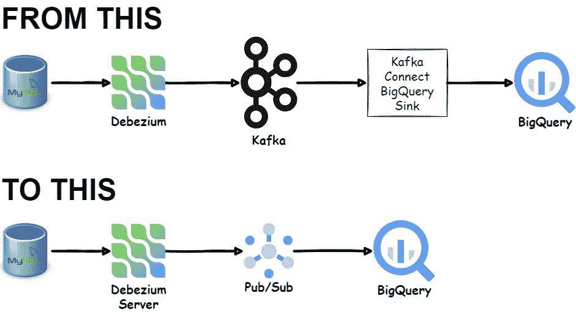
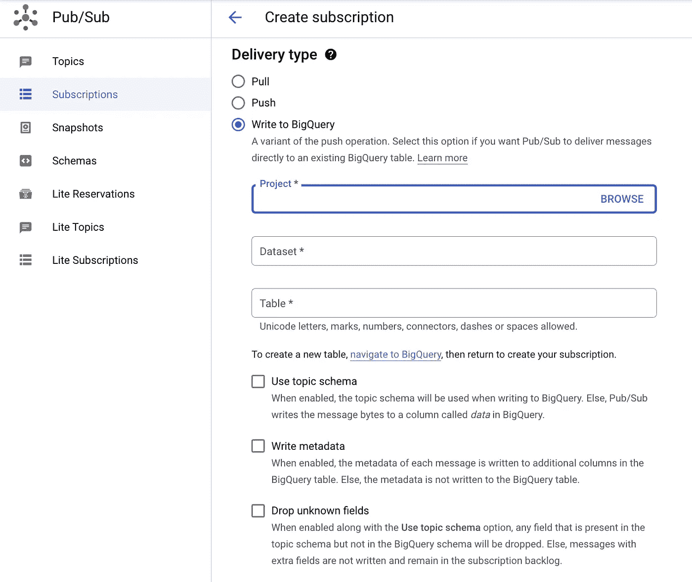
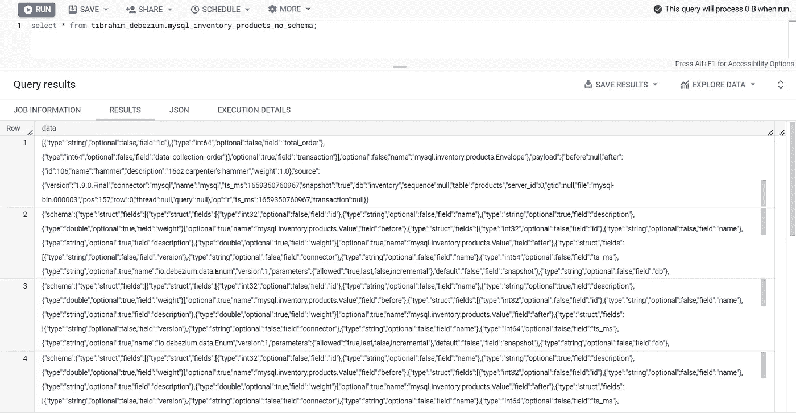
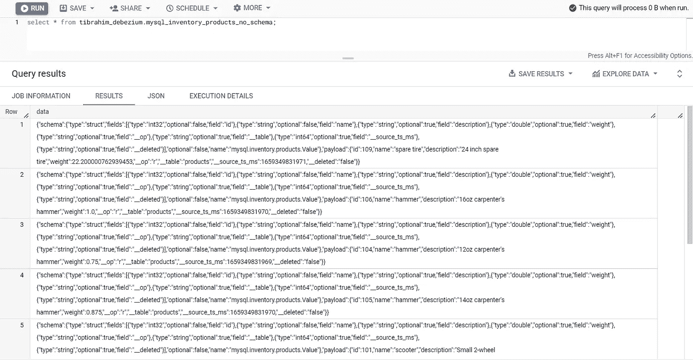
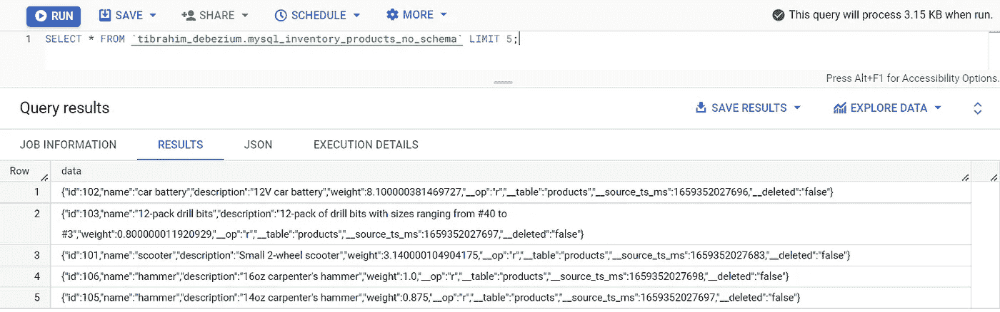
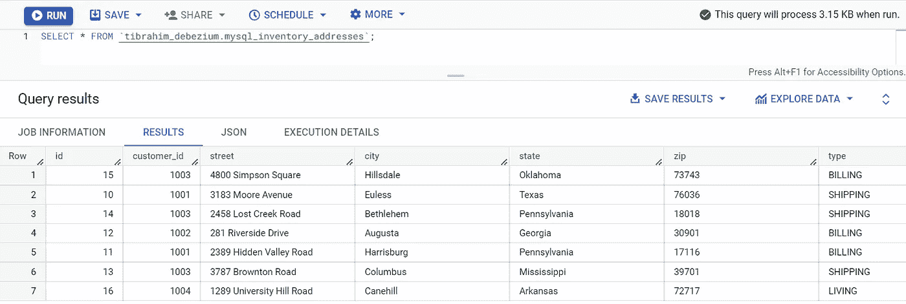

# 实时将数据捕获更改为 BigQuery —没有 Kafka，没有数据流

> 原文：<https://blog.devgenius.io/realtime-change-data-capture-to-bigquery-no-kafka-no-dataflow-fb4a6994441b?source=collection_archive---------1----------------------->

## 使用 Debezium 和 Pub/Sub 实时运行从 MySQL 到 BigQuery 的 CDC 的概念验证…


卡斯帕·卡米尔·鲁宾在 [Unsplash](https://unsplash.com?utm_source=medium&utm_medium=referral) 上的照片



> 有一段时间，我一直在考虑使用 Debezium 进行概念验证，从 RDBMS 执行变更数据捕获或 CDC，并将数据接收到 BigQuery，低延迟，无需 Kafka 和 Kafka Connect。上次我尝试使用[Debezium Server](https://debezium.io/documentation/reference/stable/operations/debezium-server.html)-Cloud Pub/Sub 组合，但是遇到了一个失望，因为我需要部署[数据流作业](https://cloud.google.com/dataflow/docs/guides/templates/provided-streaming#pubsub-topic-to-bigquery)，这产生了额外的成本和更多的管理资源。所以，我当时就把这个想法甩了。直到…

> **更新 2022–08–23**关于使用浮点或双精度数据类型的[问题已经解决](https://www.googlecloudcommunity.com/gc/Data-Analytics/BigQuery-Subscription-Error-Incompatible-schema-type-DOUBLE-vs/m-p/458537#M616)。感谢谷歌云团队！

最近，Google Cloud 推出了 [**新功能，将数据从 Pub/Sub 直接传输到 BigQuery**](https://cloud.google.com/blog/products/data-analytics/pub-sub-launches-direct-path-to-bigquery-for-streaming-analytics) 。有了这个新的 **BigQuery 订阅**特性，我可能会有另一个替代解决方案。我很有兴趣试一试。



> **注意:这只是为了好玩，并不打算用于生产用例。我会在这篇文章的最后给出更多的细节。**

# 在本地准备数据库和 Debezium 服务器

我使用 MySQL 作为源数据库，并使用 Docker 将 Debezium 服务器部署在我的笔记本电脑上。你可以找到下面的`docker-compose.yml`文件作为参考。

让我们对上面的 Docker 合成文件做一个小小的演练:

*   MySQL 容器中预装了一个名为`inventory`的数据库。我们将使用一个名为`inventory.products`的桌子作为这次试验的测试桌子。
*   Debezium Server 容器有 2 个装载卷。第一个是对 Pub/Sub 和 BigQuery 具有写权限的服务帐户文件(`demo-sa.json`)。第二个，我们挂载`conf/`目录，其中包含名为`application.properties`的 Debezium Server 配置文件。您可以在下面看到初始配置文件。请参考 [Debezium Server sink 配置文档](https://debezium.io/documentation/reference/stable/operations/debezium-server.html#_sink_configuration)中的详细内容。

这是我的目录结构。

```
├── conf
│   └── application.properties
├── demo-sa.json
└── docker-compose.yml
```

目前，我们还没有准备好运行 MySQL 和 Debezium 容器，因为我们需要在谷歌云上获得这些资源:

*   发布/子模式—可选
*   酒吧/子话题
*   酒吧/Sub 订阅
*   大查询表

我们将在以后创建这些资源。

# 了解大查询订阅

## 酒吧/自助服务帐户权限

要创建大查询订阅，发布/订阅服务帐户必须具有写入特定大查询表和读取表元数据的权限。将大查询数据编辑器(**角色/大查询.数据编辑器**)角色和大查询元数据查看器(**角色/大查询.元数据查看器**)角色授予发布/订阅服务帐户。以下是操作方法:

*   在控制台中，转到 IAM 页面。
*   转到 IAM
*   选择“包括谷歌提供的角色授予”。
*   按名称过滤:酒吧/Sub 服务帐户。服务账户的格式为[服务-项目-编号@ GCP-sa-pubsub . iam . gserviceaccount . com](mailto:service-project-number@gcp-sa-pubsub.iam.gserviceaccount.com)
*   单击编辑酒吧/Sub 服务帐户。
*   在编辑权限窗格中，单击添加另一个角色。
*   在选择角色下拉列表中，输入大查询，然后选择大查询数据编辑器角色。
*   再次单击添加另一个角色。
*   在选择角色下拉列表中，输入大查询，然后选择大查询元数据查看器角色。

更多信息请参见[为发布/订阅服务账户分配大查询角色](https://cloud.google.com/pubsub/docs/create-subscription#assign_service_account)。

## 大查询订阅的属性:主题架构

BigQuery 订阅有一个选项叫做**使用主题模式**。此选项允许发布/订阅将主题消息中的字段写入到 BigQuery 表中的相应列中。这听起来很有趣。但是，它附带了额外的要求:

*   主题模式和大查询模式中的字段必须具有相同的名称，并且它们的类型必须相互兼容。
*   主题模式中的任何可选字段在 BigQuery 模式中也必须是可选的。
*   主题架构中的必需字段在 BigQuery 架构中不需要是必需的。
*   如果有 BigQuery 字段不在主题模式中，这些 BigQuery 字段必须处于模式`NULLABLE`。
*   如果主题模式具有 BigQuery 模式中不存在的附加字段，并且这些字段可以被删除，则选择选项**删除未知字段**。

如果我们不使用 Use topic schema 选项，订阅将写入一个名为`data`的列。所以，用这个选项比较容易。只要确保目标表有`data`列。

BigQuery 订阅文档的[属性中有更多相关信息。](https://cloud.google.com/pubsub/docs/bigquery#properties_of_a_subscription)

我从第二个选项开始。

但是，在此之前，让我们设置一些环境变量，使我们的生活更容易。

所以，事不宜迟…

# 没有模式定义的 MySQL CDC 到 BigQuery

让我们在运行 CDC 部分之前准备好所需的资源。

首先，创建一个 BigQuery 表。因为我们没有使用模式，所以我们将创建一个包含`data`列的表。

```
CREATE OR REPLACE TABLE
<project_id>.<dataset>.mysql_inventory_products_no_schema (
  data STRING
);
```

接下来，创建一个名为`mysql.inventory.products`的发布/订阅主题。这样命名的原因是，Debezium Server for MySQL 使用了`serverName.databaseName.tableName`的约定作为目标主题名。

```
gcloud pubsub topics create mysql.inventory.products
```

接下来，创建一个 BigQuery 订阅。

```
gcloud pubsub subscriptions create \
  mysql.inventory.products-bq-sub \
  --topic mysql.inventory.products \
  --bigquery-table=$PROJECT_ID.$BQ_DATASET.mysql_inventory_products_no_schema
```

现在，让我们检查一下集装箱。

```
docker-compose up
```

在等待 MySQL 容器准备就绪时，Debezium 服务器容器可能会退出并重新启动几次。

使用 SQL 检查 BigQuery。



试试 1:管用！但是那可怕的难读的行是什么？

印象深刻！但这就是为什么那些长毛唱片？

因为 Debezium 服务器默认发送原始的 CDC 格式，包括数据本身的`payload`和`schema`。你可以在 Debezium MySQL 数据变更事件文档页面上了解更多信息。

我们需要使用 [Debezium 的单消息转换(SMT)，称为新记录状态提取](https://debezium.io/documentation/reference/stable/transformations/event-flattening.html)。让我们将这些行添加到`application.properties`文件中。

```
debezium.source.transforms=unwrap
debezium.source.transforms.unwrap.type=io.debezium.transforms.ExtractNewRecordState
debezium.source.transforms.unwrap.add.fields=op,table,source.ts_ms
debezium.source.transforms.unwrap.delete.handling.mode=rewrite
```

让我们重新设置所有的事情，重新开始。

使用 SQL 再次检查。



现在，好多了。但是那些`schema`是什么东西呢？我们能摆脱他们吗？

我们当然可以。在`application.properties`上添加这些行并重新开始。

```
debezium.source.key.converter.schemas.enable=false
debezium.source.value.converter.schemas.enable=false
```

使用 SQL 再次检查。



那太好了。

这就对了。

注意，我们有额外的字段`__op`、`__table`、`__source_ts_ms`和`__deleted`。这是因为我们在`application.properties`上有这些额外的配置。

```
debezium.source.transforms.unwrap.add.fields=op,table,source.ts_ms
```

# 用模式定义将 MySQL CDC 转换成 BigQuery

我们已经成功地将没有模式定义 MySQL CDC 流式传输到一个单列的 BigQuery 表中。现在，让我们尝试使用 schema，这样我们就有了一个表格数据，它具有与 MySQL 源表模式相匹配的独立字段。

首先，让我们清理一下我们之前制造的混乱。

```
# Delete subscription
gcloud pubsub subscriptions delete mysql.inventory.products-bq-sub# Delete topic
gcloud pubsub topics delete mysql.inventory.products# Drop BigQuery table (Using SQL UI)
DROP TABLE <project_id>.<dataset>.mysql_inventory_products_no_schema;
```

创建新的 BigQuery 表。

```
CREATE OR REPLACE TABLE tibrahim_debezium.mysql_inventory_products (
  id INT64 NOT NULL,
  name STRING,
  description STRING,
  weight float64,
  __op STRING,
  __table STRING,
  __source_ts_ms INT64,
  __deleted STRING
);
```

接下来，让我们为发布/订阅主题创建模式。此方案必须是与源表定义匹配的有效 AVRO 方案。

```
gcloud pubsub schemas create mysql.inventory.products-schema \
--type=AVRO \
--definition='{"type":"record","name":"MysqlInventoryProductsSchema","fields":[{"type":"int","optional":false,"name":"id"},{"type":"string","optional":false,"name":"name"},{"type":"string","optional":false,"name":"description"},{"type":"float","optional":false,"name":"weight"},{"type":"string","optional":true,"name":"__op"},{"type":"string","optional":true,"name":"__table"},{"type":"long","optional":true,"name":"__source_ts_ms"},{"type":"string","optional":true,"name":"__deleted"}]}'
```

现在，让我们使用模式创建发布/订阅主题。

```
gcloud pubsub topics create mysql.inventory.products --message-encoding=json --schema=mysql.inventory.products-schema
```

现在，新特性 BigQuery 订阅…带有模式

```
gcloud pubsub subscriptions create mysql.inventory.products-bq-sub \
 --topic mysql.inventory.products \
 --bigquery-table=$PROJECT_ID.$BQ_DATASET.mysql_inventory_products \
 --use-topic-schema
```

哎哟，我们这里有一个错误。

```
ERROR: Failed to create subscription [projects/<PROJECT_ID>/subscriptions/mysql.inventory.products-bq-sub]: Incompatible schema type for field weight: DOUBLE vs. FLOAT.
ERROR: (gcloud.pubsub.subscriptions.create) Failed to create the following: [mysql.inventory.products-bq-sub].
```

BigQuery 订阅似乎有一个与`float`数据类型相关的问题/错误。我在 Google Cloud 社区论坛上写了一篇关于这个问题的[帖子](https://www.googlecloudcommunity.com/gc/Data-Analytics/BigQuery-Subscription-Error-Incompatible-schema-type-DOUBLE-vs/m-p/449166)，似乎我不是唯一一个经历这个错误的人。

好吧，我对这个问题有点失望。但是，我们不能就此打住。我们将尝试使用另一个没有`float`列的表。让我们使用`addresses`表。

已更改 Debezium 服务器`application.properties`:

```
debezium.source.table.include.list=inventory.addresses
```

让我们为`addresses`表创建一个新的 BigQuery 表。

```
CREATE OR REPLACE TABLE <project_id>.<dataset>.mysql_inventory_addresses (
  `id` int64 NOT NULL,
  `customer_id` int NOT NULL,
  `street` STRING NOT NULL,
  `city` STRING NOT NULL,
  `state` STRING NOT NULL,
  `zip` STRING NOT NULL,
  `type` STRING NOT NULL,
  __op STRING,
  __table STRING,
  __source_ts_ms INT64,
  __deleted STRING
);
```

接下来，创建发布/订阅模式、主题、BigQuery 订阅并运行 Debezium 服务器。

我的朋友，这就是我们数据的漂亮表格视图。



# 我的外卖

借助 Debezium 服务器和 Pub/Sub，可以在没有 Kafka 和 Kafka Connect 的情况下运行变更数据捕获。随着 BigQuery 订阅特性的发布，无需云数据流，直接传输到 BigQuery 表变得更加容易。需要监控的资源更少，麻烦更少，成本更低。

然而，这种更简单的方法带来了另一个问题:

*   **模式演变**
    目前，在一个模式与一个主题相关联之后，你不能更新该模式。如果您的源表模式发生了变化，那么 CDC 流将会失败。[融合模式注册中心](https://docs.confluent.io/platform/current/schema-registry/index.html)或 [Apicurio 模式注册中心](https://www.apicur.io/registry/)已经解决了这个挑战。关于这一点，有一个[谷歌问题跟踪器](https://issuetracker.google.com/issues/206147008)。让我们希望谷歌发布/订阅团队将在不久的将来解决这个问题。如果你的数据源经常改变模式，也许你最好坚持使用 Kafka 栈。
*   **主题和目的表自动创建/模式自动演化**
    在撰写本文时，我们需要在运行 Debezium 之前创建模式、主题、订阅和 BigQuery 表。如果您有几十或几百个表，那么您需要自动创建、管理和销毁资源。更成熟的框架如 [Kafka Connect](https://docs.confluent.io/platform/current/connect/overview.html) 和开源的[Kafka Connect biqquery Sink](https://github.com/confluentinc/kafka-connect-bigquery)已经解决了这个问题。同样，如果你在这个问题上有问题，那么也许你应该坚持使用 Kafka Connect 或者其他成熟的框架。

如果你没有上述任何问题，那么这种方法可能适合你。反正这个功能真的很棒。不仅仅是为了捕获变更数据，您还可以将它用于很多事情，比如将物联网传感器数据直接发送到 BigQuery。或者捕捉网络事件。天空是极限。