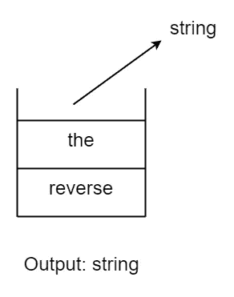
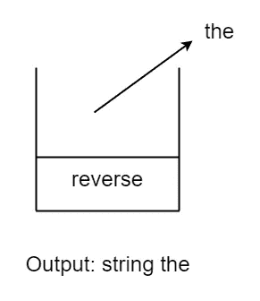

# 使用 Stack 以相反的顺序重新排列字符串中的单词

> 原文：<https://blog.devgenius.io/rearrange-the-words-of-a-string-in-reverse-order-using-stack-6c28ff87684c?source=collection_archive---------6----------------------->

## 如何以相反的顺序重新排列字符串中的单词，而不颠倒单个单词


照片由[塔尔哈·里亚兹](https://www.pexels.com/@talhariaz?utm_content=attributionCopyText&utm_medium=referral&utm_source=pexels)从[佩克斯](https://www.pexels.com/photo/black-pen-on-book-2409566/?utm_content=attributionCopyText&utm_medium=referral&utm_source=pexels)拍摄

# 问题是

给定一个字符串 S，我们需要反转它而不反转字符串中的单个单词。单词之间用空格隔开。

所以，如果我们有一个字符串:

```
S = “reverse the string”
```

简单地反转字符串将得到以下输出:

```
Output: “gnirts eht esrever”
```

但是我们的目标是在不颠倒单个单词的情况下，以相反的顺序重新排列字符串中的单词。

这个问题的输出应该是:

```
Output: “string the reverse”
```

这里，单词在字符串中以相反的顺序重新排列。但是个别单词没有反过来。

解决这个问题有不同的方法。但是这里我们会用 [**栈**数据结构](https://www.javatpoint.com/data-structure-stack#:~:text=A%20Stack%20is%20a%20linear,topmost%20element%20of%20the%20stack.)来解决。

# Stack 如何给出解决方案

让我们来理解为什么栈数据结构会解决这个问题。

堆栈遵循**后进先出**原则。这意味着堆栈中输入的最后一个元素将首先被移除。此外，堆栈只有一端，在那里我们可以**推送** (enter) 和**弹出** (remove) 一个元素。

你可以从阅读材料中了解更多关于堆栈的信息:

[](https://python.plainenglish.io/how-to-create-a-stack-in-python-from-scratch-86350d0c15d0) [## 如何在 Python 中从头开始创建堆栈

### 在不使用任何库的情况下用 Python 实现堆栈

python .平原英语. io](https://python.plainenglish.io/how-to-create-a-stack-in-python-from-scratch-86350d0c15d0) 

现在让我们看看堆栈如何在不反转单个单词的情况下反转字符串。

```
S = “reverse the string”
```

首先，我们需要把单词分开。单词之间用空格隔开。所以我们可以很容易地把它们分开。

我们需要将每个单词一个一个地推入堆栈。如果我们将包含字符串单词的堆栈可视化，它将如下所示:


现在从堆栈中一个接一个地弹出单词将会以相反的顺序重新排列它们。

## pop("string "):



## 波普(“the”):



## pop(“反向”):


所以，我们可以把它分成两个主要部分:

1.  将单词从字符串中分离出来，并将其放入堆栈中。
2.  从堆栈中一个接一个地弹出单词，并将它们存储在输出字符串中。

# 该算法

我们可以开发一个简单的算法描述程序来解决这个问题。

```
Step 1: initialize an empty stack: stStep 2: Push the individual words of string: S into the stackStep 3: Pop the words from the stack and concatenatethem to the string: resultStep 4: Return string: result
```

# Python 实现

让我们看看该过程的 Python 实现。

`Stack`类:

输出:

```
string the reverse
```

# C++实现

此过程的 C++实现如下:

输出:

```
string the reverse
```

# 结论

在本文中，我们讨论了如何使用堆栈数据结构解决字符串问题。这个特殊的问题可能有其他的解决方案。某些解决方案在空间复杂性方面可能比这个更有效。但这让我们很好地理解了如何使用不同的数据结构来解决问题。由此我们也可以理解字符串和堆栈是如何工作的。

我希望这对你有帮助。感谢阅读。

## 问题来源:

[](https://practice.geeksforgeeks.org/problems/reverse-words-in-a-given-string5459/1) [## 反转给定字符串中的单词|练习| GeeksforGeeks

### 输入:S = I . like . this . program . very . much 输出:much.very.program.this.like.i 解释:反转整个…

practice.geeksforgeeks.org](https://practice.geeksforgeeks.org/problems/reverse-words-in-a-given-string5459/1)