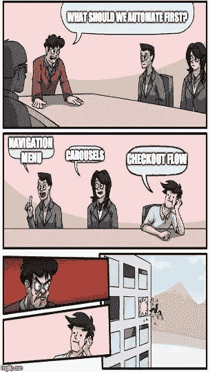
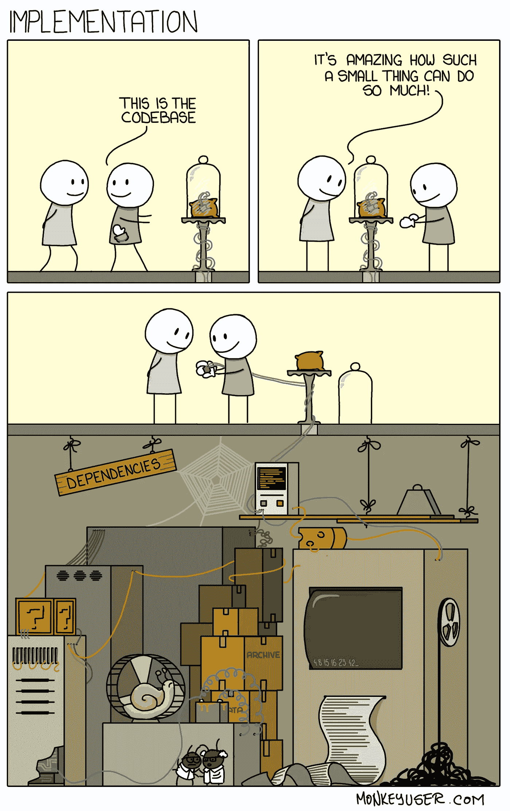
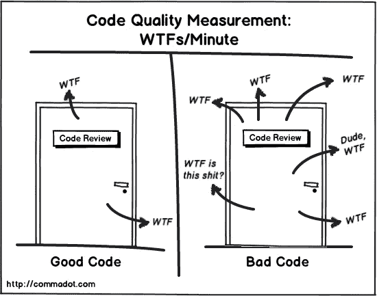

# 你的移动测试不可靠的原因

> 原文：<https://blog.devgenius.io/reasons-for-your-unreliable-mobile-tests-4fb700b78d4c?source=collection_archive---------15----------------------->

一个测试自动化工程师在早上…

通常当运行一个测试自动化套件时，最大的担心是有不可靠的测试。开始时，商业兴趣很高，期望也很明确。随着时间的推移，从一个 sprint 到另一个 sprint，稳定性成为一个更大的问题，直到它们被放弃，QA 求助于“只是手动检查，以确保”，从而导致工作量的更大增加，危及项目的时间表。避免这些陷阱应该有助于您使您的移动测试成为一个成功的故事，并帮助您从一个舒适的位置开发您的服务，而不是失败的期望。

# **使命陈述**

要清楚你在测试什么！人们倾向于混淆他们测试的目标，使其成为依赖于 UI 可视化、网络条件、性能测试和黑盒安全测试的弗兰肯斯坦怪物。

大约 90%的不可靠测试都源于动态内容及其对 UI 视图层次结构的影响。由 Espresso、XCUITest 和 Appium 提供的测试自动化本身被定义为仅进行 ***功能测试。*** 是的，我已经可以听到你说*“你可以实现视觉测试和性能检查！”。你肯定可以。但是不要将* ***多个评估*** *混合成一个测试用例！测试应该只验证一件事，尽可能在你的测试设计中有一个清晰的任务陈述。一旦稳定了纯功能，就可以添加验证 UI、性能或前端安全性的套件。所以说:**片状测试是不一致的测试设计的一个很好的指示器。***

# **第三方供应**

像 [Appium](http://www.appium.io) 、 [Earl Grey](https://github.com/google/EarlGrey) 或 [TestProject](https://testproject.io/) 这样的开源测试软件的兴起令人难以置信。然而，哪里有软件，哪里就有缺陷，因此，第三方软件会多次交付不一致的结果。注意你将要选择的工具的当前问题。

Appium 正在使用一系列依赖项，包括 Selenium 和著名的[脸书·WDA](https://github.com/appium/WebDriverAgent)，它们本身是开放项目，需要一些时间来适应新的操作系统版本。所以小心行事，学徒！

# 可测试性造就更聪明的测试工程师

想象一下，测试一个移动应用程序，它使用带有 a-sync 服务器的弹出窗口来进行跟踪。最初，测试会消除对话。到目前为止一切顺利。但是，当稍后收到回调时，它会奇迹般地重新打开弹出窗口，而且它会将弹出窗口与智能手机的许可弹出窗口混淆。第一种解决方案是在导航的同时期待不同的弹出窗口，但这将需要大量几乎没有使用过的代码。尝试后退一步观察剥落问题。您可以对任何 Ajax 调用使用 loading spinner，并且只在调用完成时继续。处理所有应用程序权限应该通过 adb 在“之前”挂钩中完成。

在你的应用中建立可测试性不仅仅是给你的导航项目分配 id。这样，可测试性可以极大地提高可用性，因为它给用户更多关于实际发生的上下文。用户可以理解加载微调器，但是由于延迟的弹出窗口，用户往往会对随机出现的弹出窗口感到烦恼。

# **前提条件和拆卸**

能够设置和清理您的前提条件是测试自动化工程师工作的 80%。如前所述，您没有测试数据的可靠性，所以在您的测试设计中考虑这一点。有时，您必须在模拟数据和实时数据之间找到最佳平衡点，以充分利用您的套件。这需要相当多的**领域知识。**有时，你可以使用像 [Sinatra](http://sinatrarb.com/testing.html) 或 [Wiremock](http://wiremock.org/) 这样的工具来重新创建应用的后端，只是为了获得可靠的前提条件，并能够在测试结束时丢弃后端的实例。这是游戏的一部分:在你的时间表中考虑这些努力。

# **适当的测试**

仅仅因为你能，并不意味着你应该！测试金字塔是一个多维对象，智能手机应用程序(或任何前端应用程序)不是测试 API 的地方。在开始缓慢的移动测试之前，调整您的管道来运行后端服务的健康检查，以避免混淆。

此外，在每次提交时运行完整的套件 100%只会给开发人员的测试带来麻烦。选择有助于验证正在运行的开发状态的综合冒烟套件。

尝试在以下两者之间取得最佳折衷:

*   高风险特征
*   高用户负载的功能
*   难以手动测试

# **编码最佳实践也适用于 QA**

[https://cheezburger . com/8944133/17-为沮丧的软件工程师编码迷因](https://cheezburger.com/8944133/17-coding-memes-for-the-frustrated-software-engineer)

作为质量保证，我们不会超越基本的编码原则，如 KISS(保持简单愚蠢)，DRY(不要重复自己)等。

测试自动化是一个支持软件，所以你最好把它当作支持软件来对待。不要轻易用//TODO 偷工减料:这会损害稳定性，会使它无法适应不断变化的特性。有一个反对运动，主张代码生成解决方案的“开火并忘记”本质，我个人不认为它们必须自相矛盾。使用低代码工具创建测试套件，需要像编写代码一样小心。最终，您会生成代码；不管你看不看。

# **要求开发人员进行审核**

并且:

> **“总是这样编码，就好像最终维护**你的代码**的那个人**将会是**一个知道你住在哪里的**暴力精神病患者”——stack overflow

# **一个 Bug 最好的藏身之处是一个脆弱的测试**

有时候，一个不可靠的测试实际上可以从错误中找到根源。智能手机——尤其是安卓手机——有很多形状和形式。bug 不必在每台设备上每次都 100%可重现。你确定你没有发现永远难以捉摸的“*”5%可再生的三星 Bug-the-devs-never-find，因为他们倾向于在像素上编码的手机？*

如果你对上面提到的所有其他方面都有信心，不要认为一个不可靠的测试会自动成为测试问题。**和你的开发人员讨论一下吧！**

这应该有助于您稳定您的测试套件。你还有其他的建议吗？

Mathias Strziga *从 2020 年初开始在 Appsfactory 担任质量保证总监。致力于建立更强大、更有灵感的测试团队。他在 intive 担任团队领导和测试自动化工程师。此外，他是一个巨大的美国车迷，除了测试，喜欢环游世界，和他的孩子一起玩。*