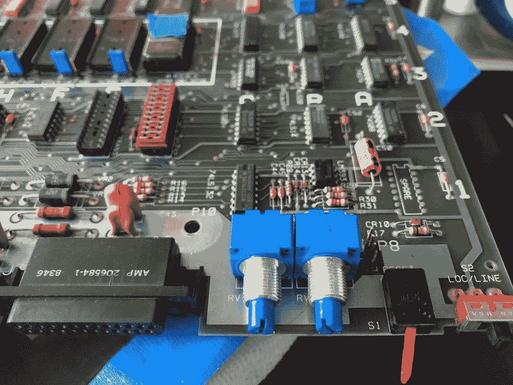
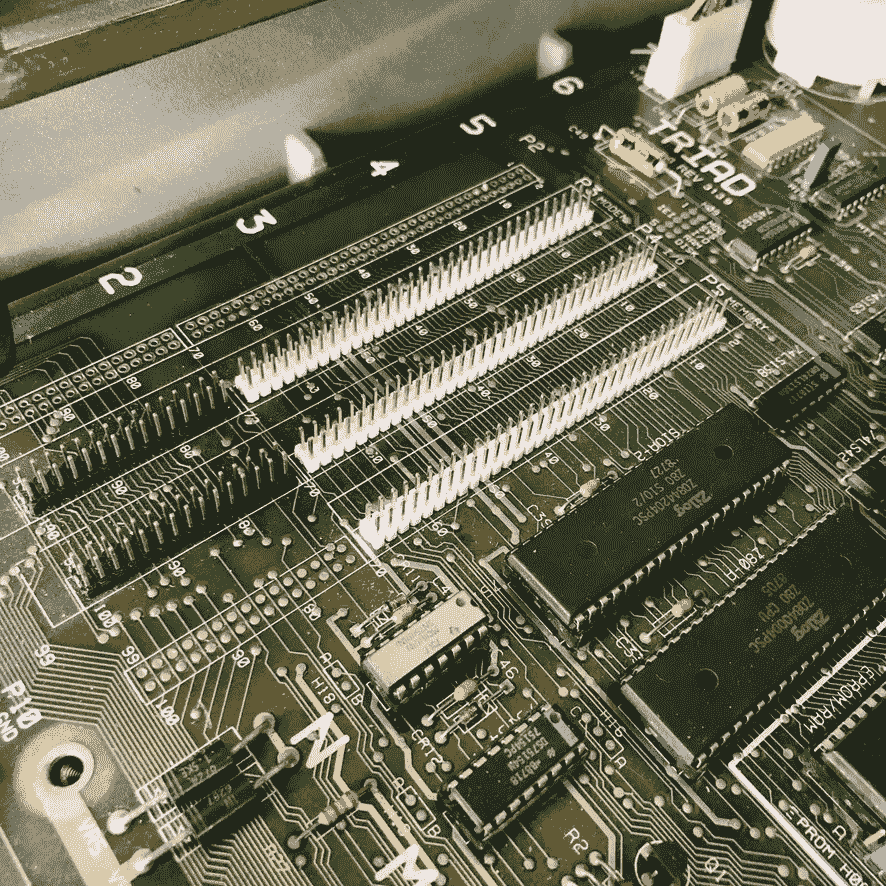
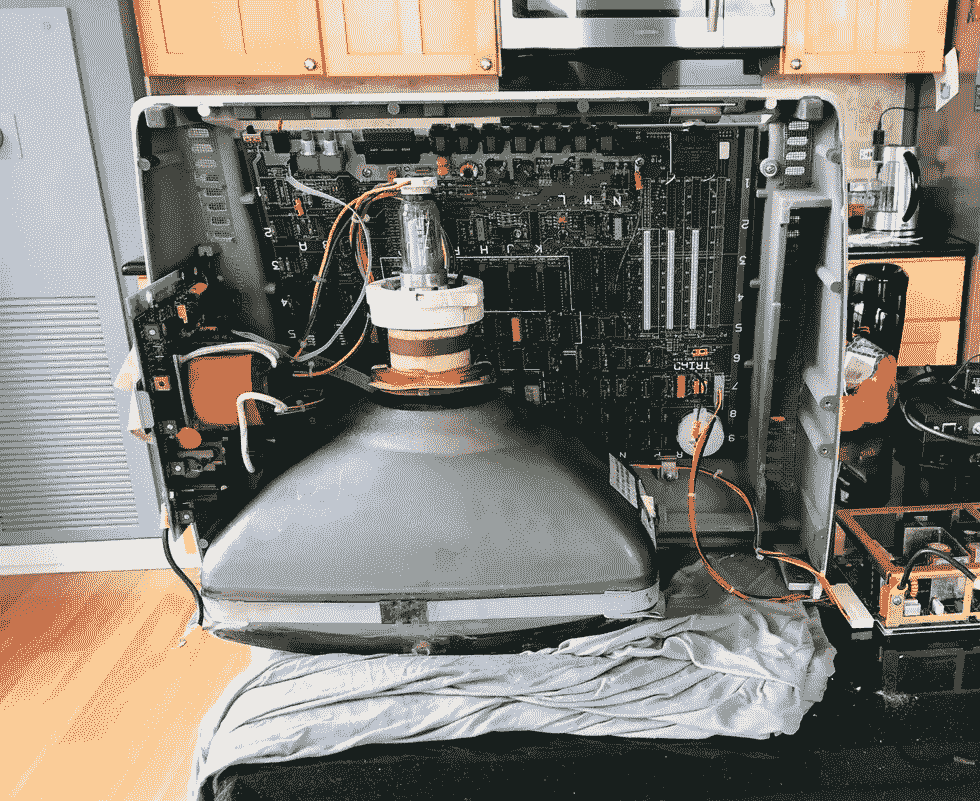
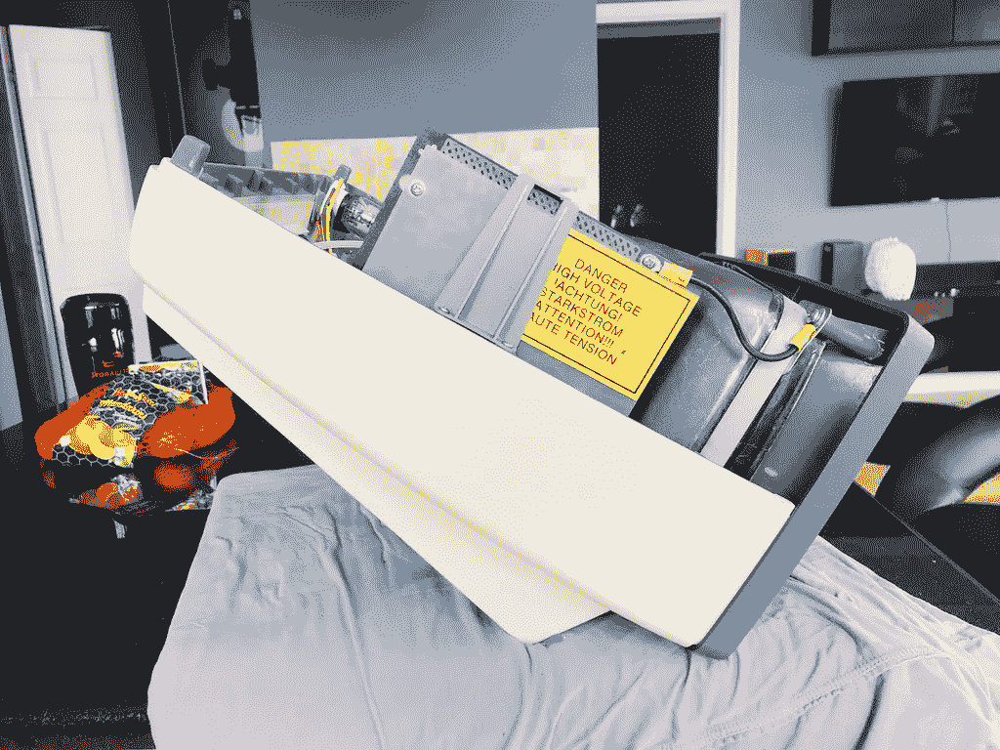
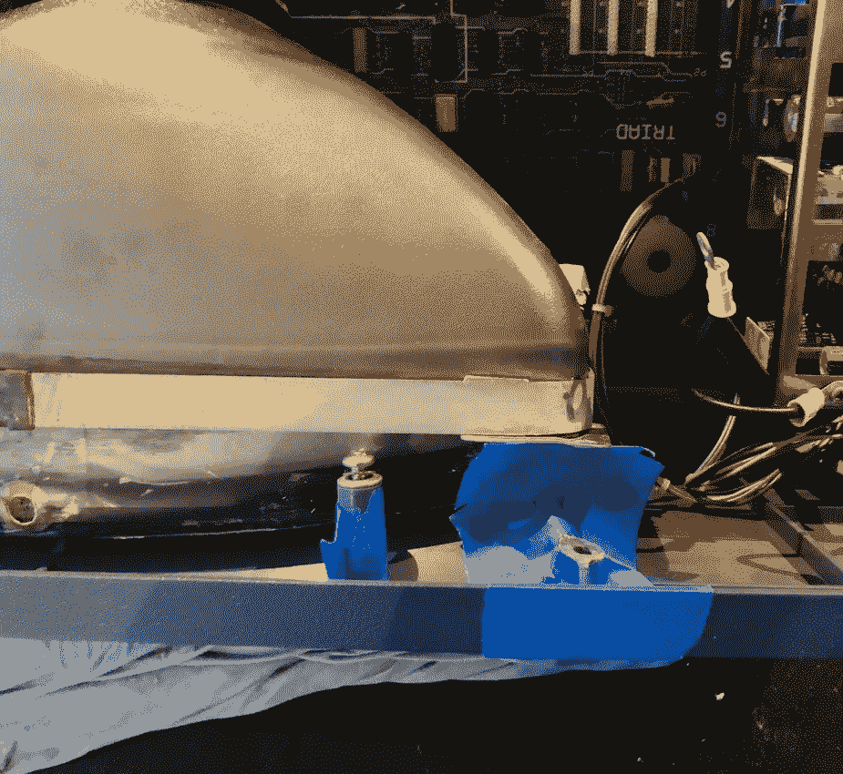
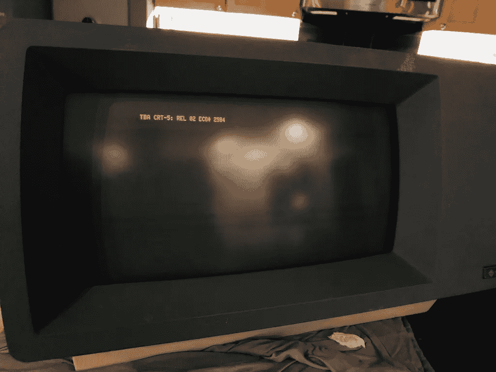

# 重新组装 Triad T2556

> 原文：<https://blog.devgenius.io/reassembling-the-triad-t2556-4706f01fb486?source=collection_archive---------20----------------------->

## 三和弦 T2556 系列之五

好了，我大概了解了硬件[和软件](https://medium.com/@alexwking/tracing-the-triad-t2556-1c9ff7822f0e?source=friends_link&sk=af2fdbb1c6506b9a370725c38696da2d)[是如何组合在一起的，现在是时候把所有的东西放回一起了。事实证明，在这个过程的早期拍摄大量的机器照片是一种更安全的做法。](https://medium.com/@alexwking/decoding-the-triad-t2556-6f0ed4cd1125?source=friends_link&sk=e32da8e9a78695b9ebede817e3d0e466)

亮度和音量的电位器需要更换。显然有一种叫做*的非常好的电位器*。我不知道。

黑板上的那些是伯恩制造的，它们制造了如此多不同的[变体](https://www.bourns.com/docs/product-datasheets/91_95.pdf?sfvrsn=195bcf8d_4)，如果不去找一个优质供应商，花一大笔钱，然后等很长时间，很难找到任何接近匹配的东西。

幸运的是，在易趣上有*几乎*的东西。唯一真正的区别是主轴更短，由塑料制成。但它们在电学上是等效的。够好了。

我还在易趣上找了一些头连接器来代替坏掉的。我挑选了一套非常漂亮的双行头，有六种颜色，想着将来会用在其他项目上。

然而，事实证明，Ebay 上出售的廉价多色组件包并不总是最高质量的。那时，我不知道以后如何使用它们，但希望它们能坚持下去。

真正的问题是将 CRT 重新连接到机箱上。我粘上了前面板上的固定柱，并试图重新安装，但职位只是再次折断。

我花了一点时间才意识到安装过程有多重要，我不得不从不同的角度思考问题。第一件事是将管子垂直放在底盘前面，用一些织物保护管子的表面。

从这里开始，可以安装下部安装螺栓并用手拧紧。到目前为止一切顺利。

现在连接前面板，这是我之前出错的地方。这是一个两步过程:首先将机箱倾斜 30 度角，并将前面板对齐到位，将固定螺钉固定在底部前中心。单位现在应该就这样高高兴兴的休息了。就好像他们在设计这个病例时就考虑到了这一步。也许他们有？

你永远不知道什么时候你会需要一个紧急的克莱门汀

在我继续下一步之前，两个顶部的柱子必须粘在一起。为此我使用了 Testor 的模型水泥，但是因为我以前遇到过麻烦，我想通过在螺纹插件下面的空隙中加入一个小孔来加强柱子。

这些销钉是 3D 打印平的，以最大限度地提高轴向强度。

在使用胶水之前，接缝周围的区域用油漆工胶带包裹，以尽量减少溢出。

令人失望的是，我通过这个过程了解到的一件事是，前面板上的亚光纹理实际上是油漆。我取下胶带时不小心弄掉了一些。尽管如此，至少我知道我可以在某个时候把它拆下来重新上漆，让它看起来像新的一样。

还有一个问题:显像管和前面板之间的间隙太大。

用于安装的包裹管的金属护板有四个凸耳。不幸的是，其中两个标签在运输过程中受到冲击而弯曲，需要一些劝说才能恢复对齐。

它仍然不完美，但我担心会对玻璃造成太大的压力。虽然离得很近，但我想没人会注意到。

最后，所有东西都重新组装好了，是时候打开电源了。这是第一次连接管道，我很紧张。非常。紧张。

在这一点上，传统上要提到的一件重要的事情是:尽管保护绝缘是负责任地安装的，但开关和电源上存在电源电压，驱动 CRT 的电子设备中存在数千伏电压。重要的是要尊重这些电压和它们可能造成的致命伤害。

无论如何，我不必担心:它启动得很好。虽然我期望更多的屏幕被使用，但是显示器的行为是正常的。也许有一个配置步骤发生在引导过程的后期。如果它能通过 R2D2 哔哔事件的话。

所以现在开始弄清楚[一切是如何组合在一起的](https://medium.com/@alexwking/schematizing-the-triad-t2556-36baaaf97706?sk=d386d658d3c721bcc5de384a46e13e9b) …