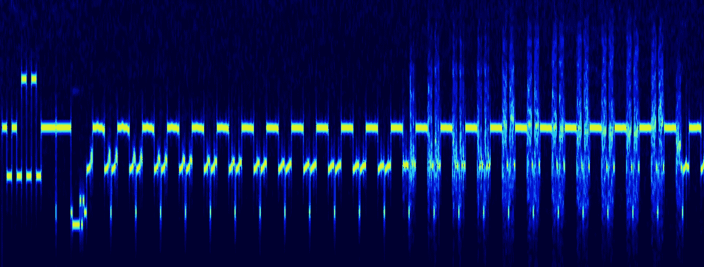

# 接收和解码来自国际空间站的 SSTV 图像

> 原文：<https://blog.devgenius.io/receive-and-decode-sstv-images-from-the-international-space-station-65a5c39f4b25?source=collection_archive---------1----------------------->

每年，国际空间站都会安排一系列的慢扫描电视(SSTV)传输，这些图像使用 145.800 兆赫的业余无线电频率传输。如何接收和解码？让我们弄清楚。


图片来源【https://en.wikipedia.org/wiki/International_Space_Station 

# 总说明

从国际空间站传来的图像是由 [ARISS](https://www.ariss.org) 团队完成的，这个项目的崇高目标是吸引人们对太空探索和航天的关注。这些广播一年进行几次，世界任何地方的任何人都可以在 145.8 兆赫频率上接收 SSTV 图像。SSTV(慢扫描电视)格式本身是很久以前创建的，它甚至被用来传输来自俄罗斯“月球 3 号”站的月球背面的图像。很久以后，SSTV 在业余业余无线电爱好者中流行起来，因为它使得用无线电收发机发送和接收图像成为可能。经过一些改变，SSTV 格式保留到了今天。在 70 年代，慢扫描图像的接收只能使用特殊和昂贵的设备，现在可以使用一台 PC、免费软件解码器和 RTL-SDR 接收器，价格为 35 美元。

# 接受

因为信号是从绕地球轨道运行的空间站发出的，我们首先需要知道接收的准确时间。早期使用的是 Orbitron 软件，但现在打开 n2yo.com 页面查看最近的飞越时间要容易得多。


右上角的频率不是为 SSTV，我们需要 145.800 兆赫的频率。当然，我们还需要一个收音机，最便宜的 RTL-SDR V3 就可以了。大约 35 美元你就可以买到这样一套设备，它非常适合于无线电实验:


如果一切操作正确，信号应该出现在频谱上:


对于录音，我们需要使用调频类型。图像处理可以使用第三方软件和虚拟音频电缆实时完成，但出于教育目的，我将数据保存在 WAV 中，并用纯 Python 自己解码。

# 解码

有许多 SSTV 软件解码器，让你做几个鼠标点击的过程。我对数据格式本身更感兴趣，所以我们来看看如何手动解码。

首先，我们可以看看信号频谱:



SSTV 是一种模拟格式，线按顺序传输，一条线传输的持续时间为 0.5 秒。使用频率调制，其中频率取决于画面亮度-黑色电平对应于 1500 赫兹，白色电平对应于 2300 赫兹。

让我们加载图像并将带通滤波器应用于数据:

```
import scipy.io.wavfile as wav
import scipy.signal as signal
import numpy as np
import matplotlib.pyplot as plt
from PIL import Image fs, data = wav.read('HDSDR_20201228_075406Z_145803kHz_AF.wav')def butter_bandpass(lowcut, highcut, fs, order=5):
    nyq = 0.5 * fs
    low = lowcut / nyq
    high = highcut / nyq
    b, a = signal.butter(order, [low, high], btype='band')
    return b, a def butter_bandpass_filter(data, lowcut, highcut, fs, order=5):
    b, a = butter_bandpass(lowcut, highcut, fs, order=order)
    y = signal.lfilter(b, a, data)
    return ydata1 = butter_bandpass_filter(data, 1400, 2200, fs, order=4)
```

下一步是应用频率解调器。我没有找到合适的库，所以我只能通过计算数据过零来手动获取频率:

```
data_fsk = np.zeros(len(data1))pos1 = 0
for p in range(0, len(data1)-1):
    if np.sign(data1[p]) != np.sign(data1[p+1]):
        pr = p - pos1
        data_fsk[pos1:p] = np.full(p - pos1, pr)
        pos1 = p
```

现在，我们可以将数据“扩展”为 2D 图像:

```
frame_width = int(0.5*fs) + 203
w, h = frame_width, data_fsk.shape[0]//frame_width
image = Image.new('RGB', (w, h))data_2d = data_fsk[:w*h].reshape((h,w))
for py in range(h):
    for px in range(w):
        lum = int(data_2d[py][px]*16)
        if lum < 0: lum = 0
        if lum > 255: lum = 255
        image.putpixel((px, py), (lum, lum, lum))
```

显示:

```
plt.imshow(image)
plt.show()
```


我们看到一幅相当有趣的图画。每条线路传输 4 帧。这是一幅彩色图像，以 **YCrCb** 格式编码，更准确地说，y1 crcb y2——一行包含*两行*亮度和*两行的一个*颜色数据。因此，图像的颜色分辨率是亮度分辨率的一半。最终图像为 640x480，总共传输 240 行。

一行在 0.5s 内传输，总共 240 行给我们 120 秒的完整传输时间，即 2 分钟。这种 SSTV 格式的名称 *PD-120* 也向我们表明了这种价值。

最后一步是执行 YCrCb => RGB 转换:

```
image_rgb = Image.new('RGB', (w//4, 2*h))
for py in range(h):
    for px in range(int(0.125*fs)):
            *# PD-120 – 640×480, 190 ?s/pixel*
            k = 32
            y0 = 255 - k*data_2d[py][px]
            cr = 255 - k*data_2d[py][px + int(0.1216*fs)]
            cb = 255 - k*data_2d[py][px + 2*int(0.1216*fs)]
            y1 = 255 - k*data_2d[py][px + 3*int(0.1216*fs)]
            image_rgb.putpixel((px, 2*py), (int(y0 + 1.402 * cr), int(y0 - 0.34414 * cb - 0.71414 * cr), int(y0 + 1.772 * cb)))
            image_rgb.putpixel((px, 2*py + 1), (int(y1 + 1.402 * cr), int(y1 - 0.34414 * cb - 0.71414 * cr), int(y1 + 1.772 * cb)))
```

这是非常简单的代码，只是一个概念证明，没有任何边缘对齐和颜色标准化。但是有些颜色很容易辨别:


这只是一个大概的想法。我没有目标要制造另一个 SSTV 转换器，有很多这样的转换器。好的话，来自同一个 WAV 文件的图像如下所示:


# 结论

正如我们所看到的，SSTV 解码并不太难，而且相当有趣。感兴趣的人可以自己尝试接收来自国际空间站的图像。今年(写这篇文章时是 2020 年)，转移将持续到 12 月 31 日(希望明年会再次发生)，所以还有几天时间接收来自 ISS 的照片。当然没有必要使用 Python，SSTV 解码器可以在任何平台上下载。

同样值得感谢的是国际空间站业余无线电项目的所有参与者对这些活动的支持。对于业余无线电爱好者、小学生和学生来说，这是一个亲身体验太空探索的好机会。