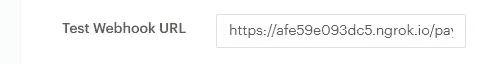

# 用 Laravel 中的 Paystack 通过 webhooks 接收数据—第 1 部分

> 原文：<https://blog.devgenius.io/receiving-data-over-webhooks-with-paystack-in-laravel-part-1-857bc4aab657?source=collection_archive---------0----------------------->


你是否曾经在构建一个应用程序时想:“我可以向这个服务的 API 发出请求，但是有没有办法让他们让我的应用程序知道`X`何时发生？您可以尝试在设定的时间间隔内调用 API。获取响应，将其与上一个进行比较，然后继续。这是轮询，但效率很低，而且很容易达到速率限制。相反，一些 API 和服务提供了所谓的 webhook。他们不是联系他们，而是联系你。

# 什么是 webhook？

webhook(也称为 web 回调或 HTTP 推送 API)是应用程序向其他应用程序提供实时信息的一种方式。Webhooks 是一种发送通知的方式。它们本质上是单向的。发件人不在乎你用它做什么，在某些情况下甚至不在乎你是谁。他们最多只想得到一个回复，让他们知道你的应用已经收到了。webhook 在数据发生时将数据传送给其他应用程序，这意味着您可以立即获得数据。许多服务，如 [Stripe API](https://stripe.com/docs/api/events) 、 [Paystack API](https://sendgrid.com/docs/for-developers/tracking-events/event/) 、 [GitHub API](https://developer.github.com/webhooks/) 和 Twillio API，都提供了在事件发生时以编程方式通知您的能力。webhook 向您选择的 URL 发出一个`POST`请求，并带有一个*有效负载*，其中包含事件的详细信息。这使得 webhooks 对提供商和消费者来说都更加有效。webhooks 的唯一缺点是初始设置的困难。

如果您曾经构建过您的应用程序或其他应用程序使用的 REST API，那么您几乎已经了解了入门所需的一切。

对于我们的示例，流程如下所示:

1.  Web 服务(Paystack API 或 Github API)将有效负载发送到应用程序的端点。
2.  你的应用程序接收有效负载。
3.  你的应用程序响应并确认接收。
4.  你的应用程序作用于有效载荷数据。

*如果你想在构建应用程序消费 webhook 之前测试它的形状，可以使用类似*[*request bin*](http://requestbin.net/)*这样的服务。*

# 我们将建造什么

在本教程中，我们将构建一个项目来监听来自 Paystack 的事件。

# 先决条件

*   Laravel v5.8 或更高版本
*   spatie/laravel-web hook-客户端
*   工资单账户。你可以在这里注册一个免费账户。

# 设置您的项目

对于这个例子，我们将使用 Laravel，但是这个概念也适用于其他语言和框架。如果您要将 webhook 消费添加到现有项目中，请跳过下面的设置。

首先，初始化一个新的 Laravel 项目:

```
composer create-project --prefer-dist laravel/laravel learning-webhook
```

# 安装 Spatie 的 Laravel webhook 客户端包

```
composer require spatie/laravel-webhook-client
```

本教程使用 Spatie 的 webhook 客户端包来处理和处理传入的 webhook 事件，它还验证事件没有被破坏。

# 配置包

您可以使用以下命令发布配置文件:

```
php artisan vendor:publish --provider="Spatie\WebhookClient\WebhookClientServiceProvider" --tag="config"
```

这是将在`config/webhook-client.php`发布的文件内容:

```
return [
    'configs' => [
        [
            /*
             * This package support multiple webhook receiving endpoints. If you only have
             * one endpoint receiving webhooks, you can use 'default'.
             */
            'name' => 'default', /*
             * We expect that every webhook call will be signed using a secret. This secret
             * is used to verify that the payload has not been tampered with.For the purpose of this article we will be using our Paystack secret key. Make sure you add it to the .env file            */
            'signing_secret' => env('PAYSTACK_SECRET_KEY'), /*
             * The name of the header containing the signature.
             */
            'signature_header_name' => 'x-paystack-signature', /*
             *  This class will verify that the content of the signature header is valid.
             *
             * It should implement \Spatie\WebhookClient\SignatureValidator\SignatureValidator
             */
            'signature_validator' => \Spatie\WebhookClient\SignatureValidator\DefaultSignatureValidator::class, /*
             * This class determines if the webhook call should be stored and processed.
             */
            'webhook_profile' => \Spatie\WebhookClient\WebhookProfile\ProcessEverythingWebhookProfile::class, /*
             * This class determines the response on a valid webhook call.
             */
            'webhook_response' => \Spatie\WebhookClient\WebhookResponse\DefaultRespondsTo::class, /*
             * The classname of the model to be used to store call. The class should be equal
             * or extend Spatie\WebhookClient\Models\WebhookCall.
             */
            'webhook_model' => \Spatie\WebhookClient\Models\WebhookCall::class, /*
             * The class name of the job that will process the webhook request.
             *
             * This should be set to a class that extends \Spatie\WebhookClient\ProcessWebhookJob.
             */
            'process_webhook_job' => '',
        ],
    ],
```

名词（noun 的缩写）b:我在“signature_header_name”和“PAYSTACK_SECRET_KEY”中添加了 Paystack 的签名头“x-paystack-signature”作为 signing_secret。为清楚起见，请点击查看 Paystack 关于设置 webhook [的文档:](https://paystack.com/docs/payments/webhooks/)

# 准备数据库

默认情况下，所有的 webhook 调用都会保存在数据库中。

要创建保存 webhook 调用的表，必须使用以下内容发布迁移:

```
php artisan vendor:publish --provider="Spatie\WebhookClient\WebhookClientServiceProvider" --tag="migrations"
```

迁移发布后，您可以通过运行迁移来创建`webhook_calls`表:

```
php artisan migrate
```

# 负责路由

接下来，让我们来处理路由。Paystack 允许您在设置页面的 API & Webhook 部分向您的仪表板添加 webhook URL。



在我的 Paystack 帐户上配置的 Webhook URL

在你的应用程序的 routes 文件中，你必须将该 URL 传递给`Route::webhooks`，如下所示:

```
//routes/api.phpRoute::webhooks('paystack-webhook');
```

在后台，这将注册一个`POST`路由到这个包提供的控制器。因为向您发送 webhooks 的应用程序无法获得 csrf-token，所以您必须将该路由添加到`VerifyCsrfToken`中间件的`except`数组中:

```
// App/Http/Middleware/VerifyCsrfToken.phpprotected $except = [
    'paystack-webhook',
];
```

# 创建我们自己的签名验证器

接下来我们需要做的是创建一个自定义的签名验证器，为什么我们需要创建一个签名验证器呢？

> 验证事件源自 Paystack 非常重要，以避免基于 countefeit 事件传递值。

上面引用的语句是我们为什么需要创建一个实现`Spatie\WebhookClient\WebhookClient\SignatureValidator\SignatureValidator`接口的自定义签名验证器的原因。

```
//App/Handler/CustomSignatureValidator.php<?phpnamespace App\Handler;use Illuminate\Http\Request;use Spatie\WebhookClient\Exceptions\WebhookFailed;use Spatie\WebhookClient\WebhookConfig;use Spatie\WebhookClient\SignatureValidator\SignatureValidator;class PaystackSignature implements SignatureValidator{
    public function isValid(Request $request, WebhookConfig $config): bool{$signature = $request->header($config->signatureHeaderName);if (! $signature) {return false;
     }$signingSecret = $config->signingSecret;if (empty($signingSecret)) {throw WebhookFailed::signingSecretNotSet();
     }$computedSignature = hash_hmac('sha512', $request->getContent(), $signingSecret);return hash_equals($signature, $computedSignature);
   }
}
```

之后需要做的是用处理传入 webhook 响应的签名验证的类的名称来更新这个路径`config/laravel-webhook-client.php`中的文件，以便真正确定它不是伪造的响应。

```
/**  This class will verify that the content of the signature header is valid.** It should implement \Spatie\WebhookClient\SignatureValidator\SignatureValidator*/'signature_validator' => App\Handler\CustomSignatureValidator::class,
```

# 存储和处理 webhooks

既然已经解决了这个问题，我们现在可以专注于处理 webhook 响应了。为此，我们需要创建一个名为`Handler`的文件夹，并将其放在我们的`App`目录中。

创建文件夹后，我们需要在上面创建的文件夹中创建一个名为`ProcessWebhook.php` 的文件来处理(存储和处理)webhook 响应。

```
//App/Handler/ProcessWebhook.php
<?phpnamespace App\Handler;
use \Spatie\WebhookClient\ProcessWebhookJob;//The class extends "ProcessWebhookJob" class as that is the class //that will handle the job of processing our webhook before we have //access to it.class ProcessWebhook extends ProcessWebhookJob
{public function handle(){
       $data = json_decode($this->webhookCall, true);
       //Do something with the event
       logger($data['payload']);
       http_response_code(200); //Acknowledge you received the response}
}
```

之后需要做的是用处理从 Paystack 或您可能使用的任何其他服务(比如 Github API、Stripe API 等)获得的 webhook 响应的类的名称来更新这个路径`config/laravel-webhook-client.php`中的文件。

```
/*
             * The class name of the job that will process the webhook request.
             *
             * This should be set to a class that extends \Spatie\WebhookClient\ProcessWebhookJob.
             */
            'process_webhook_job' => App\Handler\ProcessWebhook::class,
        ],
```

# 结论

很有趣，对吧？在很短的时间内，我们就能够设置和配置一个 webhook-client 包来处理来自 Paystack 的事件。对于进一步的阅读，你可以在 [*阅读更多关于我们用于这个项目的包，它的官方文档*](https://github.com/spatie/laravel-webhook-client) 也是如此。你也可以在 [GitHub](https://github.com/adejorosam/webhook-tutorial) 上查看这个项目的完整源代码。

在本文的下一部分，我们将看到如何在上线之前用 ngrok 在本地测试我们的 webhook！

*如果你喜欢这个，点击💚所以其他人会在媒体上看到这个。*

推特:@samss [s_a](https://twitter.com/samsss_a)