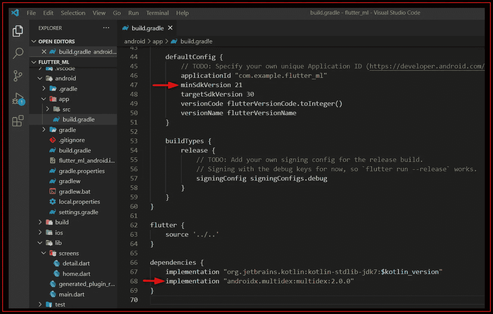

# 在抖动中识别图像上文本

> 原文：<https://blog.devgenius.io/recognize-text-on-an-image-in-flutter-c8da05fe043e?source=collection_archive---------2----------------------->

在 Flutter 中使用[**Google ML kit**](https://developers.google.com/ml-kit)**启用设备上的机器学习来识别图像上的文本比你想象的要容易。文本识别通常用于**识别扫描文档和图像中的文本**或将纸质文档转换为可访问的电子文本。**

****

**[**Google ML kit**](https://developers.google.com/ml-kit)**in 扑-鲁美数码****

****如今，许多应用程序需要在多个平台上运行，如 iOS、Android 和 web。****

****这就是谷歌开发 Flutter 的原因，这是一个 UI 工具包，可以在不牺牲质量、速度或性能的情况下，从单一代码基础上构建漂亮的原生应用。****

****Google 提供的 **ML 套件**文本识别有助于[识别任何基于拉丁语的字符集中的文本](https://developers.google.com/ml-kit/vision/text-recognition),并且便于自动化数据输入任务，如处理信用卡、收据和名片。最好的部分是，您只需要不到 10 行代码就可以在移动设备上启用机器学习算法。****

# ****你会支持 awesome❤️****

> ****请帮我获得 100 名追随者。****

# ****🟤在颤振中启用 ML 套件****

******步骤** 1️⃣:将**相机**和 **google_ml_kit** 包添加到 pubspec.yaml****

****访问 [pub.dev](https://pub.dev/packages/sqflite/install) 并在`pubspec.yaml`文件中添加`[camera:^0.9.4+5](https://pub.dev/packages/camera/install)`和`[google_ml_kit:^0.7.3](https://pub.dev/packages/google_ml_kit/install)`****

```
**environment:
   sdk: ">=2.12.0 <3.0.0"dependencies:
   flutter:
     sdk: flutter
   google_ml_kit: ^0.7.3
   camera: ^0.9.4+5**
```

******步骤** 2️⃣:通过编辑**Android/app/build . gradle**在 Android 上启用它:****

****✅设置***minsdkversion***为 21****

****✅添加 ***实现“androidx . multi dex:2 . 0 . 0”*******

********

****在颤振中使用 ML 套件—鲁美数码****

# ****🟤文本识别****

****谷歌提供的 ML 套件[文本识别](https://developers.google.com/ml-kit/vision/text-recognition)有 5 个主要特点:****

****✅识别文本****

****✅检测单词、行和段落****

****✅Identify 识别文本的语言****

****设备上的✅Real-time 识别****

******步骤** 1️⃣:导入 dart 文件中的包****

```
**import 'dart:async';
import 'dart:io';
import 'package:google_ml_kit/google_ml_kit.dart';**
```

******步骤** 2️⃣:初始化谷歌 ML 工具包文本检测器****

```
**//the path of the image stored in the device
late final String _imagePath;
late final TextDetector _textDetector;@override
void initState() {    
    // Initializing the text detector
    _textDetector = GoogleMlKit.vision.textDetector();
    _recognizTexts();
    super.initState();
}**
```

******步骤** 3️⃣:从`RecognisedText`对象中检索文本****

```
**void _recognizTexts() async { // Creating an InputImage object using the image path
  final inputImage = InputImage.fromFilePath(_imagePath); // Retrieving the RecognisedText from the InputImage
  final text = await _textDetector.processImage(inputImage); // Finding text String(s)
  for (TextBlock block in text.blocks) {
    for (TextLine line in block.lines) {
       print('text: ${line.text}');
    }
  }
}**
```

******步骤** 4️⃣:在 UI 上显示识别出的文本****

# ****🟤在 Android 模拟器中使用摄像头****

****要在模拟器中使用相机拍照，请进入 AVD 高级设置，将前置和后置相机设置为`Webcam()`****

********

****在 Android 模拟器中使用相机—鲁美数码****

# ****🟤在设备上测试你的应用程序:****

******步骤** 1️⃣:使用`flutter clean`清理你的项目****

******步骤** 2️⃣:通过使用`flutter pub get`获取包****

******步骤** 3️⃣:运行`flutter build apk` (`flutter build`命令默认为`--release`。)****

****4️⃣:在你的机器中找到你的 apk。****

****✅your 项目名称\build\app\outputs\flutter-apk(在发布模式下)****

****✅copy 此 APK 并安装您的移动设备****

****更多请看[这个](https://www.youtube.com/watch?v=qSn68_WLRKc)视频。****

# ****🟤故障排除案例:****

******案例** 1️⃣:如果你看到这个错误消息:[任务执行失败':camera:compiledebugjavawithjavac '](https://stackoverflow.com/questions/69999966/execution-failed-for-task-cameracompiledebugjavawithjavac)****

******解决方案**:转到**Android/app/build . gradle**:****

****✅设置***minsdkversion***为 21****

****✅设置 ***编译*** 为 31****

****✅设置 ***目标值*** 为 31****

****✅添加 ***实现“androidx . multi dex:2 . 0 . 0”*******

****✅重启应用程序****

********

****在颤振中使用 ML 套件—鲁美数码****

# ****更多教程:****

*   ****[颤振动画教程](https://medium.com/@lumeilin301/flutter-animation-tutorial-4eb560eace48)****
*   ****[颤振& Firebase App 教程](https://medium.com/@lumeilin301/flutter-firebase-app-tutorial-part-1-get-started-95cce84939c3)****
*   ****[在颤振中使用 SQLite](https://medium.com/@lumeilin301/using-sqlite-in-flutter-4b16e5ef36dc)****

# ****你会支持 awesome❤️****

> ****有更多的关注者会鼓励我写更多的文章。****

******关键词:** Flutter，ML Kit，Google，文本识别。****