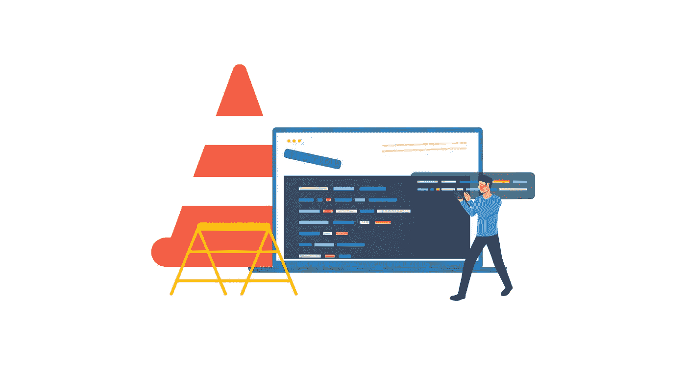
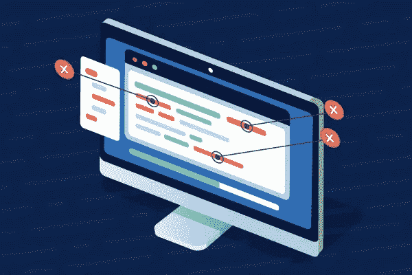

# 认可“卓越工程”

> 原文：<https://blog.devgenius.io/recognizing-engineering-excellence-6ecf747894db?source=collection_archive---------3----------------------->

对于任何在大公司工作的工程师来说，开发新功能只是工作的一部分。另一个主要部分是为“**卓越工程** (EE)”做出贡献。EE 也称为“更好的工程”，包含

> **所有提高产品质量&效率**的努力。

如果工程师在 Infra 团队中工作，这一职责的优先级会更高。在这篇笔记中，我将分享我在日常运营中如何认识到“卓越工程”的影响的经验。

来自[代码夹](https://www.codegrip.tech)的 Img

# 测试覆盖率

编写更多的测试是确保代码质量的一个显而易见的方法。为了衡量影响，我们通常使用两个指标:**代码覆盖率和以前的问题预防率。**

代码覆盖很简单。对于“以前的问题预防”，我们可以将其分为两个级别:

*   **基础** : **预防产品流程中发生的未来问题**。例如，用户不能对一种类型的帖子发表评论(如视频分享)。我们为它建立了一个测试。
*   **理想的** : **预防一整类问题。**同样的例子，如果工程团队能够建立一个覆盖所有类型帖子的 E2E 测试集合，并使这些测试推阻塞。这将是理想的预防措施。

# 开发效率

这个地区不一样。与试图通过编程来衡量事物相比，**案例研究可能会有效得多**。

例如，找到我们的工作在过去可以被使用的三个案例，并提交历史，估计它可以节省多少时间。

在添加新特性的另一方面，为了提高开发效率，**删除废弃的组件、库或死代码**也很重要。通过保持代码库的现代化，它将帮助未来的工程师阅读你的代码。因此，工程师可以得到最好的支持，因为代码库中的例子通常是最好的文档。

# 代码性能

[**性能是特色**。](https://blog.codinghorror.com/performance-is-a-feature/)

如果我们在产品的核心路径中发现了低效的流程，就需要尽快修复。

为了衡量它，通常像 **P90/P95/P99 花费的时间**这样的指标是很好的代理，取决于你的产品的受众。

除了直接减少花费的时间，构建工具来帮助识别瓶颈或仪器功能也非常有效。

# 稳定性

对于一个简单的产品/服务，跟踪一段时间内的失败率是一个很好的顶线指标。然而，当系统开始变得越来越复杂时，比如包含多个关键工作流，工程师可能需要与数据科学家坐下来分解指标。

来自[的 Img 执行](http://perforce.com)

# 数据保密

人们应该只被允许查看他们工作所需的数据，仅此而已。

这个区域曾经是“更好的工程”的一部分。然而，随着监管(如欧洲的 [**、GDPR**](https://gdpr-info.eu/) 和美国的 [**数据隐私&合规**](https://www.dhs.gov/topic/privacy) )越来越严格。“数据隐私”现在已经成为一个系统的重要组成部分。因此，我们将在本笔记中跳过它。