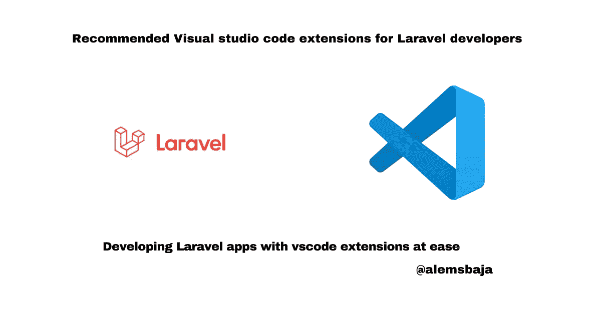

# 向 Laravel 开发人员推荐的 Visual studio 代码扩展

> 原文：<https://blog.devgenius.io/recommended-visual-studio-code-extensions-for-laravel-developers-76244ea0b730?source=collection_archive---------10----------------------->

向 Laravel 开发人员推荐的 Visual studio 代码扩展

在本文中，我们将为 PHP/Laravel 开发人员介绍出色的 vscode 扩展。

Vscode 是微软的免费开源文本编辑工具，支持使用不同的编程语言开发应用程序。它有内置的 Git 功能。

安装扩展以添加新的语言、主题、调试器，并连接到其他服务。扩展在单独的进程中运行，确保它们不会降低编辑器的速度。

它有一个适用于 Windows、Linux 和 macOS 的桌面应用程序。了解关于 [Vscode](http://code.visualstudio.com) 的更多信息

**Vscode 是开发人员应该拥有的最好的编辑器之一。**

以下是众多扩展中的几个，可以让你在构建 Laravel 应用程序时的开发体验更加顺畅。

> [Laravel 扩展包 ](https://marketplace.visualstudio.com/items?itemName=onecentlin.laravel-extension-pack)

这是最好的 laravel vscode 扩展之一，集 10 个扩展于一身(vscode 扩展的集合)

laravel blade 片段、dotEnv、laravel artisan、转到视图、转到控制器、laravel extra IntelliSense、PHP debug、PHP IntelliSense、VScode 的编辑器配置是在安装 laravel 扩展包时自动添加的。

[**拉韦勒刀片片段**](https://marketplace.visualstudio.com/items?itemName=onecentlin.laravel-blade)

**功能**

*   刀片语法突出显示
*   刀片片段使用@符号访问刀片片段列表
*   刀片格式化

**DotEnv** [**扩展**](https://marketplace.visualstudio.com/items?itemName=mikestead.dotenv) 支持 highligting。环境变量和值

[**拉韦勒工匠**](https://marketplace.visualstudio.com/items?itemName=ryannaddy.laravel-artisan)

有了这个扩展，我们可以在 vscode 中运行 laravel 命令，还可以在开发人员记不起命令名的情况下提供 laravel 命令的列表。

[**前往查看**](https://marketplace.visualstudio.com/items?itemName=codingyu.laravel-goto-view) 有了这个扩展，开发者可以通过按住 ctrl 键并点击 Windows，轻松地从代码片段中导航到文件。

[**转至控制器**](https://marketplace.visualstudio.com/items?itemName=stef-k.laravel-goto-controller)

按住 Alt 键并单击可从一个路径导航到相应的控制器文件。

[**Laravel Extra Intellisense**](https://marketplace.visualstudio.com/items?itemName=amiralizadeh9480.laravel-extra-intellisense)

**特性**

*   自动完成
*   路线名称和路线参数
*   视图和变量
*   配置
*   翻译和翻译参数
*   Laravel 混合函数
*   验证规则
*   查看部分和堆栈
*   包封/包围（动词 envelop 的简写）
*   路由中间件
*   资产
*   模型属性(Beta！)
*   刀片指令

> [*PHP 名称空间解析器*](https://marketplace.visualstudio.com/items?itemName=MehediDracula.php-namespace-resolver)

PHP 名称空间解析器可以导入和扩展你的类。您还可以根据行长度或字母顺序对导入的类进行排序。

给目录中的文件夹添加漂亮的自定义图标

**功能**

*   突出显示包含诊断信息的行
*   将诊断信息作为文本附加到行尾
*   在装订线中显示图标
*   在状态栏中显示消息

> [*VSCode 高级新文件*](https://marketplace.visualstudio.com/items?itemName=patbenatar.advanced-new-file)

特征

*   模糊匹配自动完成创建相对于现有路径的新文件(感谢 JoeNg93 让它更快)
*   创建新文件时创建新目录
*   创建一个目录而不是一个文件，方法是在文件路径后面加上/作为后缀，如在 somedirectory/中创建目录(感谢 maximilianschmitt)
*   忽略 gitignored 和 workspace files.exclude 设置。
*   将 advancedNewFile.exclude 设置添加到工作区设置的附加选项，就像原生 files.exlude 一样，只是它仅显式影响 advancedNewFile 插件。(感谢卡夫丁峡谷)
*   通过配置设置 advanced new file . convenience options 控制最方便选项的顺序(“最后选择”、“当前文件”等)

创建、复制、移动、重命名、删除文件和目录的便捷方式。

灵感来自 Sublime 的侧边栏增强功能。

> ***感谢您阅读这篇文章。***

请与您的网络分享，并随时使用评论区的问题，答案和贡献。

你喜欢这篇文章吗？？请在 Hashnode [alemsbaja](https://alemsbaja.hashnode.dev/) 或 Twitter [@alemsbaja](https://alemsbaja.hashnode.dev/twitter.com/alemsbaja) 上关注我，以获得更多文章的更新

*原发布于*[*https://alemsbaja . hashnode . dev*](https://alemsbaja.hashnode.dev/recommended-visual-studio-code-extensions-for-laravel-developers)*。*