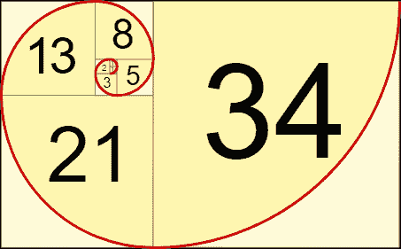

# 递归算法:定义、比较与循环、何时使用以及如何实现

> 原文：<https://blog.devgenius.io/recursion-algorithm-definition-comparisons-vs-loop-when-to-use-and-how-to-implement-it-69a4d86f5f61?source=collection_archive---------8----------------------->

在这篇文章中，我将讨论递归。我们将了解递归的定义，递归和循环的比较，何时使用递归，以及如何在 golang 中实现递归。

# 介绍

递归是函数调用自己。当一个函数被调用时，它将被存储在一个堆栈中，如果最后一个函数结束或返回，该函数将从堆栈中弹出。无休止的递归会导致堆栈溢出，这是一种当我们的内存没有剩余空间时的情况。为了实现递归，我们必须注意这三条规则:

*   确定基本案例
*   识别递归情况
*   越走越近，需要的时候再回来。通常，你有两个回报。

## 递归与迭代

基本上，用递归可以做的任何事情都可以迭代完成(循环)。下面是递归算法的优点和缺点。

## 何时使用递归

每当你使用树或者把东西转换成树的时候，考虑使用递归。递归适用于以下情况:

*   分成许多子问题，这些子问题是同一问题的较小实例
*   子问题的每个实例本质上都是相同的
*   每个子问题的解决方案可以组合起来解决手头的问题

# 如何使用递归:斐波那契数列研究案例

斐波纳契数列是一系列数字，其中 I 处的数字是它前面两个数字的和。

## 递归的

要用递归创建斐波那契数列，我们必须确定何时需要返回。在这种情况下，当索引小于 2 时，只返回 1，因为我们不想添加 0。如果索引大于 2，则返回索引-1 和索引-2 之和的两个函数。在下面的例子中，我们想得到索引为 6 的斐波那契数。

输出

但是，使用递归函数有一个缺点，那就是被调用的函数的数量。看下面的图片，仅仅为了得到一个索引为 5 的斐波那契数，我们必须调用 15 个函数，这些函数并不是真正高效的。想象一下，如果我们想得到指数大于 10 的斐波那契数，我们会有很多调用栈，这会导致栈溢出。斐波那契递归的时间复杂度是 O(2^n)

## 环

要创建一个具有循环的斐波那契数列，首先，我们必须存储两个第一数字 0 和 1。然后，迭代并将 y 处的当前数字移动到 x，并将 x 和 y 的和存储在 y 中。完成此操作后，返回 x，因为 y 与 1 个索引重叠。

输出

循环的缺点是它不是真正可读的。理解背后的逻辑需要时间。但是循环的优点是性能更好，效率更高，因为时间复杂度是 O(n)。

# 结论

递归是函数调用自己。递归的优点是它是可读的，当我们有一个可以分成子问题的问题，并且每个子问题都是相同的时候，使用它是很好的。递归的缺点是调用堆栈太大，会导致堆栈溢出。