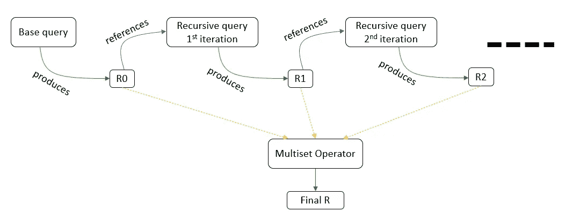
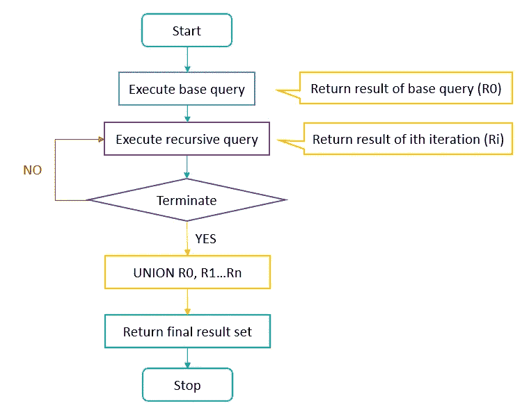

# 递归 CTE——去神秘化

> 原文：<https://blog.devgenius.io/recursive-cte-demystified-6adc0021813f?source=collection_archive---------5----------------------->


照片由[蒂内·伊万尼奇](https://unsplash.com/@tine999?utm_source=unsplash&utm_medium=referral&utm_content=creditCopyText)在 [Unsplash](https://unsplash.com/@tine999?utm_source=unsplash&utm_medium=referral&utm_content=creditCopyText) 拍摄

递归解决 SQL 问题

# CTE

公用表表达式(CTE)是一个临时结果集，可以被紧跟在 CTE 后面的 DML 语句引用。

CTE 的语法如下:

```
WITH 
  cte AS ( SELECT a, b FROM table1 )
SELECT * FROM cte
```

我们甚至可以创建多个 cte 并一起使用:

```
WITH
  cte1 AS (SELECT a, b FROM table1),
  cte2 AS (SELECT c, d FROM table2)
SELECT b, d FROM cte1 INNER JOIN cte2
WHERE cte1.a = cte2.c;
```

如果在一个基表上创建了 CTE，那么在 CTE 上的任何更新或删除都会传播到该基表。如果 CTE 是从多个表中创建的，并且只对一个基表进行了更新，它仍会将更改传播到基表，但结果可能不稳定。每个 CTE 的作用域都存在于定义它的语句中。

实际上，CTE、子查询和临时表具有相似的性能。从可读性来看，人们可能更喜欢其中的一个。但是 CTE 在子查询 1 上有两个闪光点。因为 CTE 是它们自己的查询，所以它们可以被重用并避免冗余。2.CTE 可以递归使用。

## 递归复习器

递归解决方案必须具有以下属性

*   **基础案例**，其中递归软件系统达到定义的解决方案状态
*   以某种方式(通常通过减少输入空间)在有限的步骤中将递归程序移向基本情况

## 递归 CTE

一个**递归 CTE** 是一个子查询，它使用自己的名字来引用自己。

创建递归 CTE 的语法如下

```
WITH **RECURSIVE** cte AS 
    (
        SELECT query (Non recursive or base query)
        UNION (separtor [multiset operators])
        SELECT query (recursive query using cte with termination condition)
    )
SELECT * FROM cte
```

查询的流程有以下步骤:

*   首先，执行基本查询以形成基本结果集(R0)，并将该结果用于下一次迭代。
*   第二，使用前一次迭代的输入结果集执行递归成员，并返回一个子结果集(Ri ),直到满足终止条件。当前一个结果是一个空表时，终止条件到达。递归查询不引用自身，它只引用前一个结果，当前一个结果是一个空表时，递归停止。



*   第三，使用`UNION`操作符组合所有结果集 R0，R1，… Rn 以产生最终结果集。



递归 CTE 流程图

## 要记住的要点

*   递归查询只能在它的`FROM`子句中引用一次 CTE 名称，而不能在任何子查询中引用。
*   递归查询不能有聚合函数
*   如果期望的结果集包含重复项，那么我们需要使用`UNION ALL`作为多重集操作符。
*   递归查询必须包括终止条件
*   确保递归深度在通过设置此变量`cte-max-recursion-depth`定义的系统限制范围内

# 例子

## 生成从 1 到 n 的数字。

```
WITH RECURSIVE cte AS 
    (
        SELECT 1  as n 
        UNION ALL   
        SELECT n + 1  FROM cte WHERE n < 5 
    )
SELECT * FROM cte;
```

## 生成斐波那契数列

```
WITH RECURSIVE fibonacci AS
(
  SELECT 1 as n, 0 as fib_n, 1 as next_fib_n
  UNION ALL
  SELECT n + 1, next_fib_n, fib_n + next_fib_n FROM fibonacci WHERE n < 10
)
SELECT * FROM fibonacci;
```

类似地，我们也可以生成阶乘

```
WITH RECURSIVE factorial AS
(
  SELECT 1 as n, 1 as fact
  UNION ALL
  SELECT n + 1, (n+1)*fact, 
  FROM factorial WHERE n < 5
)
SELECT * FROM factorial;
```

## 在单独的行中打印给定单词的每个字符。

```
SET [@changes](http://twitter.com/changes) = 'CHANGES';
WITH RECURSIVE cte  AS (
  SELECT 1 AS rownum
  UNION ALL
  SELECT rownum + 1 FROM cte WHERE rownum < LENGTH([@changes](http://twitter.com/changes))
)
SELECT
SUBSTRING([@changes](http://twitter.com/changes), rownum, 1) AS print_down
FROM cte;
```

## 树遍历

给定一个表`bst`，它有两列`node`和`parent`，给出了二叉查找树中一个节点的值和它们各自的父值。写 SQL 到找到给定`bst`中所有节点的路径。

```
WITH RECURSIVE
cte ( node, path )
AS
( SELECT node, cast ( 1 as char(30) )  
          FROM bst WHERE parent IS NULL
  UNION ALL
  SELECT bst.node,  CONCAT ( cte.path, '-->', bst.node ) 
         FROM cte JOIN bst ON cte.node = bst.parent
)
SELECT * FROM cte ORDER BY node;
```

## 取消给定数据的分组

为下面的输入表编写一个查询来生成给定的输出表。

```
**Input Table**
+----+----------+------------+
| id | Customer | VisitCount |
+----+----------+------------+
| 1  | Abbot    | 4          |
| 2  | Doris    | 1          |
| 3  | Emerson  | 2          |
+----+----------+------------+**Output Table:** +----+----------+
| id | Customer |
+----+----------+
| 1  | Abbot    |
| 1  | Abbot    |
| 1  | Abbot    |
| 1  | Abbot    |
| 2  | Doris    |
| 3  | Emerson  |
| 3  | Emerson  |
+----+----------+
```

解决办法

```
with data as (
  SELECT 1 as id, 'Abbot' as Customer, 4 as VisitCount
  UNION ALL
  SELECT 2, 'Doris', 1
  UNION ALL
  SELECT 3, 'Emerson', 2
), cte as
    (
      SELECT id, Customer, VisitCount
      FROM data
      UNION ALL
      SELECT cte.id, cte.Customer, cte.VisitCount - 1
      FROM cte 
      INNER JOIN data d ON d.Customer = cte.Customer and d.id = cte.id
      WHE cte.VisitCount > 1
    )
SELECT id, Customer
FROM cte
ORDER BY 1
```

正如我们在上面的例子中看到的，递归 cte 可以用于层次结构或树结构数据的序列生成和遍历。

快乐递归！！