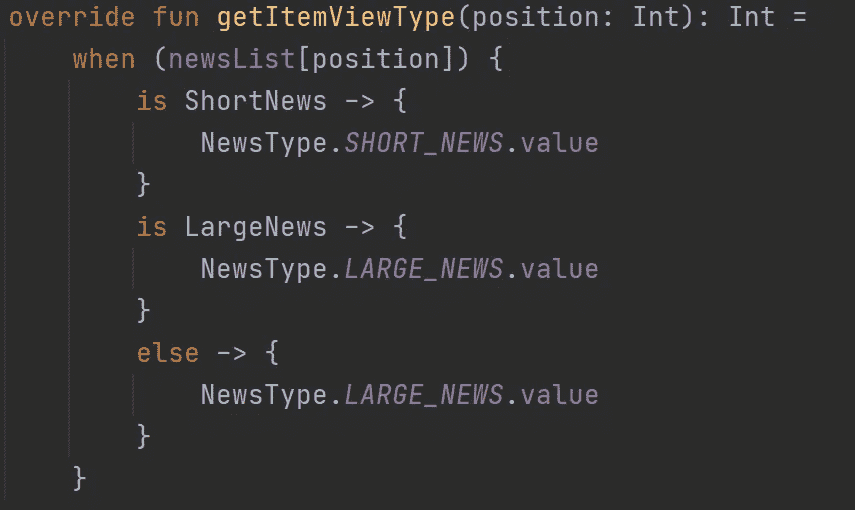

# Kotlin 中具有多个视图的 RecyclerView

> 原文：<https://blog.devgenius.io/recyclerview-with-multiple-views-in-kotlin-bffe299c1994?source=collection_archive---------2----------------------->


在我的 recycle view 文章的第一部分中，我展示了如何从头开始创建一个简单的 recycle view。现在，我将演示如何使用相同的适配器向相同的 recyclerview 添加不同的项目布局。因为我将建立在我以前的项目上，你可能想要[看看它](/android-kotlin-recyclerview-with-databinding-788d353a67bf)。

让我们深入研究代码。

在之前的项目中，我有一个名为`LargeNews`的模型类。现在，我添加另一个名为`ShortNews`的类。考虑到 OOP 原则，拥有一个名为`News`的抽象父类是一个很好的实践，它拥有任何新闻类型的蓝图。任何继承`News`的类都必须有一个标题和一个图像，这些属性应该被它们覆盖。因此，我们将`News`及其属性定义为抽象的。另外，`ShortNews`接受一个日期，`LargeNews`接受一个描述。虽然它并不意味着在现实生活中使用，但它有助于我们更清楚地看到差异。

```
abstract class News {
    abstract val title: String
    abstract val image: Drawable?
}data class ShortNews(
    override val title: String,
    override val image: Drawable?,
    val date: String
) : News()data class LargeNews(
    override val title: String,
    override val image: Drawable?,
    val description: String
) : News()
```

在`DummyData`中有一个函数创建并返回`News`对象作为一个由`LargeNews` 和`ShortNews`组成的列表。由于`News`是`LargeNews`和`ShortNews`的父节点，我们可以将它们返回到与`News`相同的列表中。显然，条目将根据我们添加到列表中的顺序显示在屏幕上。

下一步是准备`ShortNews`项目的布局。为了节省时间，我将创建一个真正基本的、没有吸引力的 UI。因此，创建一个新的布局文件，并根据需要进行定制。正如我在文章的第一部分中演示的，如果你想使用数据绑定，把文件转换成数据绑定布局。我向同一个`item_large_news.xml`文件添加了一个文本视图。我的`item_short_news.xml`文件是这样的:

现在，是时候为`ShortNews`创建 viewholder 类了。除了命名之外，它与`LargeNewsViewHolder`几乎相同。在视图持有者内部，有一个函数将`shortNews`对象绑定到布局的 shortNews 变量。可以定义不同于`LargeNewsViewHolder`的功能和行为。

```
class ShortNewsViewHolder(
    private val binding: ItemShortNewsBinding
) : RecyclerView.ViewHolder(binding.*root*) {
    fun bind(shortNews: ShortNews) {
        binding.*shortNews* = shortNews
    }
}
```

此后，是时候根据我们的需要，为不同的视图类型安排具有所有逻辑的`NewsAdapter`了。

上一个项目中的`NewsAdapter`，以`LargeNewsViewHolder`为视图持有人。然而，这已经不起作用了，因为我们有了另一个视图持有者，即`ShortNewsViewHolder`。适配器必须与两种类型的观察架兼容。为此，使用`RecyclerView.ViewHolder` a 类，因为两个视图持有者都从`RecyclerView.ViewHolder`继承。正如`LargeNews`、`ShortNews`和`News`的情况。

随后，开始将列表的类型从`LargeNews`更改为`News`，因为列表由`LargeNews` 和`ShortNews`组成，正如我已经解释过的，它们都继承自`News`。


由于 viewholder 类型已经改变，IDE 告诉我们要覆盖这些函数。然后，在类中添加两个项目布局的绑定类。

```
private lateinit var bindingLargeNews: ItemLargeNewsBinding
private lateinit var bindingShortNews: ItemShortNewsBinding
```

当您查看`onCreateViewHolder`函数时，您会看到该函数返回`RecyclerView.ViewHolder`。因此，我们将使用`when`结构返回`LargeNewViewHolder` 或`ShortNewViewHolder`。为了区分当前绘制的视图，我们将使用函数的 viewType 参数。该参数将根据当前项的类型返回一个整数值。要处理这种行为，覆盖`getItemViewType`功能。

在实现这个函数之前，为了保持有序，创建一个名为`NewsType`的枚举类，它保存可能的新闻类型和一个值。该值将用作视图类型。尽管如此，您仍然可以在不使用 enum 类的情况下给出这个值。

```
enum class NewsType(val value: Int) {
    *LARGE_NEWS*(1), *SHORT_NEWS*(2)
}
```

在`getItemViewType`中获取当前项目，并通过`is`关键字检查其类型。如果是一种类型的`ShortNews`，那么返回我们在`NewsType`中定义的值 2。`onCreateViewHolder`将使用这个值来检查视图类型。这同样适用于`LargeNews`。此外，我们必须写 else 情况，我更喜欢把`LargeNews`放在里面。但是，这不会有任何区别，因为我们只有两种类型。作为另一种选择，你可以抛出一个异常。



现在在`onCreateViewHolder`中，通过检查我们最近设置的 viewType 的值，我们将扩展视图的布局并返回它的一个实例。同样，我们必须编写 else 块，我将用 LargeNews 填充它。或者如前所述，您可以抛出一个异常。


在`onBindViewHolder`函数中，我们将调用 viewholder 的`bind`函数。为了决定调用哪个视图持有者的绑定函数，再次检查当前项的类型。要使用 holder 参数作为所需的 viewholder 类型，请使用`as`关键字并转换它。如果当前项目是`ShortNews`的类型，则将项目绑定为`ShortNews`，这同样适用于`LargeNews`。


最后，`getItemCount`返回列表的大小。

最后一步是更改`MainActivity.kt`中的变量名，以保持清晰。但是，如果您遵循了我的第一篇文章，就没有必要添加或删除代码。


仅此而已。虽然它看起来不漂亮，但工作正常。


你可以在这里查看完整项目[。](https://github.com/canonall/MultiView-RecyclerView)

非常感谢任何反馈或建议！