# 基于分类回归模型的红酒质量预测

> 原文：<https://blog.devgenius.io/red-wine-quality-prediction-using-classification-and-regression-model-f19337821b71?source=collection_archive---------3----------------------->

在我的上一篇文章中，我提到了[统计学对于数据科学](https://medium.com/p/statistics-for-data-science-ddbc284d4016?source=email-bc3371cfd6fb--writer.postDistributed&sk=0b4bc16f16ee956ffff901f3709f68ce)的重要性。这是因为统计学是一个重要的概念，机器学习是建立在这个概念之上的。在这个使用 Kaggle 数据集预测红酒质量的逐步过程中，您将看到统计学在转换、解释、分析和可视化数据方面的重要性。

**值得注意的是，拥有问题集的领域知识非常重要。**

图片来源:Unsplash

现在，简要概述一下红酒质量数据集。

红酒质量数据集的主要目的是预测哪种理化特性可以酿造出好酒。给定 11 个变量和 1 个输出变量(质量),让我们检查每个特征的作用:

1.  ***固定酸度*** :不挥发酸，不容易挥发
2.  *:葡萄酒中的乙酸含量高，会产生令人不快的醋味*
3.  ****柠檬酸*** :作为防腐剂，增加酸度。少量时，增加葡萄酒的新鲜度和风味*
4.  ****残糖:*** 是发酵停止后剩余的糖量。关键是要在甜味和酸味之间有一个完美的平衡。需要注意的是，45 克/升的葡萄酒是甜的*
5.  ****氯化物*** :酒里的盐量*
6.  ****游离二氧化硫:*** 它阻止微生物的生长和葡萄酒的氧化*
7.  **二氧化硫总量:为游离态+结合态 SO2 的量**
8.  *****密度*** :越甜的葡萄酒密度越大**
9.  *****pH*** :描述酸度等级，范围为 0-14。大多数葡萄酒的 pH 值总是在 3-4 之间**
10.  *****酒精*** :少量存在于葡萄酒中使饮酒者易于交际**

12.  *******质量*** :哪个是输出变量/预测值****

****现在我们对影响好酒质量的各种因素有了基本的了解，我们是不是该为那杯酒干杯？****

****让我们为此干杯，干杯。****

****在决定使用哪种机器学习算法时，需要 6 个步骤:****

1.  ******定义问题:******

****a.在你的模型中展示每个因素对葡萄酒质量的贡献****

****b.说明哪些特征对决定葡萄酒质量更重要****

****c.说明哪些特征在决定葡萄酒质量方面不太重要****

****2.**数据收集:**归功于 Kaggle 数据集****

****3 **。数据清理:**检查重复、空值、缺失值等。****

****4.**数据探索和可视化:**这有助于有效地解释葡萄酒数据中的每个特征****

****5.**训练算法**:使用多变量回归和随机森林分类来识别目标和特征之间的模式和关系****

****6.**使用一些指标评估您的模型(回归和分类)**:****

****a.偏斜:接近零的正态分布是完美的分布****

****b.MSE(均方误差):是拟合的绝对度量。注意，MSE 为 0 表示完全符合)****

****c.RMSE(均方根误差):是模型预测目标的准确程度的一个很好的度量****

****d.R-Squared:是拟合的相对度量****

****e.混淆矩阵(准确度、精确度、召回率)****

****此外，使用 BIC(贝叶斯信息标准)的模型选择在测量复杂性；其中具有较低 BIC 值的模型是优选的。****

****让我们把手弄脏，好吗？****

****所需的软件包/模块****

******第二步:数据收集******

****多亏了 Kaggle，数据集以 CSV 文件的形式下载到了我的个人电脑上****

****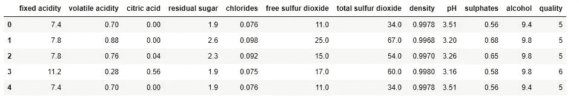****

****重命名列****

****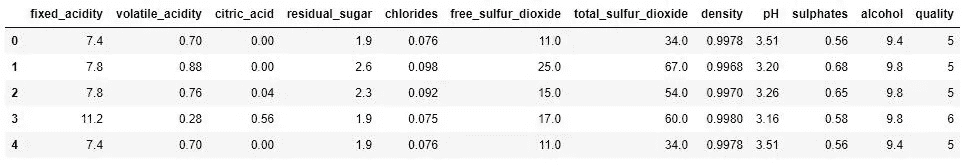****

******步骤 3:使用 Pandas 进行数据清理和探索******

****值得注意的是，该数据有 240 个重复的行，所以我们可以删除这些值，但我们不会这样做，因为我们希望相信这项调查是由不同的独特的葡萄酒品尝者进行的。可以使用 Pandas Profiling 检查这些重复项****

****让我们探索数据中的一些特征****

****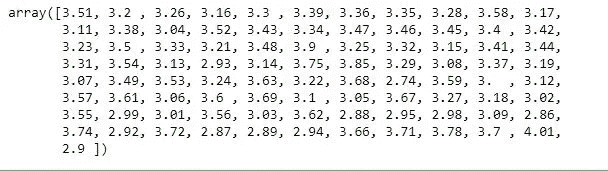****

****红酒数据的 pH 输出****

****值得注意的是，大多数葡萄酒的 pH 值在 3.0 — 4.0 之间****

****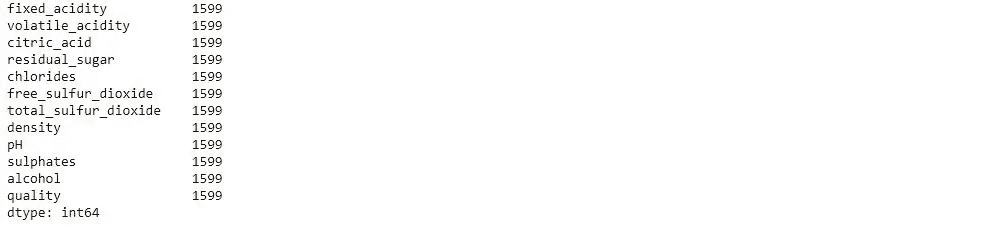****

****检查空值(如果有)****

****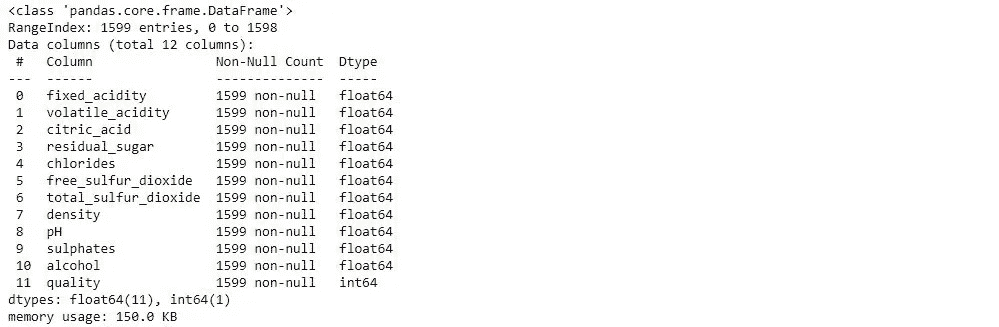********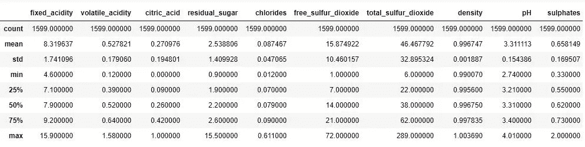****

****在总结数据时，我们可以看到残余糖与最大值 15.5 有很大的异常值，这与平均值 2.5(中位数(50%)为 2.2)相差甚远。这些差异也可以在游离二氧化硫、总二氧化硫、硫酸盐、酒精****

****相互关系****

*****P{XY} = corr(X，Y)*****

*   *****1.0 ≤P (XY) ≤+1.0*****

****哪里；0:没有关系****

****(+/-)0.6:中度关系****

****(+/-)0.8:相当强的关系****

****(+/-)1:完美关系****

****现在检查所有特征与目标(质量)之间的关系****

****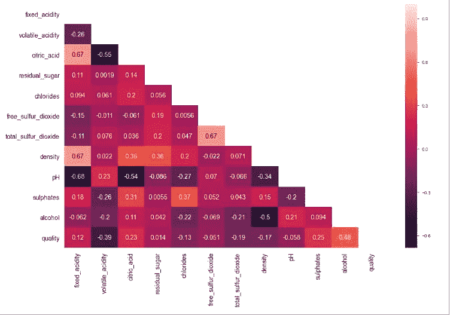****

******步骤 4:训练和测试数据分割******

****模型选择—多变量线性回归****

****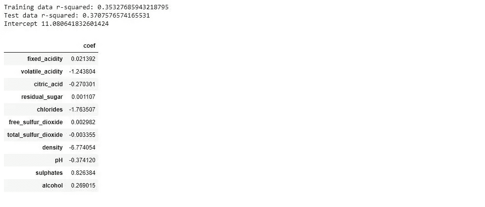****

****请注意，R 平方高于测试数据集，因为算法没有看到****

*******数据转换*******

****偏斜值为 0.2178，接近于 0，这意味着它是一个正态分布，没有向左或向右偏斜的极端异常值。因此，我们不需要转换数据。****

*******现在让我们使用 StatsModel 来运行我们的回归*******

******P 值和评估系数******

****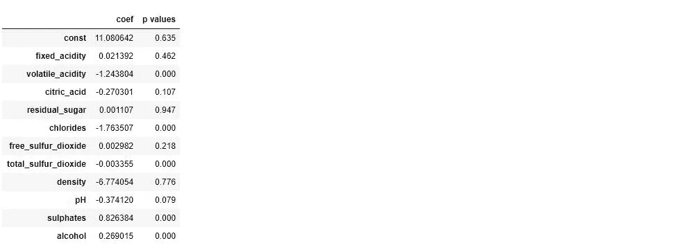********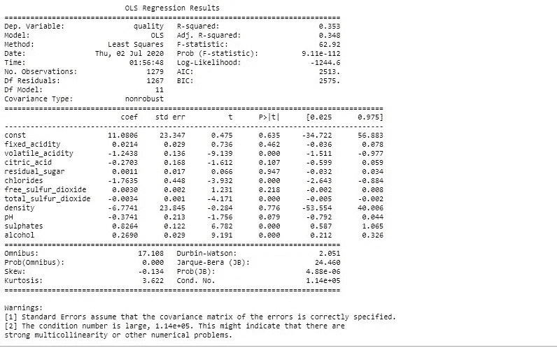****

****注意，使用 scikit-learn 包和 statsmodel 给出了相同的系数值和截距。****

*******方程/预测值*******

*****质量= 11.1+0.27 酒精-1.76 氯化物-0.27 柠檬酸-6.77 密度+0.02 固定酸度+0.0029 游离二氧化硫-0.37 ph+0.001 残糖+0.83 硫酸盐-0.003 总二氧化硫-1.24 挥发酸度*****

****从上面的等式中，我们可以看到酒精、固定酸度和硫酸盐的增加会提高红酒的质量，而其他属性如氯化物、二氧化硫、挥发性酸度、pH 值的大量增加会降低红酒的质量。****

******步骤 6:部署和评估模型******

*******多重共线性测试*******

****当回归中的两个或多个预测变量高度相关时，就会出现多重共线性。也就是说，它们不为模型提供唯一的信息。多重共线性可以使用方差膨胀因子(V.I.F)进行测试****

*******使用方差膨胀因子***；****

****VIF(FA)= 1/(1-R^2)****

****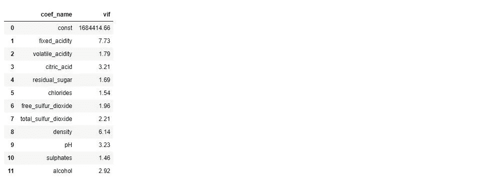****

****方差膨胀因子是一种统计指标，用于评估回归模型中的多重共线性。注意 V.I.F > 10 是有问题的。一个国际货币基金组织****

****= 1:不相关****

****1–5:中度相关****

****> 5:高度相关****

****> 10:值得关注****

*******利用模型简化和贝叶斯信息准则*******

****所有要素的 BIC 和 R 平方值****

****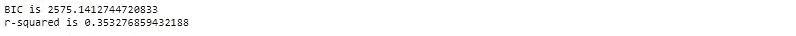****

****丢弃某些要素后的 BIC 和 R 平方值****

****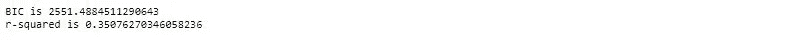****

******正态分布——检查正态性******

*****记住正态分布有偏斜且均值为 0*****

****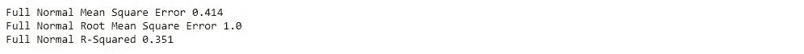****

****使用回归模型的度量****

****在进行多元回归分析后，我们的结论是****

1.  ****我们拒绝零假设，因为它的 p 值。并非所有的列都是重要变量。****
2.  ****尽管 r 平方不是一个很好的拟合度，但它的表现很差。尽管 r 平方在显示数据之间的关系方面没有统计学意义，但可以看出，该值很弱且非常低，r 平方为 0.35，不适合该模型。它表明，回归模型解释了均值数据中约 35%的方差。即数据点远离拟合的回归线。即使我们在整体上执行 V.I.F .后删除了一些要素，该值也没有提高，这表明使用回归模型对于这种类型的数据集来说不是一个好的模型。****

******用多类分类模型评估******

****可以看出，相对于其他特征的目标输出(质量)不会绘制完美的拟合线，因此我们应该**考虑使用分类算法(随机森林)**。输出显示，我们可以根据它的唯一评级 3、4、5、6、7、8 对它进行分类。其中:****

****3–4:餐酒-> 0****

****5–6:高级葡萄酒-> 1****

****7–8:美酒-> 2****

****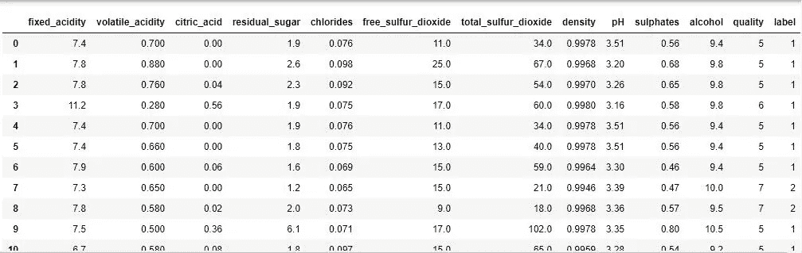****

****带标签列的葡萄酒数据****

******训练和分割数据用于随机森林分类******

****执行随机森林分类器****

****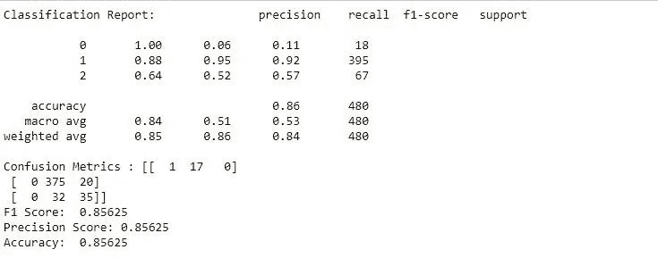****

****输出****

****我们可以看到更好的准确度、精确度，f1 分数约为 86 %。计算精度和其他指标有一个简单的数学基础。虽然由于分类不平衡，精度不是多类分类的好指标，但最好的指标是精度、召回率，尤其是 f 值。****

****现在让我们看看测试数据的输出和它的预测值****

****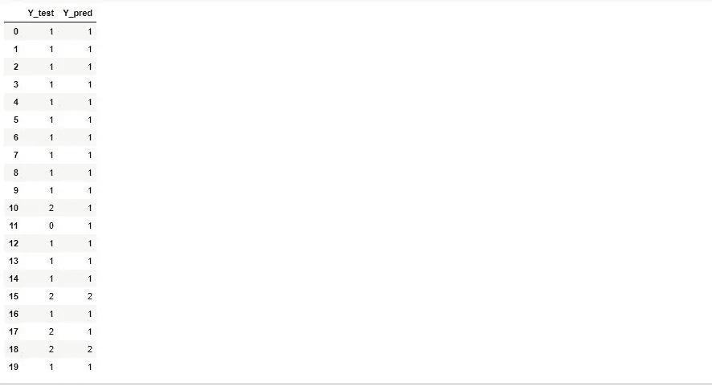****

****预测结果****

******在 Scikit 中寻找重要特性-学习**。在这里，您可以在红酒数据集中查找重要的要素或选择要素。在 scikit-learn 中，您可以通过以下步骤执行该任务:****

*******首先*** ，你需要创建一个随机森林模型。 ***第二个*** ，使用特征重要性变量查看特征重要性分数。 ***第三个*** ，使用 seaborn 库可视化这些分数。****

****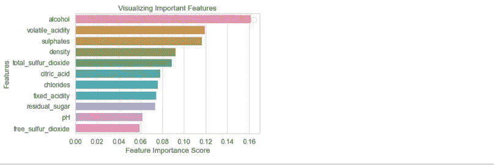****

****形象化特征的重要性我们可以看到最重要的特征是酒精、挥发性酸度、硫酸盐、密度、总二氧化硫，它们会提高葡萄酒的质量。****

****当决定使用什么模型时，识别我们的输出(预测)变量的数据类型；无论是定量(连续)还是定性(离散或成组)都是一个重要因素。如果是定量的，所用的模型应该是回归分类。分析这两个模型(回归和分类),我们可以推断:****

1.  ****预测离散变量时，回归效果不佳，而分类对离散变量效果良好****
2.  ****当可视化输出及其特征时，回归拟合直线，而分类拟合 s 曲线****
3.  ****用于评估分类模型的度量包括精确度、召回率、f 分数和相对准确度，而对于回归，度量包括 rmse、mse 和相对 r 平方。****

******资源**:****

**** [## MzSusann 红酒质量预测

### permalink dissolve GitHub 是超过 5000 万开发人员的家园，他们一起工作来托管和审查代码，管理…

github.com](https://github.com/MzSusann/Red-Wine-Quality-Prediction/blob/master/Red%20Wine%20Quality%20Prediction.ipynb) 

【https://realpython.com/linear-regression-in-python/】T2 和

[https://medium . com/@ sydneychen 222/a-初级红酒质量统计分析-c5933aa1970c](https://medium.com/@sydneychen222/a-statistical-analysis-for-beginner-red-wine-quality-c5933aa1970c)

[https://statisticsbyjim . com/regression/多重共线性-回归-分析/](https://statisticsbyjim.com/regression/multicollinearity-in-regression-analysis/)

[https://machine learning mastery . com/precision-recall-and-f-measure-for-balanced-class ification/](https://machinelearningmastery.com/precision-recall-and-f-measure-for-imbalanced-classification/)****