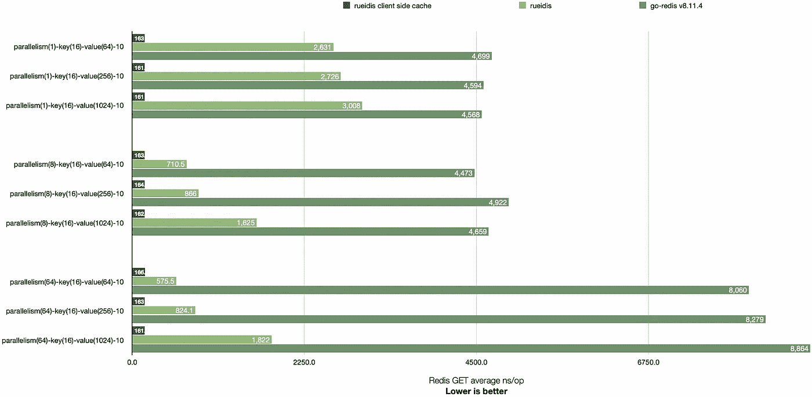

# Redis 6 使用 Golang 进行服务器辅助的客户端缓存

> 原文：<https://blog.devgenius.io/redis-6-server-assisted-client-side-caching-with-golang-1238ca1ceba8?source=collection_archive---------2----------------------->

大多数人使用 Redis 作为远程缓存存储，因为它很快。

从用户的角度来看，Redis 6 可以通过消除不必要的网络往返使速度更快。

# 服务器辅助的客户端缓存

技术很简单。Redis 6 将跟踪客户机请求的键，并在键值改变时通知客户机。

因此，客户机现在可以重用响应，而无需通过网络咨询 Redis，直到收到相应的失效通知。这个新特性被称为服务器辅助客户端缓存。

更多详情:【https://redis.io/topics/client-side-caching】T4

虽然这种技术很简单，但它需要升级到新的 RESP3 协议，或者在 RESP2 发布/订阅通道上做一些手脚来接收通知。对于现有的客户端库来说，这两个选项都不容易实现。

距离 2020 年 Redis 6 发布已经快两年了。我发现在现有的 Golang 客户端库上使用这个强大的新特性仍然很困难。因此，我决定自己创建一个新的客户端实现。

# Rueidis:一个快速 Golang Redis RESP3 客户端

 [## GitHub - rueian/rueidis:一个快速的 Golang Redis RESP3 客户端，可以自动流水线化并支持…

### 一个快速的 Golang Redis RESP3 客户端，支持自动流水线操作和客户端缓存。

github.com](https://github.com/rueian/rueidis) 

由于 RESP3 和自动流水线技术的简单性。新的客户端库通常比现有的客户端库具有更高的吞吐量。以下是我的 Macbook M1 Pro 上的基准对比。

全基准源代码:[https://github.com/rueian/rueidis-benchmark](https://github.com/rueian/rueidis-benchmark)

如果缓存命中，服务辅助的客户端缓存表现非常好，因为没有网络通信。在我的笔记本电脑上，从客户端的内存缓存中检索一条记录平均需要大约 165 纳秒。

即使没有客户端缓存，新的库也可以在本地基准测试中实现比现有库高 14 倍的吞吐量。参见`parallelism(64)-key(16)-value(64)-10`案例。

# 去找 github.com/rueian/rueidis

下面是一个如何在新的客户端库中使用服务器辅助客户端缓存的示例:

省略了错误处理

`DoCache()`该方法使用服务器辅助的客户端缓存，它有 3 个参数:

1.  支持 OpenTelemetry 跟踪的上下文。
2.  Redis 命令，应该从命令构建器`client.B()`中构建。
3.  客户端 TTL 与`PTTL`结合使用，以确保客户端的 TTL 不比 Redis 端的 TTL 长。

此外，用户可以使用`IsCacheHit()`来检查响应是否来自客户端内存。

如果启用了 OpenTelemetry 集成，还有两个指标可供用户观察缓存命中率，分别是`rueidis_do_cache_hits`和`rueidis_do_cache_miss`。

Rueidis 还支持其他功能，如 Redis 集群、发布/订阅、流、Lua、事务。

还支持流行的 Redis 模块。比如:RedisBloom，RedisJSON，RediSearch，RedisTimeseries。

鲁伊迪斯几个月前刚刚出生，但我会继续让它变得更好。反馈，问题报告，公关，明星都很感谢。谢了。