# Redis 基础|简介

> 原文：<https://blog.devgenius.io/redis-basics-introduction-7a11aeb46b7a?source=collection_archive---------8----------------------->

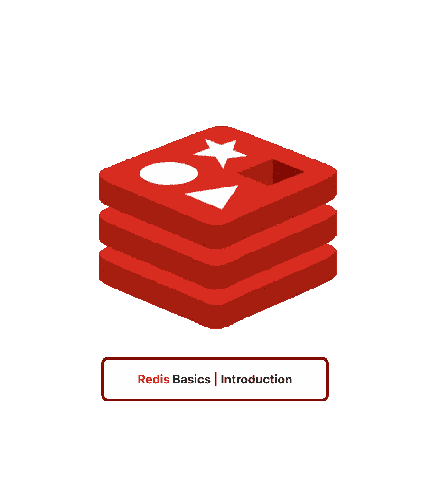

👨🏻‍💻在这篇基础文章中，我们将处理基本的 Redis 命令并更加熟悉它们！

## 那么 Redis 是什么？

Redis 是一个使用 NoSQL 的高级键值数据存储。由于其健壮的数据类型，包括字符串、哈希、列表、集合、排序集、位图和超级日志，它也被称为“数据结构服务器”。

Redis 默认将其所有数据**存储在内存**中，使得读写操作非常快。因此，数据也可能留在磁盘上。Redis 允许创建正在保存的数据的二进制快照，或者包含一段时间以来运行的所有命令序列的可读文件。这些分别被称为日志和快照。

# 运行 CLI！

*redis-server* 是实际的 **Redis 数据存储**。它可以在*独立*模式或*集群*模式下启动。

*redis-cli* 是一个**命令行接口**，可以执行任何 redis 命令(它是一个 Redis 客户端)。

默认情况下，Redis 绑定到端口 *6379* ，以独立模式运行，并且可以通过该行启动)

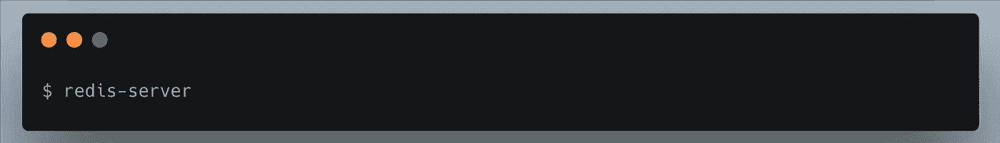

现在，让我们启动美丽的 redis-cli，开始学习吧！

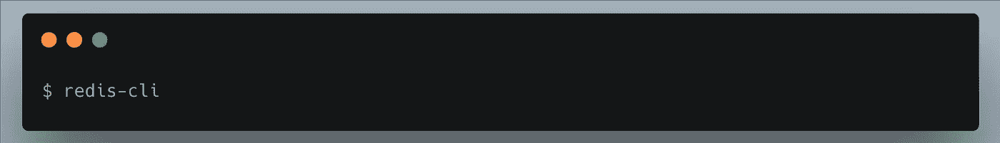

# 基础知识:

让我们先创建一个密钥！

我们使用 *SET* 命令创建一个带有字符串值的键，然后使用 GET 命令读取键值

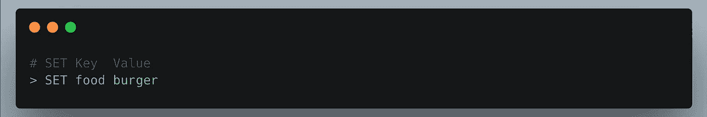

我们可以通过使用以下方法获得键值:

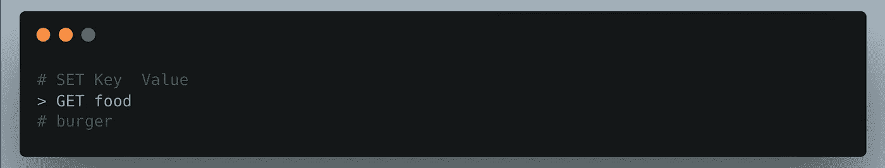

> 太好了。

精彩的 gif

您可以使用 HELP 命令来查看命令的作用。

**HELP** 命令对于了解命令语法非常有用。它显示命令参数以及摘要和示例。

KEYS 命令也很有用，因为它返回所有存储的匹配某个模式的键(这是一个 glob 样式的模式，类似于 Unix shell glob 模式)

## 获取键的数据类型

## 删除密钥

## 一把钥匙存在吗

## 在 UNIX 纪元中设置过期时间

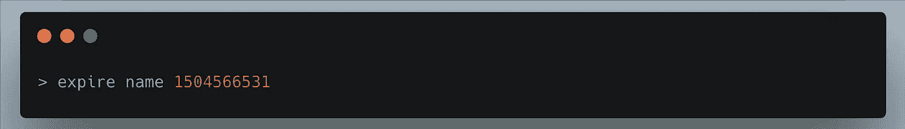

## 在毫秒数内使密钥过期

## 检查过期密钥的生存时间

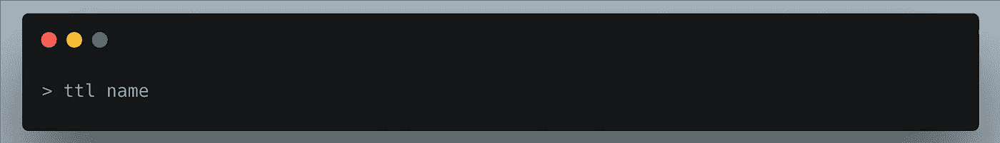

## 删除密钥的过期时间

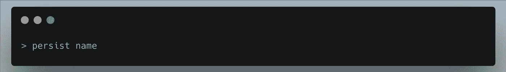

## 命名一个键

## 如果新的密钥不存在，请重命名密钥

edis 的字符串数据类型是最灵活的，因为它们可以用于各种各样的任务和命令。根据其值和使用的命令，字符串可以作为整数、浮点、文本字符串或位图。它可以存储任何类型的数据，包括二进制数据、浮点数、整数和文本(包括 XML、JSON 和原始文本)(视频、图像或音频文件)。

字符串值**不能超过 512 MB 的文本或二进制数据**。以下是字符串的一些使用案例:

*   缓存机制:文本或二进制数据，比如 HTML 页面、API 答案、照片和视频，可以缓存在 Redis 中。通过使用命令集、GET、MSET 和 MGET，可以建立一个基本的缓存系统。
*   具有自动密钥过期的缓存:使用命令 SETEX、EXPIRE 和 EXPIREAT，字符串可以与自动密钥过期配对，以创建可靠的缓存系统。当数据库查询可以缓存一段预定的时间并需要很长时间来执行时，这非常有用。因此，这可以防止这些查询过于频繁地运行，并可以提高应用程序的速度。
*   计数:命令 INCR 和 INCRBY 和字符串使创建计数器变得简单。计数器的好例子是页面浏览量、视频浏览量和喜欢。字符串还提供其他计数命令，如 DECR、DECRBY 和 INCRFLOATBY。

## 附加

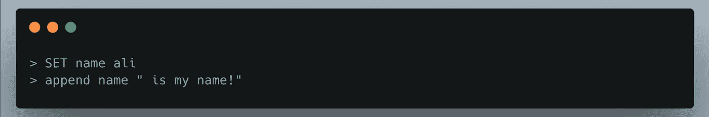

## 增加 1

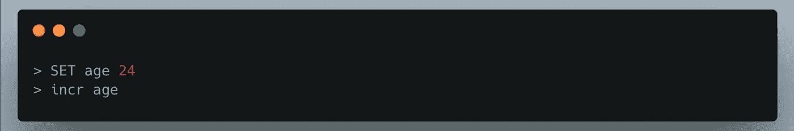

## 任意递增

## 递减 1

## 获取字符串长度

## 设置多个值

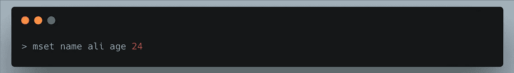

## 如果键不存在，则设置多个值(nx)

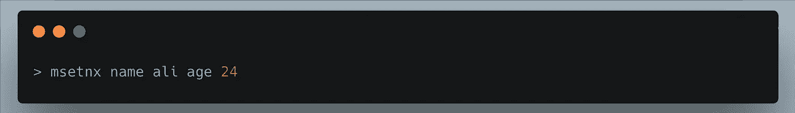

由于列表能够表现为简单的集合、堆栈或队列，所以在 Redis 中，列表是一种特别灵活的数据类型。因为 Redis 列表的操作保证了在从队列中删除项目时并发系统不会重叠，所以许多事件系统使用列表作为它们的队列。列表中的命令是原子的。Redis 的列表支持阻塞命令，因此如果一个客户在一个空列表中使用阻塞命令，Redis 将等待一个新项目被添加到列表中。

Redis 的列表是链接列表，因此从列表的开头或结尾添加或删除需要 O(1)常量时间。列表的元素可以在 O(N)，线性时间内访问，但是第一个和最后一个元素总是在常数时间内访问。

如果列表的元素少于 list-max-ziplist-entries 的配置，并且每个元素都小于 list-max-ziplist-value 的配置，则可以对列表进行编码和内存优化(以字节为单位)。

一个列表可以容纳的最大元素数量是**232–1**，这意味着每个列表可以有超过 40 亿个元素。列表的一些真实使用案例如下:

*   许多技术，如 Resque、Celery 和 Logstash，都利用了列表。
*   存储最近的用户帖子。

## 创建新列表(或添加到列表中)

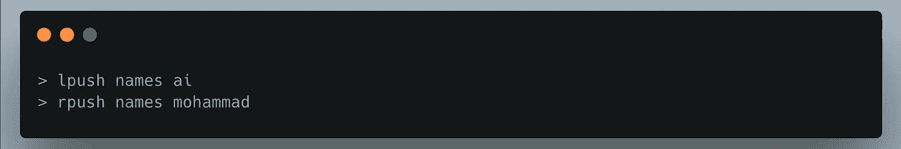

## 仅当列表存在时，将项目推送到列表

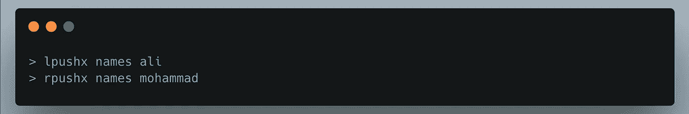

## 根据索引将列表项设置为不同的值

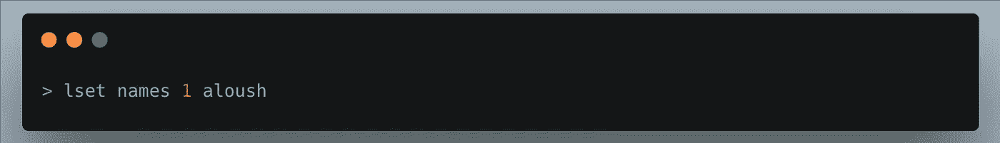

## 根据值将项目插入列表

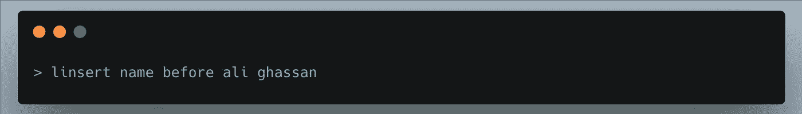

## 获取列表长度

## 移除第一个或最后一个项目

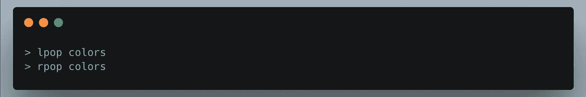

## 获取列表索引的值

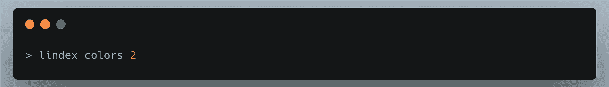

## 显示所有列表项目

ash 是存储对象的一个很好的数据结构，因为你可以将字段映射到值。它们被设计用来快速搜索数据和有效利用内存。哈希表中的字段名和值都是字符串。因此，哈希是从字符串到字符串的映射。

哈希具有内存优化的优势。hash-max-ziplist-entries 和 hash-max-ziplist-value 参数是优化的基础。在内部，哈希可以是哈希表或 ziplist。一个叫做 ziplist 的双重链表被做得更节省内存。在 ziplist 中，使用实数而不是字符串来存储整数。ziplist 有内存优化，但是查找不会立即发生。另一方面，哈希表提供了固定时间的查找，但是不节省内存。

## 设置哈希

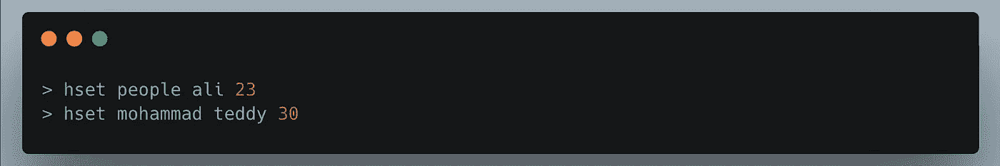

## 设置多个哈希

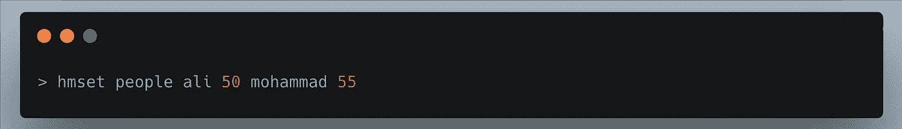

## 获取哈希数据

## 获取单个哈希值数据

## 获取多个哈希值

## 从哈希中删除成员

## 检查哈希是否存在

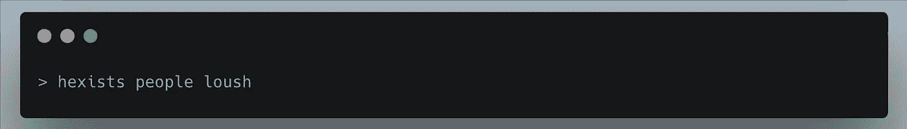

## 摘要

在本文中，我们学习了 Redis 及其基本数据类型和命令。

在下一篇文章中，我们将讨论集合、有序集合和超对数

> H️ope，你会发现这篇文章很有趣，很好玩，❤️！