# Redis —超越缓存

> 原文：<https://blog.devgenius.io/redis-beyond-caching-1237058033d?source=collection_archive---------3----------------------->

最受欢迎的数据库— SOF

是**Re**mote**Di**dictionary**S**server 的简称。

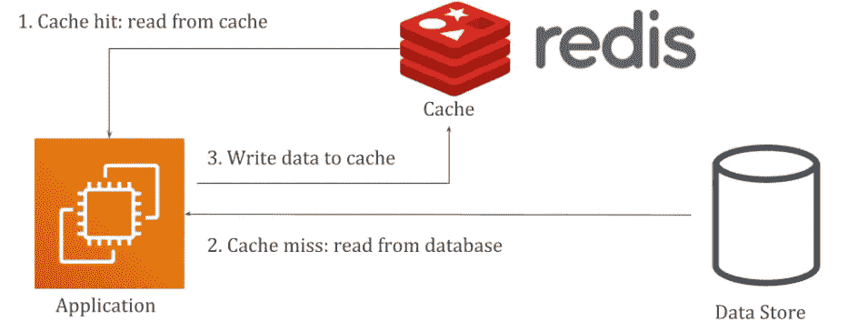

Redis 是一个快速、开源、内存中的键值(NoSQL)数据库。Redis 使用 RAM，提供亚毫秒级的响应时间，每秒可以处理数百万个请求。Redis 主要用于缓存，但对于数据变化不太频繁的应用程序，它甚至可以用作主数据库。Redis 有内置的复制、服务器端脚本(带 Lua)脚本、LRU 驱逐、定时过期和事务。

Redis 的使用案例包括:

*   数据投影服务
*   短暂消息代理
*   事件来源系统

*注:Redis 是用 c 写的*

## Redis 为什么快？

*   Redis 是基于 RAM 的。RAM 访问比随机磁盘访问快。
*   IO 多路复用和单线程执行循环提高了执行效率。
*   高效的低层数据结构(SDS、ZipList、SkipList、分层索引)

## 在 Linux 上安装

用以下内容创建文件`/etc/yum.repos.d/redis.repo`。

```
[Redis]
name=Redis
baseurl=http://packages.redis.io/rpm/rhel7
enabled=1
gpgcheck=1
```

然后运行以下命令:

```
curl -fsSL https://packages.redis.io/gpg > /tmp/redis.key
sudo rpm --import /tmp/redis.key
sudo yum install epel-release
sudo yum install redis-stack-server
```

## 高级 CLI 命令

```
$ redis-cli 
INFO - info about cluster
SELECT - to select the namespace / database
DBSIZE - number of keys
KEYS * - list all keys (pattern) (prefer scan)
SCAN - Returns subset of results with cursor 
EXISTS - check if key exists
TYPE - check data type of key
EXPIRE - set expiration of key 
RENAME - Rename a key to new name
FLUSHDB - clear all keys from namespace
FLUSHALL - clear all keys from all namespace
ROLE - checks nodes role, master, slave, sentinel
CLAER - clear cli context terminal
QUIT - get out of cli

>> redis-cli --pipe #stream commands to redis from file or stdin
>> redis-cli --hotkeys
```

## 关于一些命令的几点

*   Redis 数据库是为键创建隔离和命名空间的逻辑方法。默认情况下，Redis 有 0-15 个数据库索引。在集群模式下，这些数据库不存在。

> 选择索引号

*   通常会给命令添加以下后缀。然后，这些命令会根据该键的存在进行操作

> NX —如果不存在
> XX —如果存在

*注意:* `***M***` *加在命令前面一般表示多。MGET 对掘地。同样，前面加一个* `***P***` *表示基于模式的命令。*

*   KEYS 命令是顺序的[O(n)] &同步的[阻塞]。在你的应用程序中优先扫描按键。

> [RedisInsight](https://redis.com/redis-enterprise/redis-insight/) —这是一个使用 Redis 服务器的 UI。

## 试用 Redis 的链接

> [https://try.redis.io/](https://try.redis.io/)T22[https://redis.com/try-free/](https://redis.com/try-free/)

## 支持的数据结构

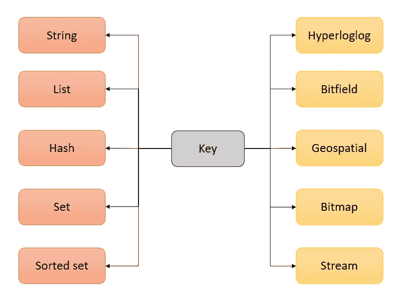

## 线

> 大多数基本和常见的 Redis 数据类型
> Redis 字符串存储字节序列。
> 最大 512 MB

```
SET | GET | DEL 
INCR | INCRBY | INCRBYFLOAT
MSET | MGET 
```

*注意:DEL 是阻塞的，而 UNLINK 是非阻塞的*

## 目录

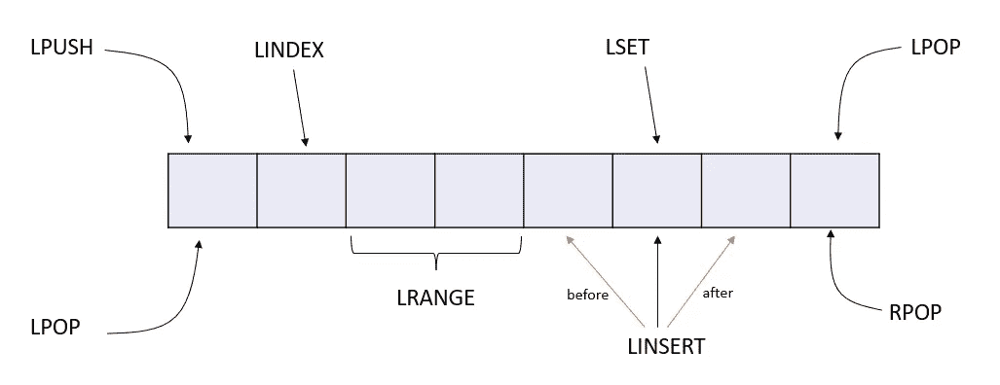

> 字符串值链表
> 元素集合
> 每个元素都是一个字符串
> 可以包含>40 亿个元素
> 元素顺序基于插入顺序
> 进行编码和内存优化

```
LPUSH | LRANGE | RPUSH | LPOP | RPOP | LLEN
LTRIM | LINDEX | LINSERT | LSET | LPOS | LREM
```

## 一组

> Redis 集是唯一字符串(成员)的无序集合。这可以用来跟踪唯一的元素。

```
SADD | SREM | SCARD | SMEMBERS | SDIFF | SDIFFSTORE 
SISIMEMBER | SMISMEMBER | SMOVE | SPOP
```

## 混杂

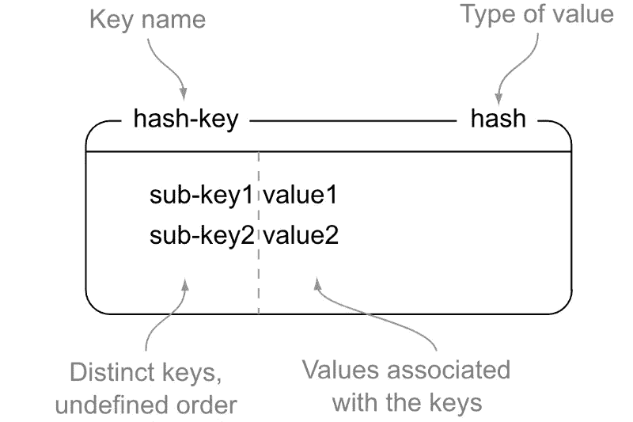

> Redis 散列是结构化为字段-值对集合的记录类型。
> 每个哈希最多可以存储 4，294，967，295(2-1)个字段-值对。哈希可用于存储应用程序中的会话和配置文件。

```
HSET | HGET | HGETALL | HDEL | HEXIST | HMSET | HMGET
```

## 排序集合


> Redis 排序集是按相关分数排序的唯一字符串(成员)的集合。它可用于排行榜、优先级队列、二级索引和限速器。

```
ZADD | ZCARD | ZSCORE | ZRANK | ZREVRANK | ZREM | ZRANGE
```

## 超对数

> 超对数是一种估计集合基数的数据结构。它可以用来跟踪独特的访问者数量。超对数实现使用高达 12 KB。

```
PFADD | PFCOUNT | PFMERGE
```

## 流


Redis 流是一种数据结构，其作用类似于只附加日志。您可以使用流来实时记录并同时整合事件。

```
XADD | XREAD | XTRIM | XDEL
XGROUP CREATE | XGROUP DESTROY | XREADGROUP
XGROUP CREATECONSUMER | XGROUP DELCONSUMER 
```

Redis Streams 允许最多一次或至少一次。Redis 流允许同步和异步读取。

## 位图

Redis 位图是 string 数据类型的扩展，允许您将字符串视为位向量。

```
BITOP | BITPOS | BITCOUNT
```

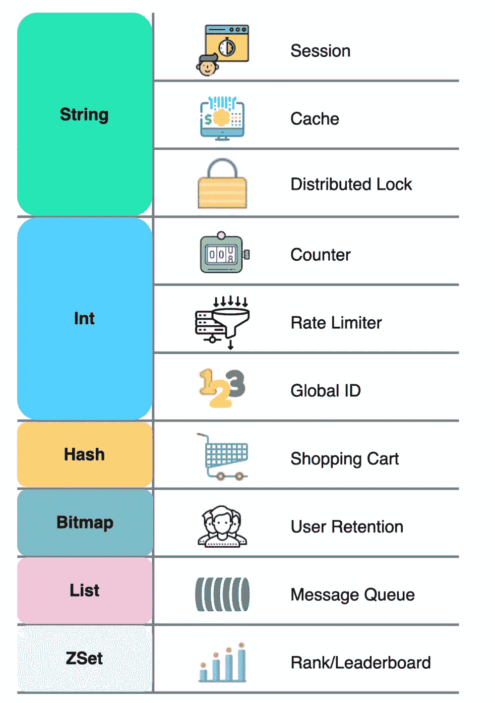

图片来源—bytebytego.com

## 位域

Redis 位域允许您设置、递增和获取任意位长的整数值。

## 地理空间的

> Redis 地理空间索引允许您存储坐标并进行搜索。在给定的半径或边界框内寻找附近的点。

```
GEOADD | GEODIST | GEORADIUS | GEOSEARCH | GEOPOS
```

*   *雷迪斯使用哈弗辛公式计算距离。*
*   *Redis 将地理空间点存储在有序集合中。这些组的分数用于编码坐标对。*

## 密钥过期

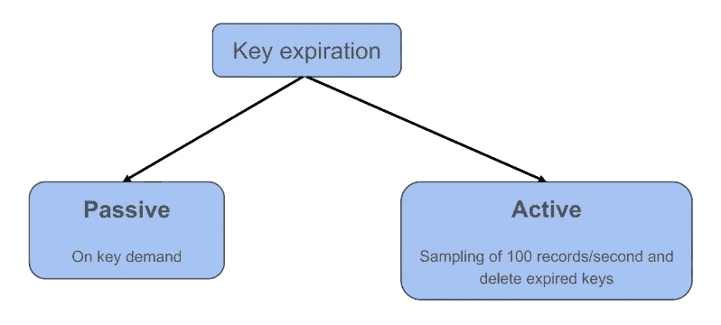

> EX —给定秒后过期
> PX —给定毫秒后过期
> EXAT —时间戳时过期(秒)
> PXAT —时间戳时过期(毫秒)
> TTL —密钥剩余的大致寿命
> PERSIST —删除当前过期时间

## 管道铺设

Redis 遵循客户机-服务器模型。客户端发送请求，服务器处理请求并返回响应。吞吐量主要由往返时间决定(通常以毫秒为单位，请求处理通常以微秒为单位)。Redis 管道技术是一种提高性能的技术，它一次发出多个命令，而无需等待每个命令的响应。这是一种网络优化，因为我们减少了客户端和服务器之间的多次往返。

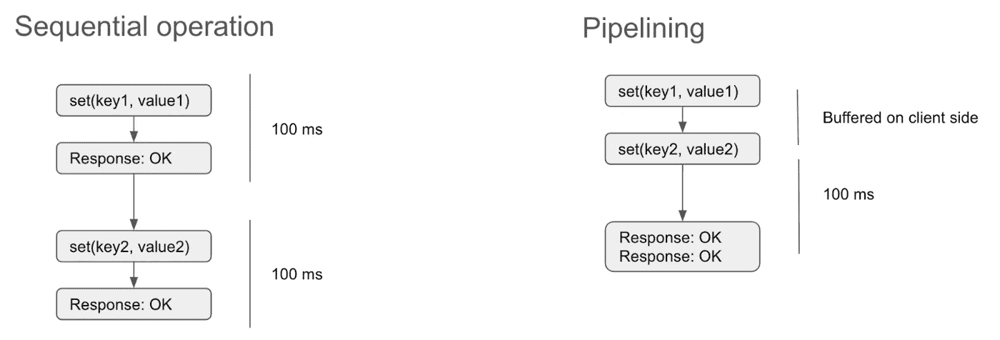

*注:1。管道不保证命令的执行顺序。2.* `*Writes*` *后接* `*Reads*` *在一个流水线内是不可能的，因为所有命令的结果最终会聚集在一起。3.在进行流水线操作时，我们需要使用散列标签，这样我们可以强制将键映射到同一个碎片上。4.管道不是原子的。5.Python 库管道被包装成* `*MULTI/EXEC*` *。*

## 脚本

调用服务器端 Lua 脚本的执行。

```
SCRIPT LOAD | FUNCTION LOAD | EVAL | FCALL | FUNCTION KILL | SCRIPT KILL
```

*注意:Lua 脚本是原子的&阻塞。*

## 发布/订阅

Redis 使用发布/订阅提供了一个解耦的消息传递范例。发布者将消息发送到通道中，订阅者确认他们对一个或多个通道的兴趣，并接收感兴趣的消息。

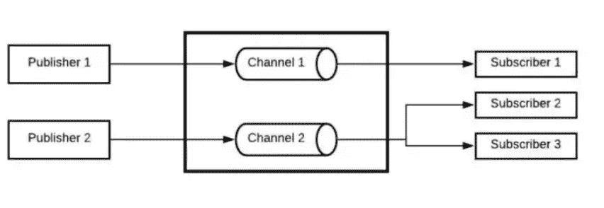

```
SUBSCRIBE | PUBLISH | PUBSUB CHANNELS | UNSUBSCRIBE
```

*注意:发布/订阅与密钥空间无关。*

## 处理

Redis 事务允许在单个步骤中执行一组命令，它们以下列命令为中心:

> MULTI —事务开始
> EXEC —事务结束
> DISCARD —退出事务
> WATCH —继续检查自我们开始监视
> UNWATCH 以来密钥是否已被修改

事务中的所有命令都被序列化并按顺序执行。在 Redis 事务的执行过程中，不会处理另一个客户机发送的请求。

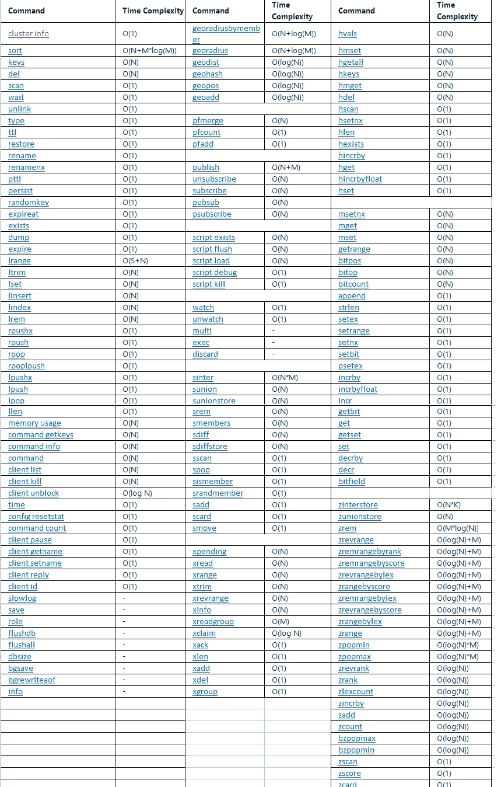

时间复杂度

## 分布式锁—红锁

`Redlock`是一个安全可靠的锁，用于协调对跨线程、进程甚至机器共享的资源的访问，没有单点故障。Python 红锁实现:

```
from pottery import Redlock
my_demo_key_lock = Redlock(key='my_demo_key', masters={redis}, auto_release_time=.2)
with my_demo_key_lock:
    # do operation here
    print('my_demo_key is locked')

# Async version

import asyncio
from redis.asyncio import Redis as AIORedis
from pottery import AIORedlock

asyncio.set_event_loop(asyncio.new_event_loop())
async def main():
    aioredis = AIORedis.from_url('redis://localhost:6379/1')
    my_async_key_lock = AIORedlock(key='my_async_key', masters={aioredis})
    async with my_async_key_lock:
        # Critical section - no other coroutine can enter while we hold the lock.
        print(f"Key is {'occupied' if await my_async_key_lock.locked() else 'available'}")
    print(f"Key is {'occupied' if await my_async_key_lock.locked() else 'available'}")

asyncio.run(main(), debug=True) 
```

## 重要的配置文件

> redis . conf
> sentinel . conf
> 。rediscli_history

## 使用 python 与 Redis 交互

```
# pip install redis

import redis, json

def redis_connect():
    try:
        client = redis.Redis(host="localhost",port=6379,db=0,socket_timeout=5,)
        ping = client.ping()
        if ping is True:
            return client
    except redis.AuthenticationError:
        print("AuthenticationError")
        sys.exit(1)

redis_client = redis_connect()

my_value = redis_client.get('my_key')
redis_client.set('new_key', json.dumps({'hello' : 'redis'}))
```

## Redis 模块

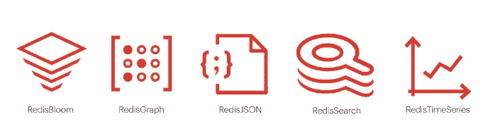

Redis 在单个数据库中支持多种数据格式。它遵循模块化的方法来处理不同的数据类型。通过添加一个新的模块，我们确保特定的数据类型以本机方式得到支持。

> redis 搜索—对 Redis 进行查询、二级索引和全文搜索
> Redis JSON —在 Redis 中添加 JSON 作为第一类数据类型
> Redis Bloom —概率 DS (Bloom filter，Count Min Sketch，t-digest)
> Redis 图形—图形数据库支持
> Redis 时间序列—在 Redis 中添加时间序列数据支持

*注意:亚马逊 ElastiCache for Redis 不提供对 Redis 模块的支持*。

## 坚持

在 Redis 中，如果启用，数据将持久存储到磁盘。当它重新启动时，它将数据加载到内存中进行计算。

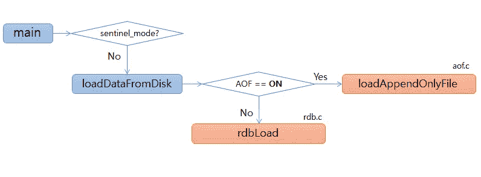

> RDB —特定时间间隔的时间点快照
> AOF —记录每个写操作、每秒同步、后台线程的日志，以备恢复时重放

注意:您可以通过发出 BGSAVE 命令来手动拍摄快照

## 高可用性和故障转移

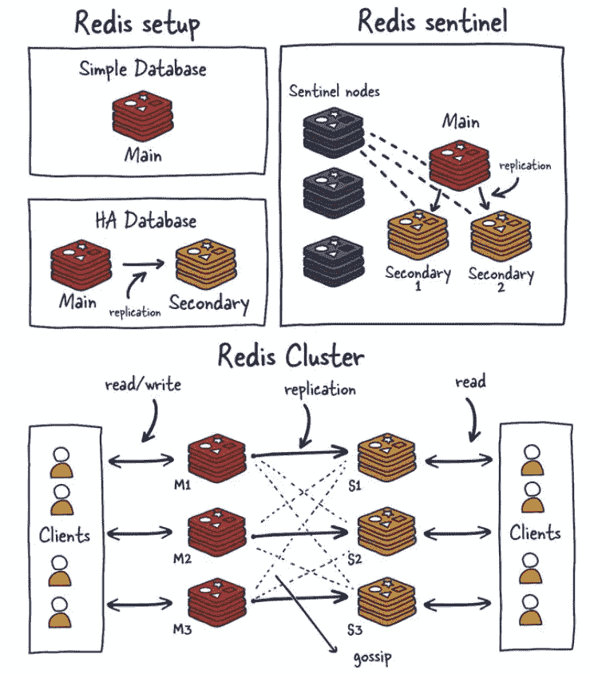

图片来自[https://architecturenotes.co/redis/](https://architecturenotes.co/redis/)

> Redis 副本
> Redis 哨兵
> Redis 集群

## 缩放比例

> 群集—主副本+从副本配置
> 分片—将特定哈希范围(片段)分配给各个节点
> CRDT —企业功能

## 一致性

> 最终一致性—默认
> 因果一致性—主动主动部署
> 强一致性—重分发

## 用例

> 缓存
> 会话管理
> 发布-订阅
> 速率限制
> IP 白名单
> 高速事务

## Redis 中常见的缓存问题

> 缓存渗透—不在缓存中，不在数据库中，redis 将缓存具有空
> 缓存故障的键—不在缓存中，存在于数据库中
> 缓存雪崩—大量缓存过期

## 在 K8s 上安装 Redis 集群

```
$ helm repo add my-repo https://charts.bitnami.com/bitnami
$ helm install my-release my-repo/redis-cluster
$ export REDIS_PASSWORD=$(kubectl get secret --namespace redis staging-redis-cluster -o jsonpath="{.data.redis-password}" | base64 --decode)
```

## 再视

```
helm install redisinsight redisinsight-chart-0.1.0.tgz --set service.type=NodePort
# Get URL
export NODE_PORT=$(kubectl get --namespace default -o jsonpath="{.spec.ports[0].nodePort}" services redisinsight-redisinsight-chart)
export NODE_IP=$(kubectl get nodes --namespace default -o jsonpath="{.items[0].status.addresses[0].address}")
echo http://$NODE_IP:$NODE_PORT 
```

我们现在可以使用`http://<endpoint>:<port>`访问我们的 RedisInsight UI。我们可以单击`Connect to a Redis Database`来配置 Redis 集群属性。一旦连接配置完成，我们将可以访问一个全功能的 web UI 来查看和管理 Redis 集群。

## 要监控的指标

使用`INFO, SLOWLOG, and LATENCY` 我们可以跟踪 Redis 的关键数据。

> used _ memory
> total _ commands _ processed
> latency
> fragmentation ratio
> evictions
> CPU wait
> 复制延迟

我们还可以使用 [Redis exporter](https://github.com/oliver006/redis_exporter) 向 Prometheus 发布这些指标。

```
helm repo add Prometheus-community https://prometheus-community.github.io/helm-charts
helm repo update
helm install my-release prometheus-community/prometheus-redis-exporter
```

## 托管产品:

> Redis 企业云
> scale grid For Redis
> AWS elastic cache For Redis
> GCP memory store For Redis

## 使用 Redis 的公司？

[Twitter](http://www.infoq.com/presentations/Real-Time-Delivery-Twitter) ， [GitHub](https://github.com/blog/530-how-we-made-github-fast) ， [Pinterest](http://engineering.pinterest.com/post/55272557617/building-a-follower-model-from-scratch) ， [Snapchat](https://twitter.com/robustcloud/status/448503100056535040) ， [StackOverflow](http://meta.stackoverflow.com/questions/69164/does-stackoverflow-use-caching-and-if-so-how/69172) ， [Flickr](http://code.flickr.com/blog/2011/10/11/talk-real-time-updates-on-the-cheap-for-fun-and-profit/) ， [Atlassian](https://www.atlassian.com/engineering/reducing-jql-database-load-with-caches) ，[威瑞森](http://www.odbms.org/2018/03/verizon-counts-on-redis-enterprise-to-elevate-its-customer-engagement-experience/)，Trip Advisor，沃达丰

## Redis 的替代方案

[KeyDB](https://docs.keydb.dev/)
[hazel cast](https://hazelcast.com/)
[气塞](https://aerospike.com/)
[NCache](https://www.alachisoft.com/ncache/)

快乐缓存！！