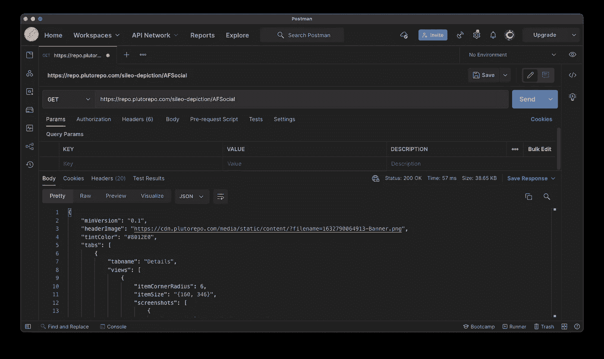
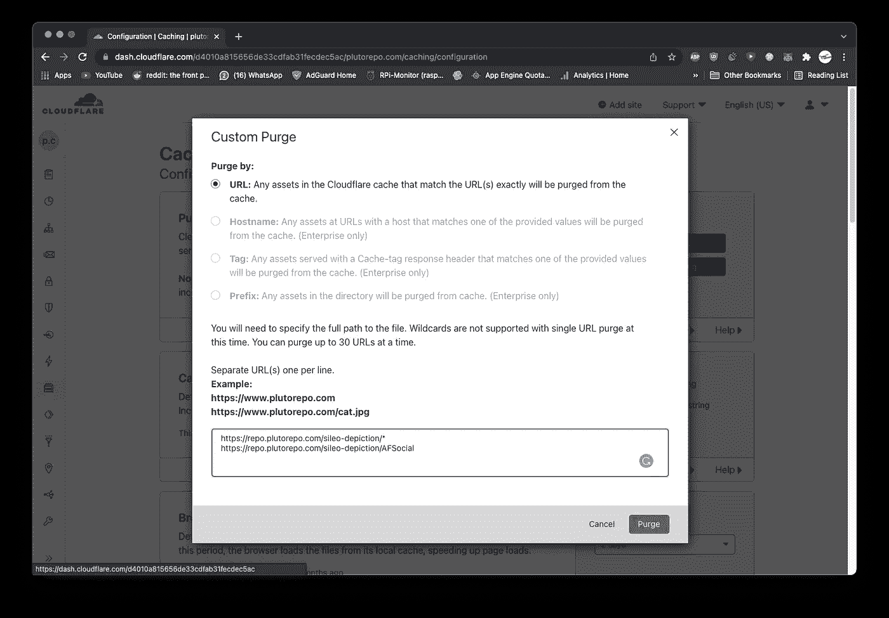

# Redis 缓存与 Cloudflare 页面规则— NodeJS

> 原文：<https://blog.devgenius.io/redis-caching-vs-cloudflare-page-rules-nodejs-1bfe2c2a6a5a?source=collection_archive---------2----------------------->

> **NodeJS + Redis 缓存 vs Cloudflare 页面规则缓存**

TLDR；用于缓存

缓存基本上是一种方式，在静态媒体(如图像和视频等)的情况下，您可以从主数据库或文件服务器上卸下沉重的负载，并将它扔给另一个更便宜、更快的平台/系统，如 Cloudflare、Redis 或 Memcached。

> 为什么要缓存

假设我们有一个每分钟被访问 100 万次的博客，这意味着每秒大约有 16，667 次读取操作，这是一个非常不现实的情况，但只是为了扩大规模，任何免费或小型自托管或托管数据库都会在这种情况下崩溃，但我们不希望它崩溃而不在我们的口袋里烧一个洞。这就是**缓存**的用武之地。

***本文将具体介绍 Redis 在 NodeJS 中的实现，您可以跟随 Cloudflare。***

在我使用 NodeJS 的职业生涯中，我遇到了两种主要的缓存数据的方法，既便宜又简单。

**Redis 和 Cloudflare 功能。**

# 1.雷迪斯

切换到黑暗模式以查看图像的其余部分

Redis 有多种用例，比如用于缓存的内存数据库、持久性通用数据库(与许多人认为 Redis 具有数据持久性相反)。出于本文的目的，我们将集中讨论内存数据库部分。

*问:为什么 Redis 的内存数据库比其他主流数据库如 Postgres 和 MongoDB 更快？
Ans。内存数据库(IMDB)依靠计算机的主内存(也称为 RAM)来存储数据，而其他数据库则使用磁盘存储，这比 RAM 慢得多。*

*问:什么时候应该使用 Redis？
Ans。当他们想要在服务器端进行缓存，并且想要完全控制缓存时，例如，在缓存上执行 CRUD 操作，他们会想要使用 Redis。*

几个数字:

这里有一个对我的 Node+Express API 的 postman 请求，它从 firebase firestore 读取数据。

不带 Redis

没有 Redis 缓存的定向 IP 请求

使用 Redis

使用* Redis 缓存定向 IP *的请求

我们可以观察到 Redis 和 not Redis 之间的响应时间大幅缩短。这是如何实现的。

由于 Redis 是一个键-值对数据库(NodeJS 代码)，因此使用键-值对从 Redis 数据库读取数据或向 Redis 数据库添加数据

## **重新验证**

一个好的缓存系统总是会考虑到它所保存的数据的有效性，即它是否需要更新/重新验证。有两件事需要注意，陈旧数据和无效数据。现在，陈旧数据本身就意味着我们缓存中的数据只是简单的旧数据，谨慎的做法是删除它并再次缓存它，以防发生一些变化。无效数据意味着我们缓存中的数据不再等于我们主/持久数据库中存储的数据，它需要更新，简而言之，当数据过时时，我们不知道数据的状态，但在无效的情况下，我们知道数据以某种方式发生了变化。

下面是从 Redis 中删除数据的方法。

从 Redis 中删除一个键，因为 Redis 是一个键值对 DB (NodeJS 代码)

删除缓存的数据后，如果有人再次请求数据，您最好等待有人再次请求，因为这样可以节省存储数据所需的内存，而且在请求和缓存时，它还可以在某种程度上提供最新的数据。

Redis 图标

# 2.Cloudflare 页面规则

Cloudflare 是一家受欢迎的 web 基础架构和网站安全公司，提供内容交付网络和 DDoS 缓解服务。

我们将专注于内容交付部分。

*问:为什么 Cloudflare 是比 Redis 更好的选择？
俺们。使用 Cloudflare 时，编写代码、管理资源和依赖关系的压力将从您身上消失，它通常比 Redis 缓存快得多，因为它是一个分布式服务器网络，可以缓存和交付数据，消除了网络延迟。*

*问:什么时候应该使用 Cloudflare？
Ans。当他们想要缓存静态媒体(如图像和视频)或在很长一段时间内不会发生变化的数据时，可能会希望使用 Cloudflare。*

几个数字

不使用 Cloudflare 缓存

对没有 Cloudflare 缓存的 API 的标准请求

使用 Cloudflare 缓存

对 API *with* Cloudflare Cache 的标准请求

我们可以看到大约有 150 毫秒的差异，这将在您的用户群中保持相当一致，因为使用 Cloudflare 缓存时，网络延迟(相对于客户端和服务器之间的距离)几乎为零。

下面是怎么做的。

***我在这里假设您已经将 Cloudflare 用于您的 web 应用程序***

1.  登录您的 Cloudflare 帐户，并选择要在其上进行缓存的域。

2.进入`Rules`选项卡

3.按下`Create Page Rule`按钮。

4.填写表格

TTL 代表`Time To Live`

您可以根据自己的喜好设置边缘缓存 TTL 和浏览器缓存 TTL

我的建议是保持浏览器缓存 TTL 最小，因为你不能控制客户端缓存。

5.保存并部署

这就是你如何使用 Cloudflare 页面规则缓存路线，这些规则也适用于静态内容，如图像和视频。

## **重新验证**

现在，如果你想重新验证，删除缓存的数据，这也很简单。

1.  登录您的 Cloudflare 帐户，并选择要清除缓存的域。

2.进入侧边栏，然后悬停在缓存按钮上，并从下拉列表中选择配置。

3.点击`Custom Purge`按钮

4.由于我们缓存了[***【https://repo.plutorepo.com/sileo-depiction/*】***](https://repo.plutorepo.com/sileo-depiction/*)*其中“*”松散地表示所有内容，我们将用“*”填充相同的链接以删除整个缓存或用查询参数删除特定的缓存响应。*

**

*5.按下`Purge`按钮。*

*删除缓存的数据后，每当有人再次请求该数据时，它会自动再次被缓存。*

**

## ***结论***

*你应该用哪一个？*

*很难给出一个适合所有人的答案，但是当你决定使用其中任何一个的时候，你应该记住以下几点。*

*问:你会存储图像、视频等静态媒体吗？
Ans。如果你的答案是“是”，那么 Cloudflare 页面规则就是一个完美的匹配。*

*问:你打算只存储 JSON 数据还是其他可以用易管理的字符串格式存储的数据？
Ans。如果您的答案是“是”，那么 Redis 或 Cloudflare 将帮助您完成工作。*

*问:您希望完全控制缓存的创建、读取、更新和删除(CRUD)吗？
Ans。如果您的回答是“是”，那么您可能只想使用 Redis。*

*理想情况下，任何大规模的 API 都可能同时使用这两者，您可以在 Redis 中更新您的缓存数据，最终，Cloudflare 将从您的缓存中重新验证它，从而将数千个服务器调用减少到数百个，并且几乎每个 web 应用程序都必须提供某种静态媒体文件，无论是图标、图像还是视频等，因此需要 Cloudflare 页面规则来处理这些内容。*

*感谢您的阅读。*

*如果你想看更多我的文章，可以考虑关注我。*

*====================================*

*如果你想和我联系，这是我的推特。*