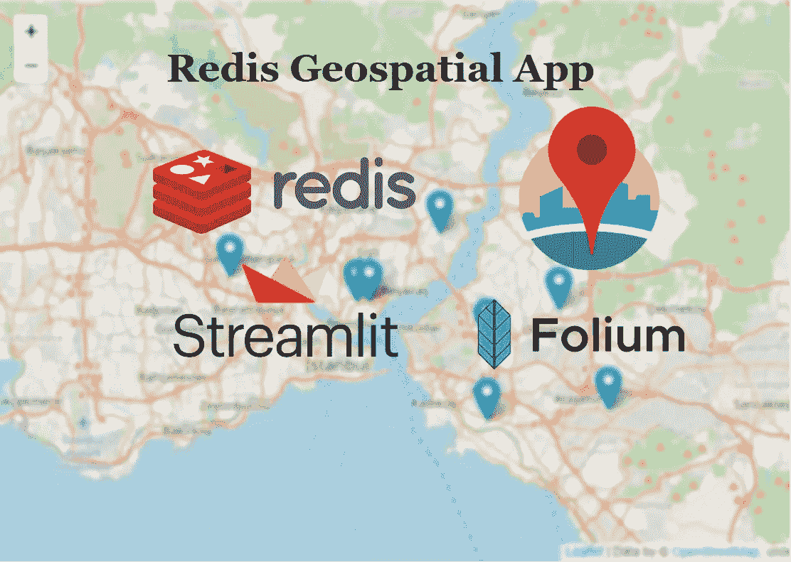
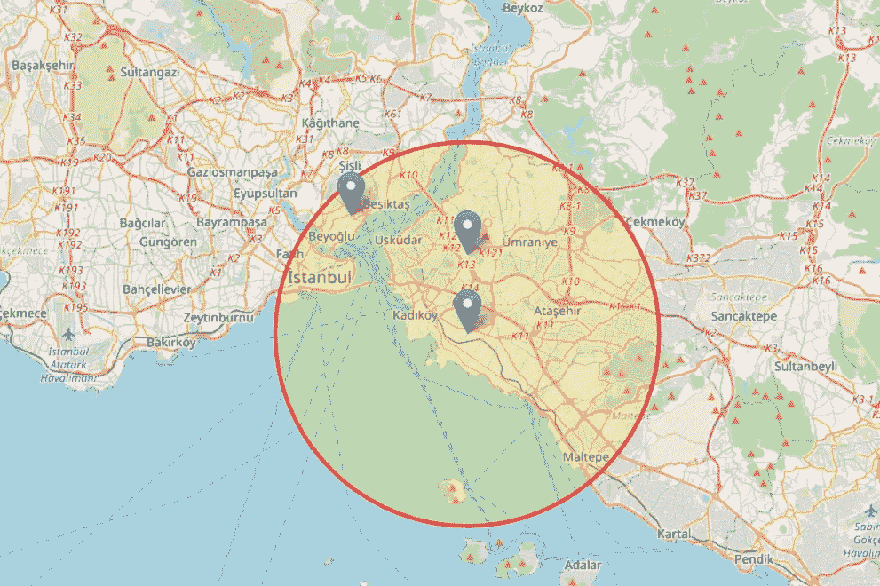
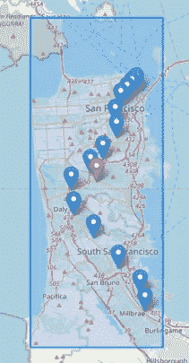
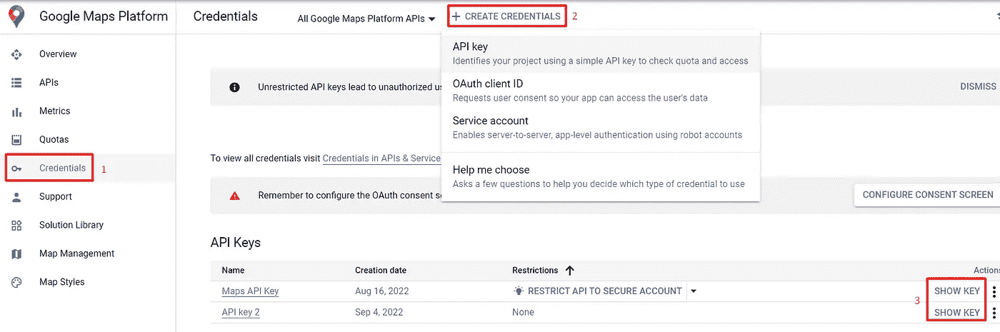
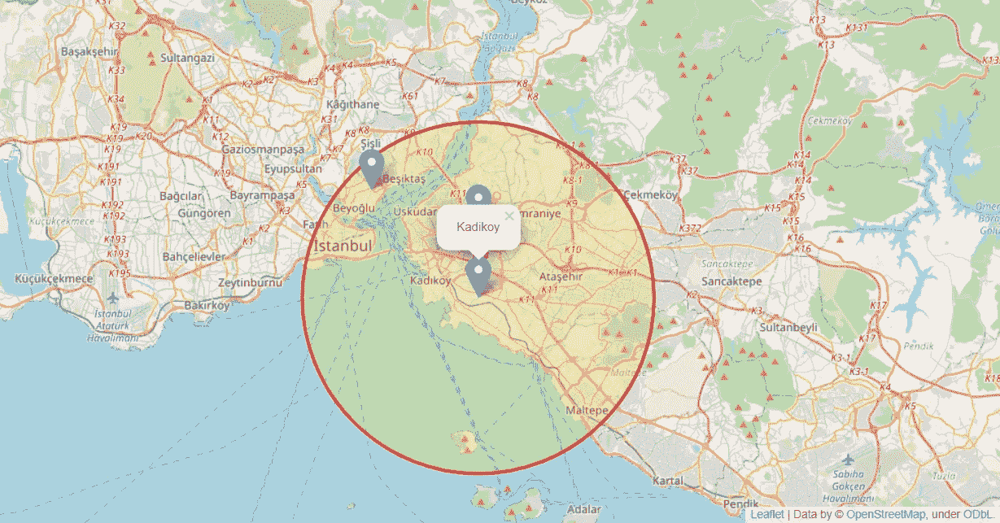

# Redis 地理空间应用程序，带有地理编码 API、Streamlit 和 Folium

> 原文：<https://blog.devgenius.io/redis-geospatial-app-with-geocoding-api-streamlit-and-folium-3937029b5420?source=collection_archive---------14----------------------->

Redis(远程字典服务器)是最受欢迎的 NoSQL 数据库之一，当谈到快速，内存，缓存，流媒体引擎。

然而，在本文中，我想谈谈 redis 的另一个特性——地理空间数据结构。

使用 Redis 地理空间数据结构，我们可以实时、快速地存储地理空间数据并进行分析。

Redis 地理空间应用程序

这篇文章主要讲 3 件事。

1.  **Redis GEO 命令
    2。地理编码 API(如何创建 API 键和如何发送请求)
    3。叶(地图库)**

地理空间应用程序演示

# **1。Redis GEO 命令**

那么，让我们从 Redis GEO 命令开始。在本文中，我打算讨论以下命令。

> **geo add
> geo pos
> geo ist
> geo search
> GEOSEARCHSTORE**

为此，我将演示在 redis-cli 和 python 中使用 Redis GEO 命令。

## **地理添加**

让我们开始第一个 GEO 命令。

使用 GEOADD，我们可以通过指定一个键来存储一个位置的经纬度信息。它还可以用于更新地理空间信息。数据作为一个排序集存储在键中。

目前我用的是 Redis 7.0.4 版本。

GEOADD

## **GEOPOS**

在前面的 before 命令(geoadd)中，我们看到了如何向 Redis 添加位置。

而是我们如何到达增加的位置。

使用 GEOPOS 命令，我们可以根据一个键访问纬度和经度信息。

GEOPOS

## **地理学家**

GEODIST 命令，指示相对于指定键的两个成员和单位的距离。

地理学家

## 地理研究

GEOSEARCH 是最有用、最强大、最常用的命令之一。

基本上，选择的键根据纬度、经度和半径信息给出最近成员的名称、坐标和距离。

使用按半径有两种类型的选项来查看最近的成员。

`**BYRADIUS**` **:** 根据给定的`***<radius>***`在圆形区域内搜索。

用叶子进行地理研究

`**BYBOX**` **:** 在轴对齐的矩形内搜索，由`***<height>***`和`***<width>***`决定。

BYBOX [ [介绍地理搜索命令](https://github.com/redis-developer/introducing-the-geosearch-command)

地理研究

## 地理搜索商店

GEOSEARCHSTORE 命令类似于 GEOSEARCH，但将结果存储在 destination key 中。什么是目的密钥？。让我们看一个例子。

地理搜索商店

# **2。地理编码 API(如何创建 API 密钥以及如何发送请求)**

**地理编码 API** ，它将地址转换为地理坐标(地理编码)，我们可以用它来放置标记或定位地图，这是一个我们将在整个项目中用来检索经度和纬度信息的 API。

你可以在这里看到文档。[ [地理编码 API](https://developers.google.com/maps/documentation/geocoding/requests-geocoding) ]

首先，我们需要创建私有 API 密钥。为此，请遵循以下步骤。

## 启用 API 服务

GCP > API 和服务>库>搜索(地理编码 API)>选择>地理编码 API >单击启用

## 创建 API 密钥

谷歌地图平台>凭证

正在创建 API 密钥

到目前为止，一切都很好，然后让我们发送请求到 api。提醒一下，地理编码 API 响应包含**近似位置信息**。

创建请求

我们看到了如何简单地向 API 发送请求。但是在使用地理编码 API 时，这种用法不合适。让我们更改它，将结果保存到 redis。

## **3。叶子(地图库)**

***leave***建立在 Python 生态系统的数据争论优势和 Leaflet.js 库的映射优势之上。

*叶是处理交互式地图时最好的库之一。对于这个项目范围，我们将使用*来可视化位置(经度、纬度)。**

**是时候将 redis GEO 命令与 leav 库合并了。**

**含 Redis 的叶子**

**看起来很迷人。✨🌟⚡**

****

**代码的结果**

## ****结论****

**在本文中，我们通过示例展示了 Redis 如何用于存储地理空间数据，如何与其他 Geocommand 协同工作，以及如何与 folium 交互使用。作为一项额外的工作，可以尝试使用 follow 库在 geosearch 命令中运行 BYBOX 参数。**

**我希望在阅读这篇文章的时候，你能有所收获。再见，直到我的下一个帖子。你可以在我的 github 链接下面看到所有的项目细节。祝你今天开心！玩的开心！**

** [## GitHub-tugrugokce/Redis _ Geospatial _ App

### 此时您不能执行该操作。您已使用另一个标签页或窗口登录。您已在另一个选项卡中注销，或者…

github.com](https://github.com/TugrulGokce/Redis_Geospatial_App)**