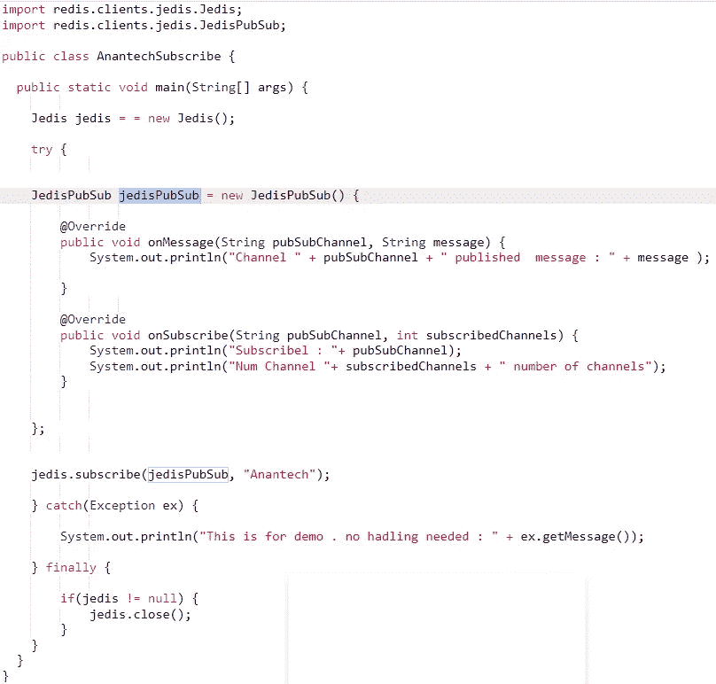

# 神圣的三位一体

> 原文：<https://blog.devgenius.io/redis-holy-trinity-2fa86b78a86e?source=collection_archive---------9----------------------->

Redis 初级读本，介绍如何将其用作缓存、数据库和消息代理。

由[巴斯·安德森](https://unsplash.com/@ldandersen)在 [Unsplash](https://unsplash.com/?utm_source=unsplash&utm_medium=referral&utm_content=creditCopyText) 上拍摄的照片

Redis 已经成为数据密集型处理的默认[分布式缓存](https://faun.pub/cache-15f81a6ed111)框架。它的核心，本质上是一个非 SQL 数据库，具体来说是它的键值存储。

> 键值存储在内存中，这是其超低延迟背后的秘密。内存中的数据可以持久化(为了弹性)。

Redis 一些鲜为人知的功能列举如下。这些功能现在越来越受欢迎

*   可以像 [*Kafka*](https://towardsdev.com/kafka-fundamentals-a268db22b8af) 或者 MQ 一样作为消息代理。
*   对于维护者全局计数器来说，这是微服务架构中一个关键且具有挑战性的特性。
*   全局锁定(确保只有一个线程访问存储的数据)。

Redis 定义为与其同名的公司 [*Redis*](https://redis.io/topics/introduction) Ltd

> Redis 是一个开源的(BSD 许可的)、内存中的数据结构存储，用作数据库、缓存和消息代理。Redis 提供数据结构，如字符串、散列、列表、集合、带有范围查询的排序集合、位图、超级日志、地理空间索引和流。Redis 具有内置的复制、Lua 脚本、LRU 驱逐、事务和不同级别的磁盘持久性，并通过 Redis Sentinel 和 Redis Cluster 的自动分区提供高可用性。

我们将讨论 Redis 的每个特性。

# **REDIS 作为缓存**

Redis 的主要受欢迎程度是由于它的快速缓存特性。Redis 是分布式缓存，以键和值的形式存储所有数据。

> Redis 键总是字符串，而值可以是字符串、列表、集合、散列、排序集合。下面是这些集合可以具有的数据类型的详细信息。**请记住，您可以序列化任何对象，并将其作为字符串持久化**。

资料来源:Redis 在行动

存储在 Redis 中的键值数据可以有一个预定义的时间，在此之前它应该保留在内存中。经过一段时间后，密钥将从缓存中清除。

在设置键和值时，我们添加了额外的参数 EX (Expire)。在下面的例子中，键值设置为 10 秒到期。

当我们试图在 10 秒内得到这个值时，它返回这个值。10 秒钟后，它返回空值。当然，用户可以使用 DEL 命令删除密钥。

通过 REDIS 命令行界面(CLI)的 REDIS 命令

用于连接和使用 Redis 的一些流行的客户端库是

*   ***爪哇*** : [*杰迪斯*](https://www.baeldung.com/jedis-java-redis-client-library)[莴苣](http://redis.paluch.biz/)和[雷迪森](https://github.com/mrniko/redisson/)。
*   ***Python***:redis-py 和 walrus。

Redis 网站*上列出了推荐和支持的客户端库的详细列表。*

# *REDIS 作为数据库*

*Redis 通常是一个补充数据库，与其他持久性存储一起使用。*

> *Redis 不提供强大的持久性(ACI **D** 保证，它取决于 REDIS 设置的配置。*

*REDIS 中的磁盘持久性有两种方式:*

1.  ***RDB** (Redis 数据库):在这种情况下，会在某个预定义的时间和/或事件之后拍摄 Redis 内存中数据的快照。加入 25 种元素后，每 15 分钟或每 5 分钟一次。另一方面是，如果服务器停机，那么前一个快照中的增量数据就会丢失。*
2.  ***AOF** (仅附加文件):REDIS 服务器上的所有操作，如添加关键字或更新值等。被添加到日志文件中。该日志文件按时间顺序存储操作(即操作被调用的顺序)。这个相同的日志文件可以提供给一个普通的 Redis 实例——在使用该文件后，它将与原始实例相同。*

*除了以上两种，我们还可以运行 REDIS，选项为*

*   ***无持久性**(仅作为缓存使用)*
*   ***RDB + AOF***

*[这个](http://kohler.co.in)是理解 REDIS 为 DB 的一个很棒的链接。RDB[*和 AOF*](https://redis.io/topics/persistence#snapshotting) 的选择取决于业务需求。*

> *需要指出的一点是，对于相同的数据大小，RDB 文件要紧凑得多。这是灾难恢复的有用功能。*

# *REDIS 作为消息代理*

*随着我们从整体架构转向微服务，多个服务需要相互通信。*

> *通常我们想从 REST 这样的同步通道转移到 Kafka 或 MQ 等异步媒介。REDIS 的一个鲜为人知的特性是它可以充当健壮的消息代理。*

*REDIS 支持以下消息传递范例*

## *发布/订阅:*

*在发布/订阅中，发布者以预定义的格式向通道发送消息。订户读取该频道的消息。订阅者和发布者互不了解。*

*[订阅](https://redis.io/commands/subscribe)、[退订](https://redis.io/commands/unsubscribe)、[发布](https://redis.io/commands/publish)在 REDIS 中实现。应用程序可以使用 PUBLISH 将消息放到主题上。*

*下面是发布订阅的 Java 客户端代码示例。类似的客户端也有其他语言版本。*

**

*出版者*

**

*订户*

*对于那些寻找 Pub Sub 内部的人，请点击下面的链接*

 *[## 引擎盖下的 Redis Pub/Sub

### 要不要编个聊天 app？在这里，你将看到如何做它的艰苦方式。我详细展示了 Redis 发布/订阅是如何工作的…

making.pusher.com](https://making.pusher.com/redis-pubsub-under-the-hood/)* 

## *基于流的异步通信*

*这种信息范式与卡夫卡非常相似。它本质上使用不可变的仅追加日志，是 Redis 5.0 以后增加的。*

*如 Redis 所述，[流](https://redis.com/blog/what-to-choose-for-your-synchronous-and-asynchronous-communication-needs-redis-streams-redis-pub-sub-kafka-etc-best-approaches-synchronous-asynchronous-communication/)是*

> *流是一系列不可变的、只附加的时间导向条目，许多类型的数据自然适合这种格式。例如，传感器读数或日志包含的值本质上是按创建时间索引的，并且是仅附加的(不能改变过去)。它们也有相当规则的结构。*

*因此，producer 将数据发布到 stream，并将其添加到这个只附加日志中。消费者可以从日志中读取事件。每个订户都需要记住它处理的最后一个条目。在重启、崩溃或网络问题的情况下，它可以很容易地从上次处理的地方恢复。*

*除了作为数据库、缓存和消息代理，REDIS 还有一些非常酷的特性。下面列出了其中的一些。*

1.  *存储全局计数器:REDIS 提供了原子计数器，没有更新丢失的问题。*
2.  *分布式锁定:这种锁定分布在客户机上，即分布在机器上。*
3.  *Hyperloglog:它提供了项目的大概数量。这和 bloom filter 很像。*

*有关 REDIS 的更多信息，请访问以下链接:*

* [## 雷迪斯

### 注意:Redis 文档也可以在 redis-doc github 存储库中以 raw(计算机友好)格式获得…

redis.io](https://redis.io/documentation)  [## Redis 在行动

### 摘要 Redis in Action 介绍了 Redis，并通过示例向您展示了如何有效地使用它…

www.oreilly.com](https://www.oreilly.com/library/view/redis-in-action/9781617290855/) 

对于设计博客，请关注 medium 上的 [Anantech.ai](https://smverma.medium.com/) 。*