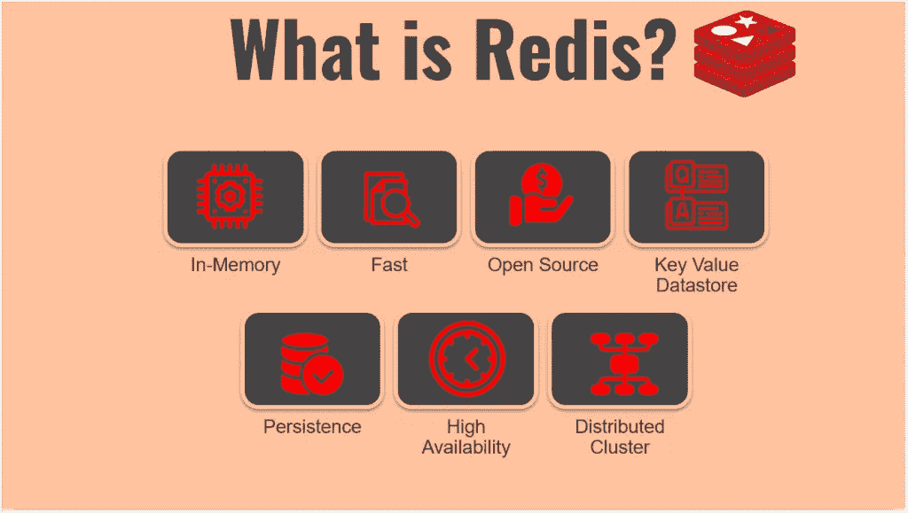
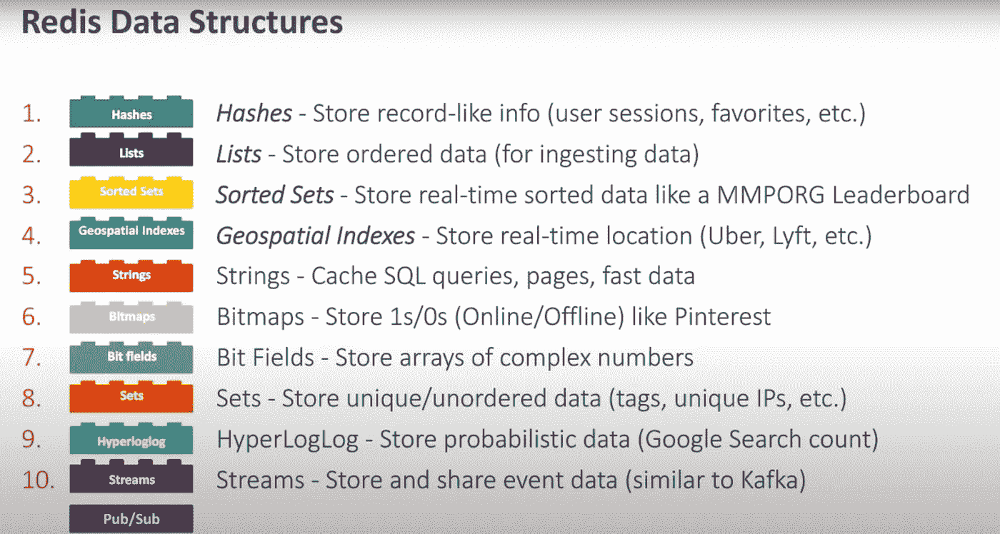
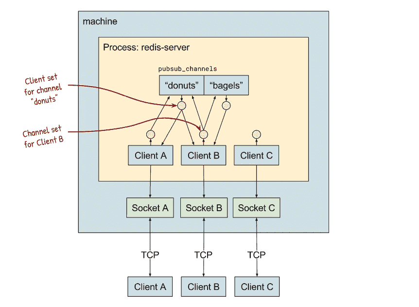

# Redis 不可思议的特质

> 原文：<https://blog.devgenius.io/redis-incredible-traits-16a253f3240c?source=collection_archive---------11----------------------->

在这篇博客中，我们关注为什么 Redis 被评为最佳数据库之一？
将讨论许多事情，如:*数据类型、Redis 基准、发布-订阅、版本 5 和 6 的主要更新。*

**Redis 是什么？？**

*Redis 是开源的(BSD 许可)，内存中* ***数据结构存储*** *，用作数据库、缓存、消息代理。*



雷迪斯！！！

# 数据类型

Redis 提供了广泛的数据类型。



Redis 的数据类型

下面是一些数据类型的例子。

**Hash:** 这是最常用于存储用户会话的类型。

> HSET 哈希字段 1“你好”字段 2“世界”
> 
> HGETALL myhash

**地理空间索引:**我认为是 Redis 中最被低估的类型。

> 地理添加位置-122.375 37.618889 SFO
> 
> 地理位置-115.1537 36.0840 MCA
> 
> **获取距离:**地理学家位置 SFO MCA 公里
> 
> **获取基于特定无线电的位置:**地理半径按成员位置 MCA 1000 km

**有序集合:**数据连续解析，按顺序排列。

> ZADD 游戏 10 id:a
> ZADD 游戏 20 id:b
> ZADD 游戏 30 id:c
> ZADD 游戏 40 id:d

# **Redis 基准**

在大家看来，Redis 是速度最快的数据库之一。


*坦白说，我们确实有* ***的证明。***

> redis-benchmark-q-n 100000-c 100-t get，set

以下链接为您提供了更多使用 benchmark 命令运行的属性，以便在 Redis 服务器[基准文档](https://redis.io/topics/benchmarks)上运行压力测试。

可能会发生许多正在进行的操作，用户试图用两种不同的操作来修改相同键的值，如何解决这种情况？


```
from redlock import RedLock
import redis

redis_obj = redis.Redis()
name_lock = RedLock('last_name')
name_lock.acquire()

print(f"setting value redis key last_name")

redis_obj.set('last_name', 'Ocean11')

print("new value set")
name_lock.release()
```

我们可以使用像 ***Redlock*** 这样的库来提供一个节点，改变值然后释放节点。

# **发布/订阅**

Redis 最受关注的特点之一是**发布/订阅**。当我们想到发布/订阅时，首先想到的是 AMQP 协议。Redis 是发布/订阅的一个更简单的实现。

以图形方式展示建筑的样子。



**频道**

所有的频道都由服务器内的 Redis 维护。它是一个哈希表数组，存储所有的消息。可以使用确切的名称或频道模式订阅来订阅频道。

**发布者** 客户端通过套接字连接与 Redis 服务器连接，一旦从桶列表中找到通道，它就向通道发送消息。它将向频道添加一条消息。

```
import time
import redis

redis_client = redis.Redis()

for n in range(1, 10):
    redis_client.publish('serviceStatus', n)
    pubsub = redis_client.pubsub()
    print(f"--> publish state {n=}")
    time.sleep(1)
```

**订阅者** 客户端连接渠道，接收发布者发送的消息。

**注意:** Redis 发布/订阅与概念**火灾和忘记**一起工作，所以如果订户没有连接，它将错过消息。

```
import redis

redis_obj = redis.Redis()
pubsub = redis_obj.pubsub()
pubsub.subscribe(['serviceStatus'])
for item in pubsub.listen():
    print(item)
```

*参考链接:*这提供了关于 Redis [Pub/Sub](https://making.pusher.com/redis-pubsub-under-the-hood/) 的更深入的知识。

# **Redis 5**

## **Redis 流**


Salvatore Sanfilippo(Redis 创始人)

Redis 在下一版本 Redis 5.0 中提供了解决方案，具有一个名为 Redis Stream 的特性和一个新的数据类型。

> XADD mystream *问候语" hello1"
> XADD mystream *问候语" hello2"
> XADD mystream *问候语" hello3 "
> 
> XREAD COUNT 10 流 mystream 0

它不同于 Redis 发布/订阅，它将存储为指定流创建的所有值和事件。

1.流是不可变的。
2。添加到流中的每个条目都被称为具有唯一 id 的“事件”。
3。因为它保存了所有的事件，所以在这种情况下，任何订阅流的新消费者都将默认从添加到流中的第一个条目发送数据。
4。一旦不再需要历史数据，我们可以使用 XTRIM 命令删除指定长度的旧事件。

# **雷迪斯 6**

**ACL** Redis 一直是单一用户界面，总有一些缺点所有用户都可以访问一切，这可能导致灾难。


前十字韧带

**Redis 中增加了 ACL** ，能够创建用户并向用户提供访问权限。

> 创建用户:ACL setuser test on > password 1 > password 2 > foobar+[@ all](http://twitter.com/all)~ *

@all 表示可以用任何其他命令更改所有权限。

用新用户登录

> 验证测试工具栏

使用命令检查登录用户

> ACL WHOAMI

阻止测试用户的 SET 命令

> ACL setuser 测试集

**RESP 3**

其他内部协议取代了 **RESP 3** 。为了向后兼容，Redis 6 默认运行与协议 **RESP 2，**激活 **RESP 3** 协议运行命令。

> 你好 3

您可以在哈希数据类型显示中看到这种差异，它为您提供了更合理的键和值表示。

**线程输入/输出**

Redis 一直是一个单线程数据库，有时无法使用系统提供的所有 CPU 资源来优化进程并保持 Redis 实现的简单性。

Redis 写操作实现了部分线程 I/O，因为写操作使用了 50%的 CPU，与使用相同系统资源的早期版本相比，Redis 操作速度更快。

**Redis 模块**

它提供了许多模块来扩展 Redis 操作的功能。
请查看提供不同模块更多信息的链接。

[Redis 模块列表](https://redis.io/modules)

[**Redis AI:**](https://oss.redis.com/redisai/) 它提供了运行 TensorFlow 的功能。

[**Redis Search:**](https://oss.redis.com/redisearch/)**Redis Search 是由 [Redis](http://redis.com/) 开发的一个源可用的二级索引、查询引擎，以及 Redis 上的全文搜索。**

# **结论**

**Redis 提供了更快、更可靠和大量开箱即用的特性，这在设计系统时总是值得一看的。Redis 模块工作起来就像顶端的樱桃。**