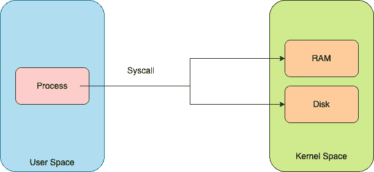
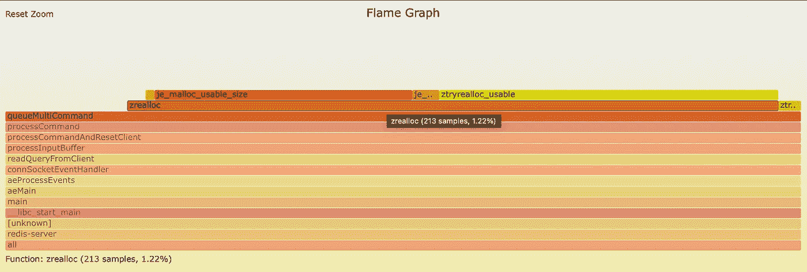
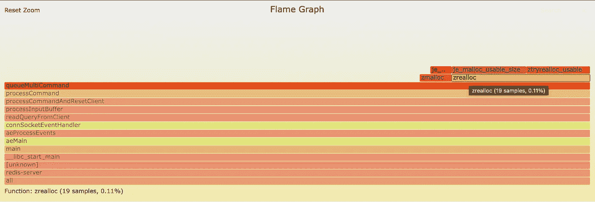

# Redis 优化:一次 1 %

> 原文：<https://blog.devgenius.io/redis-optimization-1-at-a-time-3c3c5084be7b?source=collection_archive---------13----------------------->

Redis 一般来说很快。它每秒可以处理大约 50 万到 1 百万个查询。然而，总有一些改进的余地。每个变更背后都涉及到各种各样的因素，这取决于开发人员在给定时间点的优先级。总的来说，在 Salvatore 维护 Redis 时，重点是可读性和简单性。我将讨论一个小的改进，它不会妨碍可读性，并且仍然有一些性能增益。我们走吧。

# 问题

Redis 的核心是单线程的，因此热路径上的任何优化都有利于更快的执行。Redis 事务允许在一个步骤中执行一组命令。事务中的所有命令都被缓冲并一起顺序执行。这保证了其他客户端不会在正在进行的操作之间受到服务。通过发送一个`MULTI`命令来启动一个事务，然后跟随一组命令，这些命令被排队，直到服务器接收到`EXEC`命令。

在本文的剩余部分，我将重点关注命令的排队。

来自 [redis](https://github.com/redis/redis/blob/7.0/src/multi.c#L59-L88) `multi.c`文件的代码片段:

每当一个命令在事务中排队时，就会执行上面的`queueMultiCommand`方法。如果我们观察第 12 行，会发现有一个`zrealloc`方法会依次调用`realloc`系统调用。随后，命令的状态被初始化。

快速浏览一下 syscall 是什么。

系统调用(syscall)是一种编程方式，在这种方式下，计算机程序向执行它的操作系统内核请求服务。



在上面的例子中，服务器正在系统调用 RAM 中的额外空间。

现在回到 Redis 代码段，对于每个执行服务器，将内存分配扩展一定的大小。“realloc”将根据它所在的内存段表现不同。当我们在这种情况下进行扩展时，重新分配可以通过两种方式进行:

1.  扩展当前内存，旧数据保持在同一位置，新的内存区域未定义。
2.  新的内存块被分配到所请求的大小，旧的数据被复制到该位置的起始处，旧的内存块被释放。

所以，这个手术可能会很贵。为了避免这种情况，我想不出什么解决办法。我们来讨论一下。

# 解决方案

1.  **使用线性增长**代替请求单个额外的分配块，我们可以一起请求 X 个块的内存。当保留的内存块完全用完时，我们可以请求更多的 X 块，依此类推。
2.  **使用指数增长** 或者，我们可以使用指数增长，也就是说，我们以 2 次方的增量请求内存。这将把系统调用次数从 O(N)次减少到 O(logN)次。
3.  **使用静态内存块+上述** 中的任何一个我们也可以避免动态分配内存，我们可以选择静态分配内存。我们可以根据过去使用的数据点选择一些常数。假设在 MULTI/EXEC 块中排队的命令的平均数量是 16 个命令，我们可以保留(16 * `multiCmd`)的静态存储器块，并且如果排队的 MULTI 命令少于 16 个，则不会发生存储器分配/解除分配。如果它超过 16，那么我们将不得不退回到上述方法之一。

这是下面的代码片段，我已经修改了代码，以使用我们刚刚讨论过的指数增长方法。我从大小为 2 的默认预留开始，作为大小为< 2, would be same as single command execution and then increase the size in multiple of 2.

You could also find the entire change over here:

[](https://github.com/hpatro/redis/commit/25bb6e9ebde5c0c7b1da810335d5e9afdc707475) [## Optimize number of realloc syscall during multi/exec flow. · hpatro/redis@25bb6e9

### Redis is an in-memory database that persists on disk. The data model is key-value, but many different kind of values…

github.com](https://github.com/hpatro/redis/commit/25bb6e9ebde5c0c7b1da810335d5e9afdc707475) 

You could also take this as an exercise and implement the remaining approach(es) and profile to see if there is a gain.

# Profiling

Theoretically it looks like we are going to reduce the number of syscalls however we need to prove the gain by profiling or benchmarking. So, I’m going to profile the 【 process while sending continuous requests of 【 blocks with 【 commands within them. In order to do profiling, I’m going to use few of the linux tools like 【 and 【 to visualize the data.

Redis provides a nice blog around how to do [的 multi/exec CPU 配置文件](https://redis.io/docs/reference/optimization/cpu-profiling/)，我还将对其进行一些讨论。

## 脚本

这个脚本是用 python 编写的，并使用了`redis-py`库。在这个脚本中，`r.pipeline()`启动一个`MULTI`块并对 100 个`MSET`命令进行排队，然后在一个无限循环中执行。*

为了分析`redis-server`的用户和内核堆栈，我们将使用以下命令捕获 3 分钟的性能数据。

```
$ perf record -g --pid $(pgrep redis-server) -F 999 -- sleep 180
```

一旦捕获了性能数据，我们可以使用以下命令使用`flamegraph`来可视化它。

```
$ perf script > redis.perf.stacks
$ stackcollapse-perf.pl redis.perf.stacks > redis.folded.stacks
$ flamegraph.pl redis.folded.stacks > redis.svg
```

下面是结果(svg 文件的快照):

**未经优化**



**同优化**



从上面的图中我们可以清楚地看到，对“zrealloc”的调用数量下降了，CPU 使用率也下降了 1%多一点。

更新:上面的修改被合并到 Redis 库，耶！！！

[](https://github.com/redis/redis/commit/a3704d4e87b65a9c071b9dd1ead04cc338d3bc18) [## 优化 multi/exec 流期间 realloc syscall 的数量(#10921) redis/redis@a3704d4

### Redis 是持久存储在磁盘上的内存数据库。数据模型是键值，但是许多不同种类的值…

github.com](https://github.com/redis/redis/commit/a3704d4e87b65a9c071b9dd1ead04cc338d3bc18) 

这就是我在这篇文章中要写的内容。我计划写一篇关于 Redis 7 中分片发布订阅特性的文章，这是我最近写的。如果您喜欢这篇文章，请关注我，获取关于系统软件、Redis 等的有趣文章。