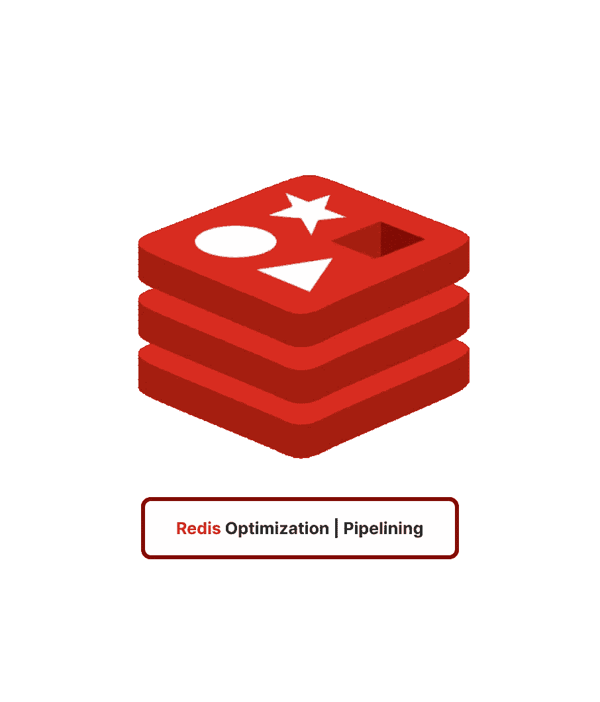

# Redis 使用流水线优化往返时间

> 原文：<https://blog.devgenius.io/redis-optimizing-round-trip-times-with-pipelining-1dbae39265c3?source=collection_archive---------8----------------------->



🥰这篇短文将解释 TCP、请求/响应协议、RTT 和 Redis 管道。

## 🧐:在我们开始之前，让我们回顾一下我使用的一些术语:


makeameme.org 术语模因

## 传输控制协议（Transmission Control Protocol）

TCP 是面向连接的协议，这意味着它在发送数据之前连接发送方和接收方。这种连接在整个传输过程中保持不变，确保数据以正确的顺序无误地传送。TCP 还控制数据流并检查错误，这有助于确保传输的可靠性。

## *请求/响应协议*

在请求-响应协议中，客户端向服务器发送请求，服务器用响应进行响应。人们通常称这个过程为“往返”，因为客户端发送请求，服务器向客户端发回响应。通常，TCP(传输控制协议)或 UDP(用户数据报协议)用于设置它们。

在请求-响应协议中，客户端向服务器发送请求以开始对话。该请求可以包括服务器处理该请求所需的数据或参数。服务器处理请求，并向客户端发回响应。根据请求的类型和处理的结果，响应可以是数据、确认或错误消息。

## 循环时间(Round-Trip Time)

往返时间，或称 RTT，是对客户端向服务器发送请求并接收响应所需时间的度量。RTT 通常以毫秒(ms)为单位，它取决于客户端离服务器有多远、网络连接有多快以及服务器有多忙等因素。

# 💎管道铺设

管道意味着客户端可以向服务器发送多个请求，而无需等待响应，然后在一个步骤中读取响应。管道化允许客户端向服务器发送多个请求，而无需等待响应，然后一次性读取所有响应。

## 🥳是一个真实世界的代码示例

下面的基准测试将使用支持管道的 Redis Ruby 客户端，以及基准测试 gem 来测试管道带来的速度提升。

让我们转到我们的工作目录，然后键入您的终端:

```
gem install redis benchmark
```

然后，让我们启动我们的 redis 服务器

```
brew services start redis
```

一旦完成，让我们前往我们最喜欢的 IDE 我的是 RubyMine 创建一个名为**benchmark _ pipes . Rb**的文件，开始编码:

```
require 'redis'
require 'benchmark'

# Connect to the Redis server
r = Redis.new

# Set the keys we'll be using for the benchmark
keys = ['food', 'ats', 'loush']

# With pipeline
puts Benchmark.measure {
  # Start the pipeline
  r.pipelined do 
    keys.each do |key|
        5_000.times do
            r.ping
            r.incr(key)
            r.get(key)
        end
    end
  end
}

# Without pipeline
puts Benchmark.measure {
  keys.each do |key|
    5_000.times do
            r.ping
            r.incr(key)
            r.get(key)
    end
  end
}
```

现在让我们运行脚本，见证管道的威力！

```
ruby benchmarking_pipes.rb
```

> 难以置信吧。


法。Bu。Lous GIF

***批量使用，性能得到惊人优化😎***

## Redis 流水线的优势:

*   提高性能:管道化的主要优点之一是它可以显著提高 Redis 支持的应用程序的性能。通过减少执行命令所需的网络往返次数，管道可以显著减少单个请求的开销，并提高应用程序的整体性能。
*   减少延迟:通过允许客户端在一个请求中发送多个命令，管道也有助于减少请求的延迟。这对于依赖实时数据或有严格延迟要求的应用程序尤其有用。

## Redis 流水线的缺点:

*   不能保证命令的执行顺序:流水线的一个潜在缺点是它不能保证命令的执行顺序。这意味着，如果您需要以特定的顺序更新多个键，管道可能不是正确的选择。在这些情况下，可以使用`BATCH`命令来代替，这保证了命令将按照它们被发送的顺序执行。
*   增加复杂性的可能性:使用管道也会增加代码的复杂性，因为您需要管理管道，并确保它在需要时正确关闭或重置。这在处理多线程或并发请求时尤其重要。

> 希望你发现这篇文章有趣和有用的❤️