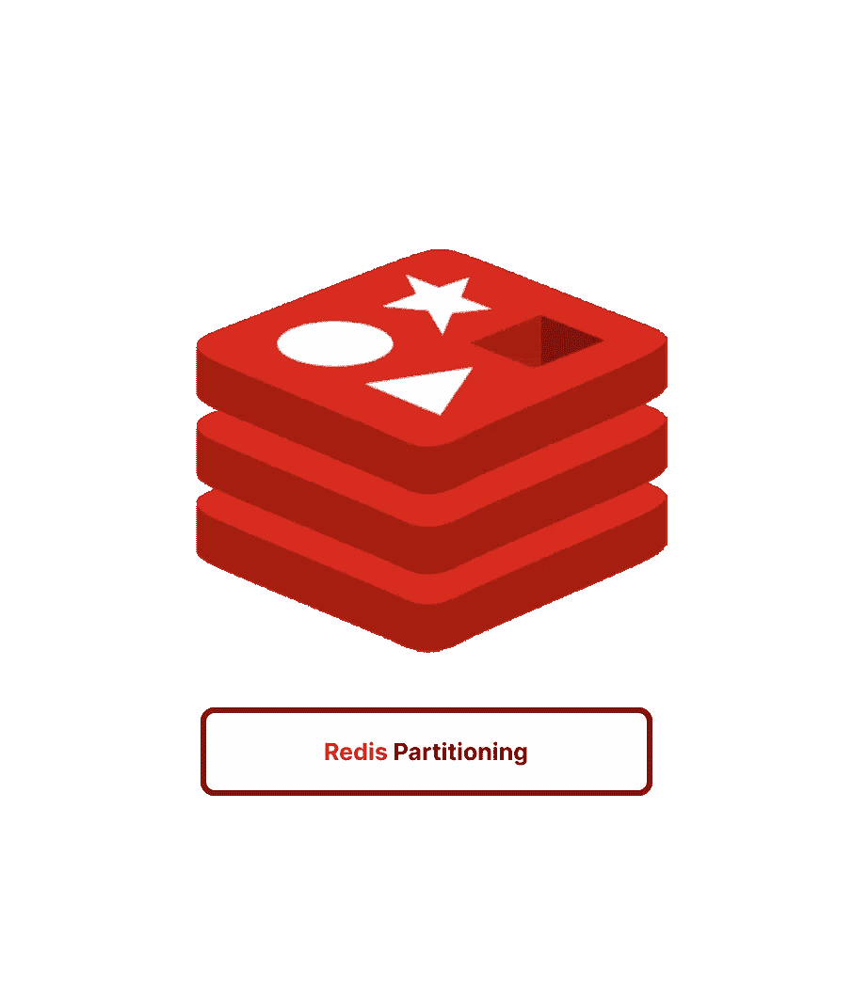

# Redis 分区|范围、散列、一致散列和预散列

> 原文：<https://blog.devgenius.io/redis-partitioning-range-hash-consistent-hash-and-presharding-f0f379289c94?source=collection_archive---------6----------------------->



本文将解释“分区”在 Redis 上下文中的含义，以及“水平”和“垂直”分区，还有范围、散列、一致散列和预散列。

此外，这篇文章有一些相关的 ruby 代码，所以享受❤️

⚠️喝一杯你最喜欢的饮料☕️，这将是一个漫长的旅程🌪️

## 😎让我们从一开始就看看什么是分区。


帕特里克数据迷因

分区是一个通用术语，用于描述分解数据并将其分布在不同主机上的行为。分区有两种:*水平分区*和*垂直分区*。
当需要更好的性能、可维护性或可用性时，在主机集群中执行分区。

## 📜准备好上历史课了吗？

当 Redis 第一次出现时，它并不意味着是一个分布式数据存储，所以它的数据不能在不同的实例之间自动共享。它被设计成在单一服务器上运行良好。Redis 集群是为了解决 Redis 中的分布式问题而设计的。
随着时间的推移，Redis 存储可能会增长到一台服务器可能不足以存储其所有数据的程度。对单个服务器的读写性能也可能会下降。

## 🫡，那么在 Redis 中，什么是分区？

Redis 分区是将一个 Redis 数据库分割成几个更小的数据库的一种方式，这些更小的数据库称为“分区”这样做是为了提高数据库的速度和可伸缩性，并减少管理大量键带来的内存和处理负载。Redis 分区使得单个 Redis 服务器可以保存更大量的数据，并且多个客户端可以同时访问这些数据，这可以提高系统的整体性能。

*   **水平分区** :
    水平分区，通常称为分片，是一种 Redis 策略，用于将一个巨大的数据集划分为更小、更易于管理的部分，存储在不同的 Redis 服务器上。这允许数据分散在多个服务器上，从而提高了系统性能和可伸缩性。水平分区允许客户机向一台 Redis 服务器发送请求，以便访问存储在该服务器上的数据，从而减少了获取数据所需的时间和处理资源。此外，水平分区允许并行访问数据，这可以提高整体系统性能。
*   **垂直分区** :
    垂直分区是一种 Redis 方法，用于将数据集划分为更小的分区，每个分区包含总数据的一个子集。这实现了更高效的数据存储和检索，以及增强的性能和可扩展性。垂直分区将每个分区存储在一个 Redis 服务器上，并根据数据集中存在的不同数据种类或类别来组织分区。例如，如果 Redis 数据库既有数字数据又有字符串数据，那么数字数据可能保存在一个分区中，而字符串数据保存在另一个分区中。因为 Redis 可以基于数据类型优化其存储和检索活动，这将允许更高效的数据存储和检索。此外，垂直分区允许并行访问数据，这可以提高整体系统性能。

通过垂直分区，键值分布在不同的 Redis 实例上，而通过水平分区，键分布在不同的 Redis 实例上。

**TL；在水平分区中，一个数据库表根据某个属性或一组属性的值被分割成更小的表。这与垂直分区不同，在垂直分区中，数据库表根据表中不同的列或字段被划分成更小的表。**

> 注意:(在单实例模式下，Redis 不支持分区或集群)

# 🤔那么，我们如何对数据进行分区呢？


分割模因

# 范围划分

R 安歌分区是一种 Redis 方法，用于根据数据集内包含的值的范围将数据集划分为更小的分区。例如，包含大量数字的 Redis 数据库可以基于值的范围进行分区，一个分区包含从 1 到 100 的所有值，另一个分区包含从 101 到 200 的所有值，依此类推。这实现了更有效的数据存储和检索，因为 Redis 可以根据每个分区中存储的值的范围优化其操作。此外，范围分区支持并行访问数据，这可以提高整体系统性能。

**范围分区是一种基于一系列键划分数据的方法。**
范围划分的整体思想是创建键的范围，并将它们分配给不同的 Redis 实例。您可以创造性地创建产品系列。

> 激动人心的权利🍔？让我们看一些例子:

## 💻使用 CLI 对现有数据进行分区

要对 Redis 中的现有数据进行 range 分区，可以使用`redis-cli`命令行界面为每个分区创建一个新的 Redis 实例，然后使用`MIGRATE`命令将现有数据从旧的 Redis 实例移动到新的实例。

下面是一个如何做到这一点的示例:

1.  首先使用`redis-server`命令为每个分区创建一个新的 Redis 实例，为每个实例指定不同的端口号:

```
redis-server --port 8000
redis-server --port 8001
redis-server --port 8002
```

2.接下来，使用`redis-cli`命令连接到旧的 Redis 实例，并使用`MIGRATE`命令将数据迁移到新的分区。`MIGRATE`命令采用以下参数:

```
MIGRATE host port key destination-db timeout [COPY] [REPLACE] [KEYS key1 key2 ...]
```

例如，要将带有关键字`burger`的数据从旧的 Redis 实例迁移到端口 7000 上运行的新分区，可以使用以下命令:

```
redis-cli MIGRATE 127.0.0.1 8000 burger 0 1000 COPY
```

这将把带有键`burger`的数据从旧的 Redis 实例移动到端口 8000 上运行的新分区。对每个分区和每个要移动的项重复此步骤。

## 🎨使用 Ruby 划分现有数据

要使用 Ruby 对 Redis 中的现有数据进行范围分区，可以使用`redis-rb` gem，它提供了 Redis 键值存储的 Ruby 接口。

1.  使用以下命令开始安装`redis-rb` gem:

```
gem install redis
```

2.接下来，使用`Redis.new`方法为每个分区创建一个新的 Redis 实例，为每个实例指定不同的端口号:

```
require 'redis'

# Create a new Redis instance for a partition 
partition1 = Redis.new(:port => 8000)
partition2 = Redis.new(:port => 8001)
partition3 = Redis.new(:port => 8002)
```

3.使用`migrate`方法将数据从旧的 Redis 实例迁移到新的分区。`migrate`方法采用以下参数:

```
migrate(host, port, key, dest_db, timeout, [options])
```

例如，要将带有关键字`burger`的数据从旧的 Redis 实例迁移到端口 8000 上运行的新分区，可以使用以下代码:

```
# Connect to the old Redis instance
old_redis = Redis.new
# Migrate the data with key "burger" from the old Redis instance
# to the new partition running on port 8000
old_redis.migrate("127.0.0.1", 8000, "burger", 0, 1000, :copy => true)
```

这将把带有关键字`burger`的数据从旧的 Redis 实例移动到在端口 8000 上运行的新分区。对每个分区和每个要移动的项重复此步骤。

# 📒哈希分区

H 灰烬划分是一个简单易懂的概念。它需要对 Redis 键应用一个散列函数，将得到的散列值除以可访问的 Redis 实例的数量，并将该除法的余数用作实例索引。

在 Redis 中，散列分区根据键的散列将键空间分成几个分区。
*HASH*命令用于发现给定的键属于哪个分区，数据随后保存在该分区中。
这使得 Redis 能够跨多个实例分发密钥，潜在地提高了性能和可伸缩性。

一个红宝石片段可能比英语更能体现这一思想:

```
partition_index = key.hash % @partitions.length
host = @partitions[partition_index]
```

这种方法的效果取决于所使用的散列函数。如果您的哈希函数适合您的数据集，则会生成偶数除法。人们经常使用 MD5 和 SHA1 作为哈希算法。

为了减少冲突，建议在使用这种分区策略时，Redis 实例的总数应该是一个质数。如果 Redis 实例的总数不是质数，冲突会更频繁。

## 使用 Ruby 对现有数据进行🛞自动分区

您可以使用“redis-rb gem”开发一个定制的分区功能，该功能可以根据某个特定数据的键或值来识别该数据应该存储在哪个 redis 实例中，从而为 Redis 中的正确实例自动分区新数据。

下面是一个如何做到这一点的示例:

1.  使用以下命令开始安装`redis-rb` gem:

```
gem install redis
```

2.接下来，创建一个表示 Redis 分区的新 Ruby 类。该类应该包含连接到分区的 Redis 实例的方法，以及存储和检索分区数据的方法。下面是该类的一个示例:

```
require 'redis'

class RedisPartition
  attr_reader :redis

  def initialize(port)
    @redis = Redis.new(:port => port)
  end

  def set(key, value)
    @redis.set(key, value)
  end

  def get(key)
    @redis.get(key)
  end
end
```

3.创建一个新的 Ruby 类，表示一组 Redis 分区。这个类应该包含创建新分区和将键映射到正确分区的方法。下面是该类的一个示例:

```
class RedisPartitionSet
  attr_reader :partitions

  def initialize
      @partitions = []
  end

  def create_partition(port)
      partition = RedisPartition.new(port)
      @partitions << partition
      partition
  end

  def get_partition(key)
      # Determine which partition the given key belongs to
      # based on the key's value
      partition_index = key.hash % @partitions.length
      @partitions[partition_index]
  end
end
```

4.使用`RedisPartitionSet`类创建一组 Redis 分区，并根据键从正确的分区存储和检索数据。下面是一个如何做到这一点的示例:

```
# Create a new set of Redis partitions
partitions = RedisPartitionSet.new
# Create a new partition running on port 7000
partition1 = partitions.create_partition(7000)
# Create a new partition running on port 7001
partition2 = partitions.create_partition(7001)
# Create a new partition running on port 7002
partition3 = partitions.create_partition(7002)
# Store the value "burger" with key "food" in the correct partition
partitions.get_partition("food").set("food", "burger")
# Store the value "zenAts" with key "awesome" in the correct partition
partitions.get_partition("team").set("awesome", "zenAts")
# Retrieve the value stored with key "awesome" from the correct partition
value = partitions.get_partition("team").get("awesome")
```

这个示例创建了一组三个 Redis 分区，并使用一个定制的分区函数来根据每个数据的键确定应该将它存储在哪个分区中。

# **🏋🏻预硬化**

预分级是一种跨多个 Redis 服务器或实例预先分配和分发数据的技术，以分担工作负载并提高性能。这通常是通过将数据分成称为“碎片”的固定大小的块，并将每个碎片分配给唯一的 Redis 实例来实现的。在 Redis 集群中，预加固可以实现更好的资源利用和可伸缩性。

对数据进行预散列是应对使用散列分区随着时间的推移添加或替换节点的挑战的一种方法。这需要对数据进行大量的预分区，以便主机列表的大小永远不会改变。计划是在不同的端口上运行额外的 Redis 实例，同时重用现有的服务器。这样做很好，因为 Redis 是单线程的，不会消耗机器的所有资源，允许您在每台服务器上启动多个 Redis 实例，并且仍然没有问题。

然后，有了这个 Redis 实例的新列表，您将应用我们之前介绍的相同散列算法，但是现在 Redis 客户机数组中有了更多的元素。这种方法是可行的，因为如果您需要向集群添加更多的容量，您可以用更强大的 Redis 实例替换一些 Redis 实例，并且客户机阵列大小永远不会改变。

## **在 CLI 中对所有现有的 Redis 实例进行预共享和分区**

1.  使用`cluster info`命令获取关于当前 Redis 集群的信息。
2.  使用`cluster nodes`命令获取集群中的节点列表。
3.  使用`cluster reshard`命令在现有节点中平均分配数据。
4.  使用`cluster replicate`命令创建节点的额外副本，以提高可靠性和可用性。
5.  使用`cluster forget`命令从集群中删除一个节点。
6.  根据需要重复步骤 3-5，对现有 Redis 实例进行预共享和分区，以提高性能和可伸缩性。
7.  使用`cluster info`和`cluster nodes`命令验证数据是否均匀分布，集群是否已分区。

## 现在，如果我们的服务器没有足够的能力来处理负载怎么办？

让我们首先定义我们的服务器。

```
redisHosts = [
    'loush_server'  => [6379, 6380, 6381, 6382, 6383],
    'loush_server1' => [6379, 6380, 6381, 6382, 6383],
    'loush_server2' => [6379, 6380, 6381, 6382, 6383],
];
```

作为示例，我们选择每台服务器只有五个实例，但是有些人每台服务器有超过 200 个实例。

替换为另一个更大容量的服务器，如 *loush_server4* 。

这些步骤如下:

1.  使用与 *loush_server3* 相同数量的 Redis 实例启动 *loush_server4* 。使每个新实例成为 *loush_server3* 的一个实例的副本，以避免丢失数据。
2.  在所有新实例中完成同步后，用 Redis 主机列表中的 *loush_server4* 实例替换所有 *loush_server3* 实例。
3.  停止所有连接到 *loush_server3* 实例的进程。将 *loush_server4* 实例提升为主实例(无人命令的**从实例)。**
4.  重新启动之前停止的所有进程。
5.  关闭 *loush_server3* 。

> Redis 中的 SLAVEOF NO ONE 命令用于防止一个 Redis 实例成为另一个实例的从属实例。当 Redis 实例不再需要作为从实例从主实例复制数据时，通常使用该命令。当您运行此命令时，Redis 实例将停止从主实例复制数据，并且不再从主实例接收更新。这对于停用 Redis 实例或重新配置它以从不同的主实例进行复制非常有用。

*如果您无法立即停止所有进程，请将从服务器设置为可写(****CONFIG SET slave-read-only no)****)，将所有客户端移动到新实例，然后将从服务器升级为主服务器。*


权衡迷因

在灾难环境中，预先加固策略效果不佳。如果一组服务器出现问题，需要更换，保持集群平衡的唯一方法是用其他服务器替换损坏的服务器。根据定义，群集的大小不能变化。在这种情况下，客户端将尝试连接到较差的服务器，如果新服务器没有立即启动，可能会对受影响的项目产生重大影响。这不是一个弹性的方法，随着每个人都迁移到云，弹性总是可取的。

这种策略的另一个缺点是，您有更多的实例需要管理和监控，而且没有任何有效的工具来做到这一点。一致散列就是其中之一，它经常被用作这种方法的替代方法。

# **🤓一致散列法**

一致散列是一种用于在 Redis 服务器集群中分发密钥的技术。它基于散列函数将密钥分配给服务器，该散列函数将密钥映射到与集群中的服务器相对应的一系列值(仅重新映射 *K/n* 个密钥，其中 *K* 是密钥的数量，而 *n* 是服务器的数量)。这允许密钥在服务器之间均匀分布，降低了热点风险并提高了性能。当在集群中添加或删除服务器时，只需要重新分配少量的密钥，从而将对整个系统的影响降至最低。在 Redis 集群中使用一致散列来实现水平扩展和高可用性。

我们已经讨论了散列分区是如何工作的。最大的缺点是在列表中添加或删除服务器可能会对密钥分发和创建产生不利影响。当使用 Redis 作为具有哈希分区的缓存系统时，伸缩变得极其困难，因为 Redis 服务器列表的大小不能改变(否则，将会发生大量的缓存未命中)。

## 🚘举一个光荣的鲁比的例子

```
require 'redis'

Create a Redis client object.
redis = Redis.new
```

```
# Define a ConsistentHash class that implements the consistent hashing algorithm.
class ConsistentHash
  def initialize
    @nodes = []
  end

Add a node and its corresponding slots to the hash.
  def add_node(node, slots)
    @nodes << { node: node, slots: slots }
  end

  # Remove a node from the hash.
  def remove_node(node)
    @nodes.delete_if { |n| n[:node] == node }
  end

Get the node and slot for a given key.
  def get_node_and_slot(key)
Use a hash function to map the key to a value in the range of slots.
Return the node and slot that correspond to this value.
  end
end
```

```
# Create a consistent hash object.
hash = ConsistentHash.new

# Use the cluster nodes command to get the list of nodes in the cluster and their corresponding slots.
nodes = redis.cluster('nodes')
nodes.each do |node|
  # Add the node and its slots to the consistent hash.
  hash.add_node(node, node.slots)
end

# Use the cluster forget command to remove a node from the cluster and the consistent hash.
redis.cluster('forget', node_id)
hash.remove_node(node_id)

# Use the cluster reshard command to redistribute the keys in the cluster and update the consistent hash.
redis.cluster('reshard', key_pattern, count, destination_node_id)

# Update the slots for the destination node in the consistent hash.
destination_node = nodes.find { |n| n.node_id == destination_node_id }
hash.add_node(destination_node, destination_node.slots)
```

## 分区的✅优势。

1.  它通过组合多台计算机的内存来支持更大的数据库。如果没有分区，单台计算机可以支持的内存量是有限的。
2.  它支持将处理能力扩展到众多内核和计算机，并将网络带宽扩展到多台计算机和网络适配器。

## ❌分区的缺点

1.  不支持多键操作。例如，如果两个集合存储在分配给不同 Redis 实例的键中，则不能相交。
2.  不能使用多个关键字执行 Redis 事务。
3.  在处理持久性时引入了大量的模糊性。
4.  缩小和缩放数据是超级困难的。

> 希望你觉得这篇文章有趣和好玩❤️