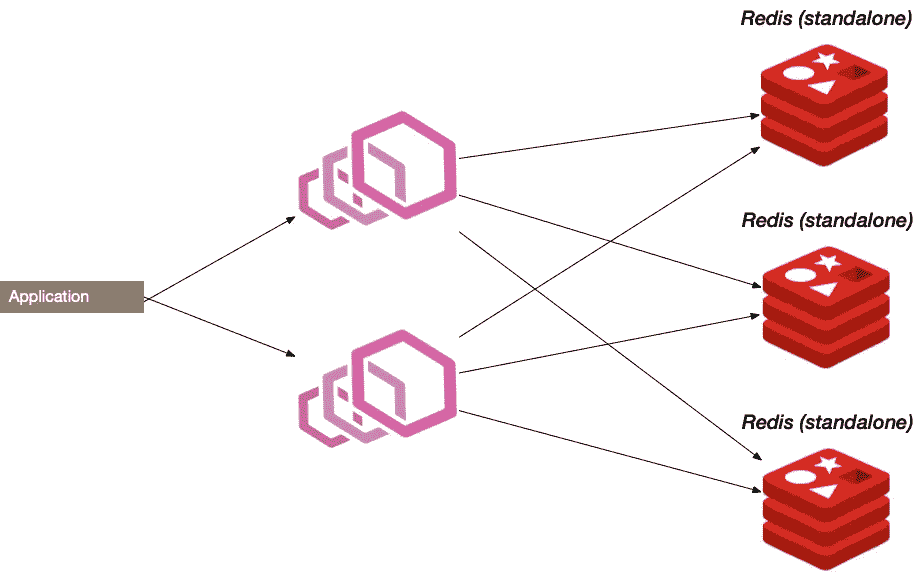

# Redis 拓扑

> 原文：<https://blog.devgenius.io/redis-topologies-d9e16a7fa8e0?source=collection_archive---------0----------------------->

Redis 是一个开源的内存数据结构存储库，是现代架构中非常重要的一部分。在少数情况下，它被用作更一般的数据存储，但在缓存技术领域，它是一个明显的赢家

Lyft 最近分享了他们 2020 年 Redis 工作负载的更新数字( [youtube 视频](https://www.youtube.com/watch?v=b9SiLhF9GaU)):

*   171 个集群
*   大约 3，600 个实例
*   高峰时 6500 万 QPS

令人印象深刻的是，Redis 生态系统在核心技术保持简单的情况下发展了多少。Redis 的创始人 Salvatore Sanfilippo 功不可没。

最小核心为设置场景的变化留下了很大的空间，在本文的范围内，我们将回顾不同的拓扑，每种拓扑都有自己的高可用性和数据安全特性。

这篇文章是介绍性的。如果你对 Redis 非常有经验，你不会发现太多的新材料。但是如果你是新手，它可以帮助你浏览各种设置场景，这样你就可以更深入地了解。这也将为今后关于这一主题的写作奠定基础

# 复制设置


Redis 基本复制设置

[Redis 复制指南](https://redis.io/topics/replication)

这是一个非常简单的设置。有一个主服务器和一个或多个副本服务器。副本试图维护存储在主节点中的数据的精确副本

Redis 复制是异步和非阻塞的。这意味着主机将继续处理传入的命令，因此对性能的潜在影响非常小

**好处:**

*   **提高了数据安全性**，因此，如果一个主节点发生故障，您仍然可以在其他节点上保存数据
*   **读取可扩展性**。您可以将读取工作负载分配给副本。但是请记住，在这种设置中没有一致性保证。(对于某些工作负载来说完全可以)
*   ***主机上的高性能/低延迟**。通过这种设置，可以关闭主服务器上的磁盘持久性。但是要非常小心，并且阅读官方文件。(至少禁用自动重启)

虽然这种设置简单明了，但也有不足之处:

*   不提供高可用性！！！
*   客户端应该知道拓扑结构，以获得读取可伸缩性。他们需要了解在哪里进行读写操作

如果您没有知道将流量路由到哪里的智能客户端，HAProxy 有一个非常旧的设置:

它使用健康检查机制来 ping Redis 节点，以便它可以识别主节点并将流量定向到它

# 雷迪斯哨兵报

[Redis 哨兵指南](https://redis.io/topics/sentinel)


Redis Sentinel 设置

Redis Sentinel 建立在复制基础上，无需人工干预即可为 Redis 提供高可用性。

Sentinel 不断监视主服务器和副本服务器，并检查它们是否按预期工作。如果出现问题，它可以运行自动故障转移并提升不同的主节点。

除此之外，Sentinel 还充当连接客户端的配置提供者(服务发现)。在故障转移过程中，客户端将获得主节点的更新地址。

建议设置包括多个 sentinel 节点，因此，如果其中一些节点关闭，则具有容错特性。

哨兵节点合作，以便就集群的状态达成一致(例如，在检测到故障的情况下做什么)。

sentinel 配置示例(sentinel.conf):

```
sentinel monitor mymaster 127.0.0.1 6379 2
sentinel down-after-milliseconds mymaster 60000
sentinel failover-timeout mymaster 180000
sentinel parallel-syncs mymaster 1
```

在那里，它声明了一个哨兵节点监视具有法定人数`2`的名为`mymaster`的组

```
sentinel monitor <master-group-name> <ip> <port> <quorum>
```

不需要指定副本，它们将通过自动发现来识别。

**好处**

*   **高可用性。**该设置建立在 Redis 复制之上，支持自动故障转移
*   服务发现。Sentinels 充当客户端的配置提供者，使它们能够感知拓扑

**缺陷**

*   通常，这种设置涉及许多具有不同角色的节点。(例如，5 个节点:主节点、副本节点、3 个哨兵节点)。因此，它带来了极大的复杂性，同时所有的写操作仍然指向单个主机
*   客户端驱动程序负责加载并实现 Sentinel 设置的路由机制。不是所有的司机都支持这一点

# Redis 集群


这就是事情变得越来越有趣的地方。Redis 集群于 2015 年推出，从 3.0 版本开始。它是第一个开箱即用的 Redis 体系结构，允许写入可伸缩性

**亮点**:

*   水平可伸缩。添加更多节点会增加容量
*   数据会自动分片
*   容错的

为了分发数据 Redis 集群有**哈希槽**的概念。总共有 16384 个哈希槽，集群中的每个节点负责其中的一个子集

因此，当发送针对给定密钥的请求时，客户端会为该密钥计算一个哈希槽，并将其发送到适当的服务器。这意味着 Redis 集群客户端实现必须支持集群:

*   定期更新哈希槽
*   自己处理重定向(在集群拓扑发生变化和集群插槽暂时不同步的情况下)

**好处:**

*   更简单的操作(更少的移动部件)
*   开箱即用的高可用性
*   水平可扩展性

**不足之处:**

*   客户端需要更加复杂，并且自己同步集群状态
*   关于多键操作处理的警告(因为数据可能位于不同的节点上)

Box 的 Ryan Luecke 有一个关于迁移到 Redis 集群的很好的演讲( [youtube 视频](https://www.youtube.com/watch?v=NymIgA7Wa78))。

# redis[单机版]带特使

(或旧时代的 Twemproxy)



Redis 与特使代理

(特使代理 [doc](https://www.envoyproxy.io/docs/envoy/latest/intro/arch_overview/other_protocols/redis)

这就是我们在 Whisk(【https://whisk.com】T4)运行的设置。我们非常喜欢它的操作简单性和良好的容错特性。

请注意，如果您计划将 Redis 用作持久性数据存储，这种设置并不合适，但它非常适合缓存，甚至对于速率限制之类的特性也足够好了

我推荐看 Lyft 的视频( [youtube 链接](https://www.youtube.com/watch?v=U4WspAKekqM))，因为它很好地解释了这个概念。

这个想法和设置非常简单:

*   您有一堆独立的 Redis 节点，它们之间互不了解
*   在它们前面有一组特使代理，它们知道如何分配流量(一个键和一个 Redis 节点的关联)

这使您的操作非常简单。您的客户端可以将流量路由到任何特使节点，它将得到处理。在这种设置中，很容易容忍任何 Redis 或 Envoy 节点出现故障。在“Redis 作为缓存”的场景中，最糟糕的事情是您需要重新计算一个键的值。

由于我们的特使代理在 Kubernetes 上运行，靠近应用程序服务，我们有一个非常可靠和快速的设置。几乎没有遇到任何问题

Envoy 执行**基于散列的分区**，在初始化或拓扑变化期间，Envoy 为每个 Redis 节点计算并关联一个整数值。然后，当一个请求到来时，它将它的键散列为一个整数，并找到与之最匹配的节点


图片来自 Lyft 演示:[https://www . slide share . net/redis labs/redis conf 18-2000-instances-and-beyond](https://www.slideshare.net/RedisLabs/redisconf18-2000-instances-and-beyond)

**好处:**

*   **操作简单。**非常易于设置和维护。更少的移动部件
*   **容错**。您可以丢失/替换任何节点，影响极小
*   **水平可扩展性**。横向扩展和添加更多服务器时几乎没有开销
*   **简单客户**。只有负载平衡或良好可靠的连接到特使是必要的
*   **曝光指标**开箱

**限制**

*   仅适用于可能丢失一小部分数据是可以接受的特定使用情形(例如缓存)

# 摘要

我们概述了一些基本的 Redis 拓扑，每种都有不同的特征。各有利弊。这取决于你的场景。

但是如果你的场景是关于“尽力而为的缓存”，那么我强烈建议你考虑用 Envoy 来设置。否则，如果您需要数据的安全保证，Redis 集群可能是一个不错的选择，它已经足够成熟，并且有成功的案例研究。

在未来的一些文章中，我们可能会更深入地研究我们在 Whisk 上运行的 Envoy 设置，并且可能会考虑不同 JVM 驱动程序的一些性能比较。

# 资源

*   Redis 复制指南—[https://redis.io/topics/replication](https://redis.io/topics/replication)
*   Redis 哨兵指南—【https://redis.io/topics/sentinel 
*   瑞恩·吕克的《雷迪斯集群》——【https://www.youtube.com/watch?v=NymIgA7Wa78 
*   红色集群图图里亚尔—[https://redis.io/topics/cluster-tutorial](https://redis.io/topics/cluster-tutorial)
*   Lyft 的 Redis +特使—[https://www.youtube.com/watch?v=U4WspAKekqM](https://www.youtube.com/watch?v=U4WspAKekqM)
*   envoy Proxy Redis doc—[https://www . envoy Proxy . io/docs/envoy/latest/intro/arch _ overview/other _ protocols/Redis](https://www.envoyproxy.io/docs/envoy/latest/intro/arch_overview/other_protocols/redis)