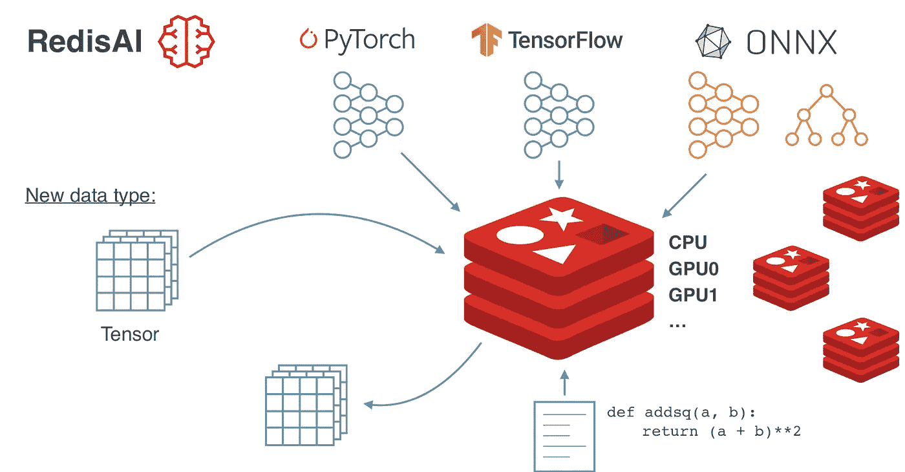
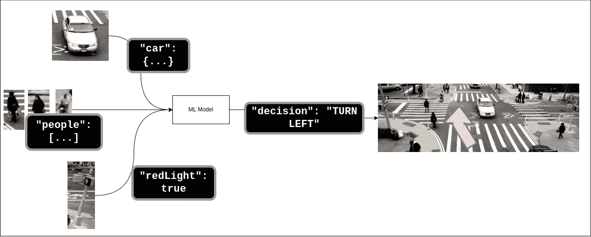
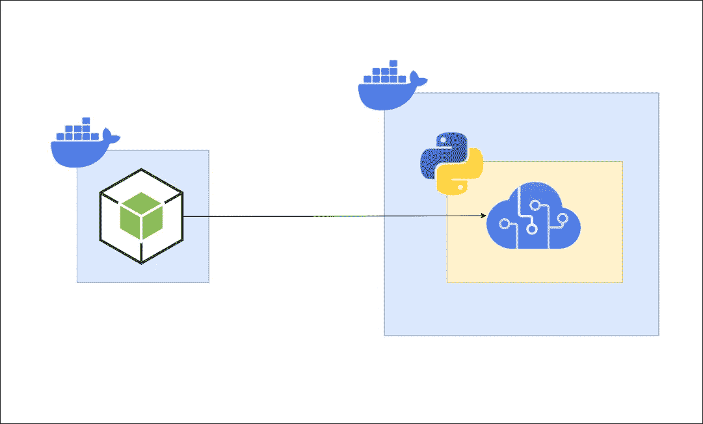
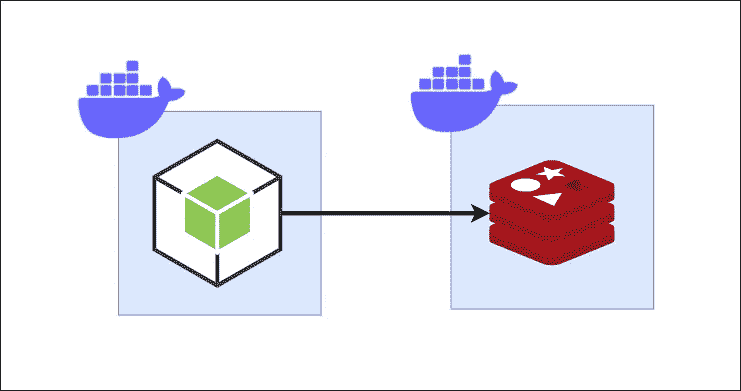

# 为生产中的 ML 模型提供服务

> 原文：<https://blog.devgenius.io/redisai-for-serving-ml-models-in-production-ed450143ec19?source=collection_archive---------0----------------------->



# 我们在建造什么？

我们正在构建一个用户可以安装的 chrome 扩展，当他们右键单击时，他们会看到一个按钮，上面写着“这是什么？”。当用户点击这个的时候，他们会得到一个通知，告诉用户图片里有什么(*有用吗？没有。但是我想写博客，而 AI 似乎是一个不错的点击诱饵！*)。

这可能看起来很多，尤其是如果你是 ML 或 MLOps 的新手，所以让我们从零开始。让我们从头开始学习，什么是 ML 模型？？

# 模特以及如何为她们服务

来说说 AI 模型吧！别担心，我不指望你了解 ML 模型，所以让我给你简单介绍一下它们是什么和它们做什么。

ML 模型的工作有点像黑盒。他们接受输入并给出预测...真的就是这样！


ML 模型可能

不，不是真的。许多人非常努力地构建这些模型，以及如何分析和操作它们等等。但是现在，我们不关心这些。我们需要学习的所有*就是 ML 模型接受输入并给出输出。例如，对于操作自动驾驶汽车的人工智能模型，输入可以是其他汽车的位置、人的位置等。，输出可以是汽车应该转弯的地方。*



所以，我们学习了**ML 模型**做什么，但是**他们在哪里**做这个？或者说，这种 ML 模式在哪里运行？这种计算发生在哪里？

他们肯定不能在客户端运行这个，因为这些模型可能是计算密集型的，我们可能希望自定义数据转换和管道来提高模型性能，或者我们可能只是希望对数据和模型有更多的控制。

进来的是*云*！这似乎是完美的，我们不需要托管昂贵的计算，我们不需要在客户端处理 ML 模型，云似乎具有无限的规模和数据容量！简而言之，云和 ML 看起来工作得很好！


好了，现在我们开始掌握窍门了。我们只需要在云上运行这些模型。用户给我们发送输入，我们运行 ML 模型，ML 模型给我们它的预测，我们把预测发送回用户。这叫做服务 ML 模型。

既然我们对需要做什么有了一些想法，让我们来看看如何去做吧！我们来讨论一下建筑。

# 服务于模型的架构

## 将 ML 模型推理集成到您的应用程序中

让我们先来看一个直观的方法。让我们构建一个简单的 REST API，并在同一个代码库中将 ML 模型作为一个模块运行。

所以，这里真的没有任何高层次的系统设计架构。只需编写您的 REST API，并设计一个模块或类，将模型加载到内存中并为其服务。

至少可以说，这并不理想。这将我们的 ML 模型与我们的 REST API 服务紧密耦合在一起。因为这两个是在同一个进程中运行的，所以我们不能单独扩展它们。事实上，我们也不能为我们的 ML 模型和 API 使用不同的编程语言！如果我们需要运行多个 ML 模型，可能一个非常受欢迎的 ML 模型(像对象识别模型)被很多客户使用，而一个不太受欢迎的模型呢？我们如何单独扩展它们？我们会在同一台机器上运行所有的 ML 模型吗？

让我们看看如何解决这个问题。

## 将 API 作为独立微服务的容器化 ML 模型



如果我们有一个运行在 docker 容器中的 REST API，并且 ML 模型作为一个单独的 docker 容器运行，那会怎么样呢？托管 ML 模型的独立 docker 容器公开了一个简单的 API，可用于连接我们的 REST API。

这有很多好处，我们可以独立地扩展这些容器，也可以在单独的机器上运行这些容器。我们现在甚至可以更容易地支持多个 ML 模型。我们可以为不同类型的模型提供不同的服务，我们甚至不需要为 ML 模型和 REST API 使用相同的编程语言。以及微服务的所有其他优势！可能性是无限的。

再加上 Pub/Sub(比如 Kafka、RabbitMQ)和良好的容器编排(比如 ECS、EKS)，你就真的有东西了！

## 使用 ML 模型服务解决方案

以上是很好的解决方案…但是我仍然看到一个问题。只是… *很多工作*。

如果我正在编写这些代码，我需要编写大量代码来容器化那些 ML 模型，并且不要认为 ML 模型是那些简单的黑盒。事实上，引擎盖下的 ML 模型是*复杂的野兽*，它们有不同的引擎(或后端。它们取决于 ML 模型是如何构建的)并且引擎具有不同的兼容性要求。一些 ML 模型在 GPU 上工作得更好，而一些在 CPU 上工作得更好。人工智能模型的性能也是一个非常重要的属性(想象一下实时模型的延迟，如 Messenger/Instagram 用于给视频通话添加效果)，所以我们需要确保我们可以尽可能多地提高性能。还有很多其他我需要学习和关心的微妙之处。

所有这些都是大量的工作。所有这些都需要大量的代码。所有这些都需要大量的测试。

所以，让我们尝试一些不同的东西。不可能只有我们面临这个问题，对吧？事实上，我们不是！

我们已经有很多现成的解决方案来服务 ML 模型，所以让我们使用其中的一个——redsai！

RedisAI 只是取代了我们最初的定制 ML 服务解决方案。我们只是将我们的 REST API 连接到 Redis AI。它将为我们提供 API 来加载 ML 模型并使用它们进行预测。



# 雷迪赛

## 快速介绍！

让我们快速介绍一下 RedisAI。RedisAI 只是构建在 Redis 之上的一个模块。它支持两种数据类型，模型和张量。张量只是数组的一个花哨的词(不，不是真的，但我不能在这篇文章中解释它们是什么，所以暂时假设这一点)，模型只是指 ML 模型！

我们需要做的就是加载 RedisAI，加载模型(RedisAI 运行许多不同类型的 ML 模型),然后我们就可以为请求提供服务了。当用户发送一个请求时，我们用用户的输入创建一个张量，我们把这个输入输入到 Redis 中运行的 ML 模型，RedisAI 给我们输出。不要担心，我们会很快进入代码，但如果你不耐烦，检查一下[这里](https://github.com/Sanil2108/redisai)。我还添加了大量的注释，以便于理解和阅读。

## Docker 撰写

我使用 Docker compose 来加载 RedisAI 和 REST API。这是 docker-compose.yml 文件的样子

这里唯一不寻常的是

```
command: --loadmodule /usr/lib/redis/modules/redisai.so ONNX redisai_onnxruntime/redisai_onnxruntime.so
```

正如我之前解释的，RedisAI 支持 ML 模型的多个后端。同样，ML 模型的后端就像编程的库或框架。本质上，所有的 ML 模型都有一个特定的后端，RedisAI 需要知道它应该加载哪个后端。例如，我使用的模型是 ONNX 模型，所以这里的命令只是告诉 Redis 加载模块来运行 ONNX 模型。

休息是相当简单的。只需运行 RedisAI，只需运行 REST API。

## 加载 ML 模型

我正在使用我从[这里](https://github.com/onnx/models/tree/master/vision/classification/mobilenet)得到的 ML 模型。

在我能使用它之前，我需要装载它。为此，我可以简单地运行人工智能。模型存储命令。看起来是这样的-

```
redis-cli -x AI.MODELSTORE mobilenet ONNX CPU BLOB < mobilenetv2-7.onnx
```

这个命令只是说从*mobilenetv 2–7 . ONNX*文件中加载一个运行有 *CPU* 的 *ONNX* 模型，并将这个模型命名为*“mobilenet”*。现在，让我们看看如何在 REST API 中使用它！

## REST API

我构建了一个简单的 REST API，它将请求中图像的 URL 作为用户的输入。

流程很简单，我们获取图像 URL，从 URL 下载图像，进行一些预处理(这意味着我们对图像进行一些转换，以针对我们的 ML 模型进行优化，但本质上这是相同的图像，只是对它进行了一些小的改进。出于好奇，请查看这里的[是什么](https://github.com/Sanil2108/redisai/blob/master/rest-api/ml_driver.py#L31)，计算所有不同对象的分数，并将前三个预测返回给用户。

这是完成这项工作的代码—

看起来很简单，对吧？

有几个特别的领域我会快速浏览一下，它们是 RedisAI 特有的。如果你想对代码有更深入的理解，我真的推荐你去 Github 上看看代码。我试图让它干净简单，并添加了大量的评论来帮助你。

回到代码，让我们看看代码中更关键的部分

```
scores = get_redis_driver_instance().predict(preprocessed_image)
```

这将调用 Redis 驱动程序中的一个函数，该函数获取预处理图像(同样，预处理图像只是经过一些微小调整的原始图像)并实际运行模型，同时返回预测得分。这些是模型给它分类的不同标签的分数。所以它简单地包含了模型认为图像是汽车的程度，以及模型认为图像是猫或…的程度。诸如此类。

这是这个函数的样子-

希望代码是不言自明的，但它只是从图像中创建一个张量，指示 RedisAI 使用模型 *mobilenet* 对输入张量进行预测，并将输出存储在输出张量中。然后，它获取输出张量的值，并将其发送回来。

在 ml_driver.py 中还有一些其他有趣的函数，但它们与我们理解 RedisAI 的关系不够密切，所以我不会在这里介绍它们。但是，如果你想了解更多，你知道去哪里找。

而且，其实就是这样！这就是建立一个可以服务于 ML 模型的系统所需要的全部。

# 结论

不要误解我，这绝不是一个生产就绪的系统。一个生产就绪的系统将需要更多的工作，以构建协调来扩展这些服务，进行测试来确保与 ML 空间中大量标准的兼容性，以经济高效的方式运行，等等。

我最近才发现 RedisAI，觉得应该尝试一下，看看它是如何工作的。它让我非常兴奋的原因是，不久前我实际上使用第二种架构构建了一个服务于 ML 模型的解决方案……它看起来确实有效。但是我不得不做*很多工作*来让它工作，并且我增加了 10 倍多的工作到我的待办事项中。另一方面，RedisAI 似乎可以处理一堆我必须手动完成的事情。

所以，不，这个系统肯定不是一个可以服务于大量现成 ML 模型的系统，但它绝对可以成为一个 ML 模型的灵感。