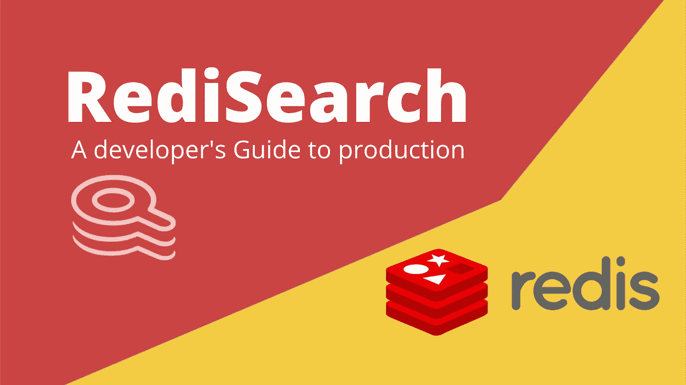
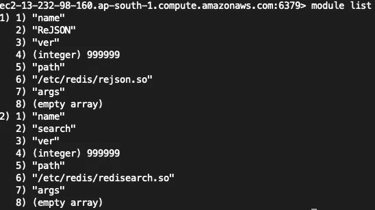
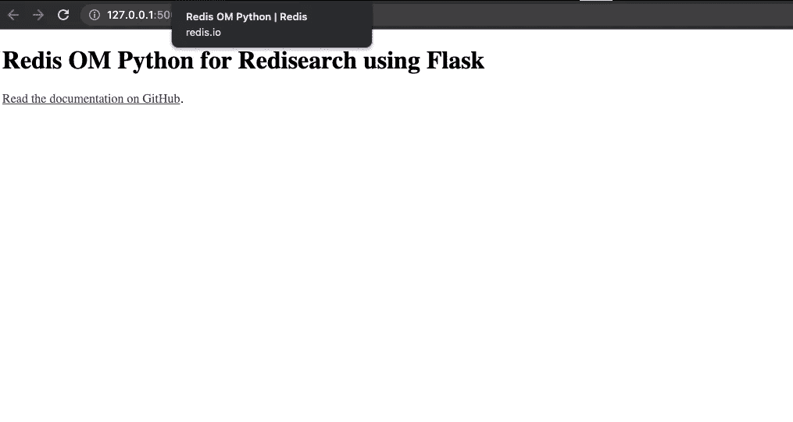
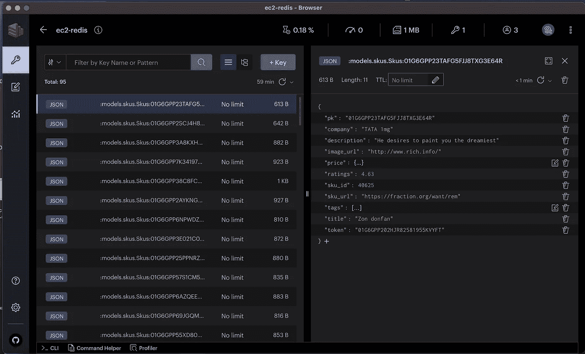

# 再研究——开发者生产指南

> 原文：<https://blog.devgenius.io/redisearch-e6aac3fed2d5?source=collection_archive---------6----------------------->

所以，你是一名开发人员，你来到这里是为了了解如何在你的生产应用程序中使用 RediSearch。目前，有一些资源可以帮助您熟悉 RediSearch( [一个 Redistack 产品](https://redis.io/docs/stack/))，但是关于如何在生产应用程序中部署和使用它，还没有太多的资源。

这篇文章的目的是让你的产品准备好重新搜索功能。本文的目标读者是 python 开发人员。然而，我还将讨论如何首先在生产就绪的 linux 环境中安装 RediSearch & RedisJSON 模块。开始了-

# 什么是再研究？

根据[*research 官方文件*](https://redis.io/docs/stack/search/#overview) *-*

> RediSearch 为 Redis 提供了二级索引、全文搜索和一种查询语言。这些功能支持多字段查询、聚合、精确短语匹配和文本查询数字过滤。

对开发者来说，这意味着你现在可以在 redis 上运行类似 SQL 的文本搜索等等。

# 装置

> 如果您使用的托管 redis 已经安装了推荐的模块，例如- Redis cloud，那么您可以跳过这一部分。

RediSearch 作为一个模块安装在 redis 部署中。要使用 RediSearch 的一些高级功能，您还需要安装 RedisJSON。基本上有三种方法可以安装和使用它们。

1.  [**使用 Redis Cloud**](https://redis.io/docs/stack/search/quick_start/#redis-cloud) —提供完全免费的托管数据库，容量高达 30MB。已经包括推荐的模块，如 RediSearch、RedisJSON、RedisGraph、RedisTimeSeries 和 RedisBloom。玩一玩，让自己熟悉再搜索功能。
2.  [**与 docker 一起运行**](https://redis.io/docs/stack/search/quick_start/#running-with-docker) —如果您是 Docker 爱好者，并且想要将您的部署进行 Docker 化。
3.  [**建筑再研究从源头**](https://redis.io/docs/stack/search/quick_start/#building-and-running-from-source)——**首选生产方式** **应用方式**。因为这篇文章关注的是产品化，我们将会继续讨论这个问题。

## 从源代码构建重新搜索模块

首先，克隆 git repo(确保不要省略`--recursive`选项，以便正确地克隆子模块)

运行以上 4 个命令后，在位置`~/RediSearch/bin/linux-x64-release/search`应该有一个名为`redisearch.so`的文件

> 将文件`redisearch.so`移动到`/etc/redis` —这样做是为了防止 redis 服务器重启时出现权限被拒绝的错误

或者，你也可以从[这里](https://redis.com/redis-enterprise-software/download-center/modules/)下载预编译版本。

## 从源代码构建 RedisJSON 模块

克隆 repo 并安装一些必需的依赖项到`make`项目中。

运行以上 4 个命令后，您应该在位置`~/RedisJSON/bin/linux-x64-release`有一个名为`rejson.so`的文件

> 将文件`*rejson.so*`移动到`*/etc/redis*` —这样做是为了防止 redis 服务器重启期间出现权限被拒绝的错误

## 在 redis 中安装 RediSearch 和 RedisJSON 模块

一旦准备好了`redisearch.so` & `rejson.so`文件，就需要将它们加载到 redis 中。您应该已经部署了独立或集群模式的 redis。查看我以前的博客，了解如何创建 redis 集群。

有两种方法可以在 redis 部署中加载模块

1.  **在发出`redis-server`命令时使用 CLI 选项-** `--loadmodule`(**不建议生产**)

2.**使用** `**redis.conf**` **文件—** 在`/etc/redis/redis.conf`中添加以下行(**推荐生产**)

然后使用— `sudo service redis-server restart`重新启动服务

**如何检查模块是否加载成功？**

在 redis-cli 中运行`module list`。这将返回关于加载到服务器中的模块的信息。这是我的机器截图。我们可以看到两个模块都已成功加载。

> 您现在已经完成了安装。是时候写些代码了。

# 通过客户端库进行编程访问

所以，有很多 python 库我们可以用来和 redis 交互，其中一些是-

1.  `[**redis-py**](https://github.com/redis/redis-py)` —广泛使用。如果您在应用程序中使用 redis，那么您可能已经在使用这个库了。
2.  `[**redis-om**](https://github.com/redis/redis-om-python)` ( **推荐** ) —一个更新的库，它提供了高级抽象，使得使用现代 Python 应用程序在 Redis 中建模和查询数据变得容易。`redis-om`中的 OM 代表对象建模。

> 尽管如此，我推测阅读本文的大多数开发人员一定已经在应用程序中使用了`redis-py`，并且您可以继续为现有的工作负载这样做。然而，`redis-om`是超级棒的，在尝试使用 RediSearch 来充分发挥它的潜力时应该首选它。`redis-om`为您提供更大的灵活性和更简洁的代码。由于对象建模功能 **redis-om 被推荐用于生产**，因此我将展示如何在生产应用中使用它。

## **让我们从**开始吧`**redis-om**`

作为展示 redis-om 功能的一种方式，我开发了一个示例应用程序。参见此处—[https://github . com/iamvishalkhare/rede search-product-catalog](https://github.com/iamvishalkhare/redisearch-product-catalog)

> 这是一个应用程序，客户/客户可以注册自己获得一个令牌，然后使用该令牌，他们可以摄取他们的产品目录。然后，他们将公开一些搜索 API 来搜索他们的产品目录记录。如果你熟悉的话，它就像是一个非常基础的版本。

**数据建模**

这个应用程序处理 2 个实体/模型。`Customer`模型，具有以下 JSON 表示:

2.`Skus`模型，用以下 JSON 表示:

我们将让 Redis OM 处理惟一 id 的生成，这是通过使用 [ULIDs](https://github.com/ulid/spec) 来完成的。Redis OM 还将为我们处理创建惟一的 Redis 键名，以及从存储在 Redis Stack 数据库中的 JSON 文档中保存和检索实体。

**要求**

要运行此应用程序，您需要:

1.  [git](https://git-scm.com/download) —将回购克隆到您的机器上。
2.  [Python 3.7 以上](https://www.python.org/downloads/)。
3.  一个 [Redis 栈](https://redis.io)数据库，或者安装了 RediSearch 和 RedisJSON 模块的 Redis。您还可以[注册](https://redis.com/try-free/)一个免费的 30Mb Redis 企业云数据库——在创建您的云数据库时，一定要检查 Redis 堆栈选项。
4.  [curl](https://curl.se/) 或 [Postman](https://www.postman.com/) —向应用程序发送 HTTP 请求。我们将在本文中提供使用 curl 的例子。
5.  可选: [RedisInsight](https://redis.com/redis-enterprise/redis-insight/) ，Redis 的免费数据可视化和数据库管理工具。下载 RedisInsight 时，一定要选择 2.x 版或者使用 Redis Stack 自带的版本。

**获取源代码**

从 GitHub 克隆存储库:

**启动 Redis 堆栈数据库，或者配置您的 Redis 企业云凭据**

接下来，我们将启动并运行一个 Redis 堆栈数据库。您可以按照本文前面的说明安装 RediSearch 和 redisJSON 模块来设置自己的 Redis 集群，或者如果您使用的是 Redis Enterprise Cloud，您将需要数据库的主机名、端口号和密码。使用这些来设置`REDIS_OM_URL`环境变量，如下所示:

例如，如果您的 Redis 企业云数据库位于主机`enterprise.redis.com`的端口`9139`，并且您的密码是`5uper53cret`，那么您应该如下设置`REDIS_OM_URL`:

**创建一个 Python 虚拟环境并安装依赖关系**

创建 Python 虚拟环境，并安装项目依赖项

**启动烧瓶应用**

让我们以开发模式启动 Flask 应用程序，这样每当您在`app.py`中保存代码更改时，Flask 将为您重新启动服务器:

如果一切顺利，您应该会看到类似如下的输出:

您现在已经启动并运行了，并且准备好使用 Redis、RediSearch、RedisJSON 和 Redis OM for Python 对数据执行 CRUD 操作了！为了确保服务器正在运行，将您的浏览器指向`[http://127.0.0.1:5000/](http://127.0.0.1:5000/`),`，在那里您可以看到应用程序的基本主页:

**加载样本数据**

我已经提供了少量的样本数据。
客户数据在`data/customer_data`中，sku(库存单位)数据在`data/sku_data` (该数据是使用 [Fakejson](https://fakejson.com/) 生成的)
有一个端点可以将该数据加载到 redis 中。像这样使用它-

**问题？**
如果你已经设置了`REDIS_OM_URL`环境变量，并且在启动时出现如下代码错误:

然后你需要检查你在设置`REDIS_OM_URL`时使用了正确的主机名、端口、密码和格式。

如果 dataloader 端点无法将样本数据发送到应用程序中，请确保 Flask 应用程序在**运行 data loader 之前* *运行。

## 理解和操作数据

让我们在 Redis 中创建和操作一些数据模型的实例。这里我们将看看如何用 curl 调用 Flask API(您也可以使用 Postman)，代码如何工作，以及数据如何存储在 Redis 中。

**利用 Redis OM 建立客户&SKU 模型**

Redis OM 允许我们使用 Python 类对实体建模。我们的客户模型包含在文件`models/customer.py`中。以下是关于它如何工作的一些注意事项:

*   我们声明一个类`Customer`，它扩展了一个 Redis OM 类`JsonModel`。这告诉 Redis OM 我们希望将这些实体作为 JSON 文档存储在 Redis 中。
*   然后，我们在模型中声明每个字段，指定数据类型以及是否要对该字段进行索引。下面是`Customer`类的样子。`Optional`关键字告诉 Redis 这个字段可以在部分或全部记录中不存在。

我们的 SKU 模型包含在文件`models/Skus.py`中。以下是关于它如何工作的一些注意事项:

*   我们声明了一个类`Skus`，它也有一个名为`price`的嵌套对象
*   `Price`与其他字段的工作方式不同。注意，在模型的 JSON 表示中，价格是一个对象，而不是字符串或数字字段。在 Redis OM 中，这被建模为另一个类，它扩展了 Redis OM `EmbeddedJsonModel`类。
*   `EmbeddedJsonModel`只能在扩展了`JsonModel`的类中使用。假设类 SKU 扩展了`HashModel`而不是`JsonModel`，那么你就不能使用`EmbeddedJsonModel`了。

*   我们也可以像存储`tags`字段一样存储`lists`的值

*   对于`title`和`description`字段，我们不想索引字段的值，因为它是一个自由文本句子，而不是一个单词或数字。为此，我们将告诉 Redis OM，我们希望能够对值执行全文搜索:

*   我们为每个 SKU 记录存储一个字段`token`。此令牌唯一标识 SKU 记录所属的客户。

*   我们还可以为字段设置默认值。假设`title`应为“测试 SKU ”,除非另有说明:

**增加新客户**

`managers/customer_manager.py`中的函数`register_customer`处理 Redis 中新客户的创建。它需要一个符合客户模型模式的 JSON 对象。然后用该数据创建一个新的 Customer 对象并保存在 Redis 中的代码很简单:

这个功能也确保没有两个客户有相同的电子邮件 ID。

当创建一个新的客户实例时，Redis OM 为它分配一个惟一的 ULID 主键，我们可以用`.pk`来访问它。我们将其返回给调用者，以便他们知道他们刚刚创建的对象的 ID。

将对象持久化到 Redis 只是简单地对其调用`.save()`。

尝试一下…在服务器运行的情况下，使用 curl 添加一个新客户:

运行上面的 curl 命令将返回分配给新创建的客户的唯一 ULID ID。比如说-

我们现在将使用此令牌上传该客户的 sku 数据。

**添加 SKU 数据**

使用令牌上传 sku 数据。类似这样的-

**检查 Redis 中的数据**

让我们看看我们刚刚在 Redis 中保存了什么。使用 RedisInsight 或 redis-cli，连接到数据库并查看存储在键`:models.skus.Skus:01G6GPP23TAFG5FJJ8TXG3E64R`中的值。这在 Redis 中存储为 JSON 文档，因此如果使用 redis-cli，您将需要以下命令:

如果您正在使用 RedisInsight，当您单击密钥名称时，浏览器将为您呈现密钥值:

当在 Redis 中将数据存储为 JSON 时，我们可以更新和检索整个文档，或者只是部分文档。例如，要仅检索 sku 的标题和第一个标签，请使用以下命令(RedisInsight 用户应该使用内置的 redis-cli 来执行此操作):

有关用于在 Redis 中查询 JSON 文档的 JSON 路径语法的更多信息，请参见 [RedisJSON 文档](https://oss.redis.com/redisjson/path/)。

## 探索更多 API 和 redis-om 特性

**获取客户详细信息**
客户可以通过将他们的唯一令牌作为路径变量来查看他们的详细信息。类似这样的-

下面这段代码搜索给定令牌的`all`客户

**通过** `**sku_id**`
获取 sku 的详细信息给定作为路径变量传递的唯一的`token`和`sku_id`，客户可以请求先前获取的 SKU 记录

请注意我们如何`and`客户提供的条件`token`必须与记录中的内容相匹配。这将确保一定程度的安全性，因为顾客只能查看属于他们的那些 SKU 的详细信息。

**更新 SKU 的折扣价**
客户可以选择更新`discounted_price`字段。
这是一个补丁端点，请求有效负载应该包含唯一的客户端`token`、`sku_id`，其`discounted_price`必须被更新，以及折扣价格的新值

注意我们如何首先获得记录的`pk`(主键)，然后设置新值。

对`title`和`description`字段
进行全文搜索由于`title`和`description`字段`full_text_search=True`已设置，我们可以对这些字段进行全文搜索。
端点将接受令牌作为路径变量，搜索词作为查询参数。

请注意我们如何使用`OR`条件在两个不同的字段中进行搜索，即在`title`和`description`中。

**范围搜索—搜索** `**discounted_price**` **值在范围**
内的记录客户可以搜索`discounted_price`在范围内的 sku 记录。
端点接受`token`作为路径变量，接受`discounted_price`的`min`和`max`值作为查询参数。

我们使用标准和`&`操作来执行这个动作。

**稍微复杂的范围查询**
返回评级大于 min_rating 或者`discounted_price`大于 max_price 的记录。

我们使用 OR `|`结合 AND `&`操作来执行这个动作。
我们还可以根据字段对响应进行排序。(`ratings`本例中)

**搜索记录中的列表**
返回其标签字段包含作为查询参数传递的任何标签的所有记录

我们可以传递一个标签列表，下面这段代码将返回所有在`tag`列表中有这些值的记录

这里的`<<`符用来表示`in`或`contains`。

**使记录到期**
使记录到期，给定其`sku_id`的 ttl 秒
该端点接受`sku_id`到期和`ttl_in_sec`(记录到期后的时间)

我们使用`.expire()`函数来终止记录

使用`redis` -cli，您可以使用 Redis `expire`命令检查 sku 现在是否设置了 TTL:

这表明 Redis 将在 102 秒后使密钥过期。

每当您想要运行较低级别的 redis 命令时，您可以在您的模型类上使用`.db()`函数来获得底层的 redis-py 连接。更多详情，参见[再发行文档](https://redis-py.readthedocs.io/en/stable/)。

# 结论

redis-om 提供了对 redis 上现有 JSON 数据结构的全文搜索能力。我个人开发了一些基于搜索的应用程序，使用 Elasticsearch 来提高搜索能力。再搜索可以作为一个更快的缓存层介于两者之间。毕竟 redis 的表现比 Elasticsearch 更好更快。参见[基准测试:再研究与弹性研究](https://redis.com/blog/search-benchmarking-redisearch-vs-elasticsearch/)

另外，在我的下一篇文章中，我将会谈到`redis-om`的一些更好的特性，以及如何充分发挥再搜索的潜力。我将讨论诸如分页之类的主题，这在构建生产应用程序时是必不可少的。

# 参考

1.  [https://github . com/redis-developer/redis-om-python-flask-skeleton-App](https://github.com/redis-developer/redis-om-python-flask-skeleton-app)—我的应用建立在这个骨架应用之上
2.  [https://redis.io/docs/stack/search/](https://redis.io/docs/stack/search/)—再研究
3.  [https://redis.io/docs/stack/json/](https://redis.io/docs/stack/json/)—雷迪森
4.  [https://Redis . io/docs/stack/get-started/tutorials/stack-python/](https://redis.io/docs/stack/get-started/tutorials/stack-python/)—Redis OM python
5.  [https://redis . com/blog/Search-Benchmarking-rede Search-vs-elastic Search/](https://redis.com/blog/search-benchmarking-redisearch-vs-elasticsearch/)—搜索基准:RediSearch vs. Elasticsearch
6.  [https://fakejson.com/](https://fakejson.com/)—用于生成 SKU 数据的 FakeJSON。

*这篇文章是与 Redis 合作的。*