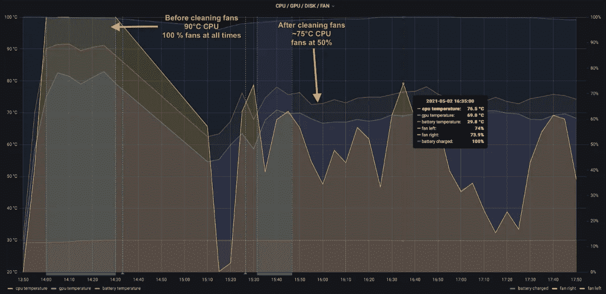
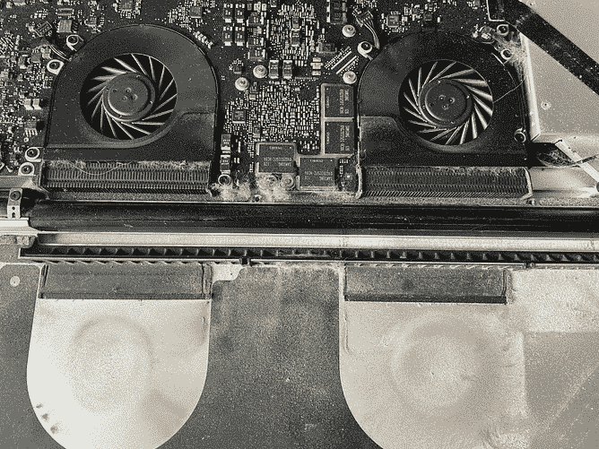
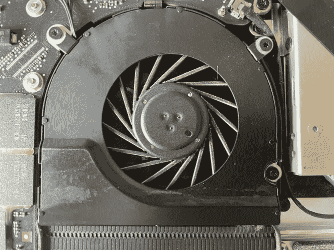
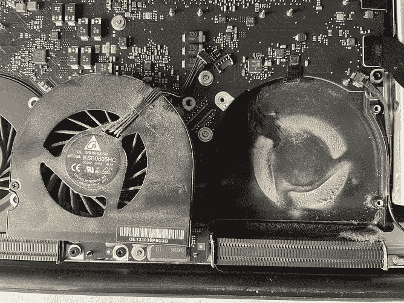

# 将风扇转速降低 50% —只需用吸尘器清扫笔记本电脑。

> 原文：<https://blog.devgenius.io/reduce-fan-speed-by-50-just-by-vacuuming-your-laptop-2e3d50b89541?source=collection_archive---------4----------------------->

害怕你的机器会因为听起来像飞机而起飞？想知道为什么你的 CPU 一直在 90°C/194°F 左右？

杰里米·帕金斯在 [Unsplash](https://unsplash.com/s/photos/vacuum-cleaner?utm_source=unsplash&utm_medium=referral&utm_content=creditCopyText) 上的照片

# 我就知道！

我一直知道清理你的风扇会有帮助——这完全合乎逻辑。但我仍然被它对我的 MacBook Pro 的影响所淹没。在此之前，我清理了我的笔记本电脑，但现在是我第一次实际测量这些影响——我很惊讶。

## 一句警告

对我来说，作为一个有技术背景的人，很容易做到。这显然不适合所有人。但是，如果你有一个懂一点技术知识的朋友或同事，他们肯定可以帮助你，并向你展示它背后没有魔法。

如果你相信自己会小心，你也能做到！只有几个非常重要的注意点:

*   永远不要试图用任何液体清洁你的笔记本电脑内部！
*   在触摸任何东西之前，一定要确保你已经静电放电了！
*   如果你担心你的保修，首先检查是否打开你的机器背面无效保修。
*   给风扇抽真空时，如果可能的话，不要让它们转动或先拔掉电源插头。当高速旋转时，它们会像发电机一样损坏你的冲浪板。

**澄清一下**:我不会对你清洗机器造成的任何损坏承担任何责任。这是你的决定，因此也是你的责任。

# 效果

*   CPU 温度下降了 15℃！
*   GPU 温度下降了 10°C！
*   粉丝把速度降到 50%！

清洁风扇前后的 MBP 17 英寸(蓝色区域)的指标。

# 防尘证明

这些照片显示了在 **清洁**之前**内部看起来有多脏。有些人可能会认为我住在垃圾箱里是为了让这么多灰尘进入我的机器。我可以向你保证——当你使用你的机器足够长的时间，无论你在哪里使用它，它看起来都是一样的(可能除了无尘洁净室)。**

这些图像也清楚地显示了风扇后面的散热片有多堵塞——这是问题的主要原因。如果空气不能流通，风扇必须更用力(即变得更大声)并且冷却效果显著降低。

图片来自 2011 年的 MacBook Pro 17 英寸。

图表中显示的差异是清洗前后运行《我的世界》。所以负荷应该不相上下。我现在可以管理《我的世界》，但球迷仍然只有 50%，这有很大的不同。

# 如何监控您的机器

我之前的一些用`telegraf`、`influxdb`、`grafana`监控你机器的文章，产生了上面的图。

 [## 使用 TIG 监控您的机器

### TIG = Telegraf，InfluxDB，Grafana。受众:开发人员、书呆子、devops 初学者…

blog.devgenius.io](/monitoring-your-machine-s-with-tig-a9ef39cd0eec)  [## 在 macOS 上使用 Telegraf 监控温度

### 在 macOS 上使用 Telegraf 可以监控的内容:适用于书呆子、开发人员和 devops 初学者…

blog.devgenius.io](/monitor-temperatures-with-telegraf-on-macos-4a0eae03549d)  [## 在 Windows 上使用 Telegraf 监控 Nvidia GPU

### Telegraf 通过 SMI 收集 Nvidia 指标并在 Grafana 中显示的 5 分钟设置:适用于书呆子、开发人员和…

medium.com](https://medium.com/the-innovation/monitor-nvidia-gpu-with-telegraf-on-windows-5acb73c91d20) 

## 感谢您的阅读！

如果你喜欢我的写作，请考虑支持我，以达到更广泛的受众。

 [## 网上心理咨询

### 我所在的所有网站的一个简单的“登陆页”。

drpsychick.org](https://drpsychick.org/drpsychick-on-the-web-a9ccfb0df17e)