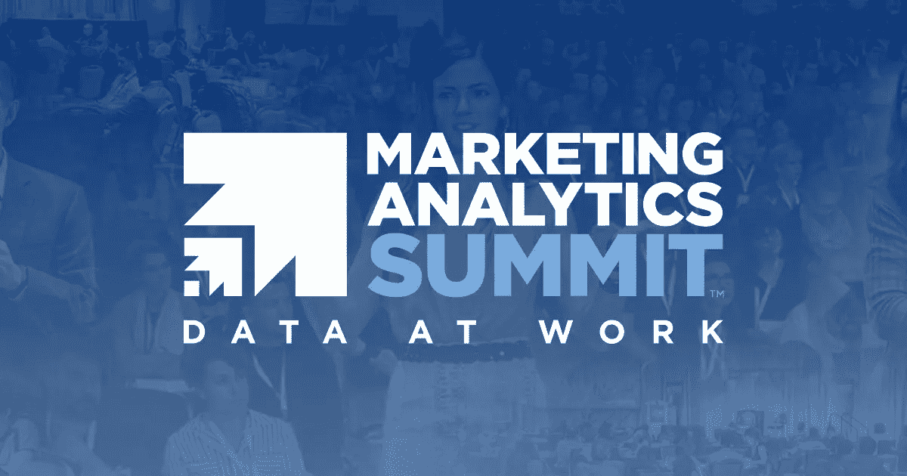

# 降低认知负荷、人工智能和成功的全渠道归因计划

> 原文：<https://blog.devgenius.io/reducing-cognitive-load-ai-and-successful-omni-channel-attribution-programs-b99c3d868e13?source=collection_archive---------21----------------------->

## 换句话说，你在首届虚拟营销分析峰会上错过了什么

营销分析峰会

## 2020 年集锦来自基申·贾扬蒂、蒂姆·威尔逊和肯特·刘易斯

# 为什么构建端到端的人工智能比模型更重要

Anthem 数据科学负责人 Kishen Jayanti 称，人工智能将机器学习与数据连接和真实决策相结合。他解释说，人工智能产品的生命周期包括四个阶段——构思、ML 构建、工程和学习。

Jayanti 告诉我们不断地问自己，“值得努力吗？”以及“预期投资回报率是多少？”

考虑您的解决方案的更大影响。你应该一直测试和实验。参加考试并从中学习。此外，当谈到机器学习构建时，可扩展性是您最好的朋友。Jayanti 建议您考虑您的解决方案是否可以用于解决多个问题。

> “从小处着手，逐步扩大”

Jayanti 为我们如何利用一个问题的解决方案来解决下一个问题提供了很好的见解。他告诉我们不要寻找答案，而是寻找可以扩展的解决方案，专注于你正在创造的产品，而不是专注于单个项目。最后，他强调了用你的发现从小处着手并扩大规模的重要性。

# 减少图表和表格中的认知负荷

Tim Wilson 的演讲，*数据可视化和神经科学:为什么它对分析师很重要*提供了关于我们如何通过演示中使用的视觉材料来减少认知负荷的深刻见解。

威尔逊演讲中我最喜欢的部分是“饼图是邪恶的”这一概念威尔逊滑稽地解释说，当查看饼图时，我们的观众会花不必要的时间试图识别他们应该从数据中提取什么信息，而不是理解它的意义。

这是由于观看者的认知负荷量饼状图和类似的甜甜圈图。在阅读图例的同时，很难在头脑中处理弧线和切片的差异。观看者的目光会在两者之间弹跳，结果是缺乏理解力。

数据可视化是巨大的，但是你选择如何展示你的发现也同样重要。战略数据可视化技术可以有效地减少理解你的发现所用的脑力。

威尔逊建议加入色彩以增强冲击力。例如，当关注条形图时，对每个类别使用灰色，对你所关注的类别使用单一强调色。为了在大量的数字表格中突出关键发现，使用热图。这种策略可以把注意力吸引到最重要的结果上。

*   比较指标时并排放置条形图。
*   迷你图可以显示文本大小的变化。
*   如果你想显示变化，使用斜率图。

为了更深入地了解这个话题，Wilson 建议阅读 Cole Nussbaumer Knaflic 的[Story Telling with Data:A Data Visualization Guide for Business Professionals](https://www.amazon.com/Storytelling-Data-Visualization-Business-Professionals/dp/1119002257/ref=pd_bxgy_img_2/147-3931487-3561023?_encoding=UTF8&pd_rd_i=1119002257&pd_rd_r=ab1d60c9-c328-4a89-81c4-220683de033a&pd_rd_w=4il0r&pd_rd_wg=6fSrw&pf_rd_p=4e3f7fc3-00c8-46a6-a4db-8457e6319578&pf_rd_r=P1HQ6W2Q3DEN3KZ53ZBN&psc=1&refRID=P1HQ6W2Q3DEN3KZ53ZBN)。

# 建立一个成功的全渠道归因计划— Kent Lewis

在 Kent Lewis 的演讲中，我们看到了以消费者为中心的营销观点。作为疫情的结果，Kent Lewis 告诉我们聊天机器人的重要性正在上升，虚拟和在线渠道也在增加。

目前成功采用全渠道的品牌包括 REI、美国银行、星巴克，甚至迪士尼，该公司在公园使用 RFID 手环就证明了这一点。

Lewis 告诉我们，成功的全渠道归因计划最重要的一个方面是公司在整个客户旅程中减少摩擦的能力。想一想你可以用来提供最佳整体体验的不同渠道。渠道可以包括电子邮件、社交媒体，甚至公司网站。

> “了解你的客户。”

专注于深入了解主要里程碑，并不断寻找新的机会，使客户之旅无缝衔接。渠道间的整合是关键。

## Lewis 提供了建立成功项目的五个步骤:

1.  **衡量。**始终跟踪您的数据，并利用它来识别新趋势。Lewis 建议为 T4 的所有数据创建一个存储库。不衡量你的数据，你无法做出基于数据的决策。
2.  **细分市场。** Lewis 告诉我们，我们应该始终考虑每个接触点背后的背景，此外，我们应该为每个细分市场创建定制内容。
3.  **创造。**你需要始终如一地提供引人注目的内容。这一步的诀窍是移情。你的客户需要什么，你如何满足他们？
4.  **听。从你的数据中学习，并乐于适应。你的发现可以告诉你哪些接触点有效，哪些无效。一旦确定，你应该把时间集中在*做*工作的接触点上。为了获得最佳效果，Lewis 说要监控所有渠道和部门的反馈。**
5.  **展开。不要限制自己，总是在团队之外寻找新的合作方式。一个全新的视角可以让一切变得不同，所以试着打破常规，跳出“营销框框”去思考**