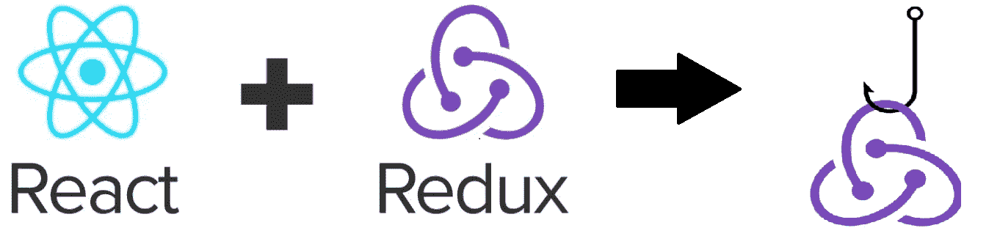
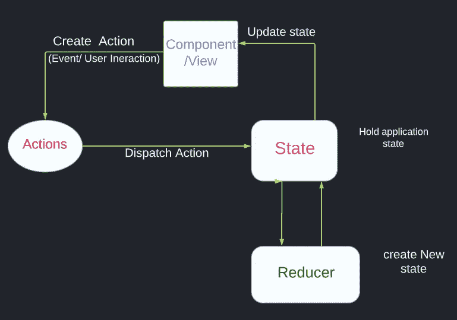
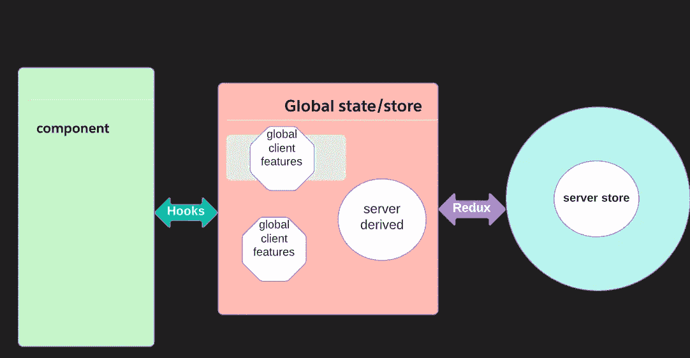
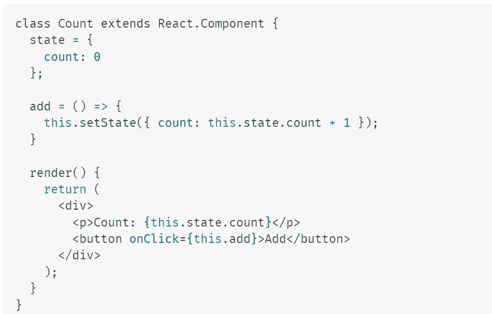
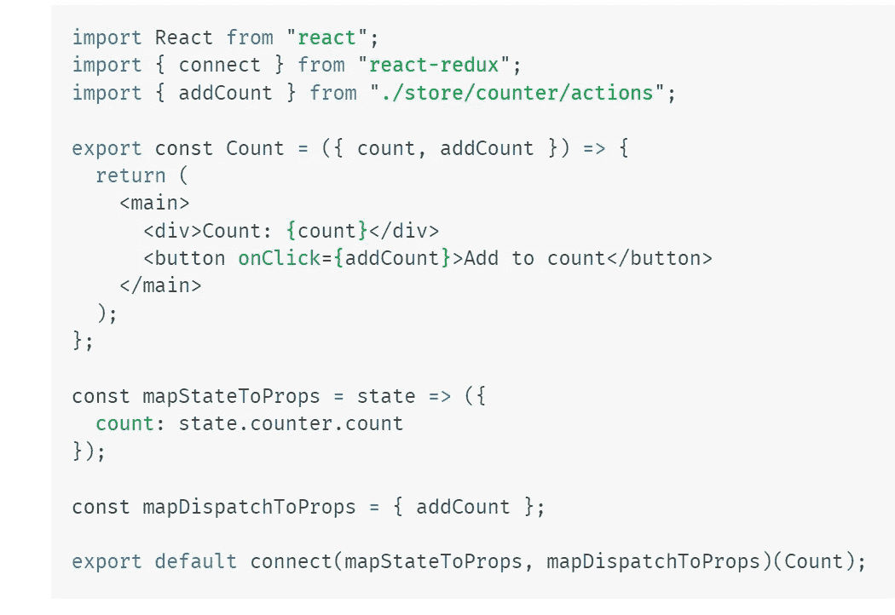
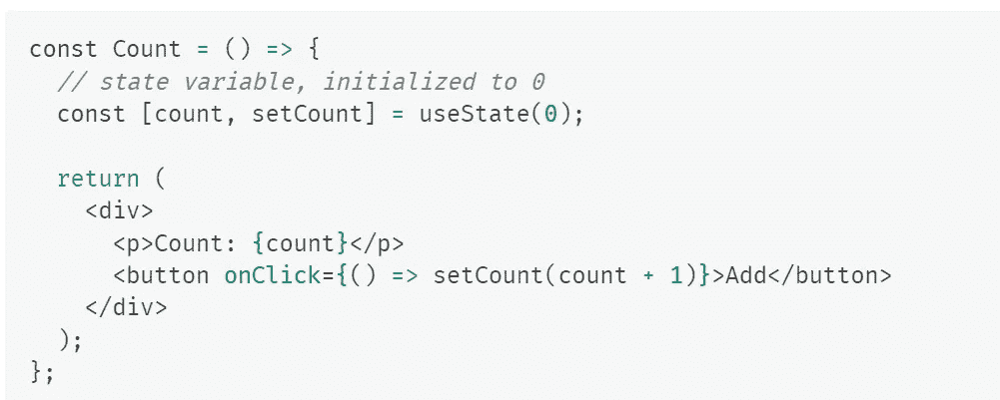
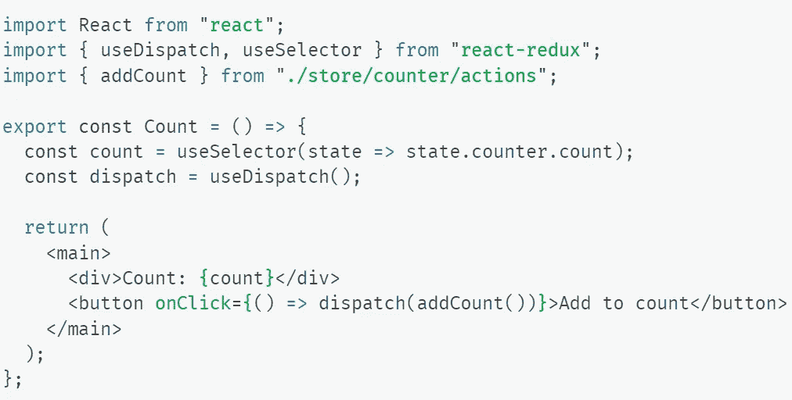

# 带挂钩的 REDUX

> 原文：<https://blog.devgenius.io/redux-with-hooks-c5117d5a9389?source=collection_archive---------6----------------------->

图:反应+还原

首先要理解 redux 和钩子，我们必须知道为什么 REDUX，钩子会在 react-JS 中出现，以便让我们理解它们:

## REDUX:

edux 是由 Dan Abramov 和 Andrew Clark 在 2015 年创建的，作为管理和提供整个 React 应用程序状态的解决方案。Redux 创建一个名为 Store 的全局状态，并允许您将组件连接到 Store 以访问全局状态。

*   Redux 有助于防止 props 钻取，并使跨许多组件的状态管理更加容易。

## 使用 React-Redux 时，您需要了解 3 件事情:

Redux 由**动作**、**减速器**、**状态**、**存储**组成。每样东西都有特定的任务。

*   **动作**:动作是应该有两个属性的对象。一个描述动作的类型，第二个描述状态的变化。
*   **Reducers** :这些是纯函数，它们执行动作和应用程序的先前状态。Reducer 的工作是将新状态返回给应用程序。
*   **状态:** *状态*一个组件是一个对象，它保存了一些在组件的生命周期中可能发生变化的信息。
*   存储:它只是管理应用程序的状态。它将**动作**和**减速器**集合在一起。它保存并改变整个应用程序的状态。整个应用程序只有一个存储。

> *在 redux store 中将状态存储为集中格式，以便我们可以在整个应用程序的任何地方访问它

反应还原的流程

## 挂钩:

钩子是 React 16.8 的新增功能。它们允许您使用状态和其他 React 特性，而无需编写类。钩子是 **JavaScript 函数**，但是使用时需要遵循两条规则。

**规则**中的**挂钩**:

1.我们只能在函数组件中使用 React 钩子。

2.只调用顶层的钩子。

以下是 React 挂钩:

*   使用状态
*   使用效果
*   使用上下文
*   使用回拨
*   使用备忘录
*   使用参考
*   使用减速器
*   定制挂钩

> react 挂钩的主要好处是写**更少**，做**更多&有状态逻辑的可重用性。**

现在我们对 redux 和 Hooks 有了一个基本的了解，让我们一起来看看这个叫做 **Redux 与 Hooks 的组合。**

Redux 中带钩子的经典状态管理

# 如何使用带有钩子的 redux:

*React Redux 现在包括了其* ***使用选择器()*** *和* ***使用分派()钩子*** *可以用来代替* ***连接*** *。*

**使用选择器**类似于将地图状态连接到道具。您传递给它一个函数，该函数接受 Redux 存储状态并返回您感兴趣的状态片段。

**使用分派**代替了连接地图分派到道具，但是重量更轻。它所做的只是返回你商店的分派方法，这样你就可以[手动分派行动](https://github.com/reduxjs/react-redux/issues/1252#issuecomment-488160930)。我喜欢这种变化，因为绑定(连接)动作创建者可能会让新人对 React-Redux 感到有点困惑。

## 通过连接恢复:

一个类组件使用 ***connect()*** 方法连接 redux 存储。

React 中的示例类组件。

**connect()** 函数将一个 React 类组件连接到一个 Redux 存储。它向其连接的组件提供它需要的来自存储的数据片段，以及它可以用来向存储分派动作的函数。

使用`connect`:

## 带挂钩的 Redux:

** Redux 使用不变性来简化应用开发和逻辑。通过在状态中的所有项目上强制不变性。*

反应中的样品功能成分。

## `useSelector( ) :`

const result: any = useSelector(选择器:Function，equalityFn？:Function)
允许您使用选择器功能从 Redux 存储状态中提取数据。

## `useDispatch( ) :`

const dispatch = use dispatch()
这个钩子从 Redux 存储中返回对调度函数的引用。您可以根据需要使用它来调度操作。

现在，用新的 React Redux 钩子代替了`connect`:

## 结论:

*   Redux 允许用户将应用程序的状态管理到一个集中的存储中，并使应用程序中的更改更加可预测和可跟踪。
*   钩子使得 react 更好，因为你有更简单的代码来更快更有效地实现类似的功能。不用写类也能反应状态和生命周期方法。
*   使用 Redux 挂钩的主要好处是它们在概念上比 connect 简单。