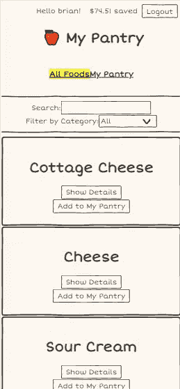

# 重构:与条件呈现作斗争

> 原文：<https://blog.devgenius.io/refactor-struggling-with-conditional-rendering-2cf7d366c6b4?source=collection_archive---------9----------------------->

如果你读过我的一些帖子，你会知道我建了我的储藏室，一个让你的食物保持新鲜的应用程序！如果你还没有读过，欢迎！你可以在这里找到那些帖子[，在这里](https://medium.com/@bidiaz101/how-i-built-my-pantry-an-app-to-keep-those-veggies-fresh-bd0a46e818f8)找到[。](https://medium.com/@bidiaz101/just-one-more-feature-build-from-front-end-to-back-8f1c51fe7076)

第二个故事是关于我添加的编辑功能。太牛逼了。用户单击一个按钮，表单出现在卡片中，如下所示:

让我们将其与网站的另一部分进行比较。具体来说，就是可以向页面添加食物的页面。

看起来不错，对吧？当我建造它的时候，我想给我的朋友和家人看看。我们在芝士蛋糕工厂的时候我不会拿出我的笔记本电脑。所以我让它有反应。我们去看看。

向 Chrome DevTools 大喊

到目前为止一切顺利。我看不出有什么问题。也许我反应过度了。我可能只需要—

力量

好吧，那看起来确实很狭窄。表格也被切掉了，所以在填写你的信息时，用户可能不得不反复左右滚动来查看食物信息。不太好。

为了做得更好，我想让所有食物页面上的卡片有一个表格出现在卡片内部，而不是在旁边，就像我在新功能中做的那样。

如果你想知道我什么时候可以进行条件渲染，我想感谢你的耐心，并奖励你标题所承诺的内容。看看下面的一些卡片。

要添加的食物

添加的食物

如果我告诉你它们是同一种成分，你会相信吗？是真的！所有这些都是通过条件渲染的魔力完成的。

虽然条件渲染非常有用，但它在这里可能已经发挥到了极致。这些卡片的不同之处多于相同之处。而这只是他们的表象！如果您考虑一下它们的行为方式，一个发出 post 请求，而另一个发出补丁和删除，那么它们就更加不同了。是时候将这个组件一分为二了，这样可以更容易地在卡片中添加表单。希望我不要太纠结。

当我写自己的代码时

首先，让我们制作新组件。姑且称之为“PantryCard”。这将是我们移动所有代码来创建用户添加到他们的餐具室的卡片的地方。

当我创建新组件时，我对自己说，“哈哈，这就像分手一样”。事情并不是这样开始的。所有的食物卡和餐巾纸都相处得很好，有许多共同之处。他们自然地分开了，他们的角色变了，现在他们已经不知道对方是谁了。现在，他们必须理清他们的生活，决定什么东西属于谁，谁养这条狗，我肯定买了那台电视—

我的观点是，我必须决定哪个组件需要什么道具、功能、状态等。我可以用一个道具食物卡已经决定了什么去哪里。

我让食物卡接受了一个叫做“inPantry”的道具。InPantry 是一个布尔值，默认情况下为 false。当一个名为 MyPantry 的组件呈现用户的餐具室物品时，它会将它们呈现为食物卡，并将 true 作为 inPantry 道具传入。然后，我的食物卡中的 JSX 有了[三进制](https://developer.mozilla.org/en-US/docs/Web/JavaScript/Reference/Operators/Conditional_Operator)表达式，这些表达式使用输入布尔值来呈现正确的内容。

我可以查看 JSX，查看当 inPantry 为真时将呈现什么内容，并将其放入我的新组件中。

神圣的条件渲染，蝙蝠侠！还有，什么是 pantryContent？

又一个三元！当然了。

通过查看这个，我可以看到除了 JSX 之外，我的新卡还需要访问几个功能，包括 handleRemove 和 handleEaten。它还需要几个状态，包括 showDeets(细节)和 isEditing 以及它们的 setter 函数。

我还记下了在我的餐具室组件中渲染时传递到卡片中的道具，并将这些道具放入我的新组件中。

一旦我移动了所有的状态、函数和导入，就可以通过修改呈现的组件的名称来将其连接到我的父组件了。道具应该都一样。我导入我的组件，将名称从 FoodCard 改为 PantryCard，然后…

哎呀！我忘了我不再需要我的布尔运算了。再见道具！很有趣。

这还差不多！

外观和工作方式完全一样。正如所有重构者应该做的那样。这可能看起来虎头蛇尾，但现在在不影响另一个页面的情况下更改一个页面会容易得多。这可以是新的特性，性能调整，可读性的提高，你能想到的！

现在是非常令人满意的部分。清除旧组件中所有不必要的道具、功能和条件渲染。为了小心起见，不要删除组件仍然需要的任何东西，我将删除 ternaries 和它作为 PantryCard 时呈现的任何东西。然后，VS 代码将灰显任何未使用的变量、函数和导入。

结果是下面的 JSX。

干净多了！

代码要干净得多，JSX 实际上类似于组件的样子。

既然它们是分开的，那么在我的所有食物卡里添加那个表格就容易多了。我几乎忘记了为什么我要把这个组件分成两部分！

漂亮！

那就简单多了！我的应用在移动设备上看起来没那么拥挤。无论重构多么令人生畏，它都是值得的！