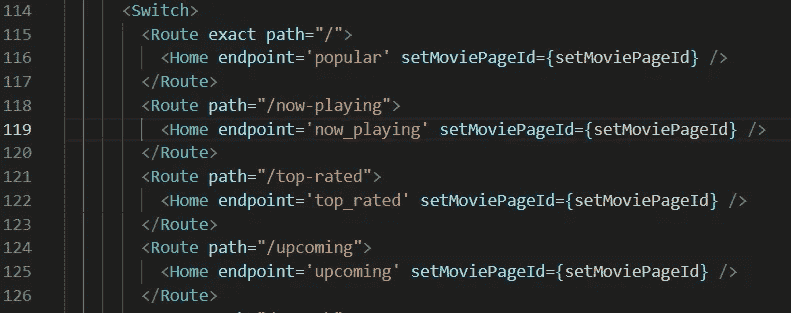
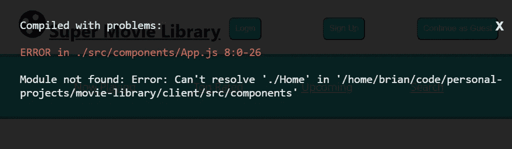
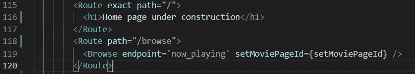
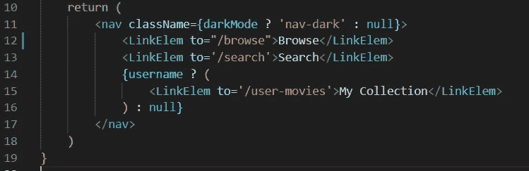
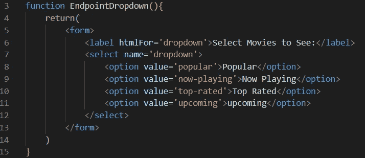
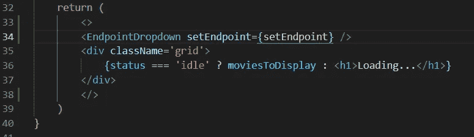
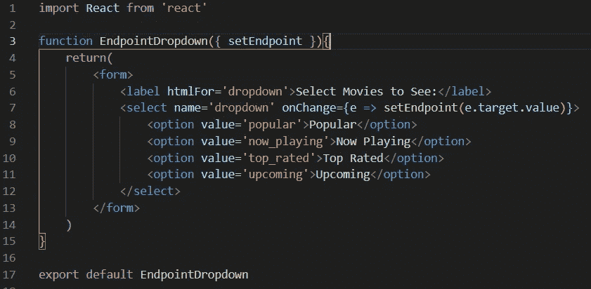

# 重构/去除那些顽固的代码味道

> 原文：<https://blog.devgenius.io/refactoring-getting-out-those-stubborn-code-smells-eedfcfe28551?source=collection_archive---------12----------------------->

我最近发表了一篇博文(你可以在这里[阅读](https://medium.com/@bidiaz101/where-was-redux-when-i-needed-it-d15de0f04b4e))关于我创建的一个名为超级电影库的应用程序。我很自豪它完全按照我的设想工作。现在是时候润色一下了。让我们回顾一下我的代码，看看我能找到什么。

哦，天啊，我看这不太干。而且它看起来不像一个主页应该表现的那样。每条路径都需要显示在导航栏上吗？我能让这个组件带有一个下拉菜单来进行我需要的更改吗？换句话说，这散发出浓重的代码味道。

最难闻的气味

让我们从简单的开始，将这个组件重命名为更合适的名称，比如“Browse”。我将组件和文件更改为新名称，我看到:

没事的深呼吸。这都是重构过程的一部分。等我完成的时候，这个网站会比以前更好。一旦我更新了父组件 App.js 中的导入，它就会正常工作。

对于新程序员来说，重构可能会令人生畏。你刚刚建立了这个应用程序，它完美地工作。为什么要改？尤其是当你在这个过程中打破它的时候。如果你不能让它像以前一样工作呢？

相信你的技能。你让这个应用程序工作。你与错误、错误和语法搏斗，做出了以前不存在的东西！你以前做过，你可以再做一次！我相信你！

好了，说够了。回到重构。接下来，我将删除通向同一零部件的多条管线，并用占位符替换主管线。

没那么臭了。

现在我已经改变了路线，我的导航栏中有死链接！Grr！

不过，没关系。我记得我的呼吸，我现在是一条平静的河…

这也是一个快速解决方案。只需删除死链接，并替换为我的新的活链接，导致“/浏览”。

现在，我有更多的路线和更多的功能空间！

现在，我仍然希望用户能够根据不同的标准进行浏览。我会给他们在页面上有一个下拉选项。当用户改变这一点时，它将改变在页面上显示哪些电影。完美的计划！

因为我们正在组件内部进行更改，所以我们不再需要这个端点作为道具，所以我删除了它。

它又断了。别担心！这不是我第一次参加竞技表演！得打破几个鸡蛋来做煎蛋卷！

让我们为这个下拉列表创建一个新组件。

看起来不错！

然后，我们将它导入到父组件 Browse 组件中，并将其包含在返回的 JSX 中。

厉害！

我们现在要在 Browse 组件中使“endpoint”变量有状态，并将 setter 函数传递给我们的孩子 EndpointDropdown。这是为了当端点改变时，EndpointDropdown 可以将信息传递给父节点。

完成了一个快速和肮脏的内嵌箭头功能

我们现在可以将 setEndpoint 函数作为道具，并将其提供给我们的组件。结果是代码工作起来一样，更直观，并且对于不熟悉该项目的开发人员来说更容易工作。成功！

我还需要做一些工作来制作一个新的主页，所以我还不会把我的改变上传到 Heroku，但是我的应用离最好的状态又近了一步！

我希望如果我能克服挑战，打破你的代码，让它变得更好，你也可以！