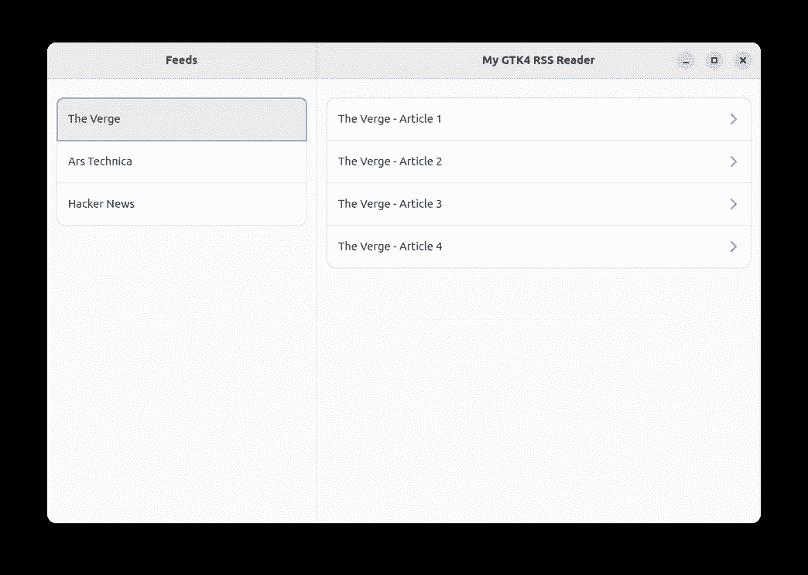
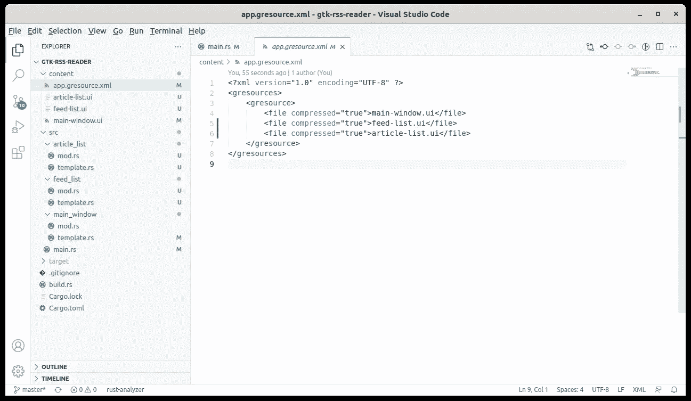

# 在 Rust 中重构 GTK4 UI 模板

> 原文：<https://blog.devgenius.io/refactoring-gtk4-ui-templates-in-rust-68cbef1a1778?source=collection_archive---------5----------------------->


梅尔·普尔在 [Unsplash](https://unsplash.com?utm_source=medium&utm_medium=referral) 上拍摄的照片

上次我们为我们的 [GTK RSS 阅读器](/initial-setup-for-a-gtk4-app-with-libadwaita-in-rust-using-vscode-b6f8c127a75e)应用[构建了一个响应 UI，但是我们把整个 UI 描述塞进了一个文件中。在本文中，我们将学习通过创建我们自己的 GTK 小部件来拆分单个 UI 文件。](/using-the-libadwaita-leaflet-widget-for-a-responsive-gtk4-ui-in-rust-73bbc2f4025)

通过从`main-window.ui`中提取两个窗口小部件，我们也将失去描述三个属性绑定的能力，因为它们现在将跨越主窗口和窗口小部件之间的边界。首先，我们将研究用代码重新建立这些属性绑定，在下一篇文章[中，我们将看到如何在 XML 模板中为支持绑定的小部件创建属性。和往常一样，你可以在](/adding-properties-to-custom-gtk4-widgets-in-rust-67d4bbed8b08) [github](https://github.com/raduzaharia-medium/gtk-rss-reader-widgets) 找到代码。

## FeedList 小部件



RSS 阅读器 GTK4 应用程序

第一个组件是左边的提要列表。先添加它的模板描述，`feed-list.ui`:

```
<?xml version="1.0" encoding="UTF-8"?>
<interface>
  <template class="FeedList" parent="GtkBox">
    <child>
      <object class="GtkBox">
        <property name="orientation">vertical</property>

        <child>
          <object class="AdwHeaderBar" id="header_bar">
            <property name="title-widget">
              <object class="AdwWindowTitle">
                <property name="title">Feeds</property>
              </object>
            </property>
          </object>
        </child>
        <child>
          <object class="GtkListBox">
            <property name="selection-mode">single</property
            <property name="hexpand">True</property>> <property name="margin-top">24</property>
            <property name="margin-bottom">24</property>
            <property name="margin-start">12</property>
            <property name="margin-end">12</property> <style>
              <class name="boxed-list"/>
            </style>

            <child>
              <object class="AdwActionRow">
                <property name="title">The Verge</property
              </object>
            </child>
            <child>
              <object class="AdwActionRow">
                <property name="title">Ars Technica</property
              </object>
            </child>
          </object>
        </child>
      </object>
    </child>
  </template>
</interface>
```

就像我们上次创建的`MainWindow`一样，`FeedList`模板有一个`class`和一个`parent`。`class`是我们新部件的名称:`FeedList`并且它的`parent`类应该是一个`GtkBox`。虽然不强制使用`parent`类型，但是 ide 更应该知道如何更好地处理小部件。

接下来，我们简单地复制窗口的左窗格:一个带有一个`HeaderBar`和一个`ListBox`的`Box`。但是还缺少一些东西:`Leaflet`和`HeaderBar`之间的`folded`属性绑定。如果窗口很窄，我们应该显示关闭窗口按钮。缺少绑定，因为我们的`FeedList`小部件没有定义属性。我们将在下一篇文章中看到如何做到这一点。现在，我们将移动代码中的绑定，稍后我们会看到。

正如我们在之前的文章中为`MainWindow`所做的那样，模板必须加载到 Rust 模块中。所以我们创建了一个`feed_list`文件夹，就像我们在 src 中有一个`main_window`文件夹一样，在那里我们为`FeedList`小部件放置了`mod.rs`和`template.rs`。在`mod.rs`中，我们简单地定义了小部件:

```
use self::template::FeedListTemplate;
use glib::wrapper;
use gtk4::{Accessible, Box, Buildable, ConstraintTarget, Orientable, Widget};wrapper! {
  pub struct FeedList(ObjectSubclass<FeedListTemplate>)
    @extends Widget, Box,
    @implements Accessible, Buildable, ConstraintTarget, Orientable;
}impl Default for FeedList {
  fn default() -> Self {
    Self::new()
  }
}impl FeedList {
  pub fn new() -> Self {
    glib::Object::new(&[])
      .expect("Failed to create an instance of FeedList")
  }
}
```

在`template.rs`中，我们将小部件链接到`feed-list.ui`:

```
use super::FeedList;
use glib::{
  object_subclass,
  subclass::{
    object::{ObjectImpl, ObjectImplExt},
    types::ObjectSubclass, InitializingObject,
  },
};
use gtk4::{
  prelude::InitializingWidgetExt,
  subclass::{
    prelude::{BoxImpl, TemplateChild, WidgetImpl},
    widget::{CompositeTemplate, WidgetClassSubclassExt},
  },
  Box, CompositeTemplate,
};
use libadwaita::HeaderBar;#[derive(CompositeTemplate, Default)]
#[template(resource = "/feed-list.ui")]
pub struct FeedListTemplate {
  #[template_child]
  pub header_bar: TemplateChild<HeaderBar>,
}#[object_subclass]
impl ObjectSubclass for FeedListTemplate {
  const NAME: &'static str = "FeedList";
  type Type = FeedList;
  type ParentType = Box;

  fn class_init(my_class: &mut Self::Class) {
    Self::bind_template(my_class);
  } fn instance_init(obj: &InitializingObject<Self>) {
    obj.init_template();
  }
}impl ObjectImpl for FeedListTemplate {
  fn constructed(&self, obj: &Self::Type) {
    self.parent_constructed(obj);
  }
}impl WidgetImpl for FeedListTemplate {}
impl BoxImpl for FeedListTemplate {}
```

我总是坚持`use`部分，因为把事情弄糟会让你陷入无休止的“我做错了什么？”会话。为右侧窗格编写小部件时使用了完全相同的代码，我们称之为`ArticleList`。代码在 [github](https://github.com/raduzaharia-medium/gtk-rss-reader-widgets) 上，我不会在这里复制它，因为它是完全相同的东西。注意我们是如何在`FeedListTemplate`结构中导出`header_bar`的。这将允许我们稍后在代码中设置属性绑定时与它进行交互。

## 更新的代码结构



显示更新的代码文件夹的 VSCode 屏幕截图

如果你想自己写代码而不是从 [github](https://github.com/raduzaharia-medium/gtk-rss-reader-widgets) 克隆，你可以在上面的截图中看到最终结果应该是什么样子。因为现在我们有三个小部件，你将有三个`ui`模板文件和三个 Rust 模块在它们各自的文件夹中:`article_list`、`feed_list`和`main_window`，我们之前有过。主窗口模板，`main-window.ui`会简单很多:

```
<?xml version="1.0" encoding="UTF-8"?>
<interface>
  <template class="MainWindow" parent="AdwApplicationWindow"
    <property name="width-request">800</property>
    <property name="height-request">500</property>
    <property name="title" translatable="yes">
      My GTK4 RSS Reader
    </property> <child>
      <object class="AdwLeaflet" id="leaflet">
        <property name="can-swipe-back">True</property>
        <child>
          <object class="FeedList" id="feed_list" />
        </child>
        <child>
          <object class="AdwLeafletPage">
            <property name="navigatable">False</property>
            <property name="child">
              <object class="GtkSeparator"/>
            </property>
          </object>
        </child>
        <child>
          <object class="ArticleList" id="article_list" />
        </child>
      </object>
    </child>
  </template>
</interface>
```

我们的`Leaflet`小部件将`FeedList`作为第一个子部件，将`ArticleList`作为最后一个子部件，而不是将所有内容都放在一个文件中。简单多了。分隔符代码太小，不值得为它创建一个小部件。由于我们现在有了更多的模板，资源定义文件`app.gresource.xml`也发生了变化:

```
<?xml version="1.0" encoding="UTF-8" ?>
<gresources>
  <gresource>
    <file compressed="true">main-window.ui</file>
    <file compressed="true">feed-list.ui</file>
    <file compressed="true">article-list.ui</file>
  </gresource>
</gresources>
```

还缺少一样东西。属性绑定。

## 代码中的属性绑定


由 [Max Saeling](https://unsplash.com/@maxsaeling?utm_source=medium&utm_medium=referral) 在 [Unsplash](https://unsplash.com?utm_source=medium&utm_medium=referral) 上拍摄

自从我们将 ui 代码从`main-window.ui`转移到`feed-list.ui`和`article-list.ui`后，我们遇到了一个小问题。主窗口无法知道子窗口`FeedList`和`ArticleList`的内部。以前，当所有代码都在`MainWindow`中时，这很容易:它知道正在发生的一切。但是现在`FeedList`隐藏了`MainWindow`需要知道的重要实现细节。

有三样东西`MainWindow`需要访问。当`Leaflet`被折叠时，来自`ArticleList`标题的返回按钮切换其可见性，以及来自`FeedList`和`ArticleList`的`HeaderBar`对象，因此当`Leaflet`再次被折叠时，它可以触发它们显示或隐藏窗口按钮。我们的`Leaflet`小部件的`folded`属性控制 UI 上的所有这三件事情。不幸的是，当我们在`FeedList`和`ArticleList`中隐藏了`HeaderBar`时，我们就失去了对它们的控制。那么我们如何恢复属性绑定呢？

现在我们将通过代码来解决这个问题。在下一篇文章中，我们将看到如何在模板 XML 文件中处理它，但是我觉得了解代码中绑定的工作方式是有好处的。首先，请记住我们是如何在小部件模板代码中发布我们需要使用的位的:

```
#[derive(CompositeTemplate, Default)]
#[template(resource = "/feed-list.ui")]
pub struct FeedListTemplate {
  #[template_child]
  pub header_bar: TemplateChild<HeaderBar>,
}
```

`FeedList`小部件有一个`HeaderBar`，所以我们在`FeedListTemplate`的模板代码中发布了它。这允许我们在代码中进一步使用它。由于我们的应用程序中只有一个小部件知道所有其他的小部件，所以我们将属性绑定放在那里。这个小部件是什么？`MainWindow`:

```
#[derive(CompositeTemplate, Default)]
#[template(resource = "/main-window.ui")]
pub struct MainWindowTemplate {
  #[template_child]
  pub leaflet: TemplateChild<Leaflet>, #[template_child]
  pub feed_list: TemplateChild<FeedList>, #[template_child]
  pub article_list: TemplateChild<ArticleList>,
}
```

首先，我们在`MainWindowTemplate`中添加一个对所有重要小部件的引用，就像我们上面做的那样。我们需要`Leaflet`、`FeedList`和`ArticleList`。还要记住，在`FeedListTemplate`和`ArticleListTemplate`中，我们对`HeaderBar`做了同样的事情。作为`ArticleListTemplate`的附加，我们也在那里发布了后退按钮。这为我们创建绑定做好了一切准备:

```
impl ObjectImpl for MainWindowTemplate {
  fn constructed(&self, obj: &Self::Type) {
    self.parent_constructed(obj); let feed_list = self.feed_list.get();
    let feed_list_template = 
      FeedListTemplate::from_instance(&feed_list); let article_list = self.article_list.get();
    let article_list_template = 
      ArticleListTemplate::from_instance(&article_list); self.leaflet.property_expression("folded")
      .bind(&feed_list_template.header_bar.get(),
        "show-end-title-buttons", Widget::NONE); self.leaflet.property_expression("folded")
      .bind(&article_list_template.header_bar.get(),
        "show-start-title-buttons", Widget::NONE); self.leaflet.property_expression("folded")
      .bind(&article_list_template.back_button.get(),
        "visible", Widget::NONE);
  }
}
```

在上面的代码中，首先我们得到了我们需要的所有东西:`feed_list_template`和`article_list_template`。我们通过在它们的实例上调用`from_instance`来获得它们。注意`self.article_list.get()`中的`get()`。那是因为`self.article_list`是`ArticleList`类型的`TemplateChild`，而不是`ArticleList`本身，所以我们需要用`get()`来抓取它。

现在我们准备创建绑定。这是通过使用 GTK4 属性表达式完成的，我现在不会写它。它们是 GTK3 属性绑定的升级，现在知道这些就足够了。我们获取`Leaflet`，引用它的属性`folded`，并将其绑定到三个对象:来自`FeedList`和`ArticleList`的`HeaderBar`，然后绑定到`ArticleList`中的后退按钮。完成了。

我们今天所做的在很多方面简化了应用程序代码。我们的主窗口代码要小得多，因为我们把它大部分移到了小部件中。我们创建了两个隐藏其实现的小部件，但我们仍然能够挽救属性绑定，并允许`Leaflet`小部件以响应的方式工作。

尽管如此，我们不能掩盖这样一个事实:代码中的绑定有点奇怪。我们如何将它们移回 XML 模板呢？我们将在下一次中看到[,届时我们将为新的小部件添加属性。到时候见，也在评论里！](/adding-properties-to-custom-gtk4-widgets-in-rust-67d4bbed8b08)