# 《朱莉娅》中的重构

> 原文：<https://blog.devgenius.io/refactoring-in-julia-155fdf76688e?source=collection_archive---------4----------------------->

我写的第一个真正的 Julia 程序是一个与 ycashd 交互的包装器(对于不熟悉的人，这是 Ycash 守护进程)。你可以在这里查看源代码。它有几个问题很长时间没有被触及，今天是我解决它们的日子。首先，是你在屏幕上方看到的依赖性混乱。

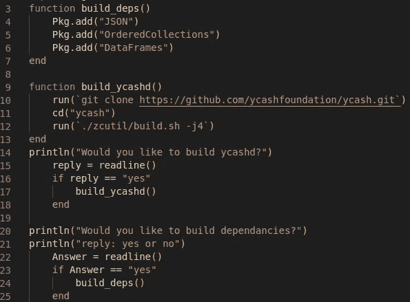

让我们创建一个名为“deps.jl”的文件，然后将所有内容剪切并粘贴到其中。打开“deps.jl”文件，你会在底部看到一些用户提示。我要彻底删除这些废话。

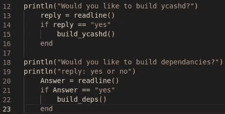

删除这个感觉真的真的真的很好

删除后，保存一切并运行它…

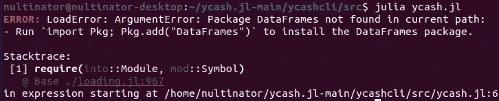

好，所以它找不到“数据帧”…让我们只在顶部添加我们的 Julian 依赖项。

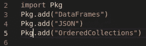

干净多了

如果你运行它，接下来你会遇到这个…

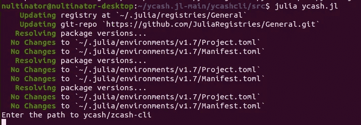

每次运行时，程序都会询问我们到 ycashd 的路径。这看起来像是不专业和可怕的结构。这应该在安装文件中。我们已经有一个了，但是我们把它命名为“deps”，让我们把名字改成“setup.jl”从“ycash.jl”中删除这段代码。

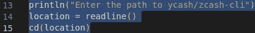

在“setup.jl”中，我们将添加这个函数。

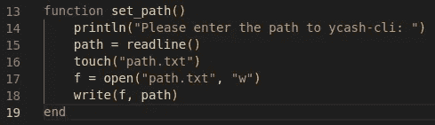

在此时运行“ycash.jl”应该会产生以下错误:

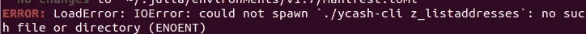

它找不到 ycash-cli

我将把下面的代码添加到“ycash.jl”中，这样它就知道在哪里可以找到 ycash-cli。

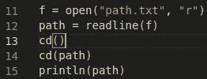

将“ycashcli()”更改为如下所示:

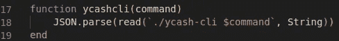

简单的一句俏皮话

接下来是实际功能的工作。单独使用 ycash-cli 时，它可以接受多个参数。

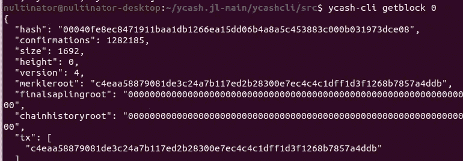

ycash-cli 的一段输出

让我们使用“ycashcli()”来运行它。

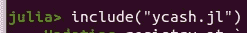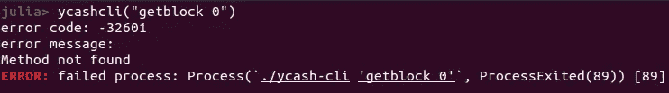

我们得到一个错误

这个错误是因为“ycashcli()”只能接受一个参数。让我们解决这个问题。首先让我们写一个测试。因为我们将测试整个脚本中的大量内容，所以让我们将测试放在一个单独的文件“tests.jl”中。

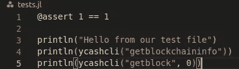

第一个断言只是为了测试我们是否有测试，然后我们从测试文件中打招呼并运行刚刚给我们一个错误的命令。在“ycash.jl”的底部，我们添加这个。

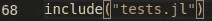

这告诉 ycash.jl 运行测试文件

运行它

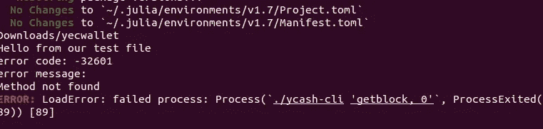

我们已经在测试文件中打了招呼，并重现了错误！

是时候来点 TDD 了。让我们添加第一个失败的测试。

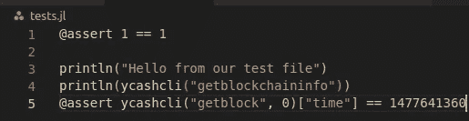

您在我们的断言中看到的大整数是块 0 的 UNIX 时间戳。现在为了让它通过，让我们重载“ycashcli()”函数。

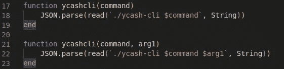

运行，它会一直运行到脚本的结尾。输出太长，无法在此发布。所以我们写了测试，它失败了，我们让它通过了，现在是时候重构了。嗯，可能是这样，但是我们在前面更改路径时已经重构了“ycashcli()”。是时候完成我们之前开始的大规模重构了。从安装文件中删除“build_deps()”函数，因为我们在“ycash.jl”中包含了 Julian 依赖项。添加正确的安装提示后，最终的“setup.jl”将如下所示:

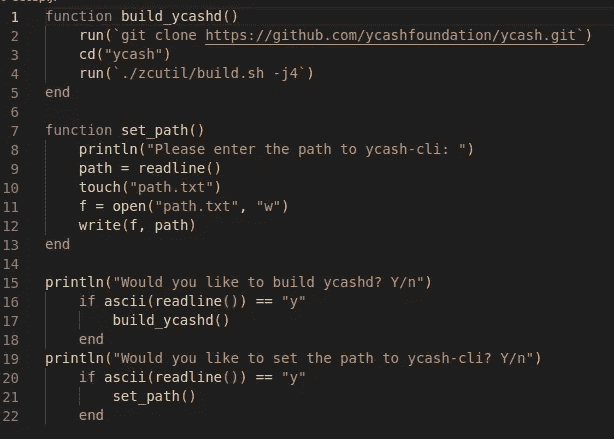

我们也将从 YAGNI 的“ycash.jl”中删除这些内容(你将不再需要它们)。

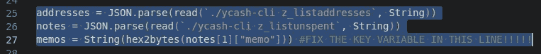

当我第一次写程序时，这些东西是为了初始测试的目的

现在让我们删除所有这些东西，因为“ycashcli()”需要多个参数，我们不需要它们。

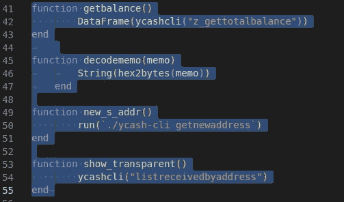

我们需要处理的下一个问题是“z_send()”函数，我将在下一篇文章中讨论这个问题，因为这是一个大问题。它可以工作，但是它真的很乱。