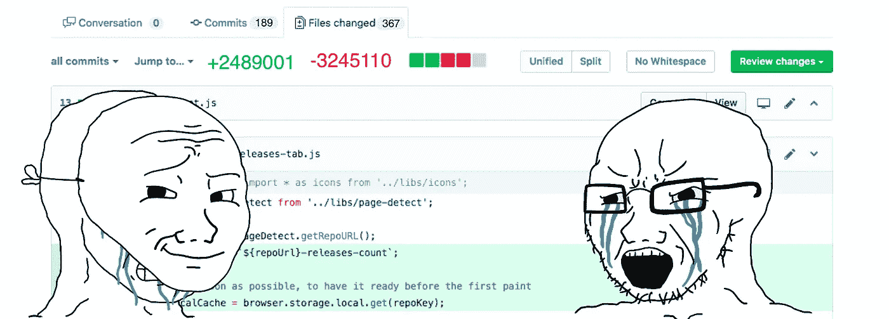
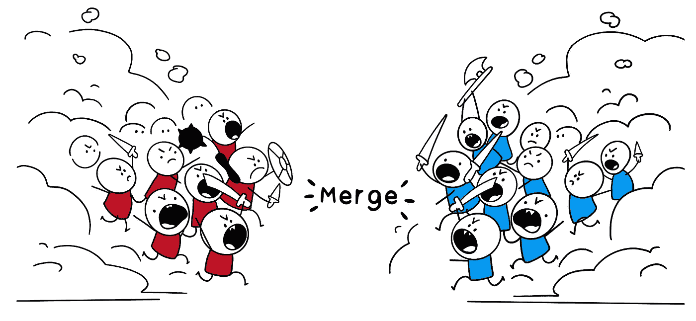

# 重构噩梦

> 原文：<https://blog.devgenius.io/refactoring-nightmares-d7f4b2511501?source=collection_archive---------11----------------------->

早日康复。

你正在开发一个快速增长、永不停止的产品；35 次冲刺和 600 杯咖啡之后，你终于要继续前进了，一个新的工程师介入了，或者你迟早会意识到你不能在保证代码质量的同时满足功能需求。然后，在提出了对重构的需求之后，作为几个特性的阻挡者，终于！这一天，你的工程团队决定将带宽用于重构——听起来很熟悉吧？你并不孤单。

# 如何避免重大重构的需要

# 不要重建；建造正确的东西。

(1)在业务需求和开发时间之间取得正确的平衡是非常重要的，尤其是在早期的初创企业中，量化遵循最佳实践的需求以编写具有有意义的测试用例的干净代码可能比看起来更难。一种可行的方法是回顾原始故事的修补程序/错误/阻止程序的数量。有一个将代码合并到预生产/生产的流程:

*   设置代码覆盖率阈值，
*   自动标记拉取/合并请求，而无需审阅注释，或者经典的“LGTM”(对我来说看起来不错)，
*   将生产中的补丁链接到原始故事/PR，
*   “代码所有者”对于某些关键的类/模块，并不是每个人都有权合并对任何文件/模块的更改(这对 monolith 代码库很重要)。

(2)几乎不要直接在你的 IDE 上开始工作一个特性，

*   收集需求，
*   开始一个粗略的解决方案文档，
*   列出不同的组件，
*   指示这些组件如何相互通信，
*   考虑抽象的程度和可能的未来用例，
*   决定合同并重新迭代

最后，是时候进入 IDE，从底层设计开始:接口、实体、dto、请求/响应等，然后是测试用例支持的实现(测试驱动开发)。

# 如果是稳定的产品，就不要碰

恰恰相反！仅仅因为应用程序是稳定的，并且近期内不会有更多的特性出现，并不一定意味着它不会受到影响。当然，这可能不是最高优先级，但是请确保维护该项目并使其保持最新，以免它在稍后阶段影响您:

*   升级依赖项，如果不是次要版本，至少是下一个主要版本。
*   保持它与代码库/服务的其余部分同等重要，无论是架构、约定还是契约。
*   稳定的服务经常被遗忘或者被认为是理所当然的；编写详细的文档。

同样，从业务的角度来看，对一个稳定的产品进行任何更改都没有投资回报，至少在短期内是这样的，但从长远来看，正是这些服务暴露了安全漏洞并存在可伸缩性问题。

# 重构不是一次性的工作

尽管采用了广泛的解决方案并遵循了所有最佳实践，但产品需求、客户需求和业务目标并不像我们想象的那样可预测，并且可能会随着时间的推移而发生巨大变化。幸运的是，这些变化也不是一夜之间发生的；

*   避免大量重构的最好方法是更频繁地进行重构。
*   当您接触代码库的旧部分时，重新验证现有的底层设计。
*   暂时的攻击并不太糟糕，但它们最终会成为常态；这些黑客应该是接下来要处理的首要问题。
*   不要担心“哦！对于一个小用例来说，代码太多了”。例如，考虑 4 个转换的 5 个状态的有限状态机，产生一个状态机编排器/引擎类、四个转换类、四个监听器类(发布-订阅)以及用于 API 资源、转换、dto 等的类/函数。众所周知，同样的情况也可以用一堆关于状态的 if-else 条件来描述。
*   不要羞于使用设计模式；也不要过度使用它。设计模式的最佳网站[https://refactoring.guru/design-patterns](https://refactoring.guru/design-patterns)

此外，如果你有一个技术债务下的重构故事，这是一个明确的指标，有些事情是不对的。

# 找到将重构的重要性与 ROI 联系起来的方法。

好吧，这是最后一个。如前所述，强调常规重构的重要性并不总是容易的，这可能会让你慢下来。

"[这样想吧](https://www.linkedin.com/pulse/refactoring-nightmares-nicholas-iannone/):你是一个代码政治家。你的利益相关者是你的公民，他们希望你不仅要制定新的法律，还要废除那些不再有人赞同的法律。重构和特性开发一样必要，开发人员倾向于过多地关注添加新的东西。我们可以把时间花在用新玩具、衣服和家具填满房间上，但我们也需要不时打扫房间，扔掉旧东西。”

头回“不要重建；构建正确的东西”并提出度量标准来更好地证明重构的必要性。

# 如何重构

# 重构时暂停新开发

想象一下重构，其他开发人员也在对你所在的类进行修改甚至重构——导致合并冲突的噩梦。所以，事先沟通你计划做的改变，确保分阶段重构，这样就不会在太长时间内成为障碍。

# 定义重构的范围

重构与处理一个特性没有什么不同；开始

*   收集关于您将要重构的现有代码的上下文，
*   确定重构计划的范围，决定要重构的类/函数，
*   一如既往，不要马上开始编码；从低层次的设计开始，想出一个大概的结果——更重要的是，在估计大概的时间时要考虑求解时间，
*   最后，区分重构任务的优先级，并将其分解成更小的可部署的块，而不是提出一个巨大的拉请求，期望你的同事来审查它。

# 测试用例，测试用例，测试用例

首先，如果之前的测试用例很少或者没有，就不应该重构。永远记住，如果任何事情都可能出错，它就会出错(墨菲定律)。我是认真的！也许此时重构并不是正确的选择。相反，提高代码覆盖率，记录预期的行为，然后回来重构。如果没有一个可量化的标准来衡量重构的正确性，后果可能是残酷的。如果已经有代码覆盖良好的测试用例，遵循 TDD，添加新的测试用例，并修复旧的测试用例。

都说了，你的麻烦有多深？从丑陋的遗留代码中走出来是困难的，没有多少人注册。老话“预防胜于治疗”是避免以重构噩梦告终的方法。