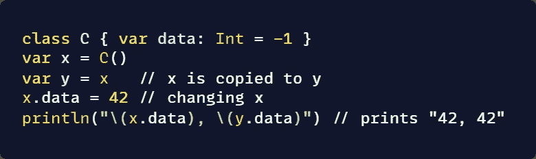

# swift 中的参考和值类型

> 原文：<https://blog.devgenius.io/reference-and-value-type-in-swift-3b8492d82b3f?source=collection_archive---------22----------------------->

## 这是关于独立和被推荐

# 参考值和数值之间的差异

举个简单的例子，想象你的朋友抄袭了你的作品，他发现了一些错误。如果他纠正了他和你作品中的错误，那就是参考类型。如果他只是随着工作而改变，那么他就是自私的(价值型)。

真正的意思是，如果你改变了复制的值，并且影响了原始值，那么它就是一个引用类型。如果它只影响复制的值，那么它就是一个值类型(自私的值类型)。

## 为什么会这样？

这时你的脑海里应该会有一个问题“为什么地狱引用类型复制后会受到影响？”如果不是，你就不是开发者，只是一个用户(像我一样)

如果我感到困惑，你不要担心，让我来澄清它

# 参考类型

参考类型

这里牛奶是抄参考的。当男人改变牛奶数据时，甚至原始牛奶数据也受到影响。

引用类型不是普通类型。

我只改变了`x.data`，但是`y.data`也改变了

这里牛奶是抄参考的。当 man2 更改牛奶数据时，甚至原始牛奶数据也会受到影响。

因为它的引用类型。这意味着类类型的变量不存储实际的实例，而是存储引用。

> (注意:引用被分配给变量或触点或函数，而不是在复制时创建的任何内存)

函数、闭包和类在 swift 中充当引用类型

# 值类型

值是普通类型。就像我们通常做的例子

所以当`b` 被复制到`a`时。这里`b`有其数据的唯一副本`a`。现在你可以用它做任何事情，不会像普通方法一样影响`a`。

> (注意:值类型是直接在内存中创建的类型。每个实例都保留数据的唯一副本。)

## 结构示例

这里只有`a`变化不受影响`b`

struct、enum、tuple、Dictionary、int、double、string 和 set 类型在 swift 中充当值类型

## 为什么会这样回答

这些都是因为堆栈和堆内存分配

值类型将其内容存储在堆栈上分配的内存中。当您创建值类型时，内存中会分配一个空间来存储该值，该变量直接保存一个值。如果将它赋给另一个变量，则直接复制该值，两个变量独立工作。

引用类型由引用使用，该引用保存对对象的引用(地址),而不是对象本身。因为引用类型表示变量的地址而不是数据本身，所以将引用变量赋给另一个变量并不会复制数据。相反，它创建引用的第二个副本，该副本引用与原始值相同的堆位置。引用类型变量存储在称为堆的不同内存区域中

如果你想喊我，就来 [twitter](https://twitter.com/Tonywilson_jpg)