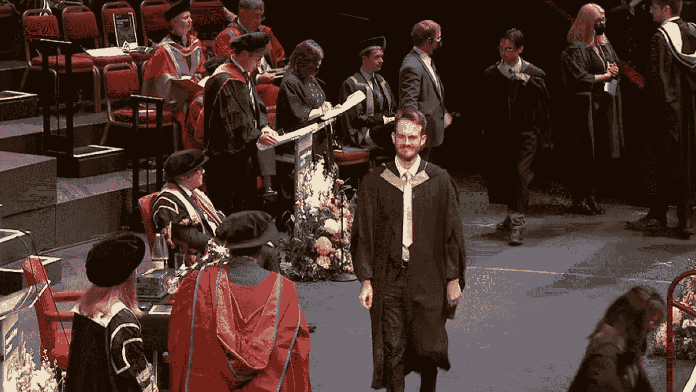
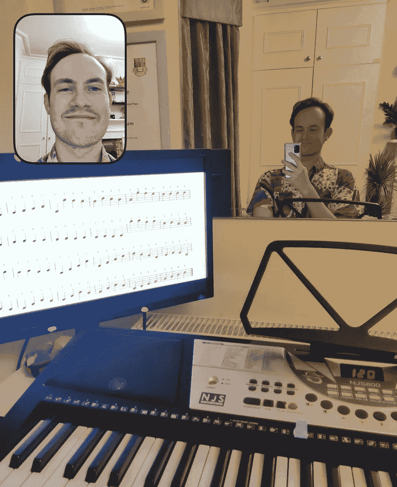
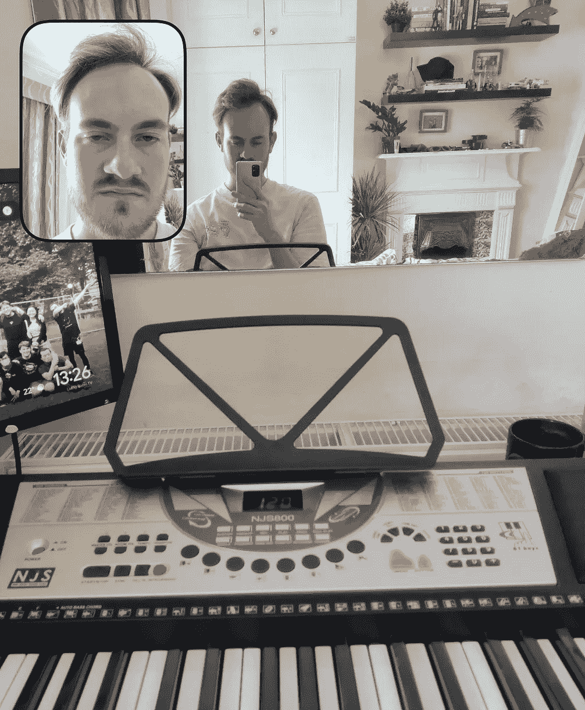

# 回想一年的软件工程师工作

> 原文：<https://blog.devgenius.io/reflecting-on-one-year-working-as-a-software-engineer-3ed0a149332c?source=collection_archive---------9----------------------->

## 当我在微软和我的职业生涯跨越一年大关时，我有一些想法

我从大学毕业开始在微软做全职软件工程师已经一年了。这是一个相当大的变化，伴随着所有的好东西，也伴随着一些挑战。我认为把这些问题说清楚会很好，这样 A)我可以分享我的经验，B)我可以带着我想做什么不同的想法进入下一年。

我毕业了

我一直纠结的一件事是为大学课程解决问题和为工作解决问题之间的区别。在大学里，给你的问题要么是支持你的学习，要么是评估你的能力。问一个知道答案的朋友没有意义，要求讲师改变作业是不明智的。这与专业软件开发的世界非常不相称。如果你能找到一个有专业知识的团队成员来帮助你在更短的时间内解决问题，你绝对应该和他们谈谈。合作伙伴团队通常会改变他们的服务/接口来适应你，而不是要求你屈从于他们。当一封简单的电子邮件或团队的信息可以让我摆脱困境时，我经常发现自己在孤立地解决一个棘手的问题。

工作之外，我也努力处理新的工作生活平衡。自从把功课和复习抛在脑后，这一切已经大规模转向生活，我现在发现自己的空闲时间比我知道如何处理的还要多。在大学，阅读、电子游戏和网飞等被动爱好占据了我晚上和周末的空闲时间，但在朝九晚六之外的时间里，这些爱好感觉很疲惫。当我每天在实验室看到我的朋友时，他们的计划会自然而然地走到一起，但现在我们中的一个必须采取主动。这意味着我需要更有意识地安排我的空闲时间。我从来都不是一个很好的计划者，但是我已经变得更加积极主动，确保我已经安排好了一些事情。我也决定尝试学习键盘；我以前的借口总是缺少空闲时间，但不是我不能用那个。

从我的内心——关于我的新爱好的复杂情感

另一件我不得不调整的事情是不再上课了。每周我都有几个小时的学习时间来扩展我的领域知识。我们会阅读论文，听取各个领域的一些领导人的意见。此外，虽然我真的很喜欢大学里的所有软件工程，但我也喜欢一些更理论化的话题。我有机会学习高等数学、证明、形式逻辑，这些在我目前的工作中并不常见。同样，这要求我积极主动。我很幸运，我的工作经常让我们有时间专注于自己的学习。然而，现在我既要决定我学什么，又要确保我真的做到了。我对自学(自学东西)的介绍喜忧参半，我探索的一些主题真的很有价值，而一些却是死胡同。最好的出口之一是这个博客，在这里我有机会应用我的新知识。

这给人的感觉有点消极，但我想强调的是，总的来说，这种体验很棒。我喜欢和我的团队一起工作，和数百万用户一起开发真正的产品一直令人兴奋不已。我有机会学习 UI 开发、可访问性、微服务、实验，并在短时间内推出一款产品。每一个大的变化都伴随着挑战，但我期待着未来的一年，期待着有机会直面挑战并取得更大的进步！

如果你喜欢这篇文章，请继续关注或查看我的[抖音，我在那里谈论计算](https://www.tiktok.com/@joetalkscomputing?is_from_webapp=1&sender_device=pc)。