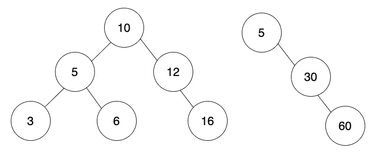
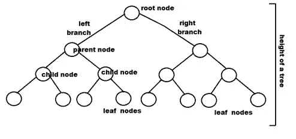

# 反射:二叉树的广度优先与深度优先遍历

> 原文：<https://blog.devgenius.io/reflection-breadth-first-vs-depth-first-traversal-of-binary-trees-e0a92b9589f9?source=collection_archive---------5----------------------->



为了准备技术面试，我每天都和丹·卡尔文一起学习数据科学和算法，学习熨斗学校的课程。我们已经学习了各种排序和搜索算法，并且使用了像单链表、双向链表和二叉树这样的数据类型。

最近，我们开始学习[二叉树](https://en.wikipedia.org/wiki/Binary_tree#:~:text=In%20computer%20science%2C%20a%20binary,child%20and%20the%20right%20child.)并订购二叉树，称为[二分搜索法树](https://en.wikipedia.org/wiki/Binary_search_tree)或 BST。虽然一开始理解二叉树的模式是有挑战性的，但是使用它们变得非常有趣。在这里，我将展示一个我创建的递归方法来按层次顺序遍历一棵二叉树…至少我是这样认为的！

# 二叉树是什么？



[https://www.upgrad.com/blog/5-types-of-binary-tree/](https://www.upgrad.com/blog/5-types-of-binary-tree/)

二叉树是一种树形数据结构，其中:

*   有一个根节点
*   每个节点最多有两个子节点:左子节点和右子节点
*   这些值不必按顺序排列(有序的树称为二分搜索法树)
*   没有子节点的节点称为叶节点
*   高度用从根部到最远叶子的边数来衡量。在上面的例子中，高度是 3。

关于二叉树的详细描述，请阅读这个[博客](https://www.upgrad.com/blog/5-types-of-binary-tree/)。

# 什么是深度优先树遍历？


深度优先树遍历下降到树中最左边的叶子，并沿该分支向上向右移动，直到碰到根，并下降到右分支中最左边的叶子。在上面的例子中，它将按照 1、2、4、8、9、5、10、11 的顺序访问节点，并像这样打印结果`[8,9,4,2,10,5,11...]`。当树被排序时，它使得搜索非常有效。

# 深度优先遍历什么时候有用？

这个方法非常适合在 BST 中查找值。如果我们预期我们正在寻找的价值更接近树叶，它也是一个很好的工具。如果树更平衡，深度优先遍历将具有空间复杂度优势。

# 什么是广度优先(层次顺序)树遍历？


级别顺序遍历是指一次遍历树的一个级别。在本例中，节点按照层级顺序遍历的路径进行排序。所以你会从 1 到 2，2 到 3，等等。

# 层次顺序树遍历什么时候有用？

在无序的二叉树中搜索值时，这很有用，特别是当树有相当大的深度或无限大时。在这些情况下，深度优先搜索可能永远不会到达所需的节点，即使它存在。这是因为它们会在查看其他分支之前继续沿着一条边向下遍历。如果树不太平衡，则宽度优先遍历将具有空间复杂度优势，因为队列会更短。

如需更详细的解释，请阅读此[文章](https://www.geeksforgeeks.org/bfs-vs-dfs-binary-tree/)。

# 我第一次尝试广度优先遍历

每当我遇到一个新的场景，我都试图在找到最有效的解决方案之前自己解决它。我发现这有助于磨练我的批判性思维能力和创造力。在这种情况下，我太专注于创建想要的输出，以至于没有足够的注意如何去做。看看你能否发现我逻辑中的错误。

这是我的解决方案:

```
class Node {
  constructor(value, left = null, right = null) {
    this.value = value;
    this.left = left;
    this.right = right;
  }
}function levelOrderTraversal(root) {
  if(!root){
    return []
  } const result = [[root.value]] const assignValues = (value, depth) => result[depth] ?  
    result[depth].push(value) : result[depth] = [value]

  const traversal = (node, depth=1) => {
    if(node.left){
      assignValues(node.left.value, depth)
      if(node.left.left || node.left.right){
        traversal(node.left, depth + 1)
      }
    }
    if(node.right){
      assignValues(node.right.value, depth)
      if(node.right.left || node.right.right){
        traversal(node.right, depth + 1)
      }
    }
  }

  traversal(root)
  return result.flat()
}
```

首先，我创建了一个`Node`类，并为 left 和 right 属性分配了默认值。

```
class Node {
  constructor(value, left = null, right = null) {
    this.value = value;
    this.left = left;
    this.right = right;
  }
}
```

然后，我开始写`levelOrderTraversal`函数。

如果没有根值，我就返回一个空数组。

```
if(!root){
    return []
  }
```

我没有想过创建队列，所以我决定创建一个数组的数组，其中内部数组的索引与节点所在的级别相匹配。

所以，我开始声明一个根值为 0 的`result`变量。

```
const result = [[root.value]]
```

我编写了一个助手函数来分配一个节点的值:

```
const assignValues = (value, depth) => result[depth] ?  
    result[depth].push(value) : result[depth] = [value]
```

如果这个深度有一个数组，那么我就把这个值放到这个数组里。如果没有该深度的数组，它会用该值创建一个数组。

然后我写了一个助手函数`traversal`来递归遍历树的节点。

```
const traversal = (node, depth=1) => {
    if(node.left){
      assignValues(node.left.value, depth)
      if(node.left.left || node.left.right){
        traversal(node.left, depth + 1)
      }
    }
    if(node.right){
      assignValues(node.right.value, depth)
      if(node.right.left || node.right.right){
        traversal(node.right, depth + 1)
      }
    }
  }
```

如果有`node.left`，那么我把值赋给结果数组。然后，如果该节点有一个左或右节点，我在该节点上调用遍历，并将深度增加 1。我对`node.right`也执行了同样的逻辑。我先检查了`node.left`,因为它可以从左到右保持值的顺序。

然后，我调用`traverse(root)`来遍历整个树。在这一点上`result=[[1],[2,3],[4,5,6,7],[8,9,10,11,12,13,14]]`，所以我在返回数组的时候把它展平了`return result.flat()`。

# 解决方案

解决之后，我将我的解决方案与使用 Flatiron 提供的队列的标准迭代解决方案进行了比较。

```
function levelOrderTraversal(root) {
  let queue = root !== null ? [root] : [];
  let result = [];
  while (queue.length) {
    const node = queue.shift();
    result.push(node); if (node.left) {
      queue.push(node.left);
    } if (node.right) {
      queue.push(node.right);
    }
  }
  return result.map(node => node.value);
}
```

这里的逻辑是有一个从根节点开始的`queue`数组。

当队列中有节点时:

1.  从队列中删除第一个节点，并将其存储在变量`node`中。
2.  将节点的值推入结果数组。
3.  如果`node`有左节点，将其推入队列。
4.  如果`node`有一个正确的节点，将其推入队列。
5.  重复步骤 1–4

然后，通过 result 映射来获取值并返回结果。

# 我最初的想法

乍一看，我对自己的解决方案非常满意。在本练习中:

*   两种解决方案都会访问每个节点一次
*   他们的解决方案通过创建一个额外的`queue`数组来使用更多的内存，而我的没有
*   我的解决方案使结果变平，他们通过它进行映射，这在时间和空间复杂性上是可比较的。

在这一点上我感觉棒极了！我认为我的解决方案更好，因为我没有分配额外的空间。但是…

# 我错过了一些重要的东西

首先，他们的解决方案可以被重构，通过将`result.push(node)`改为`result.push(node.value)`来消除映射结果的需要。但最重要的是，我的解决方案错过了广度优先遍历的意图。我返回了预期的结果，但是我没有按照程序操作。

其中队列实际上首先遍历二叉树的宽度，**我的过程实际上进行深度优先遍历，但是返回该遍历的结果，就好像它已经首先遍历了宽度。**

我得出的结论是，我没有编写广度优先遍历解决方案。

# 最终反射

出于几个原因，我非常感谢我犯的那个错误。创建它提醒我，在解决这样的场景时，我需要小心地遵循预期的过程模式。通过简单的测试，仅查看输出是否与预期输出匹配，我的逻辑中的缺陷不会很明显。所以，我需要努力批判性地分析所呈现的信息。

同样，犯这个错误促使我进一步研究遍历和搜索方法的用例。现在，当我在野外遇到树时，我将能够根据二叉树的预期特征更好地决定使用哪种方法。