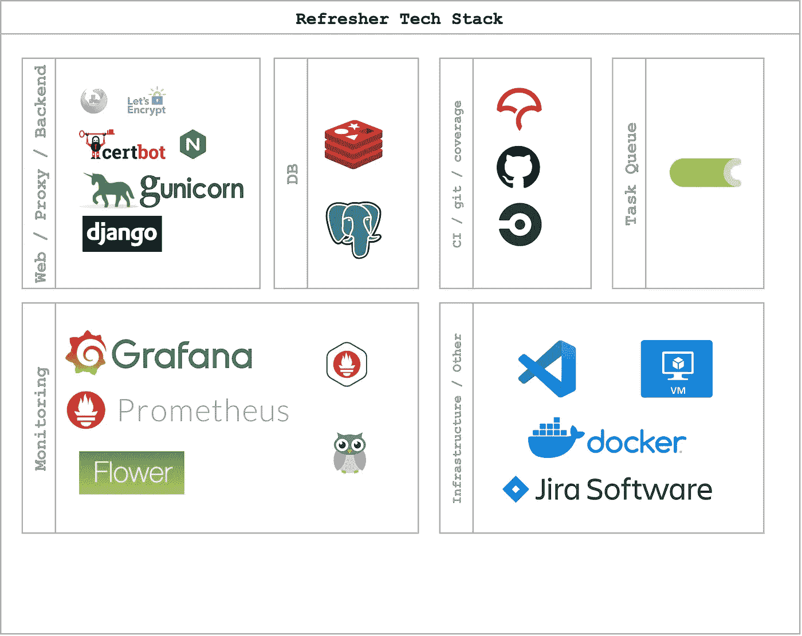

# 复习项目:系统设计和架构一瞥

> 原文：<https://blog.devgenius.io/refresher-project-a-glimpse-of-system-design-and-architecture-aaef28510dd4?source=collection_archive---------9----------------------->

使用姜戈、芹菜、格拉夫纳和普罗米修斯来启动你的想法。如果你没有想法，你可以建立一个基础设施来代替！

# 介绍

你可能在某个笔记本上有很多关于你想开始实施的特定项目的想法。你可能还会一遍又一遍地*谷歌*同一套指令，你可能总是会忘记`Dockerfile.`中的一些语法

相反，*你为什么不拥有一个完整的项目，随着你的经验增长而增长，并作为你自己的技术* ***更新者*。****进修项目旨在更新技术技能，并创造一个为试验想法和扩展做好准备的环境。这个项目的每个版本都应该介绍一个设计方案。**

***这是复习者 v1。***

# **复习项目**

# **概观**

**Refresher project 是一个完整的基础设施，它包含了服务于一系列任务的不同技术。refresher 项目旨在为这些技术的每个方面创建一个完整的指南，作为启动类似项目的指南或模板。这个项目基本上没有明确的目标，而不是有一个教育管道，既复杂又简单，以深入了解如何开发，阶段，发布和维护项目。**

## **复习用例**

**假设您需要一个基于 cronjob(调度)的应用程序，该应用程序在您选择的特定时间间隔执行特定任务**和**存储关于这些任务的信息(输出、日志…等)。).此外，您需要根据成功和失败来监控这些任务。您还需要监控您的系统使用、数据库使用和 docker 服务(容器)的健康状况。最后，您需要将所有这些服务可视化，而不是在控制台上查看表格、查询中的大量杂乱数据。尽管如此，您仍然需要公开和安全地提供您的应用程序。**

****refresher 项目**是一个 Django 后端，使用 PostgresSQL 数据库和异步任务调度器——celery——使用 Redis 代理。在复习项目中有一个 Django 应用程序叫做 **speedtester** 应用程序。speedtester 应用程序主要使用 celery workers 每隔特定间隔**运行互联网速度测试，并使用 Django 的 ORM 将每次测试的`download`、`upload`速度和`url`存储到 PostgresSQL。使用 celery beat 数据库调度程序，数据库现在保存有关 celery 任务和定义的时间间隔的信息。这意味着您可以简单地通过您的管理门户来指示在您的后端编写的特定任务定期运行。****

**用户使用 **Django** 管理门户添加周期性任务，这将自动在数据库的指定数据表中添加周期性任务及其定义的时间间隔。celery——异步任务调度程序——有两个主要进程在运行(celery **worker** 和 celery **beat** )。使用`django-celery-beat`应用程序，在 **Django** 和 **Celery** 之间建立了连接，其中 **Celery Beat** 调度程序进程现在正在寻找存储在数据库中的任务。换句话说，Django 让 celery beat 监视存储在上述指定数据表中的预定任务。然后，Celery beat 收集这些任务，并将它们添加到一个代理( **Redis** ) —内存数据库的时髦说法。Redis 中的那些任务正等待由一个**芹菜工人**来完成——负责执行任务单元的进程。最后，任务本身——在本例中是 speedtester 单元——被执行。任务速度测试器单元使用`RefresherSpeedtest()`类执行互联网速度测试，并通过 **Django 的** ORM 将数据作为 db 条目存储到**PostgreSQL**数据库中。现在，工人将任务标记为已完成，并开始处理下一个任务。**

****

**refresher 项目现在有了一些围绕它构建基础设施的基本想法。**

1.  **一个全功能的 Django 后端**
2.  ****异步任务调度器**(基本上管理良好的 cronjobs)**
3.  **一个**PostgreSQL**数据库**

**速度测试仪收集每次进行网速测试`apps.speedtester.tasks.process_speedtest`的`download`、`upload`速度和`url`。在这样做的时候，它还保留了每个 speedtest 的 ping 服务器的详细信息列表，例如(国家、国家代码、坐标)。所有这些都保存在数据库中，现在**需要**——可以——来可视化我们的数据。**

****

**上图是一个 [Grafana](https://grafana.com/) 仪表盘，显示`speedtester`应用程序的数据表。这可以通过将 Grafana 连接到数据库来轻松完成。**

****

# **技术**

# **技术堆栈**

**在本节中，将对 refresher 项目的技术体系进行可视化描述和解释。tech stack 是一个图表，包含了用于构建这个项目的所有组件和工具，不仅仅是技术工具，还有项目管理工具、持续集成(CI)和代码覆盖率。**

****

# **体系结构**

**refresh project V1 在一台主机(虚拟机)上运行，以简化架构可视化。运行在 Azure 计算虚拟机上，使用 Docker 运行容器。在 ***V2*** 及以后的版本中，refresher project 将随着项目的增长而改变其架构。是一个单片单主机项目，使用 dockerized 容器共享同一个网络来服务不同的目的。**

> ***这里有很多错误，但对于快速启动选项来说，这是可以考虑的。***

****

> **好吧，让我们来分析一下。refresher 项目有一个附属的子域，即 `*speedtester.withnoedge.tech*`**

**安全 web 应用网关(Secure Web Application Gateway)是一个工具，它封装了运行安全 Web 应用所必需的工具，正如它所说的“设置一个 Nginx web 服务器和反向代理，支持 PHP 和一个内置的 certbot 客户端，自动生成免费的 SSL 服务器证书和更新过程”, SWAG 具有:**

1.  **[证书机器人](https://certbot.eff.org/)**
2.  **[NGINX](https://www.nginx.com/)**

****

**基本上是有主域名`withnoedge.tech`附加一个子域`speedtester`，所以变成了`speedtester.withnoedge.tech`那个*子域*现在链接一个 [*一个 DNS 记录*](https://www.cloudflare.com/learning/dns/dns-records/dns-a-record/) 到一个 [Azure 虚拟机](https://azure.microsoft.com/en-us/services/virtual-machines/#overview)的*公共 IPV4* 地址。之后，每次你*访问* `speedtester.withnoedge.tech`都会被路由到虚拟机。**

> **你有没有注意到“拜访”这个词是斜体的？**

**嗯，是的。在这里访问一个域名(一个虚拟机)需要被识别——或者为了使这在技术上正确，需要**识别**然后**路由**。**

# **应用级公路旅行**

**首先，您需要确定需要从您的服务器访问哪些应用程序(您的虚拟机现在是服务器了！)，这里的[应用](https://www.imperva.com/learn/application-security/osi-model/)意在描述工具的一般用法(HTTP、ssh、telnet…等)。)—*OSI*中的第 7 层——例如，这个项目中的大部分使用将通过 Web 浏览器进行 HTTP(s)请求。我们还需要 SSH 来安全地访问机器的控制台。**

**其次，您需要将您的应用程序路由到您将主要使用的端口，例如，默认的`HTTPS runs on port 443`和`ssh run on port 22`。所以简单地说，在本地网络中有一台暴露了`port 22`的机器，你现在可以使用你的终端连接到那台机器的控制台，如果你有一个运行在`port 9000`上的 web 服务器，你可以简单地在你的浏览器中用`port 9000`和**写下本地机器的 IP，它就工作了**！**

**复杂地说，我们在做同样的事情，但规模更大。**

**因此，同时， *SWAG* 负责我们三个主要应用程序的分发、保护和路由。**

1.  **姜戈**
2.  **[格拉夫纳](https://grafana.com/)**
3.  **[花](https://flower.readthedocs.io/en/latest/)**

**接下来:深入介绍我如何设置我的**复习项目。****

** [## 复习项目—第 2 部分:解释如何用 Django，Celery 构建一个简单的基础设施…

### 深入演练复习项目的主要组件以及如何构建基础架构和系统…

blog.devgenius.io](/refresher-project-part-2-explaining-how-to-build-a-simple-infrastructure-with-django-celery-ddf7a797c791) 

# 谢谢！**