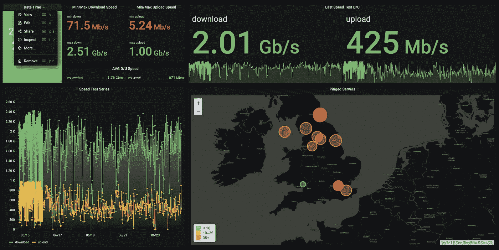
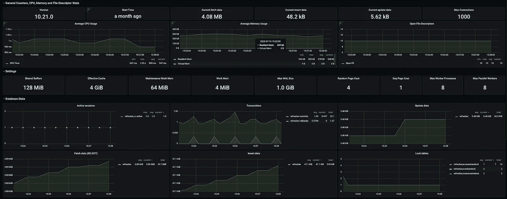

# 复习项目—第 2 部分:解释如何用 Django、Celery、Redis、Grafana 和 Prometheus 构建一个简单的基础设施

> 原文：<https://blog.devgenius.io/refresher-project-part-2-explaining-how-to-build-a-simple-infrastructure-with-django-celery-ddf7a797c791?source=collection_archive---------4----------------------->

深入演练复习项目的主要组件，以及如何从头开始构建基础架构和系统设计…

[复习项目:对系统设计和架构的一瞥](https://medium.com/@ibrahimroshdy/refresher-project-a-glimpse-of-system-design-and-architecture-aaef28510dd4)解释了一个简单复习项目背后架构的概述(鸟瞰图)。虽然这并不是设计的惊鸿一瞥，但更多的是把许多组件放在那里，想象它们是如何一起工作的。在本文中，我将深入研究项目的实际组成部分，以及我如何构建基础设施。

# 头脑风暴

在尝试任何实现之前，您应该总是集思广益。在头脑风暴阶段，人们倾向于总是想到想法本身。你集思广益的想法越多，它就越成长和扩展。你开始添加特殊的功能，增加了想法本身的复杂性。你突然创造了一个产品的概念。然而，在头脑风暴/创造力和功能性相遇的地方，有一条细微的界限——一个虚拟的界限。在 refresher project 案例中，我没有对想法进行头脑风暴，而是对组件和工具进行头脑风暴。换句话说，从系统设计的鸟瞰图开始——从有目标的更大范围开始，然后找到合适的工具使其发挥作用。我在我的系统中布置了我想要的基本功能，比如*数据库存储*、*资源监控*和*信息图表*。最后，这些功能现在是系统的目标。

在这个项目中,*目标*本身不是一个想法或产品，它是一个更新项目，对于一个技术热情的软件开发人员来说，它有复杂的组件来更新他们的技术技能。记住这一点，任何想法或产品都可以很容易地添加到项目中。

我通过分离和组织以下三个主题来开始这个项目的头脑风暴:

1.  系统架构
2.  技术栈
3.  编程；编排

图 1:项目中的三个主要主题

# 了解数据流

在[复习项目:第 1 部分](https://medium.com/@ibrahimroshdy/refresher-project-a-glimpse-of-system-design-and-architecture-aaef28510dd4)中，重点是 Django 和芹菜之间的联系。Django 是提供有组织的数据访问的 web 框架工具，而 Celery 是执行和组织预定任务的异步任务管理器。最后，Grafana 作为每个数据库的分析和可视化解决方案。

图 2:姜戈、芹菜、雷迪思格拉法纳的组件视图

Grafana 的额外好处之一是能够连接许多不同的数据源。其中一个数据源是 refresher 系统中的 PostgresSQL。随着 celery 任务的执行，它通过 Django 向数据库添加一个数据库条目。

让我们分解一下运行中的组件，以便更好地理解实际发生了什么。使用第一个主题**系统架构，**我描绘了一个用于资源管理、数据库、任务队列和可视化的后端。

图 3:识别系统组件

理解数据如何从一个资源传输到另一个资源的数据流是软件架构的关键。例如从*图 3* 开始到*图 2* 只有通过理解数据流的要求。然而，数据流并不总是连续的，您可以在处理新数据的同时监视数据，即读取当前和过去的数据。那是两条不同的数据流线。为了更好地理解 refresher 项目的数据流，让我们从用户交互点开始。用户可以完成两项主要任务:

1.  用户可以计划任务
2.  用户可以访问仪表板

为了完成这两个主要任务，你需要在你的组件中识别用户体验，这就引出了第二个主要话题，即**技术栈**。

技术堆栈选择是软件工程师技能集、研究和执行能力的组合。熟练使用工具和完全初学者状态下使用工具/库之间的平衡是关键。*我建议经常查看*[*product hunt*](https://www.producthunt.com/)*寻找一些最新的软件工具，这些工具可以帮助你提高研究技能，让你随时了解即将到来的工具。*

图 5:识别技术堆栈

因此，在对兼容性、支持和易于实施性进行研究后，您可以选择并了解您的技术组合。你可能会比你想象的更频繁地这么做！同样，如果你在 API 方法、CI 工具等之间进行比较，你会遵循同样的迭代过程。

最后，最后一个主题是将所有这些工具结合在一起，以达到上面的图 2。使用我们上面确定的两个主要任务，作为一个简单的目标，开始构建你的数据流图。这将导致一个初步的系统设计，其中你有一个基本的基础设施。

# 构建简单的基础设施

如果你仔细观察，会发现有些工具，如 **redis** 和 **Prometheus** 在*图 2 和图 8* 的设计中，但没有包括在数据流图中。这正是这两个组件最终出现在系统设计中的原因。它更像是另一个组件需要的依赖项，但在研究阶段没有准备好。我们以 **redis** 为例。

在[refresh Project:一瞥系统设计和架构](https://medium.com/@ibrahimroshdy/refresher-project-a-glimpse-of-system-design-and-architecture-aaef28510dd4)中，解释了 Django 如何使用一个芹菜库来将任务存储在数据库中。这意味着有一个用 Django 编码的已定义任务，该任务的引用点存储在数据库中。使用 Django，您可以组合任务的参考点，并选择在任何给定的时间执行它。那么，在指定的执行时间，任务执行过程中实际发生了什么呢？这就是**芹菜打，芹菜工，雷迪斯的工作。**异步任务管理器——Celery——将至少有两个主进程在运行，一个用于 Celery Beat(将其视为任务收集器),一个或多个用于 Celery Worker(将其视为任务工作器)。Django 通过在数据库中存储任务参考点来帮助 celery，但是在运行时(任务执行运行时),收集器和工作器将在哪里存储它们的数据呢？换句话说，芹菜工人将如何知道执行哪个任务？

如上图*图 2* 所示，简单来说就是*芹菜打桩机将收集计划执行的任务，并将该任务存储到内存数据库中的 redis 中以供拾取。一旦任务的时间到来，芹菜工人将执行该任务。*

## *Grafana & PostgresSQL*

*到目前为止，我们已经讨论了 Django、PostgresSQL、Celery、Redis 和 Grafana 之间的联系。普罗米修斯在哪里？或者说什么是**普罗米修斯**？*

*我们先来复习一下 Grafana 和 PostgresSQL。如前所述，Grafana 的一个关键特性是能够连接多个数据源。不同类型的不同数据源，如基于 SQL 的数据源或基于非 SQL 的数据源，以及对两者应用自定义查询的能力。
在我们当前的数据库设计中，我们在 PostgresSQL 数据库中有以下表格。*

**

*图 6:数据库表*

*这些表中的数据可以通过一些简单的查询转换成 Grafana 仪表板。*

> **查看此仪表盘的公共版* [*此处*](https://speedtester.withnoedge.tech/d/SvuObl97k/speed-test-dashboard?orgId=2&from=1655301852804&to=1657893852804)*

**

*图 7:来自 PostgresSQL 数据库的 grafana 仪表板*

## *普罗米修斯*

*所以我想到了一个我觉得每个开发者都应该问的问题:*

> **如果我可以可视化和监控我的数据，为什么我不能对我的资源做同样的事情呢？**

*我想使用 Grafana 来监控我的资源(任何计算或存储资源)。我重复了上面讨论的三个主要主题，经过研究，我发现了一个名为 **Prometheus** 的兼容工具——一个开源监控系统，具有维度数据模型、灵活的查询语言、高效的时间序列数据库和现代警报方法**。***

*在系统设计中加入普罗米修斯后，少了一些 ***出口商*** 。数据导出器从一种形式获取数据，并将其翻译成普罗米修斯语言。例如，为了从 PostgreSQL 数据库中收集资源监控数据，您将需要 PostgreSQL 和 Prometheus 之间的转换器。因此，每当您想到 Prometheus 时，请始终记住，您需要一个数据导出器来导出您想要监视的资源。*

**

*图 8:刷新架构*

## *格拉夫纳-普罗米修斯公司*

*将 Prometheus 作为数据源添加到 Grafana 后，Grafana 现在可以访问来自*出口商*的所有数据。这意味着您可以做与可视化您的数据点相同的事情，如图*图 7* 所示。*

**

*图 Grafana 上的 Postgres 监控*

# *谢谢！*

*请务必点击查看现场仪表盘[！](https://speedtester.withnoedge.tech/d/SvuObl97k/speed-test-dashboard?orgId=2&from=1655301852804&to=1657893852804)*

***接下来:**复习项目的技术设置！*