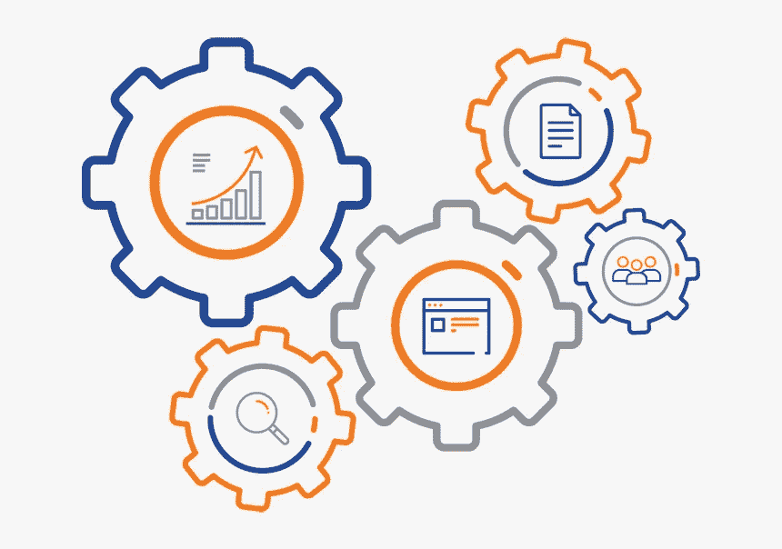
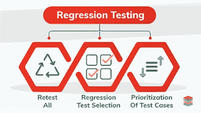

# 回归测试

> 原文：<https://blog.devgenius.io/regression-testing-bc2870770c2b?source=collection_archive---------37----------------------->

所以现在你可能会从标题中想到什么是回归测试？怎么会？什么时候？为什么？

这些对任何人来说都是标准的问题，因为如果你渴望学习，你会知道 90%的人类渴望学习新事物，而其中 98%的人喜欢问问题，这很奇怪。

关于概率的问题已经说得够多了，在这个博客里，我们会详细解释回归测试，希望你喜欢阅读它，并从我们的经验中学习。

# 什么是回归测试？

回归测试是一种测试，用来验证软件中的代码更改不会影响产品的现有功能。这是为了确保产品在新功能、错误修复或现有功能的任何更改下都能正常工作。先前执行的测试用例被重新执行，以验证变更的影响。

# 如何以及何时进行回归测试

## 软件开发生命周期影响回归测试

回归测试通常以某种形式包括在回归测试会话或阶段期间由人、机器或两者执行一套测试/检查。您如何创建您的测试套件取决于您如何作为一个团队进行测试。

## 回归测试方法 1

如果你在一个更喜欢测试用例而不是探索性测试的测试团队中工作，很可能你会将你的脚本测试存储在一个工具中，这个工具会随着你为新特性创建更多的测试脚本而不断增长。

测试脚本的明确性意味着在回归测试会话中很容易挑选出要运行的脚本，但是需要不断的检查和维护；确保您的测试脚本是相关的，并且反映了您产品的当前行为。这意味着删除与产品不再匹配的测试脚本，并更新其他脚本以保持相关性。

## 回归测试方法 2

如果您的团队喜欢探索性测试，那么您可能有一个存储的章程、测试会话和注释的列表，您可以在回归测试期间参考它们。

使用先前会议记录的探索性测试会议可以充分地指导测试人员，但是仍然可以让他们自由地捕捉测试脚本可能遗漏的 bug。然而，他们需要更多的技能和对迄今为止已经测试过的内容的理解，以帮助确定执行什么会话。

## 团队结构影响回归测试

当您执行回归测试时，您的团队的结构以及他们如何开发软件影响。

## 使用瀑布方法

如果您正在使用分阶段的瀑布方法，很可能您会被给予不同的版本来测试。随着每个版本的发布，您将有新的特性要测试，旧的特性要回归测试。因为在瀑布方法中，开发人员和测试人员之间通常很少交流，测试人员被迫运行完整的回归套件，因为他们不知道自上一个版本以来有什么变化和没有变化。

## 使用敏捷方法工作

如果你的团队采用迭代敏捷方法，一个好的敏捷团队会尽快发布一些东西，并在用户面前展示，以获得反馈和适应。这意味着要运行回归测试的更小更常规的版本或变更。例如，如果他们遵循持续集成，那么每次开发人员推出新代码和创建新版本时，都会进行回归测试。敏捷团队的协作性质意味着测试人员应该更多地了解什么发生了变化，并且能够决定执行什么回归测试。然而，这需要整个团队对回归测试负责，而不仅仅是测试人员。

# 回归测试可以手工执行吗？

有一天我正在课堂上讲课，一个问题向我袭来“回归可以手工完成吗？”我回答了这个问题，然后我们继续上课。一切似乎都很好，但不知何故，这个问题后来困扰了我好一阵子。

在许多批次中，这个问题以各种不同的方式出现了多次。其中一些是:

*   要执行测试，我们需要工具吗？
*   回归测试是如何进行的？
*   即使在一整轮测试之后——新来者发现很难辨别回归测试到底是什么？

当然，最初的问题是:

# 这个测试可以手动执行吗？

首先，测试执行是一个简单的行为，使用您的测试用例，在 AUT(测试下的应用程序)上执行这些步骤，提供测试数据，并将在 AUT 上获得的结果与您的测试用例中提到的预期结果进行比较。

根据比较结果，我们设置测试用例通过/失败的状态。测试执行就是这么简单，这个过程不需要特殊的工具。

## 帮助目标回归测试的方法

为了确保我们的目标回归测试(而不是穷尽地运行我们所有的测试)成功，您和您的团队可以做一些小事来帮助我们:

1.  如果回归来自变更，那么你在一个版本中做的变更越多，你需要测试的风险就越多，这意味着更多的回归测试。鼓励您的开发人员经常向您的测试环境发布代码，或者部署未完成功能的部分，例如系统的后端或前端。
2.  **系统建模- >** 你对你的产品了解得越多，就越容易确定变化可能会影响到什么。丹·阿什比分享了这种对有效运行的系统进行建模的新颖方法:
3.  **参与代码评审- >** 如果你的开发人员在将他们的代码推送到共享的存储库之前进行代码评审，那么试着参与那些评审。您不需要学习如何编码或阅读代码，但是倾听并询问什么可能会受到影响将有助于您的测试有针对性。
4.  **结对- >** 或者，你可以和你的开发人员结对，因为他们正在编程并做笔记。这是了解变化的一个很好的方法，可以帮助您确定回归测试的目标。为了开始配对，Lisa Crispin 写了一篇关于如何配对的综合文章。

# 何时进行该测试？

回归测试通常在变更或新功能验证之后进行。但情况并非总是如此。对于需要几个月才能完成的发布，回归测试必须包含在日常测试周期中。对于每周发布的版本，回归测试可以在变更的功能测试结束后进行。回归检验是重测的一种变体(简单来说就是重复一个测试)。

如果您正在寻找我们的服务，请点击下面的网站:

[StackedQA 网站](https://www.stackedqa.com/)

查看我们的社交媒体:

[脸书](https://www.facebook.com/StackedQA)，[推特](https://twitter.com/stackedqa)， [Instagram](https://instagram.com/stackedqa) ，&Linkedin