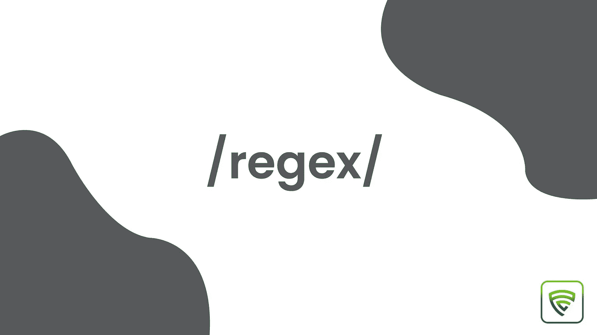

# 正则表达式备忘单

> 原文：<https://blog.devgenius.io/regular-expressions-cheatsheet-e6b666f5a5c7?source=collection_archive---------8----------------------->



正则表达式是大多数开发人员害怕的最可怕的话题之一。事实上，我也是其中之一，但我决定更努力地学习这个话题。所以，我把我所有的学习成果都加上了例子，让这个话题容易理解。

让我们开始吧。

```
const regex = //;
*or*
const regex = new RegExp('');
---
/<expression>/<flags>
```

这些是使用 regex 所需的 JS 方法。

```
match(); // returns matching strings in an array
test(); // returns true or false
```

让我们用一个例子来理解这个概念。

```
const str = 'hello world';
const regex = /hello/;console.log(regex.test(str)); //true
console.log(str.match(regex)); //["hello"]
```

match 函数用给定的正则表达式检查字符串，并返回第一个匹配项。如果字符串匹配以下表达式，测试函数返回 true，反之亦然。

# 旗帜

如果我们将上面的字符串更改为“hello world hello ”,它仍然会返回一个“hello ”,因为它会返回第一个出现的内容。为了匹配每一次出现，我们必须给出与正则表达式模式全局匹配的标志“g”。

```
*// global* const str = "hello world hello";
const regex = /hello/g;
console.log(str.match(regex)); //["hello", "hello"]
```

如果我们将字符串改为“hello world Hello ”, match 函数将返回一个 Hello，因为 regex 区分大小写。通过启用“I”标志，我们可以匹配字符串“hello”的每一次出现，而不考虑它们的大小写。

```
*// case insensitive* const str = "hello world Hello";
const regex = /hello/gi;
console.log(str.match(regex)); //["hello", "Hello"]
```

让我们将字符串改为“hello world \nHello”。如果我们想检查字符串是否以单词“hello”开始，我们必须在表达式前给一个^(cap。

> **^用于匹配输入的开始。**

所以我们需要改变这个表达式，比如/^hello/gi，即使我们使用了“I”标志，它也会返回一个 hello。我们必须使用“m”标志来匹配多行输入中的表达式，因为我们在字符串中添加了“\n”。

```
*// mutiline* const str = "hello world \nHello";
const regex = /*^*hello/gim;
console.log(str.match(regex)); //["hello", "Hello"]
```

类似地，如果我们想要匹配输入的结尾，我们必须在表达式的结尾给出$(美元)。

> **$用于匹配输入的结束。**

```
const str = "hello world \nHello World";
const regex = /*world$*/gim;
console.log(str.match(regex)); //["world", "World"]
```

# 字符类别

\d =匹配数字

\D =匹配非数字

\w =匹配单词

\W =匹配非单词

\s =匹配空格

\S =匹配非空格字符

下面提到的例子有助于更清楚地理解这个概念。

```
"123 hello %".match(/\d/); //matches "123"
"123 hello %".match(/\D/); //matches " hello %"
"123 hello %".match(/\w/); //matches "123" and "hello"
"123 hello %".match(/\W/); //matches " "," " and "%"
"123 hello %".match(/\s/); //matches " " and " "
"123 hello %".match(/\S/); //matches "123", "hello" and "%"
```

> **美国。(点)运算符匹配除行结束符**之外的任何单个字符

比如我们给 regex /t.n/g .它匹配“tin”、“t5n”、“t@n”、“t n”。

> **/(反斜杠)运算符用于转义字符。**

例如，如果我们想要匹配字符串“t\n ”,那么我们不能给 regex/t\n/g，因为它匹配 t 和 newline，而不是 t \ n。在这种情况下，我们必须使用转义字符，如果我们在反斜杠前面使用它，那么它将被视为一个字符，而不是一个运算符，那么表达式将类似于/t\\n/g。

# 组和范围

在' **(** )和' **)** ' **之间提到组。**

```
"123 hello %".match(/(123|hello)/g); //matches "123" and "hello"
```

> **|(管道)运算符用于“或”条件。**

范围在' **[** '和'**]【T19]'之间，用连字符( **-** )分隔。**

例如，[0–9]匹配所有数字，[^0-9]匹配除数字以外的任何数字。

```
/\d/g = /[0–9]/g
/\D/g = /[^0–9]/g
/\w/g = /[a-zA-Z0-9_]/g
/\w/g = /[^a-zA-Z0-9_]/g
/\s/g = / /g
/\S/g = /[^ ]/g
```

> 在上面的例子中你可能会怀疑**“为什么我们需要/[^ ]/g 来匹配非空格字符我们不能给/^ /g 吗？”**
> 
> **回答:不会，**因为/^ /g 读的是“匹配输入以空格开始”。 **^** 只有在 **[]** 内部使用时才作为 not 运算符。

# 量词

```
"a aa".match(/a{2}/g); //matches the letter 'a' sequentially occurring two times
"a aa aaa".match(/a{2,}/g); //matches the letter 'a' sequentially occurring 2 times and greater
"a aa aaa aaaa".match(/a{2,4}/g); //matches the letter 'a' sequentially occurring 2 to 3 times
```

*一个*？=与前面的项目“a”匹配 0 或 1 次。

*a* + =匹配前一项“a”1 次或多次。

*a* * =与前一项“a”匹配 0 次或更多次。

```
/(hello)? %/g; *// matches both " %" and "hello %"*/(hello)+ %/g; *// matches both "hello %","hellohello %", "hellohellohello %", etc...*/(hello)* %/g; *// matches both " %", "hello %","hellohello %", "hellohellohello %", etc...*
```

> **简单来说，“*”是“+”和“？”的结合**

# 向前看和向后看

```
**positive lookahead**
/a(?=b)/g; matches a only if it is followed by b**negative lookahead**
/a(?!b)/g; matches a only if it is not followed by b**postive lookbehind**
/(?<=b)a/g; matches a only if it is preceded by b**negative lookbehind**
/(?<!b)a/g; matches a only if it is not preceded by b
```

在上面的前瞻示例中，条件是在“(”和“)”之间提到的。如果任何字符串满足条件，那么匹配函数匹配前面的字符。

同样，对于后面的例子。如果任何字符串满足条件，那么匹配函数匹配以下字符。为了区分后视和前视，在后视中，我们使用“

就这样，我们涵盖了正则表达式中的大部分主题。下次在任何地方看到正则表达式模式时，不要害怕。回到本文来修改概念，然后尝试理解模式。