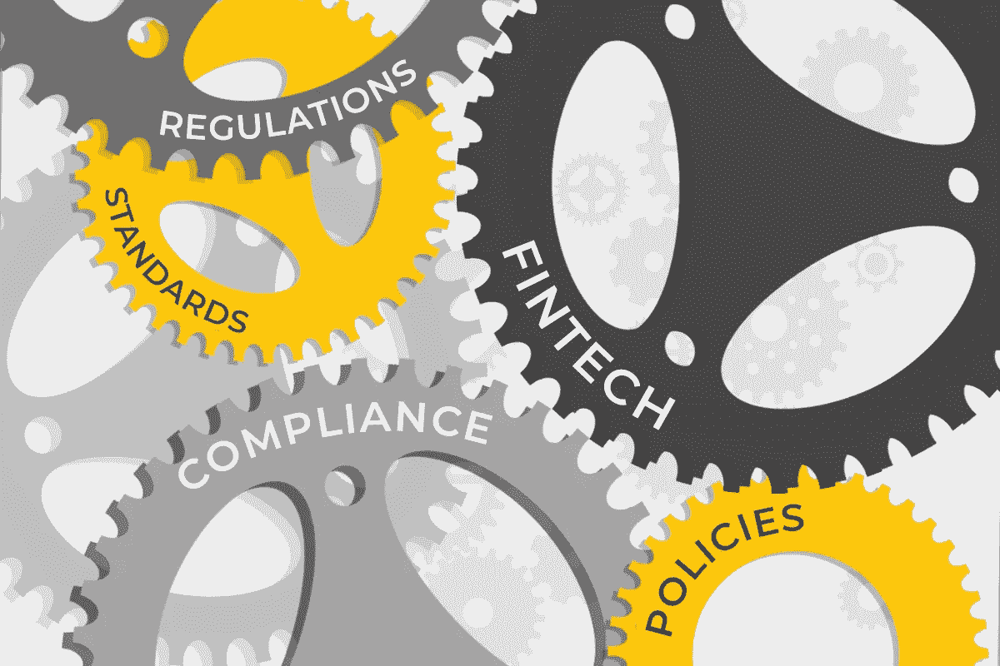

# 金融科技法规

> 原文：<https://blog.devgenius.io/regulations-in-fintech-d4da2bf6e9bf?source=collection_archive---------29----------------------->

金融科技行业的快速全球增长并非没有挑战。由于金融科技公司越来越多地干预金融交易业务，监管机构越来越关注金融科技监管。在由[*Tonya Smirnova*](https://medium.com/u/975f64af3be6?source=post_page-----d4da2bf6e9bf--------------------------------)*准备的这份材料中，我们与您分享了 2020 年金融科技监管和最佳合规实践的清单。*

金融科技法规由 [UppLabs](https://medium.com/u/66e1a7ad8027?source=post_page-----d4da2bf6e9bf--------------------------------)

最初，这篇文章发表在 UppLabs 的博客上。

这些技术彻底改变了货币交易世界。处理资金操作变得越来越容易，银行系统世界变得更加清晰和安全，我们有多种转移选择，所有这些都有可能，因为金融科技是最有前景的投资领域之一。作为一项完全集成到金融服务中的技术，此类流程的监管问题越来越多，这就是确定任何业务的监管义务至关重要的原因。

# 金融科技与传统银行

[**Fintech**](https://fintech.upplabs.com/) 是一个新的经济技术产业，包括应用程序、网站和其他使传统金融服务现代化的技术解决方案。

它让保守的银行更具创新性，让银行摆脱对货币交易的垄断，允许客户在几分钟内签订保险合同并转账，不仅从银行获得融资，还从众筹平台获得融资，在没有人工干预的情况下管理金融资产，在人工智能的帮助下，可以估计个人的支付能力，并在电子钱包中存钱。它经常在不止一个国家开展业务。这只是所有可能的金融科技选项中的一部分。

Fintech 是关于与金钱相关的行业中使用的技术，它肯定每天都在改变我们的生活。

# 当前的金融科技挑战

前几年，金融科技行业面临着各种挑战，这些挑战一直是金融部门及其监管机构关注的焦点。下面列出了公司目前面临的一些主要挑战:

*   **数据访问的监管**
    随着人们对数据在数字经济中的价值的认识不断提高，有必要为客户提出新的价值主张，同时考虑到他们的隐私问题。这导致欧洲制定了两项法规:通用数据保护法规( **GDPR** )和 **ePrivacy** 法规，解决网络通信产生的数据问题，例如使用 cookies、网站日志等的许可要求。与此同时，在墨西哥的一些州，开放的银行监管已经扩大。根据最近批准的金融科技法，数据访问和数据可移植性权利受到监管。
*   **新的支付服务指令(PSD2)** 旨在鼓励竞争并在整个欧盟(EU)和欧洲经济区(EEA)建立支付安全。它规范第三方对客户支付账户的访问，旨在鼓励支付系统的发展和支付的安全性。为了加强对创业公司的支持，银行将被要求为支付服务提供商实现客户账户的接入接口。欧盟专员称，这是向共同数字市场迈出的一步。支付服务提供商在因未授权交易(例如，信用卡信息被盗)造成损失的情况下的赔偿限额将从€ 150 降至€ 50。PSD2 有几个优点:
    1)它保护在线金融交易中客户的权利——这意味着商家将不得不提供更多的担保；
    2)它引入了访问支付服务提供商和客户账户的接口的强制实施。这对法人实体具有非银行金融机构地位的创业公司有很大帮助。
*   **网络安全**
    在大生态系统中，所有参与者都相互影响。因此，对网络攻击的反应和反击应该包括公司及其客户。一方面，金融科技的发展导致欺诈者获取数据的选择增加。另一方面，金融科技公司正在开发防止网络攻击的解决方案，并试图在下一个数字产品的设计阶段包括所有可能的漏洞。金融科技公司试图利用所有现代技术和人工智能来保护金融市场，在网络攻击造成伤害和更快的数据恢复之前检测和反击网络攻击。

# 最佳金融科技合规实践

在整个欧洲，金融科技行业的合规实践因国家而异，属于多个司法管辖区。在一些国家，金融科技没有监管，很容易成为欺诈的目标。对所有金融科技服务及其对各行业的影响只监管和制定一种方法并不是一件容易的事情。在大多数情况下，政府已经应用了当前的法规，并根据金融科技定制了这些法规。而在美国，金融科技公司不依赖于一个监管州或法律的金融科技监管框架。公司的具体活动可能在许多不同层面上受到各种州或联邦要求的约束。然而，最近一年，美国七个州的监管机构同意简化其金融科技业务的合规做法。这是一个目前正在发展的过程，许多金融科技商业模式在欧洲和美国有多项法规，因为一些业务是国际性的，必须在多个司法管辖区合规。

1.  **纯数字企业**
    监管机构正在不断完善金融科技和纯数字银行系统。2019 年，OCC 编制了一份国家金融科技宪章提案，这使得允许全面的银行服务但实施更严格的监管成为可能。这在金融科技专家中引起了巨大的意见分歧。现在，纯数字运营商正在考虑选择全业务银行。
2.  **反洗钱合规**
    遵守银行市场的内部和外部要求及行为标准，ALM(反洗钱)是保护任何银行机构及其客户声誉的先决条件。ALM 合规包括以下领域:打击犯罪和恐怖融资收益合法化、制定文件和程序以确保公司活动符合现行法律、保护信息流、打击欺诈和腐败。2015 年，金融犯罪执法网络(FinCEN)不得不对一家数字货币运营商支付 70 万美元的罚款，因为他们没有足够的反洗钱计划。自那以后，该公司与许多银行建立了合作伙伴关系，这表明银行在开始金融科技合作之前进行尽职调查非常重要。
3.  **KYC 合规**
    KYC (Know your customer)是一个银行和外汇监管术语，指的是金融机构和其他使用私人资金的公司，这意味着它们在进行金融交易之前必须确定交易对手。这一要求适用于获取有关交易对手(法律实体、其业务性质和单个业务交易)的合理完整信息。这种合规性用于防止金钱欺诈、恐怖融资和逃税。目前，旨在实施这一原则的要求和标准是在国家立法、银行监管机构的监管文件以及 FATF 等国际组织层面上确立的。随着银行试图根除欺诈和避免恐怖融资，KYC 对金融科技的合规性达到顶级水平至关重要。
4.  **支付卡行业数据安全标准**
    PCI DSS(支付卡行业数据安全标准)由 Visa、MasterCard、American Express、JCB、Discover 制定。该标准的要求适用于所有使用国际支付系统的公司，如银行、贸易和服务公司、技术服务提供商以及其他处理、传输和存储持卡人及其交易数据的组织。PCI 数据安全标准确定了十二项法规遵从性要求，并组合成六个逻辑上相关的组，称为“控制目标”。该标准结合了各种国际支付系统计划对信息保护的要求，特别是:
    -万事达卡-站点数据保护(SDP)；
    -美国签证-持卡人信息安全(CISP)；
    -欧洲签证-账户信息安全(AIS)。
5.  **以消费者为中心的战略**
    银行和信贷机构越来越多地使用封闭式支付系统。这使得佣金和其他费用(包括汇率)的计算变得复杂。为此，消费者金融保护局(CFPB)在美国成立。它为金融机构创建和应用规则，监控、制作市场报告、收集和跟踪消费者投诉。这不仅延伸到了老牌金融机构，也延伸到了金融科技。2019 年，一家消费贷款公司不得不支付 600 万美元的罚款，此前 CFPB 表示，它没有为借款人提供改善信用或以较低利率获得贷款的适当机会，违反了消费者贷款法。
6.  **数字签名证书**
    数字签名证书是由认证机构颁发的安全数字密钥，旨在识别、认证和验证证书持有人的身份。数字签名使用公钥加密来生成签名。DSC 包含有关用户姓名、电子邮件地址、pin 码、国家、证书颁发日期以及认证机构名称的数据。因此，电子数字签名用于电子文档管理、监管机构的电子报告、公共服务(来自国家注册的信息、申请的提交、上诉等)。)、与法院的互动(电子诉讼)等。电子数字签名在欧洲是一种常见的做法。它们在爱沙尼亚使用最为活跃，那里 90%的公共服务都是在线实施的。

# 金融科技规划

由于相互关联的全球趋势和银行可能面临的金融风险，这些创新使大型组织能够更高效、更合理地处理大量数据。在这方面:

*   监管机构不断审查规则，扩大规则，应对来自有组织犯罪和日益增长的全球恐怖主义网络的威胁，其中许多网络近年来变得更加强大和复杂；
*   一体化网络和跨境业务数量的增加造成了银行基础设施的缺口，增加了它们的脆弱性；
*   由于外交政策，银行的工作受到对个人更广泛的经济制裁的影响；
*   监管当局对潜在威胁保持警惕，而他们不断提高的期望值也为银行和金融机构创造了苛刻的监管条件。

# 我们如何提供帮助

无论你在哪里，金融科技法规都应该得到彻底审查，因为这些天来几乎所有金融科技解决方案和标准都可以走向全球。

此外，你应该确保与了解金融科技开发标准和限制的开发人员合作。

在过去的 5 年里，我们在 [**UppLabs**](https://upplabs.com/) 掌握了最新的 [**Fintech 技术**](https://upplabs.com/blog/best-fintech-development-tech-stack/) ，并在创建可靠、安全和复杂的 Fintech 解决方案和产品方面积累了经验:

*   Fintech [**web 和移动开发**](https://upplabs.com/services/web-and-mobile-app-development/) 我们紧跟 Fintech 趋势和创新，不断学习，参观最好的 Fintech 会议，拥有最优秀的专业 web 和 [**移动开发者团队**](https://upplabs.com/expertise/mobile-development/) 。
*   货币交易平台工程
    我们的金融科技支付生态系统是透明和多功能的。
*   在线交易和交易平台工程
    我们创建在线电子交易平台，为各种金融科技交易机会提供实时解决方案。
*   基于人工智能的金融科技解决方案
    我们已经准备好使用基于人工智能的解决方案来收集和处理金融科技公司聚集的海量数据。
*   支付系统集成和优化
    我们自动化您的会计和 ERP，创造最好的金融科技服务和应用。
*   现有服务维护和现代化。
    我们的 [**产品组合**](https://upplabs.com/portfolio/) 包括使用现代架构，确保易于维护并易于与最佳金融科技服务集成。

如需 [**IT 咨询**](https://itconsulting.upplabs.com/) 关于 Fintech — [**问 UppLabs**](https://upplabs.com/contacts/upplabs-calendly/) ！