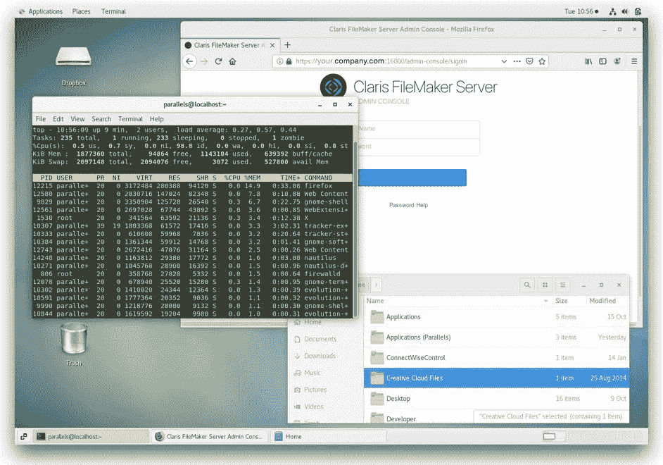

# 重新推出适用于 Linux 的 FileMaker 服务器

> 原文：<https://blog.devgenius.io/reintroducing-filemaker-server-for-linux-92aa91559ded?source=collection_archive---------7----------------------->

如果您和我们一样长期接触 FileMaker 世界，您应该还记得 FileMaker Server 5.5 发布的时候。该版本最显著的一点是，它不仅可以在 Windows 和 macOS 上运行，还可以在 Linux 上运行。FileMaker Server 5.5 是 7 之前的服务器中的最后一个，也是 Linux 版本中的最后一个…直到现在。当然，这并不完全正确，因为克拉丽丝女团自 2015 年以来一直在其所有云服务(包括 AWS 和当前产品)上使用 Linux 版本的 FileMaker 服务器。这个 Linux 云版本对本地用户不可用，但现在情况不再是这样了。我们认为等待是值得的，因为它提供了许多部署选项和一些管理优势。

# 对 Linux 开放

为什么拥有可以安装在 Linux 操作系统上的本地版本的服务器如此重要？一个重要原因是，CentOS 是基于开源服务器的操作系统的行业标准。CentOS 是克拉丽丝女团支持的 Red Hat 品牌 Linux 的开源版本。它被企业和商业数据库/web 托管提供商广泛使用。CentOS 之所以有如此好的声誉，是因为它部署便宜、运行可靠且易于管理。这些正是克拉丽丝女团在决定运行其云产品的操作系统时考虑的因素。

现在，你们中的一些人可能会对使用一些古怪的[命令行](https://blog.supportgroup.com/filemaker-server-dont-fear-the-command-line?utm_source=BlogPost-2020-10-29&utm_medium=Medium&utm_campaign=lead-gen)操作系统来部署 FileMaker 定制应用程序感到吃惊。我们大多数人 [FileMaker 开发人员](https://blog.supportgroup.com/developer-resources?utm_source=BlogPost-2020-10-29&utm_medium=Medium&utm_campaign=lead-gen)比起 IT 专家来说更像是流程专家，所以每当我们需要在我们的服务器上工作时，一想到启动终端屏幕就让人害怕。但是请放心，CentOS 发行版有一个图形用户界面，其外观和行为非常像我们流行的 Windows 和 Mac 操作系统。所以，你应该很快就会觉得很舒服了。安装过程的第一部分确实需要一个黑色背景和闪烁光标的窗口，但这很快就过去了，很快我们就被引导到一个友好的浏览器，就像我们在其他操作系统上体验到的一样。

# Linux 的优势

除了 CentOS 云实例通常比 Windows 云实例便宜之外，它们还可以从许多提供商那里获得，如 Azure、AWS、Digital Ocean、HostGator 等。它也是大多数本地虚拟机平台(如 Parallels 和 VMWare)的现成选项。大多数 CentOS 发行版的另一个巧妙之处是缺少我们不需要的额外内容。许多其他服务器平台都带有侵入性病毒/恶意软件扫描器和占用内存的媒体应用程序，如果我们没有正确配置设置，这些应用程序经常会对 FileMaker 服务器及其文件造成严重破坏。

如果您仍在犹豫新的 Linux 版 FileMaker Server 是否适合您，请不要犹豫，联系我们进行[免费咨询](https://www.supportgroup.com/contact?utm_source=BlogPost-2020-10-29&utm_medium=Medium&utm_campaign=lead-gen#form)，我们将帮助您做出明智的战略决策。我们还可以为您管理安装实例的繁重工作。无论如何，克拉丽丝女团的新 Linux 版 FileMaker Server 给了我们所有人一个期待已久的选择，在一个以可靠性、经济性和简单界面著称的平台上部署我们的应用程序。

*原载于 2020 年 10 月 29 日*[*【https://blog.supportgroup.com】*](https://blog.supportgroup.com/reintroducing-filemaker-server-for-linux)*。*