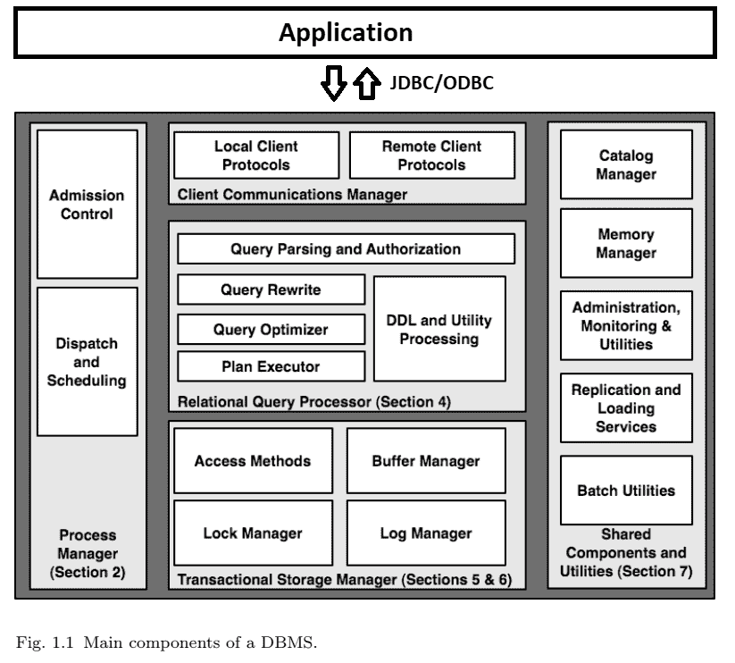
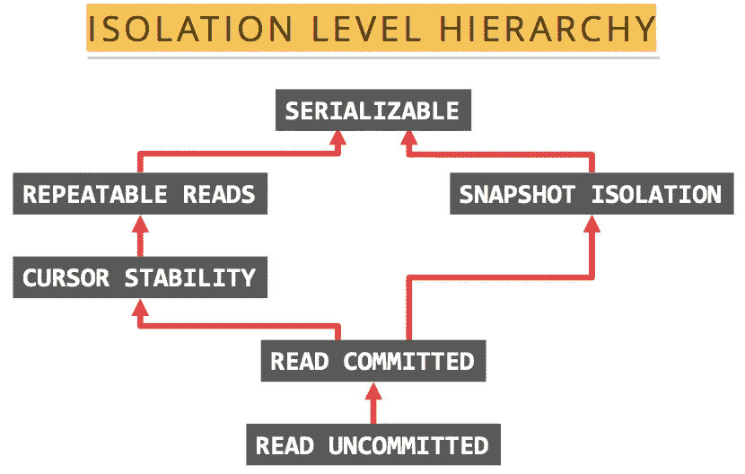
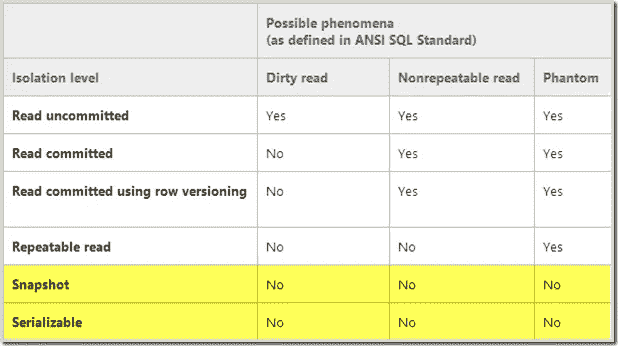

# 关系数据库管理系统(RDBMS)体系结构(二)

> 原文：<https://blog.devgenius.io/relational-database-management-system-rdbms-architecture-2-6a88d5c014ce?source=collection_archive---------6----------------------->

Pawel Czerwinski 在 [Unsplash](https://unsplash.com?utm_source=medium&utm_medium=referral) 上的照片

## 关系数据库管理系统是一个用于存储、操作和管理表中数据的大型软件。

这是关于这个主题的第二个系列。本文将继续介绍其他细节。

 [## 关系数据库管理系统(RDBMS)体系结构——(1)

### 关系数据库管理系统是一个大规模的软件，用于存储、操作和管理数据库中的数据

jinlow.medium.com](https://jinlow.medium.com/relational-database-management-system-rdbms-architecture-1-1ba5e64b190a) 

[https://pay ASR . github . io/red base-spatial/post/architect-DBMS/](https://payasr.github.io/redbase-spatial/post/architect-dbms/)

# **事务存储管理器**

**访问方法**

访问磁盘数据结构的最底层操作符，通常是 [**堆文件**](https://pages.cs.wisc.edu/~dbbook/openAccess/Minibase/spaceMgr/heap_file.html) 和 [**索引**](https://en.wikipedia.org/wiki/Database_index) 。访问数据有两个注意事项:

1.  使用索引
2.  批量固定/取消固定或复制/删除符合条件的元组以提高性能

**指标**

1.  **B 树索引—** 创建一个多级树结构，将数据库分成固定大小的块或页面
2.  **R 树索引** —用于空间访问方法的树数据结构
3.  **T 树索引** —一种平衡的索引树数据结构
4.  **哈希索引** —该索引包含唯一值
5.  **Patricia Trie 索引** —它表示一个空间优化的 Trie(前缀树)，其中每个节点都是唯一的子节点，并与其父节点合并
6.  **RD-Tree 索引** —动态空间访问方法
7.  **多维聚集(MDC)索引** —以灵活、连续和自动的方式沿多维聚集表中的数据
8.  **位图索引** —使用位图或位数组
9.  **学习索引** —使用从深度神经网络到简单回归的机器学习技术，以便对排序数组的累积分布函数建模

*   访问方法的基本 API 是迭代器 API。参数(查询条件、搜索参数、SARG)用于查询，get_next()用于返回满足条件的行，或者在不满足条件时返回 NULL。
*   行 ID (RID)直接用于表示行在磁盘上的位置，因为它直接且易于读取。然而，当行大小变大时，位图索引(B+树)被分割或者元组必须被移动，这是不合适的。
*   另一种方法是使用主键作为辅助索引中的行 ID。它通过索引找到主键值，然后返回到表中查询原始行。但是，牺牲了查询性能，却避免了行移动带来的问题。

**数据仓库**

数据仓库场景是联机分析处理场景，但不是联机事务处理场景，因为它用于数据分析。数据通常由 ETL(提取、转换、加载)和几乎所有的只读查询处理。有一些扩展可以在 OLAP 场景中获得更好的性能。

1.  **批量加载** —可以跳过 SQL 解析等步骤，直接操作底层存储引擎以获得更好的性能
2.  **位图索引** —有些列只有固定值。例如，性别和年龄。通过使用位图索引，它可以获得更好的性能。
3.  **物化视图** —创建一个视图。一旦更新了原始表，视图也会相应地更新。
4.  **OLAP &特定查询支持** —类似于预计算的数据立方体可以支持固定查询场景，例如 SQL 语句的定期执行。

**数据库扩展性**

1.  ****/**[**UDF**](https://en.wikipedia.org/wiki/User-defined_function)**
2.  **[**JSON**](https://en.wikipedia.org/wiki/JSON)/[/XML](https://en.wikipedia.org/wiki/XML)**
3.  **[**全文搜索**](https://en.wikipedia.org/wiki/Full-text_search)**

****仓储管理****

**DBMS 访问存储有两种方式**

1.  **直接与块设备交互**
2.  **与操作系统文件系统交互，这会影响数据库控制存储空间和时间的能力**

**直接控制放置比通过 OS 文件系统更好，因为数据库系统可以更好地分配自己的工作负载。**

****空间控制****

**顺序存取比随机存取快得多。数据库系统要控制数据如何排列，数据库系统比底层操作系统懂得多，做得比操作系统好。**

****时间控制—缓冲****

**为了控制数据的位置，由于两个方面，数据库系统必须控制数据是否被正确地写入永久存储设备**

1.  **为了确保正确**
2.  **为了减少操作系统由于缓存机制而产生的开销**

****缓冲管理****

**数据库通常使用内存空间来一一映射硬盘上的内容。这种映射不涉及数据内容的转换，以避免额外的 CPU 开销。此外，数据库还管理映射关系、脏标志和元数据等信息。**

1.  **可以根据脏标志将数据内容写回磁盘。**
2.  **固定/取消固定决定了数据内容是否可以根据特定的替换策略换出到磁盘**

**[**算法**](https://en.wikipedia.org/wiki/Cache_replacement_policies) **:****

1.  **最近最少使用(LRU)**
2.  **时钟**
3.  **LRU-2**
4.  **先进先出。比较 LIFO**
5.  **后进先出/后进先出法**
6.  **最近使用的(MRU)**
7.  **最不常用(LFU)**

# ****交易****

**责任:**

1.  ****协调各种资源的事务**。例如，两阶段提交协议、XA 协议等。**
2.  ****从故障中恢复** —在系统或应用程序出现故障时，保持资源处于一致状态**
3.  ****控制事务上下文** —监控事务**
4.  ****划分** —开始、提交和回滚方法**

****并发控制和恢复****

**数据库系统较大，事务存储管理没有明确定义的功能，通常由以下 4 个相互纠缠的模块组成。**

1.  **并发控制中的锁管理器**
2.  **错误恢复中的日志管理器**
3.  **用于分离 I/O 的缓冲池**
4.  **管理底层磁盘上数据的访问方法**

****交易特征(酸性)****

1.  ****原子性:**要么是事务成功时的整个执行，要么是事务失败时的整个回滚**
2.  **[**一致性**](https://aws.plainenglish.io/distributed-system-cap-theorem-3ca7d933f5e7) **:** 交易必须保证整体数据库数据的完整性和一致性。在执行事务之前和之后，数据库必须处于一致状态。比如做多表操作时，多个表要么是事务后的新值，要么是事务前的旧值
    **强一致性:**更新完成后，任何后续的访问(通过 A、B 或 C)都会返回更新后的值。
    **弱一致性**:系统不保证后续访问会返回更新后的值。在返回值之前，需要满足许多条件。
    **最终一致性:**弱一致性的一种特殊形式；数据库保证如果没有对数据项进行新的更新，最终所有的访问将返回最后更新的值。
    **因果一致性**:如果进程 A 通知进程 B 数据项已经更新，进程 B 后续的访问将返回更新后的值，写操作保证取代之前的写操作。对于与进程 A 没有因果关系的进程 C 的访问，将应用最终的一致性规则。
    **Read-your-writes 一致性**:进程 A 更新数据项后，总是访问更新后的值，永远看不到更老的值。
    **会话一致性**:进程 A 在一个会话的上下文中访问数据库。只要会话存在，系统就会保证读写操作的一致性。如果会话由于某些故障情况而终止，则需要创建新的会话，并保证没有重叠的会话。
    **单调读取一致性**:如果一个进程已经看到了一个对象的特定值，那么任何后续的访问都不会返回任何之前的值。
    **单调写入一致性**:系统保证以相同的进程对写入进行序列化。**
3.  ****隔离:**两个事务的执行是独立隔离的。当多个事务操作一个对象时，第二个事务只能在第一个事务完成后执行。因此，并发性将被最小化。**
4.  ****持久性:**持久性是指交易一旦提交成功，修改后的数据将是不可逆的、持久的，不会因异常或停机造成数据错误或数据丢失。**

****可串行化****

****

**[https://docs . pingcap . com/tidb/stable/dev-guide-transaction-constraints](https://docs.pingcap.com/tidb/stable/dev-guide-transaction-restraints)**

**为了实现隔离和一致性，必须考虑并发控制。它主要基于锁和时间戳的两种实现。数据库中有 3 种主流的并发控制技术:**

****锁定协议&时间戳****

1.  **[**严格两阶段锁**](https://en.wikipedia.org/wiki/Two-phase_locking)【2PL】—事务在使用锁之前必须获得锁，并且必须持有锁，直到事务完成或中止。**
2.  **[**多版本并发控制**](https://en.wikipedia.org/wiki/Multiversion_concurrency_control)**【MVCC】—每个事务都有自己的快照，这样只读事务就可以根据时间戳直接被快照读取，而不需要获取锁。只写事务不会受到影响。每个事务包含两个时间戳，即开始时间和提交时间。****
3.  ****[**乐观并发控制**](https://en.wikipedia.org/wiki/Optimistic_concurrency_control)【OCC】—多个事务可以频繁完成而互不干扰。事务使用数据资源，但不获取这些资源的锁。在提交之前，每个事务都会验证没有其他事务修改过数据。如果检查发现有冲突的修改，事务将回滚并可以重新启动。****

******锁定&闭锁******

****数据库将维护一个锁表来记录事务/锁/对象之间的关系，因此当事务完成或中止时，可以释放与该事务相关联的所有锁。死锁也是特征之一。当用户访问数据结构时，数据库系统也使用锁来保护数据和数据结构，这称为锁存。但是，使用锁存可以避免死锁。锁存由操作系统或硬件指令提供。****

******了解隔离等级的程度******

********

****由于使用了 MVCC 和 OCC，一些数据库系统还提供了其他隔离级别。****

1.  ****光标稳定性****
2.  ****快照隔离****
3.  ****读取一致性****

******日志管理器******

****一般数据库系统使用[**【WAL】**](https://en.wikipedia.org/wiki/Write-ahead_logging)**来实现事务持久化。有 3 条规则:******

1.  ******对数据源的每次修改都应该生成一个日志，该日志必须放在磁盘上******
2.  ******原木必须按顺序摆放******
3.  ******只有在放置日志后，才能对成功的事务做出响应******

******尽管这 3 条规则非常简单，但实际实现往往比这些规则复杂得多。数据库系统必须提供一定的回滚/中止性能，同时在事务提交的快速路径上保持高性能。此外，数据库系统必须考虑查询优化场景。日志系统将变得更加复杂。******

******在数据库系统中使用了 3 个原则:*直接、窃取/非强制。*******

1.  ******直接更新数据******
2.  ******使用撤消日志来撤消对未提交/中止事务的更改******
3.  ******提交事务时使用重做日志******

********提升业绩的战略********

1.  ****减小日志的大小可以提高日志系统的性能****
2.  ****只有逻辑操作可以被记录，而物理操作数据可以被丢弃，以便在事务提交后进一步减小日志大小****
3.  ****物理操作记录在撤消日志中，逻辑操作记录在重做日志中****

*   ****系统异常关机后，系统会使用恢复日志序列号(恢复 LSN)记录日志的顺序，并使用检查点定期记录恢复 LSN，以获取最新的恢复进程。****
*   ****当事务回滚时，保留一部分磁盘空间****

******事务存储管理的相互依赖性******

****事务存储管理是 DBMS 的最低层。****

****[**【WAL】**](https://en.wikipedia.org/wiki/Write-ahead_logging)**协议在日志系统中依赖于并发控制的实现方法。如果使用了非严格的 2 阶段锁定，并且已经释放了锁，那么在回滚期间执行撤销日志时，可能无法重新获得锁。当考虑子系统(访问方法)时，它变得更加复杂。******

******并发控制和错误恢复机制必须与其独特的数据结构紧密结合。这就是为什么数据库系统一般会实现 B+树和堆文件。每个数据结构都有自己的并发控制或错误恢复机制优化技术。将不同的并发控制方法混合到同一个访问方法中是非常困难的，因为其他并发控制方法如 OCC 和 MVCC 可能没有考虑访问方法的特征。******

********我的相关文章********

**** [## SQL 的概念及其清单

### SQL 通用语法

jinlow.medium.com](https://jinlow.medium.com/sql-basic-eb50b69e7164)  [## 项目中常用的 11 种 SQL 查询优化技术

### 随着数据量的持续增长，it 将需要精通 SQL 的专业人员，而不仅仅是入门级的…

经验堆栈。总裁](https://experiencestack.co/11-sql-query-optimization-techniques-commonly-used-in-projects-ed45c31c45cd)  [## SQL 数据库开发的核心知识(1)

### 掌握 SQL 数据库是开发人员的一项基本功。SQL 是一种简单而强大的语言，广泛应用于许多领域

medium.com](https://medium.com/geekculture/the-core-knowledge-of-sql-database-development-1-1d48cd4b732e)  [## SQL 数据库开发的核心知识(2)

### 随着互联网技术的不断发展，数据库变得越来越复杂。几乎所有的 IT 公司…

经验堆栈。总裁](https://experiencestack.co/the-core-knowledge-of-sql-database-development-2-29304458eaf3) 

**参考文献**

 [## 教学大纲::CMU-CS 15-415/615 数据库应用(2016 年秋季)

### 15-415/615 数据库应用程序(2016 年秋季)

15415.courses.cs.cmu.edu](https://15415.courses.cs.cmu.edu/fall2016/syllabus.html)  [## MVCC 实施

### 1.任何行的最新版本都存储在主数据块中，还有一些与事务相关的元数据。2…

lwn.net](https://lwn.net/Articles/368493/)  [## RDBMS 架构-极客论坛

### RDBMS 代表关系数据库管理系统，它实现 SQL。在现实世界中，人们使用…

www.geeksforgeeks.org](https://www.geeksforgeeks.org/rdbms-architecture/)  [## 什么是关系数据库？

### 关系数据库是一种数据库，它存储并提供对与一个数据库相关的数据点的访问

www.oracle.com](https://www.oracle.com/database/what-is-a-relational-database/) 

https://jimgray.azurewebsites.net/JimGrayPublications.htm

 [## B+树数据结构

### B+树是 B 树的扩展，它使得搜索、插入和删除操作更加有效。我们知道…

www.studytonight.com](https://www.studytonight.com/advanced-data-structures/b-plus-trees-data-structure)  [## 数据库系统的体系结构

### 数据库系统的架构- Hellerstein，Stonebraker & Hamilton，2007。这是一个较长的阅读(因此…

blog.acolyer.org](https://blog.acolyer.org/2015/01/20/architecture-of-a-database-system/)  [## 关系数据库如何执行 SQL 语句和准备好的语句

### 在本文中，我们将了解关系数据库如何执行 SQL 语句和预处理语句。的…

vladmihalcea.com](https://vladmihalcea.com/relational-database-sql-prepared-statements/) 

[https://courses . cs . Washington . edu/courses/CSE 444/20sp/lectures/lectures 07-execution . pdf](https://drive.google.com/viewerng/viewer?url=https://courses.cs.washington.edu/courses/cse444/20sp/lectures/lecture07-execution.pdf)

如果你发现我的任何文章有帮助或有用，那么请考虑给我一杯咖啡，帮助支持我的工作或给我赞助😊，通过使用和

[**Patreon**](https://www.patreon.com/jinlowmedium)

[**Ko-fi.com**](https://ko-fi.com/jinlowmedium)

**最后但同样重要的是，如果你还不是灵媒会员，并打算成为灵媒会员，我恳请你使用以下链接。我将收取你的一部分会员费，不增加你的额外费用。**

** [## 用我的引荐链接-金加入 Medium

### 阅读金(以及其他成千上万的作家)的每一篇小说。你的会费直接支持金和…

jinlow.medium.com](https://jinlow.medium.com/membership)******