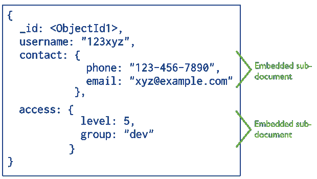
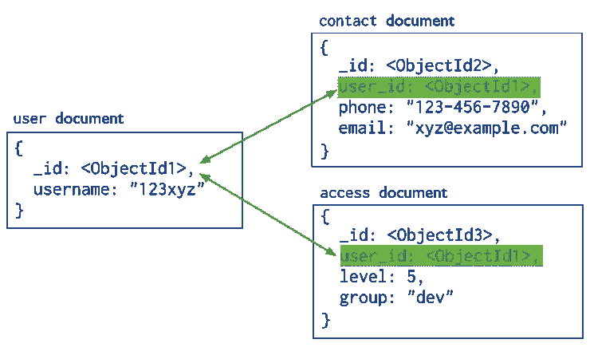

# MongoDB 中的关系

> 原文：<https://blog.devgenius.io/relationships-in-mongodb-927b0c24ecd0?source=collection_archive---------4----------------------->


关于 MongoDB 中的关系、方法、关系类型、示例和特性的基本文章。

# MongoDB 中的关系

容易混淆的一个标准是术语非关系数据库或没有关系的 NoSQL，但事实是 MongoDB 几年来一直允许通过一个称为“引用”的概念来实现关系，甚至官方文档也谈到关系数据库中已知的基数和其他特征，区别在于 MongoDB 没有忠实地遵守 er(实体关系)模型和关系数据库的其他特性。

# 关系方法

MongoDB 中的关系可以用两种不同的方法建模:嵌入关系或引用关系，这些方法的选择将取决于解决的诡辩类型和数据建模决策。以下是对每种方法的简要描述:

*   **嵌入关系**:涉及存储嵌入父文档中的子文档的关系。



*   引用关系:通过引用连接不同集合的关系。通过公共属性或键进行引用。这些引用可以有两种类型；[手动参考](https://www.mongodb.com/docs/manual/reference/database-references/#manual-references)或 [DBRefs](https://www.mongodb.com/docs/manual/reference/database-references/#dbrefs) 。



这些关系可以具有以下类型的基数:

*   1:1 —一对一。
*   1:N —一对多。
*   N:M —多对多。

**注意** 🧐:本文将关注与引用的方法和手工类型的关系，对联合使用聚合操作符。

# 查找运算符

MongoDB 为我们提供的创建文档间关系的工具之一是$lookup 操作符。该操作符旨在使用左外连接方法将信息从一个文档合并到另一个文档。

句法

```
{   
  $lookup: {       
    from: <collection to join>,     
    localField: <field from the input documents>,       
    foreignField: <field from "from" collection>,
    as: <output array field>     
  }
}
```

# 关系 1:1

通过使用相同值的共享键属性链接来自不同集合的两个文档，可以创建一对一的关系。通常，创建这种关系的最佳方式是让子集合查询第一个集合的键值。ObjectIds 通常用于建立连接，尽管它可以是任何其他类型。

```
// Users collection
{
  "_id" : ObjectId("6342ef6f73d381100e27b8e4"),
  "name" : "Juan",
  "age" : 40
}// Address collection
{
  "_id" : ObjectId("6342efb173d381100e27b8e5"),
  "street" : "Fifth Avenue",
  "number" : 1421.0,
  "city" : "New York",
  "user_id" : ObjectId("6342ef6f73d381100e27b8e4") 
}// Query
db.getCollection("employees").aggregate({
  $lookup: {
    from: "address",
    localField: "_id",
    foreignField: "user_id",
    as: "address"
  }
})// Result
{
  "_id" : ObjectId("6342ef6f73d381100e27b8e4"),
  "name" : "Juan",
  "age" : 40.0,
  "address" : [{
    "_id" : ObjectId("6342efb173d381100e27b8e5"),
    "street" : "Fifth Avenue",
    "number" : 1421.0,
    "city" : "New York",
    "user_id" : ObjectId("6342ef6f73d381100e27b8e4")
  }]
}
```

# 关系 1:N

一对多关系是通过将一个集合中的文档链接到另一个集合中的多个文档来创建的。提到这种关系可以通过多种方式实现，但是一种广泛使用的选择是使用递增和可变数组，这将在下面显示。

```
// Authors Collection
{
  "_id" : ObjectId("63430b9e73d381100e27b8e9"),
  "name" : "J. K. Rowling",
  "books" : [
     ObjectId("63430b8a73d381100e27b8e7"),
     ObjectId("63430b8a73d381100e27b8e8")
  ]
}// Books Collection
{
  "_id" : ObjectId("63430b8a73d381100e27b8e7"),
  "name" : "Philosopher's Stone"
},
{
  "_id" : ObjectId("63430b8a73d381100e27b8e8"),
  "name" : "Chamber of Secrets"
}// Query
db.getCollection("authors").aggregate({
  $lookup: {
    from: "books",
    localField: "books",
    foreignField: "_id",
    as: "books"
  }
})// Result
{
  "_id" : ObjectId("63430b9e73d381100e27b8e9"),
  "name" : "J. K. Rowling",
  "books" : [{
    "_id" : ObjectId("63430b8a73d381100e27b8e7"),
    "name" : "Philosopher's Stone"
  },
  {
    "_id" : ObjectId("63430b8a73d381100e27b8e8"),
    "name" : "Chamber of Secrets"
  }
 ]
}
```

# 关系 N:M

多对多关系是通过将一个集合中的多个文档与另一个集合中的多个文档相关联来创建的。同样，为了实现这种关系，使用了几种策略，其中对于示例，我们将继续使用递增和可变矩阵。

```
// Orders collection
{
  "_id" : ObjectId("634312b873d381100e27b8ea"),
  "company" : "Microsoft",
  "products" : [
    ObjectId("634312f073d381100e27b8ec"),
    ObjectId("634312f073d381100e27b8ed")
  ]
},
{
  "_id" : ObjectId("634312b873d381100e27b8eb"),
  "company" : "Apple",
  "products" : [
    ObjectId("634312f073d381100e27b8ed")
  ]
}// Products collection
{
  "_id" : ObjectId("634312f073d381100e27b8ec"),
  "name" : "Mouse logitech",
  "orders" : [
    ObjectId("634312b873d381100e27b8ea")
  ]
},
{
  "_id" : ObjectId("634312f073d381100e27b8ed"),
  "name" : "Keyboard logitech",
  "orders" : [
    ObjectId("634312b873d381100e27b8ea"),
    ObjectId("634312b873d381100e27b8eb")
  ]
}// Query( can be queried from both endsm the example only products )
db.getCollection("products").aggregate({
  $lookup: {
   from: "orders",
   localField: "orders",
   foreignField: "_id",
   as: "orders"
  }
 }
)// Result
{
  "_id" : ObjectId("634312f073d381100e27b8ec"),
  "name" : "Mouse logitech",
  "orders" : [{
    "_id" : ObjectId("634312b873d381100e27b8ea"),
    "company" : "Microsoft",
    "products" : [
      ObjectId("634312f073d381100e27b8ec"),
      ObjectId("634312f073d381100e27b8ed")
     ]
   }
 ]
},
{
  "_id" : ObjectId("634312f073d381100e27b8ed"),
  "name" : "Keyboard logitech",
  "orders" : [{
    "_id" : ObjectId("634312b873d381100e27b8ea"),
    "company" : "Microsoft",
    "products" : [
      ObjectId("634312f073d381100e27b8ec"),
      ObjectId("634312f073d381100e27b8ed")
    ]
   },
   {
   "_id" : ObjectId("634312b873d381100e27b8eb"),
   "company" : "Apple",
   "products" : [
     ObjectId("634312f073d381100e27b8ed")
    ]
   }
  ]
}
```

# MongoDB 中的关系资源

*   [**MongoDB**](https://www.mongodb.com/docs/manual/applications/data-models/)中的模型数据和模式:结构策略，例子，最常见的模式。
*   [**$查找运算符**](https://www.mongodb.com/docs/manual/reference/operator/aggregation/lookup/) :定义、语法和示例。

感谢你远道而来，如果你觉得这很有用，别忘了鼓掌👏。订阅以接收更多内容🔔。

如果你需要额外的帮助，请联系我🤠。

*   ✉️ [**给我发邮件**](mailto:dcortes.net@gmail.com)
*   🤝 [**在 LinkedIn 上联系我**](https://www.linkedin.com/in/dcortesnet/)
*   📮 [**在 Twitter 上联系我**](https://twitter.com/dcortes_net)

非常感谢您的阅读，我感谢您的时间。