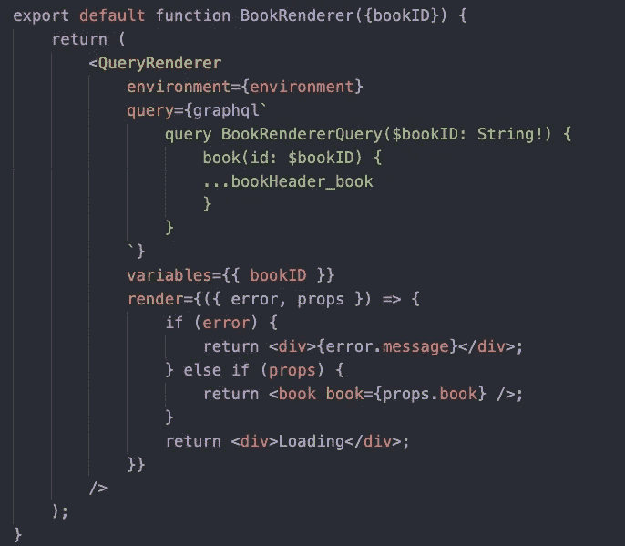
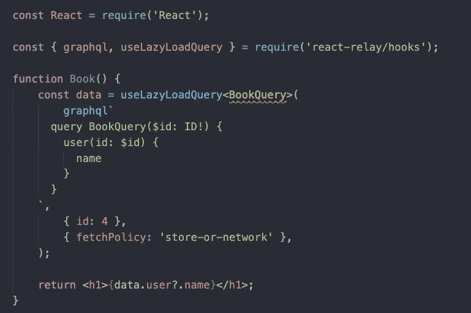

# 中继书籍与中继容器

> 原文：<https://blog.devgenius.io/relayhooks-vs-relaycontainers-fc179db4d1d1?source=collection_archive---------4----------------------->

“[**React**](https://reactjs.org/)**+**[**Relay**](https://relay.dev/)**+**[**graph QL**](https://graphql.org/)”combo 是目前构建任何浏览器 app 最先进、最简便的框架套件。在这三者中，Relay 相对来说比较难学，因为它的 API 在进化:容器→钩子。

在这篇文章中，基于我在脸书的第一手经验，我将分享为什么新的继电器盒比继电器盒更好。

# 定义

RelayContainer 是一个 React 组件，通常是中继组件树的根，如 **QueryRenderer、FragmentContainer、PaginationContainer** 等。

**QueryRenderer** 处理获取查询，并使用 render prop 来呈现结果数据。

**FragmentContainer** 不会直接获取数据；相反，数据将由根处的 **QueryRenderer** 祖先获取，它将聚合中继组件树所需的所有数据，并在**单个往返行程**中获取。

relay 容器示例

RelayHooks 是一个类似于 ReactHooks 的 API，包括像 useFragment，useLazyLoadQuery 这样的 API。它将数据加载逻辑和 React 组件呈现代码分开。

RelayHooks 示例

> 注意:**中继组件将正确地互操作**，不管它们是被写成中继钩子还是中继容器。

# 利益

## 简单的

钩子是有特定输入和输出的函数。比发生在高阶组件中的“ ***魔法*** ”更清晰，你从上面传过去的道具和你在组件内部收到的道具是不一样的。

它还允许我们不要用多层嵌套的高阶组件来污染 React 树，这些组件包装了您的实际组件，如 refetch 和 pagination 容器。

## 类型安全

钩子对于 [**流**](http://flow.org) 类型来说也要简单得多，使用中继钩子，我们能够保证比使用我们的 HOC/Renderer API 更好的类型安全性。

它们更容易推理，需要更少的间接性，并且更容易调试。

## 并发安全

与容器相比，钩子有更多的功能，例如，通过与加载状态的悬念集成，并提供新的功能，例如直接呈现缓存在中继存储中的数据，这是以前没有的。

它还允许您使用更新的**usePreloadedQuery**API，减少了空渲染、意外的悬念和意外的过度获取。