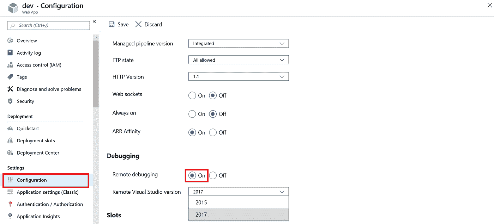
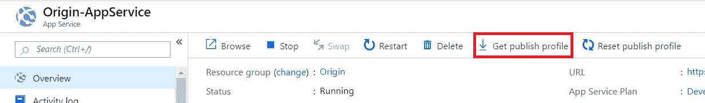
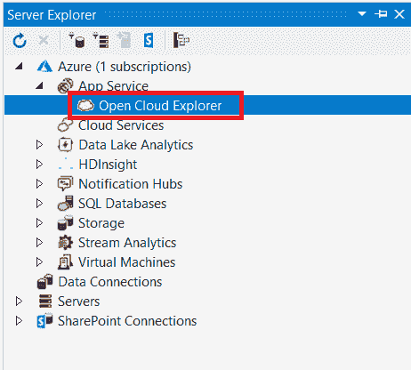
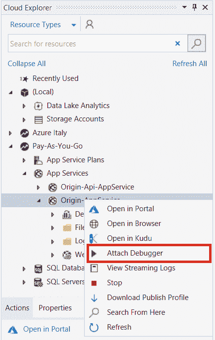

# 远程调试 Azure 应用服务

> 原文：<https://blog.devgenius.io/remote-debugging-azure-app-service-c9a89e2f8771?source=collection_archive---------0----------------------->

Azure 应用服务远程调试允许开发人员将 Visual Studio 连接到他们的 Azure 应用服务，并获得完全控制。他们可以设置断点，直接操作内存，逐句通过代码，甚至改变代码路径。

即使远程调试对所有层都可用，也有一些限制，例如，自由层和共享层一次只能有一个连接。相比之下，标准层允许五个同时连接。

# 先决条件

此过程要求客户端机器安装了 Azure SDK，并且下载了订阅配置文件。

# 在 Azure 上启用远程调试

要远程调试应用程序，您必须打开远程调试功能，并在 Azure portal 中的 web 应用程序配置上定义 Visual Studio 的版本。

*   在 Azure 门户中，打开你的应用的资源页面。
*   在左侧导航中，选择**配置**选项。

启用远程调试

*   启用**远程调试**
*   选择将用于调试的 Visual Studio 版本
*   点击**保存并继续**

# 如何远程调试应用程序

*   在 Azure 门户中，打开你的应用的资源页面。
*   点击**获取发布配置文件**下载发布配置文件

下载发布配置文件

*   在**调试**模式下发布到您的应用程序
*   将 Visual Studio 连接到您的 Microsoft Azure 订阅
*   打开**云浏览器**

云浏览器

*   找到您的应用服务并点击**附加调试器**

附加调试器

你都准备好了。如果您已经放置了任何调试断点，当执行特定功能时，它们将被命中。

# 参考

*   官方文档:[https://docs . Microsoft . com/en-us/visual studio/debugger/remote-debugging？view=vs-2019](https://docs.microsoft.com/en-us/visualstudio/debugger/remote-debugging?view=vs-2019)