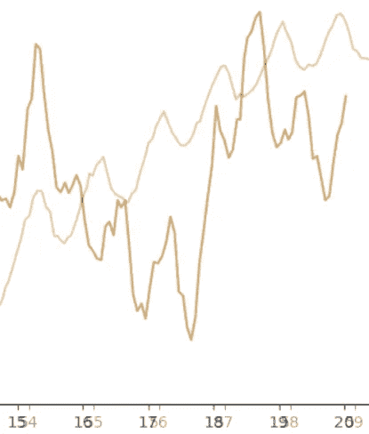

# 使用网络摄像头和 50 行代码进行远程心率检测

> 原文：<https://blog.devgenius.io/remote-heart-rate-detection-using-webcam-and-50-lines-of-code-2326f6431149?source=collection_archive---------0----------------------->

有一次，我看到了一个 Android 应用程序的描述，它通过智能手机的摄像头远程测量心率。有趣的一点是，Google Play 的审核人员不相信这种测量的可能性，因此该应用程序被拒绝。我不知道这个故事的结局，但检查这是否可能变得很有趣。没有必要制作一个 Android 应用程序，用 Python 测试这个想法要容易得多。

让我们开始吧。

# 获取相机流

首先，我们需要从网络摄像头获取一个流，为此我将使用 OpenCV。代码是跨平台的，可以在 Windows 和 Linux/OSX 上运行。

```
import cv2
import io
import time cap = cv2.VideoCapture(0)
cap.set(cv2.CAP_PROP_FRAME_WIDTH, 1920)
cap.set(cv2.CAP_PROP_FRAME_HEIGHT, 1080)
cap.set(cv2.CAP_PROP_FPS, 30)while True:
    ret, frame = cap.read()
    img = cv2.cvtColor(frame, cv2.COLOR_BGR2GRAY) *# Display the frame*
    cv2.imshow('Crop', crop_img)
    if cv2.waitKey(1) & 0xFF == ord('q'):
        breakcap.release()
cv2.destroyAllWindows()
```

确定心率的想法是，由于血管中的流动，肤色会发生轻微变化。所以我们需要一个图片裁剪，它只包含皮肤的一个片段:

```
x, y, w, h = 800, 500, 100, 100
crop_img = img[y:y + h, x:x + w]cv2.imshow('Crop', crop_img)
```

如果一切都做得正确，我们应该得到相机图像(出于隐私原因模糊)并裁剪:


# 图像处理

一旦我们有了摄像机流，这就很简单了。对于选定的图像片段，我们获得平均亮度值，并将其与测量时间戳一起添加到数组中。

```
heartbeat_count = 128
heartbeat_values = [0]*heartbeat_count
heartbeat_times = [time.time()]*heartbeat_countwhile True:
    ...
    *# Update the data and timestamps*
    heartbeat_values = heartbeat_values[1:] + [np.average(crop_img)]
    heartbeat_times = heartbeat_times[1:] + [time.time()]
```

函数计算一个二维数组的平均值，在输出端，我们得到一个数字，这是我们 100x100 平方帧的平均亮度。

我们可以使用 [matplotlib](https://matplotlib.org/gallery/index.html) 库实时显示图形:

```
fig = plt.figure()
ax = fig.add_subplot(111)
while True:
    ... ax.plot(heartbeat_times, heartbeat_values)
    fig.canvas.draw()
    plot_img_np = np.fromstring(fig.canvas.tostring_rgb(),
                                dtype=np.uint8, sep='')
    plot_img_np = plot_img_np.reshape(fig.canvas.get_width_height()[::-1] + (3,))
    plt.cla()

    cv2.imshow('Graph', plot_img_np)
```

OpenCV 处理 numpy 格式的图像，所以我必须使用 *numpy.fromstring* 函数来转换图像。

仅此而已。

我已经运行了程序，选择了这样一个位置，这样在相机裁剪区域只有一个皮肤碎片是可见的，采取了[思考者姿势](https://en.wikipedia.org/wiki/The_Thinker)头部放在手上——图像应该尽可能不动。瞧，它真的有用！


值得再次重申的是，相机不是应用于皮肤，我们只是简单地分析人的整体画面。而且很神奇的是，即使在这个距离，肤色的细微变化都被相机自信地捕捉到了！正如我们从图表中看到的，亮度的实际差异小于 0.5%，当然，“肉眼”是看不到的，但在图表上是可以清楚地区分的。大约每分钟 75 次。作为比较，脉搏血氧计的 BPM 结果如下:


为了验证我们得到的是真实的心率，而不是任何虚假信号，如闪烁的灯泡，检查心率是否随体育锻炼而变化也很有趣。事实上，如果我将两张图放在同一个图像中，我就能看到它——第一张图是在锻炼前拍摄的，第二张是在锻炼后拍摄的。



很容易看出，在第二种情况下，心率更高。

# 结论

奇怪的是，它真的有效——老实说，我不确定结果。它可以与智能手机摄像头配合使用吗？嗯，这取决于很多因素。如果手机放在三脚架上，而人保持不动，这是可行的。但是如果手机拿在手里，我强烈怀疑结果会比一个随机数生成器好；)另一方面，如果在处理之前将运动稳定算法应用于相机流，则理论上可能是可能的，因此该问题仍然是开放的。对于网络摄像头，一般来说，更容易。

由于我们正在分析视频流，可能会出现一个单独的问题——这是否适用于压缩视频数据，是否有可能看到电影或电视演员的心率？我不知道答案，愿意的人可以自己试试。为此，只需替换行 *cap = cv2 即可。VideoCapture(0)* 中带有 *cap = cv2 的代码。VideoCapture("video.mp4")* ，其他代码不变。

对于那些希望进行更多测试的人，源代码附在下面:

```
import numpy as np
from matplotlib import pyplot as plt
import cv2
import io
import time # Camera stream
cap = cv2.VideoCapture(0)
cap.set(cv2.CAP_PROP_FRAME_WIDTH, 1920)
cap.set(cv2.CAP_PROP_FRAME_HEIGHT, 1280)
cap.set(cv2.CAP_PROP_FPS, 30)
# Video stream (optional, not tested)
# cap = cv2.VideoCapture("video.mp4")# Image crop
x, y, w, h = 800, 500, 100, 100
x, y, w, h = 950, 300, 100, 100
heartbeat_count = 128
heartbeat_values = [0]*heartbeat_count
heartbeat_times = [time.time()]*heartbeat_count# Matplotlib graph surface
fig = plt.figure()
ax = fig.add_subplot(111)while True:
    # Capture frame-by-frame
    ret, frame = cap.read() img = cv2.cvtColor(frame, cv2.COLOR_BGR2GRAY)
    crop_img = img[y:y + h, x:x + w] # Update the data
    heartbeat_values = heartbeat_values[1:] + [np.average(crop_img)]
    heartbeat_times = heartbeat_times[1:] + [time.time()] # Draw matplotlib graph to numpy array
    ax.plot(heartbeat_times, heartbeat_values)
    fig.canvas.draw()
    plot_img_np = np.fromstring(fig.canvas.tostring_rgb(),
                                dtype=np.uint8, sep='')
    plot_img_np = plot_img_np.reshape(fig.canvas.get_width_height()[::-1] + (3,))
    plt.cla() # Display the frames
    cv2.imshow('Crop', crop_img)
    cv2.imshow('Graph', plot_img_np)
    if cv2.waitKey(1) & 0xFF == ord('q'):
        breakcap.release()
cv2.destroyAllWindows()
```

感谢阅读。